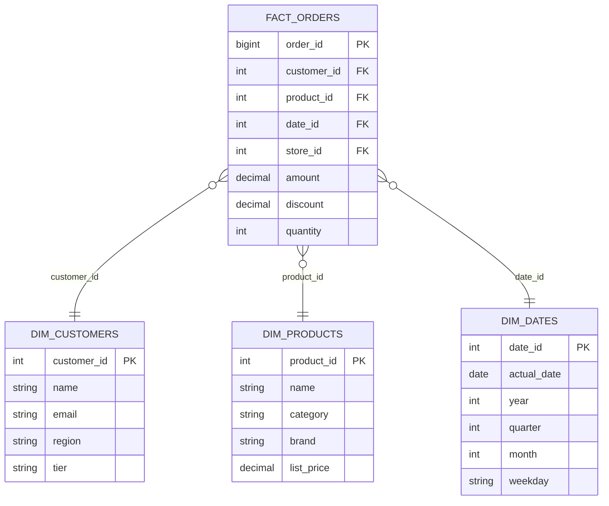
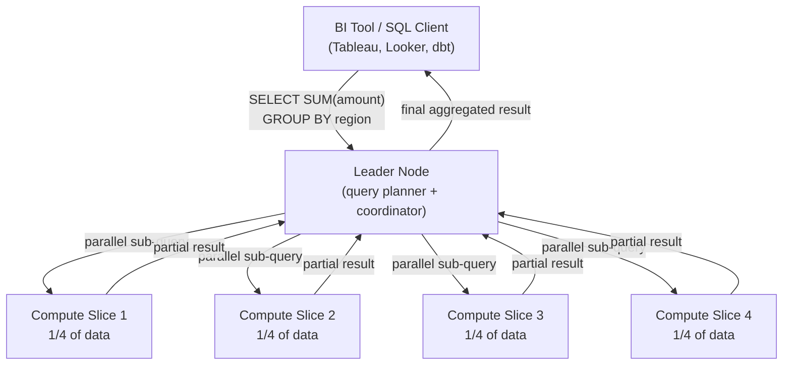

# 🏛️ Data Warehouse

> [!abstract] TL;DR
> A data warehouse is a centralized analytical store for structured business data, optimized for **read-heavy OLAP workloads** using columnar storage and MPP (Massively Parallel Processing). Business analysts run complex aggregations across billions of rows (not single-row lookups). Data arrives via ETL/ELT pipelines from OLTP sources and is modeled in star/snowflake schemas. Key systems: Snowflake (cloud-native), BigQuery (serverless), Redshift (AWS), ClickHouse (open source).

---

## Intuition — Analogy First

Imagine a **business intelligence department** versus the company's **cash registers**.

The **cash registers** (OLTP systems) are optimized for one thing: processing one transaction at a time, as fast as possible. Ring up a purchase, update inventory, record the sale. These are short, precise operations on specific rows.

The **BI department** (data warehouse) collects all the receipts from every store, loads them each night, and then runs questions like: *"What was our total revenue by product category across all 500 stores in Q3, and how does that compare to Q3 last year, broken down by region?"* This question touches billions of rows but only cares about 3 columns out of 50. Nobody queries a cash register for that — you'd bring it to the BI department.

A data warehouse is built for the BI department question: reads across billions of rows, touching few columns, no single-row updates.

---

## How It Works

### OLTP vs OLAP Comparison

| Dimension | OLTP (Transactional) | OLAP (Analytical) |
|-----------|---------------------|------------------|
| **Query pattern** | Single-row reads/writes | Full table scans, aggregations |
| **Rows touched per query** | 10–1,000 | Millions–billions |
| **Latency target** | < 10 ms | Seconds–minutes |
| **Concurrent users** | Thousands | Tens–hundreds of analysts |
| **Data freshness** | Real-time | Hours–days (batch ETL) |
| **Schema style** | Normalized (3NF) | Denormalized (star/snowflake) |
| **Storage layout** | Row-oriented | Column-oriented |
| **Example workload** | INSERT one order | SUM(revenue) GROUP BY region |

### Columnar Storage — Why It Matters

Row storage: `[row1_col1, row1_col2, ..., row1_colN, row2_col1, ...]`
Column storage: `[col1_row1, col1_row2, ..., col1_rowN, col2_row1, ...]`

**Query:** `SELECT SUM(revenue), AVG(discount) FROM orders WHERE year = 2024`

- **Row storage:** Must read every column of every row to find the 3 columns needed. If a row is 200 bytes and you need 3 columns (30 bytes), you read 6.7× more data than necessary.
- **Column storage:** Read only the `revenue`, `discount`, and `year` columns — skip all other columns entirely. Dramatically reduces I/O.

**Additional columnar benefits:**
- **Compression:** Column data has similar values (e.g., all `status` values are "SHIPPED", "PENDING", "CANCELLED"). Run-length encoding (RLE) and dictionary encoding compress 10–50× better than row storage.
- **Vectorized execution:** Modern CPUs process SIMD (Single Instruction Multiple Data) operations on arrays of integers — columnar format matches this perfectly.

### Star Schema

The canonical data warehouse data model, optimized for analytical queries.

**Star schema structure:**
- **Fact table:** Large table (billions of rows) recording business events. Contains foreign keys + numeric measures.
- **Dimension tables:** Smaller lookup tables describing the "who, what, when, where" of each event. Denormalized (e.g., `DIM_CUSTOMERS` has the full region name, not a FK to a `regions` table).
- **Why denormalized?** Joins are expensive. Analytical queries hit billions of fact rows — every extra join multiplies cost. Pre-joining dimension data into flat tables eliminates runtime joins.

### MPP (Massively Parallel Processing)

A data warehouse cluster distributes both data and query execution across many nodes.

Each slice processes its local portion of data in parallel. The leader node merges partial results. A query that takes 60 seconds on one node takes ~15 seconds on 4 nodes (linear scaling for scan-heavy queries).

### ETL vs ELT Pipeline

Data arrives in the warehouse via:

**ETL (Extract, Transform, Load):** Transform data before loading into the warehouse. Historical approach using tools like Informatica, SSIS, Talend.
- Extract from OLTP source
- Transform (clean, join, aggregate) in the ETL tool
- Load clean data into the warehouse

**ELT (Extract, Load, Transform):** Load raw data first, then transform inside the warehouse. Modern approach (dbt, Spark SQL in the warehouse).
- Extract from source
- Load raw data into a staging area in the warehouse
- Transform using SQL directly inside the warehouse (which has MPP compute)

ELT is preferred in cloud warehouses because Snowflake/BigQuery have more compute power than any dedicated ETL server.

### Key Systems Comparison

| System | Architecture | Pricing | Strengths |
|--------|-------------|---------|-----------|
| **Snowflake** | Storage/compute separated; virtual warehouses scale independently | Per-second compute + storage | Auto-scaling, zero management, multi-cloud, Time Travel |
| **BigQuery** | Serverless; auto-scale to thousands of nodes | Pay per query (TB scanned) | Truly serverless, ML integration, streaming inserts |
| **Redshift** | MPP nodes, storage provisioned | Per-node-hour (RA3: storage separate) | AWS integration, Spectrum (query S3 directly) |
| **ClickHouse** | Open source, single-server or sharded | Self-hosted or Cloud | Extreme speed for real-time analytics, very low latency |

---

## Real-World Systems

**Airbnb:** Uses Hive + Presto on an S3 data lake for raw event data, and Snowflake for structured business analytics. Their analytics engineering team uses dbt to model the star schema inside Snowflake.

**Uber:** Uses BigQuery for ad hoc analytics by data scientists, and Pinot (Apache Pinot — a real-time OLAP system) for operational dashboards that need sub-second latency on streaming data.

**Spotify:** Uses BigQuery for virtually all analytics. Their data pipeline processes billions of streaming events per day (song plays, skips, searches) into BigQuery tables for A/B test analysis and product metrics.

**Twitter (pre-X):** Ran one of the world's largest Hadoop/Hive clusters. They migrated significant workloads to Presto on S3 (data lake style) and used internal tools built on top of HDFS for user metrics.

---

## Trade-offs

| Dimension | Details |
|-----------|---------|
| **Query performance** | Excellent for full-scan aggregations; poor for point lookups |
| **Write performance** | Batch-optimized — micro-batches or ETL loads; not real-time |
| **Data freshness** | Typically T-1 (yesterday's data); streaming possible but harder |
| **Scalability** | Petabyte-scale in managed cloud warehouses |
| **Cost at scale** | Can become very expensive (BigQuery at 100 TB/day scanned = significant bill) |
| **Operational complexity** | Managed services (Snowflake, BigQuery) have near-zero ops overhead |
| **Schema flexibility** | Requires upfront schema design; schema changes can be disruptive |
| **SQL compatibility** | Standard SQL with warehouse-specific extensions |
| **Concurrency** | Limited — most warehouses have query queue limits (Snowflake: per-warehouse) |

---

## When to Use vs Avoid

**Use a Data Warehouse when:**
- Business users need to run ad hoc analytical SQL queries on large historical datasets
- You need a single source of truth for business metrics (revenue, DAU, conversion rates)
- Your OLTP system is getting slow due to analytical queries running on it
- You need to combine data from multiple OLTP systems (CRM + billing + product events)
- Dashboards (Tableau, Looker, Mode) need to query aggregated business data

**Avoid a Data Warehouse when:**
- You need real-time data (< 1 second freshness) — consider ClickHouse, Druid, Pinot
- Your data is unstructured (documents, images, free text) — use a data lake
- You need to serve user-facing features with low latency — use your OLTP database or a caching layer
- Data volumes are small (< 1 GB) — a PostgreSQL read replica is sufficient and much cheaper

---

## Common Pitfalls

1. **Running analytical queries directly on the production OLTP database.** A `SELECT COUNT(*) FROM orders GROUP BY status` on a 500M-row orders table will lock tables, spike CPU, and bring down production. Always replicate data to a separate analytical system.

2. **Not partitioning fact tables.** Without partitioning, `WHERE year = 2024` scans all rows. Partition fact tables by date so the query engine can skip irrelevant partitions entirely. In BigQuery, partition on event date. In Redshift, set `SORTKEY` on the date column.

3. **Over-normalizing the warehouse schema.** Analysts write SQL, not ORMs. Every extra join they must write reduces productivity and increases query cost. Denormalize dimension tables. Pre-join commonly used dimension columns into the fact table.

4. **Ignoring distribution keys in Redshift.** In MPP systems, queries joining two large tables require data shuffling across nodes unless the tables are distributed on the same key. `DISTKEY` mismatches cause enormous cross-node data transfer and slow queries.

5. **Forgetting to cost-control BigQuery.** BigQuery charges per TB scanned. A rogue query doing `SELECT * FROM events` without a date filter on a multi-petabyte table generates a surprise bill. Enforce partition filters and set per-user/project cost controls.

6. **Treating the warehouse as a transactional store.** Data warehouses are batch-oriented. Issuing thousands of single-row INSERTs instead of bulk COPY loads causes tiny micro-files, poor compression, and catastrophic performance.

---

## Related Concepts

- [[_MOC_Storage|↑ Section MOC]]
- [[OLTP_vs_OLAP]] — the foundational distinction between transactional and analytical workloads
- [[Data_Lake_and_Lakehouse]] — how the lakehouse merges the data lake's flexibility with the warehouse's query performance
- [[Databases]] — the OLTP source systems that feed the warehouse via ETL
- [[ETL_vs_ELT]] — pipeline strategies for getting data into the warehouse
- [[Caching]] — BI tools cache query results to avoid re-running expensive warehouse queries

---

## Review Questions

1. A product manager asks why their dashboard is slow when the data is "right there in the database." You realize they are querying the production PostgreSQL database directly. Explain the specific technical reasons why this is problematic and describe the correct architecture you would put in place.

2. Explain why columnar storage makes analytical queries dramatically faster than row storage. Walk through a concrete example: a table with 1 billion rows and 50 columns, where a query only touches 3 columns.

3. A company is choosing between BigQuery and Snowflake for their data warehouse. What are the key architectural differences, and what business factors would lead you to recommend one over the other?

---

## Sources

- [Kleppmann — Designing Data-Intensive Applications, Ch. 3 (Columnar Storage)](https://dataintensive.net/)
- [Amazon Redshift Architecture](https://docs.aws.amazon.com/redshift/latest/dg/c_high_level_system_architecture.html)
- [BigQuery Under the Hood](https://cloud.google.com/blog/products/bigquery/bigquery-under-the-hood)
- [Snowflake Architecture Paper](https://dl.acm.org/doi/10.1145/2882903.2903741)
- [The Star Schema — Ralph Kimball](https://www.kimballgroup.com/data-warehouse-business-intelligence-resources/kimball-techniques/dimensional-modeling-techniques/)

#SystemDesign #Storage #DataWarehouse #OLAP #ColumnarStorage #MPP #StarSchema #Snowflake #BigQuery #Redshift
