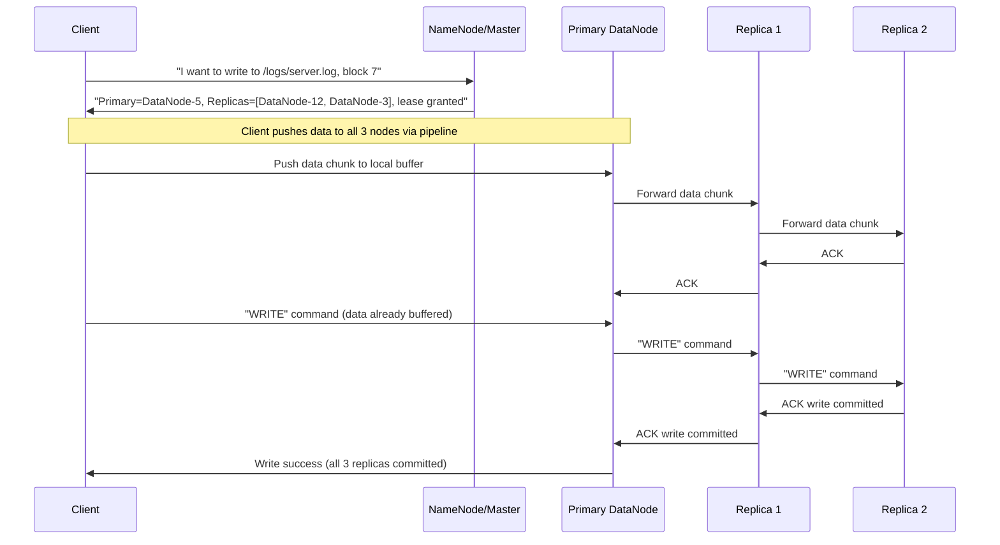
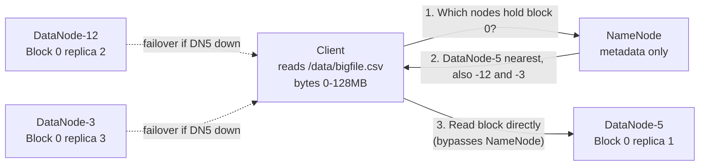

# 🌐 Distributed File Systems

> [!abstract] TL;DR
> GFS (Google File System) and its open-source clone HDFS are distributed storage systems designed for **large sequential writes at commodity-hardware scale**. A single NameNode (master) tracks file metadata; many DataNodes store 64–128 MB file blocks replicated 3×. Optimized for MapReduce batch processing — not random I/O. The NameNode is the single point of contention; large block sizes minimize metadata operations. Cloud object storage (S3) has largely superseded HDFS for modern data lakes.

---

## Intuition — Analogy First

Imagine a **public library system with one central card catalog and dozens of branch libraries**.

- The **card catalog** (NameNode) knows where every book is located: "The Complete Works of Shakespeare is at Branch 4, shelf 12, and also copies at Branch 7 and Branch 11." The catalog itself does not store books — just locations.
- The **branch libraries** (DataNodes) physically store books. Each book is stored in exactly 3 branches for resilience — if one branch burns down, the other two still have copies.
- When you want a book, you ask the central catalog for its location, then go directly to the nearest branch to pick it up. The catalog never hands you the actual book — it just directs you.
- The library system works best for **reading large textbooks end-to-end** (sequential access), not for randomly flipping to page 437 of a random novel (random access) — that pattern would require too many catalog lookups.

The "card catalog" is the NameNode. The "branch libraries" are DataNodes. The "books" are file blocks.

---

## How It Works

### GFS Architecture (2003 Google Paper)

**Design Goals:**
1. Commodity hardware (failures are normal, not exceptional)
2. Large files (100 MB to multi-GB are typical; many small files are problematic)
3. Sequential read/append workloads ([[MapReduce]] reads the whole file, then appends results)
4. Concurrent appends from many clients (producers writing to a single shared log)

**Three Components:**
- **GFS Master (NameNode equivalent):** Stores all filesystem metadata in memory: namespace (directory tree), access control, mapping of file → list of chunk handles, and mapping of chunk handle → list of ChunkServers. Does NOT store chunk data. Periodically checkpoints metadata to disk + operation log.
- **GFS ChunkServers (DataNodes):** Each file is split into fixed-size **chunks** (64 MB in GFS, 128 MB in HDFS). Each chunk is identified by a 64-bit globally unique handle. ChunkServers store chunks as plain Linux files on local disks.
- **GFS Client:** Application library linked into the client program. Caches chunk location information from the master. Communicates directly with ChunkServers for data transfer.

### Write Path (Data Flow)

**Key insight — data flow is decoupled from control flow:** The client sends write data in a pipelined chain (C→P→R1→R2) to maximize network bandwidth utilization. The write *command* is sent separately after all nodes have buffered the data. This ensures bytes travel in a linear pipeline (no bifurcation at the primary), saturating each network link fully.

### Read Path

The NameNode is **never in the data path** for reads. This is critical — it means the NameNode is a metadata-only bottleneck, and its load scales with file count (metadata operations) rather than data volume (bytes read).

### HDFS Improvements Over GFS

HDFS (Hadoop Distributed File System) is the open-source reimplementation of GFS with several additions:

- **NameNode High Availability (HA):** Original GFS/HDFS had a single NameNode (SPOF). Modern HDFS uses **ZooKeeper** to coordinate an active/standby NameNode pair. Failover is automatic. The standby NameNode receives all edit log mutations via shared NFS or JournalNodes.
- **HDFS Federation:** Multiple independent NameNodes each manage a subset of the namespace (e.g., `/user/*` → NameNode-1, `/data/*` → NameNode-2). DataNodes are shared via block pools. Scales metadata capacity beyond a single NameNode's RAM.
- **Erasure Coding in HDFS 3.0:** Like S3, HDFS 3.0 supports erasure coding (RS-6-3: 6 data blocks + 3 parity) for cold data, reducing storage overhead from 3× (3 replicas) to 1.5×.

### Why Large Block Sizes (64–128 MB)?

If a 1 GB file is stored as:
- **1 KB blocks:** 1,048,576 block metadata entries in the NameNode. Enormous memory pressure.
- **128 MB blocks:** 8 block metadata entries. The NameNode easily holds all metadata for petabytes of data in RAM.

The tradeoff: small files (< 1 block) waste space on their chunk and add disproportionate NameNode memory overhead. HDFS is pathologically bad at storing millions of small files — a common problem in practice.

### The Small Files Problem
Each file requires ~150 bytes of NameNode memory for its inode. 1 billion files = 150 GB of NameNode RAM. At scale, Hadoop clusters at companies like Facebook used **HAR (Hadoop Archive)** files or **SequenceFiles** to bundle many small files into fewer large files.

---

## Real-World Systems

**Google (GFS):** Powers Google's web crawl storage and Bigtable's SSTable files. GFS was designed for the specific workload of the Google web crawler writing large append-only log files and MapReduce reading them back for batch processing. The 2003 SOSP paper describing GFS sparked the entire distributed storage field.

**Yahoo (HDFS):** Yahoo ran the world's largest Hadoop cluster (40,000+ nodes) for ad click log processing. They were the primary contributor to HDFS during the Hadoop ecosystem's 2009–2015 peak.

**Facebook (HDFS):** Used HDFS at multi-exabyte scale for log storage and batch analytics. Facebook also developed **Haystack** (a custom object store for photos) and eventually **f4** (warm blob storage) because HDFS was not efficient for their photo storage use case.

**Uber (HDFS):** Uber used HDFS + Hive for their Hadoop data warehouse. They later migrated to cloud-native storage (S3 + Presto/Spark) to reduce operational overhead.

**Modern Reality:** In 2024, most new systems use cloud object storage (S3/GCS) instead of HDFS. HDFS requires running a separate cluster and managing NameNode HA, DataNode scaling, and rebalancing — all complexity that S3 eliminates. Apache Spark, Flink, and Presto all work natively on S3 via the `s3a://` connector.

---

## Trade-offs

| Dimension | GFS/HDFS | Cloud Object Storage (S3) |
|-----------|---------- |--------------------------|
| **Latency (first byte)** | 10–50 ms (data-center local) | 50–200 ms (HTTP + TLS) |
| **Sequential throughput** | Excellent (direct TCP to DataNode) | Excellent (parallel range GETs) |
| **Random I/O** | Poor (large block size, no POSIX) | Poor (same reasons) |
| **Small files** | Very poor (NameNode memory pressure) | Fine (each key is metadata) |
| **Operational complexity** | High (manage NameNode HA, balancer) | None (managed service) |
| **Cost** | Cheap if you own hardware; expensive if cloud EC2 | Pay-as-you-go, very cheap |
| **Data locality** | Yes — schedule compute on same node as data | No — must network to compute |
| **Consistency** | Strong (writes are synchronized) | Strong (S3 since 2020) |
| **Max file size** | Practically unlimited | 5 TB per object (S3) |

---

## When to Use vs Avoid

**Use GFS/HDFS when:**
- Running an on-premises Hadoop ecosystem (Hive, HBase, Spark on bare metal)
- Data locality matters — your compute must co-locate with data for performance
- You need full POSIX-like append semantics at large scale
- Cost constraints force commodity hardware over cloud managed services

**Avoid GFS/HDFS when:**
- Building a new cloud-native data platform (use S3 + Spark/Athena)
- You have many small files (HDFS NameNode memory will be exhausted)
- You need random read/write access (neither HDFS nor GFS supports this well)
- You want to minimize operational overhead (HDFS HA is non-trivial to run)

---

## Common Pitfalls

1. **NameNode as single point of failure (pre-HA):** Early HDFS had no NameNode HA. When the NameNode restarted (for OS patches, etc.), the entire cluster was unavailable during the startup period — potentially 30+ minutes for large clusters loading metadata from disk. Modern HDFS uses ZooKeeper-based HA to eliminate this.

2. **Small file problem.** Writing millions of 1 KB log files into HDFS will exhaust NameNode memory and degrade cluster performance. Always compact small files into larger batches (SequenceFiles, ORC, Parquet) before writing to HDFS.

3. **Ignoring data locality in scheduling.** The performance advantage of HDFS over S3 is data locality — compute runs on the same machine as the data. If your YARN/Spark scheduler ignores rack locality, you pay network costs anyway and lose the key advantage of HDFS.

4. **Not accounting for replication in capacity planning.** With 3× replication, 100 TB of raw data requires 300 TB of disk. Teams frequently underestimate capacity when they think in terms of "data size" rather than "raw disk required."

5. **Using HDFS as a general-purpose file system.** Developers familiar with POSIX filesystems sometimes try to do random seeks, frequent updates, or directory tree traversals. None of these patterns work well in HDFS — it is a write-once, read-many system.

---

## Related Concepts

- [[_MOC_Storage|↑ Section MOC]]
- [[Object_Storage]] — S3/GCS: the modern cloud alternative to HDFS for batch workloads
- [[Block_vs_Object_vs_File_Storage]] — how GFS/HDFS fits in the broader storage taxonomy
- [[Data_Lake_and_Lakehouse]] — modern data lakes use S3 instead of HDFS
- [[Data_Warehouse]] — data warehouses use columnar storage built on top of DFS concepts
- [[Databases]] — HDFS inspired distributed database storage engines (HBase, Cassandra)
- [[Replication]] — HDFS 3× replication is a concrete example of replication strategies

---

## Review Questions

1. Explain the GFS write pipeline: why is data flow (client → primary → replica1 → replica2) separate from control flow (the WRITE command)? What performance property does this separation achieve?

2. The NameNode holds all filesystem metadata in RAM. Why was this design decision made, and what is its fundamental scaling limit? What architectural changes did HDFS introduce to mitigate this limit?

3. Why has cloud object storage (S3) largely replaced HDFS for new data platform projects, even though HDFS has lower latency? What did companies operating at massive scale (like Dropbox) discover that complicates the "just use S3" answer?

---

## Sources

- [Ghemawat et al. — The Google File System (SOSP 2003)](https://static.googleusercontent.com/media/research.google.com/en//archive/gfs-sosp2003.pdf)
- [Apache HDFS Architecture Guide](https://hadoop.apache.org/docs/stable/hadoop-project-dist/hadoop-hdfs/HdfsDesign.html)
- [HDFS NameNode HA with ZooKeeper](https://hadoop.apache.org/docs/stable/hadoop-project-dist/hadoop-hdfs/HDFSHighAvailabilityWithNFS.html)
- [Facebook f4: Warm BLOB Storage System (OSDI 2014)](https://www.usenix.org/system/files/conference/osdi14/osdi14-paper-muralidhar.pdf)
- [Kleppmann — Designing Data-Intensive Applications, Ch. 10](https://dataintensive.net/)

#SystemDesign #Storage #DistributedSystems #GFS #HDFS #MapReduce #BigData #NameNode #DataNode
