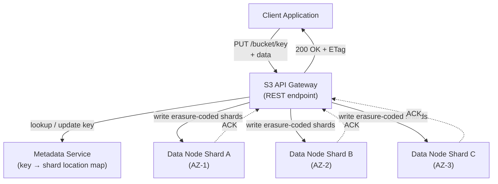

# 📦 Object Storage

> [!abstract] TL;DR
> Object storage (S3, GCS, Azure Blob) is a flat key-value store for binary data accessible via HTTP REST. It offers 11 nines of durability through multi-AZ replication and erasure coding, near-infinite scalability at low cost, and strong consistency. It is the backbone of data lakes, media delivery, and backup systems — but it is immutable and high-latency, making it unsuitable for databases or random-access workloads.

---

## Intuition — Analogy First

Imagine a **post office with infinite capacity** that accepts any package of any size from anywhere in the world.

- Every package gets a **unique tracking number** (the object key).
- The post office does not care what is inside — it stores the package as-is.
- To retrieve your package, you provide the exact tracking number — there is no "browse the warehouse" option.
- Once a package is sealed and dropped off, you **cannot open it and change its contents** — you must send a new package to replace it (immutability).
- The post office stores **multiple copies in different buildings in different cities** so even if one building burns down, your package survives (durability via erasure coding + replication).

The "tracking number" is your key (e.g., `user-uploads/2024/photo123.jpg`). The "post office" is S3.

---

## How It Works

### Core Concepts

**Buckets:** A flat namespace container that holds objects. A bucket lives in a specific region. Bucket names are globally unique across all AWS customers. There is no nesting — buckets cannot contain other buckets.

**Objects:** The fundamental unit. An object is:
- **Key:** a UTF-8 string (up to 1024 bytes). Looks like a path but is actually a flat key.
- **Value:** the binary data (0 bytes to 5 TB in S3).
- **Metadata:** system metadata (Content-Type, size, ETag) + user-defined metadata (key-value pairs).
- **Version ID:** if versioning is enabled, each overwrite creates a new version rather than deleting the old one.

**Storage Classes (S3):**

| Class | Use Case | Retrieval | Cost |
|-------|----------|-----------|------|
| S3 Standard | Frequently accessed | Instant | Highest |
| S3 Standard-IA | Infrequent access | Instant | Lower, + retrieval fee |
| S3 Intelligent-Tiering | Unknown access pattern | Instant | Auto-moves between tiers |
| S3 Glacier Instant | Archives, ms retrieval | Instant (higher fee) | Very low |
| S3 Glacier Flexible | Archives | 1–12 hours | Very low |
| S3 Glacier Deep Archive | Long-term compliance | 12–48 hours | Lowest |

### Durability and Availability
- **Durability: 99.999999999% (11 nines)** — achieved by replicating data across a minimum of 3 Availability Zones using **erasure coding**. You would need to simultaneously lose data in all 3 AZs (statistically, once every 10 million years per object) to lose data.
- **Availability: 99.99%** — the API is available even if some nodes are degraded.
- **Erasure coding:** instead of storing 3 full copies (3× cost), data is split into `n` data shards and `k` parity shards. Any `n` of `n+k` shards can reconstruct the data. Reduces storage overhead from 3× to ~1.5×.

### Multipart Upload
For objects larger than ~100 MB, S3 recommends multipart upload:
1. Initiate upload → get upload ID
2. Upload parts in parallel (each ≥ 5 MB, up to 10,000 parts)
3. Complete upload → S3 assembles the final object

Benefits: parallelism (faster), resumable (restart from last successful part on failure), required for objects > 5 GB.

### Presigned URLs
A temporary URL that grants time-limited access to a private object without exposing credentials.

```
https://bucket.s3.amazonaws.com/photo.jpg
  ?X-Amz-Algorithm=AWS4-HMAC-SHA256
  &X-Amz-Expires=3600
  &X-Amz-Signature=abc123...
```

Use case: your backend generates a presigned URL (1 hour expiry) and returns it to the frontend. The frontend uploads directly to S3 — your server never handles the file bytes.

### Lifecycle Policies
Automate transitions between storage classes:
```
Day 0:   Upload → S3 Standard
Day 30:  Transition → S3 Standard-IA
Day 90:  Transition → S3 Glacier Instant Retrieval
Day 365: Transition → S3 Glacier Deep Archive
Day 730: Delete
```

### Consistency Model
As of December 2020, S3 provides **strong read-after-write consistency** for all operations (PUT, DELETE, LIST). Previously, new-object PUTs were strongly consistent but overwrites and DELETEs were eventually consistent. The change was transparent — no API changes required.



### Internal Architecture
Internally, S3 works roughly as:
1. **Key is hashed** to determine which internal shard group (partition) owns it. Keys with common prefixes intentionally distribute across partitions — this is why adding a random prefix to S3 keys was a historical best practice for high-throughput uploads.
2. **Metadata service** maps keys to data node locations. This is a separate, highly available system.
3. **Data nodes** store the actual bytes. Erasure coding is applied across nodes in different AZs.
4. **Replication** happens synchronously within an AZ; cross-AZ replication is asynchronous (but fast enough to meet strong consistency guarantees for the user-facing API).

---

## Real-World Systems

**Dropbox — Magic Pocket:** Dropbox originally stored all user files in S3. By 2016 they had 500 PB of data and were paying enormous S3 bills. They built their own object storage system called Magic Pocket, migrating 90% of data off S3 to reduce costs. The key insight: at sufficient scale, building your own commodity hardware + custom software is cheaper than S3.

**Instagram:** Stores all photos in S3. Photos are served through a CDN (CloudFront or Fastly). S3 handles the durability; CloudFront handles the global low-latency delivery.

**Airbnb:** Hosts all listing photos, user profile images, and large data exports in S3. They use lifecycle policies to automatically move older exports to Glacier.

**Netflix:** Stores all video content (original and transcoded in hundreds of bitrates/resolutions) in S3. The encoding pipeline reads from and writes to S3. Final delivery is via CloudFront CDN. S3 event notifications trigger Lambda functions in the transcoding pipeline.

---

## Trade-offs

| Dimension | Details |
|-----------|---------|
| **Durability** | 11 nines — best-in-class, achieved via erasure coding + multi-AZ |
| **Scalability** | Essentially unlimited storage (exabytes), 5,500 GET/s per prefix |
| **Cost** | $0.023/GB/month (S3 Standard) — extremely cheap at scale |
| **Latency** | 50–200 ms first-byte — too high for databases |
| **Consistency** | Strong read-after-write (since 2020) |
| **Mutability** | Immutable — overwrites create new versions, not in-place edits |
| **Concurrency** | No locking — concurrent writes to same key have last-write-wins |
| **Query** | No SQL — must use S3 Select, Athena, or download to query |
| **Access control** | IAM policies, bucket policies, ACLs, presigned URLs — flexible |
| **Egress cost** | Data transfer OUT is expensive ($0.09/GB) — plan for CDN caching |

---

## When to Use vs Avoid

**Use Object Storage when:**
- Storing media files (images, videos, audio) at any scale
- Building a data lake (raw data accumulation for later analysis)
- Archiving logs, database backups, or audit trails
- Serving static website assets (S3 can host a static site directly)
- Distributing large files (software packages, ML model weights)
- You need globally accessible storage without managing servers
- Storing artifacts from CI/CD pipelines

**Avoid Object Storage when:**
- Running a relational or NoSQL database (needs low-latency random I/O)
- Your application modifies files in-place (e.g., SQLite database files)
- You need POSIX semantics (`open()`, `seek()`, `flock()`)
- You need extremely low latency (< 10 ms) access
- You need to list and filter objects by metadata efficiently (not a search engine)

---

## Common Pitfalls

1. **Hot partition on popular key prefixes.** S3 partitions data internally by key prefix. If all your objects start with a timestamp (`2024-01-01/...`), all traffic hits the same partition. Add a random hash prefix (`ab3f/2024-01-01/...`) to distribute load — though AWS has improved automatic partition splitting significantly.

2. **Treating S3 as a filesystem.** Code that opens a file, reads 100 bytes, seeks to position 5000, and reads another 100 bytes makes 3 API calls and accumulates 400+ ms of latency. Re-architect to download the entire object once if you need multiple reads.

3. **Forgetting egress costs.** Storage is cheap. Egress (data transfer out) is expensive. A service that reads 100 TB/month from S3 to an EC2 instance in a different region pays ~$9,000/month in transfer fees. Use CloudFront or keep compute in the same region.

4. **Using DELETE instead of versioning for "safety."** Once deleted, objects are gone (unless versioning is enabled). Enable versioning + MFA delete on critical buckets before you need it.

5. **Not setting Content-Type metadata.** If you PUT a JPEG without setting `Content-Type: image/jpeg`, browsers will prompt to download the file instead of displaying it. Always set the correct MIME type.

6. **Uploading large files as single PUT.** A 10 GB file uploaded as a single PUT request fails on transient network errors and must restart from scratch. Use multipart upload for anything above 100 MB.

---

## Related Concepts

- [[_MOC_Storage|↑ Section MOC]]
- [[Block_vs_Object_vs_File_Storage]] — comparison of all three storage types
- [[CDNs]] — CloudFront/Fastly sits in front of S3 to reduce latency and egress costs
- [[Distributed_File_Systems]] — HDFS/GFS alternatives for batch processing workloads
- [[Data_Lake_and_Lakehouse]] — S3 is the storage layer for modern data lakes
- [[Design_Google_Drive]] — a system that uses object storage internally to store user files
- [[Caching]] — client-side and CDN caching strategies to avoid repeated S3 reads

---

## Review Questions

1. S3 achieved "strong consistency" in 2020. What does this actually mean in practice, and what consistency model did it have before? Describe a concrete race condition that was possible before the change.

2. Explain how erasure coding achieves 11 nines of durability with less storage overhead than simply keeping 3 full copies of every object. What is the trade-off?

3. A user uploads a 20 GB video to your platform. Your backend needs to store it in S3. Walk through the complete multipart upload process — including what happens if the upload fails halfway through at part 15 of 20.

---

## Sources

- [Amazon S3 Documentation](https://docs.aws.amazon.com/s3/)
- [S3 Strong Consistency (AWS Blog, 2020)](https://aws.amazon.com/blogs/aws/amazon-s3-update-strong-read-after-write-consistency/)
- [Dropbox Magic Pocket Blog Post](https://dropbox.tech/infrastructure/inside-the-magic-pocket)
- [S3 Performance Best Practices](https://docs.aws.amazon.com/AmazonS3/latest/userguide/optimizing-performance.html)
- [Kleppmann — Designing Data-Intensive Applications, Ch. 3](https://dataintensive.net/)

#SystemDesign #Storage #ObjectStorage #S3 #AWS #Durability #ErasureCoding #DataLake
