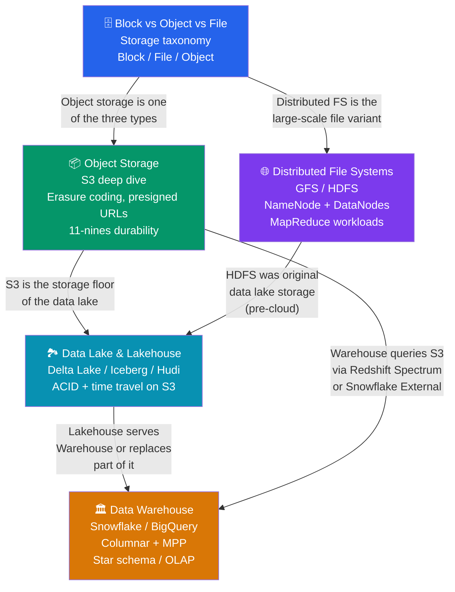

# 🗺️ Storage Systems — Map of Content

> [!abstract] What's in this section?
> This section covers the full spectrum of storage abstractions — from raw block devices at the bottom to analytical lakehouses at the top. Five notes trace the storage hierarchy (block → file → object), then follow the data pipeline from raw object storage through distributed file systems, into the data warehouse, and finally into the modern lakehouse architecture. Understanding which storage primitive to choose, and how data flows between them, is foundational to designing scalable data-intensive systems.

## Concept Map

## Learning Path

Recommended reading order — start with the taxonomy, then dive into each layer from raw storage up to analytical systems:

1. **[[Block_vs_Object_vs_File_Storage]]** — The essential taxonomy every engineer must know. Understand why you use EBS for a database, EFS for shared app files, and S3 for images and data lakes. The most common infrastructure mistake is choosing the wrong abstraction.
2. **[[Object_Storage]]** — Deep dive into S3: erasure coding achieving 11 nines, multipart upload, presigned URLs, lifecycle policies, and the 2020 strong consistency upgrade. This is the backbone of nearly every cloud-native data system.
3. **[[Distributed_File_Systems]]** — The GFS / HDFS architecture that pioneered large-scale distributed storage. Understand the NameNode bottleneck, the write pipeline (control vs data decoupling), the small files problem, and why cloud object storage has largely replaced HDFS for new projects.
4. **[[Data_Warehouse]]** — Columnar storage, MPP query execution, star schema design, and the ETL vs ELT question. Learn why Snowflake and BigQuery make OLAP workloads fast and why you must never run analytical queries on a production OLTP database.
5. **[[Data_Lake_and_Lakehouse]]** — How raw data lakes become data swamps and how Delta Lake, Apache Iceberg, and Apache Hudi add ACID transactions, time travel, and efficient upserts on top of cheap object storage. Understand the emerging Iceberg-as-standard story.

## All Notes at a Glance

| Note | Difficulty | What you'll learn |
|------|------------|-------------------|
| [[Block_vs_Object_vs_File_Storage]] | Beginner | Block / file / object trade-offs, latency, cost, when to use each |
| [[Object_Storage]] | Intermediate | S3 internals, erasure coding, multipart upload, presigned URLs, consistency model |
| [[Distributed_File_Systems]] | Advanced | GFS / HDFS architecture, NameNode, write pipeline, data locality, small files problem |
| [[Data_Warehouse]] | Intermediate | Columnar storage, MPP, star schema, Snowflake vs BigQuery vs Redshift |
| [[Data_Lake_and_Lakehouse]] | Intermediate | Data swamp problem, Delta Lake / Iceberg / Hudi, ACID + time travel, open table formats |

## Key Questions This Section Answers

- When should you use block storage vs object storage vs file storage, and what are the latency and cost implications of each choice?
- How does S3 achieve 99.999999999% (11 nines) durability, and what is the storage overhead trade-off of erasure coding vs full replication?
- Why was the NameNode a single point of contention in HDFS, and what architectural solutions did HDFS introduce to mitigate this?
- Why is columnar storage dramatically more efficient than row storage for analytical queries, and how does compression compound the advantage?
- What makes a raw data lake become a "data swamp," and which specific capabilities does Apache Iceberg add to solve each problem?
- How does the lakehouse model combine the cost advantages of object storage with the reliability guarantees of a data warehouse?
- Why has cloud object storage (S3) largely replaced HDFS for new data platform projects, and when does HDFS still make sense?

## Cross-Section Links

- Related: [[_MOC_Databases]] — OLTP databases (the source systems) run on block storage; warehouses are the analytical counterpart
- Related: [[_MOC_Data_Architecture]] — Data Architecture covers the pipeline patterns (Lambda, Kappa, ETL/ELT) that move data into these storage systems
- Related: [[_MOC_CDNs]] — Object storage (S3) integrates with CDNs (CloudFront) for global low-latency delivery of static content
- Related: [[_MOC_SystemDesign_Master]] — Master index for all System Design sections
