# 🔄 ETL vs ELT

> [!abstract] TL;DR
> **ETL** (Extract-Transform-Load) cleans and reshapes data before it enters the warehouse — traditional, when warehouse compute was expensive. **ELT** (Extract-Load-Transform) dumps raw data straight into the warehouse and transforms it there using SQL — the modern approach enabled by cheap cloud compute (BigQuery, Snowflake). **CDC** (Change Data Capture) captures database changes in real time via the write-ahead log rather than full table scans, making incremental loads efficient and enabling near-real-time pipelines.

---

## Intuition — Analogy First

**The restaurant kitchen analogy:**

**ETL** is like a prep kitchen: ingredients (raw data) arrive at a separate prep station, are washed, cut, portioned, and seasoned (transformed) before being sent to the main kitchen (warehouse) in ready-to-use form. The main kitchen only ever sees clean, prepped ingredients. But if the head chef changes the menu, the prep station must be reconfigured — a slow, expensive process.

**ELT** is like a modern open kitchen: all raw ingredients are delivered directly to the main kitchen and stored in a walk-in fridge (data lake / raw layer). Chefs (SQL analysts, dbt models) prep what they need, when they need it, using the kitchen's powerful tools. The raw ingredients are always available for new recipes — if business requirements change, write a new SQL transformation without touching the ingestion pipeline.

**CDC** is like a restaurant receiving live delivery notifications from suppliers: instead of sending a truck to count all inventory daily (full table scan), the warehouse is notified of every shipment the moment it leaves the supplier (WAL events). The inventory is always current, not 24-hours stale.

---

## How It Works

### ETL — Extract, Transform, Load

**Traditional pipeline, pre-cloud warehouse era.**

**Step 1 — Extract:** Pull data from source systems (OLTP databases, APIs, flat files). Typically a full table dump or incremental query (`WHERE updated_at > last_run`).

**Step 2 — Transform:** Clean, validate, reshape, join, and aggregate data in a separate transformation layer — historically on a dedicated ETL server, or using tools like Informatica, Talend, or IBM DataStage. This step is computationally expensive and runs outside the warehouse.

**Step 3 — Load:** Write the transformed, clean data into the data warehouse (Teradata, Oracle DW, Netezza). Warehouse compute was historically very expensive (per-query pricing, slow columnar scans) — loading only clean, pre-aggregated data kept warehouse costs manageable.

**Why ETL made sense historically:**
- Warehouse storage and compute were expensive — no room for raw/dirty data
- Warehouse query engines were slow — pre-aggregation was necessary for query performance
- Data governance: only "certified" clean data entered the warehouse

**Why ETL is painful:**
- Transformation logic lives in the ETL tool (often GUI-based, not version-controlled)
- Schema changes in source systems break the ETL job silently
- Business requirements change → ETL pipeline rebuild → weeks of work
- Raw data is discarded; if you need to re-derive a metric differently, you may not have the source data

---

### ELT — Extract, Load, Transform

**Modern approach, enabled by cloud data warehouses.**

**Step 1 — Extract:** Same as ETL — pull from source systems.

**Step 2 — Load (raw):** Load data in its raw, unmodified form directly into the warehouse. Snowflake, BigQuery, Redshift, and Databricks make raw storage cheap (object storage-backed). The raw layer is append-only and immutable — a full audit trail.

**Step 3 — Transform (inside the warehouse):** Use SQL (via **dbt** — data build tool) to transform raw tables into clean, dimensional, aggregate models. dbt turns SQL `SELECT` statements into versioned, tested, documented transformation pipelines that run inside the warehouse's powerful compute engine.

**Why ELT works now:**
- Cloud warehouses are elastically scalable — transformations run on arbitrarily large clusters at low per-query cost
- SQL is universally understood; no proprietary ETL tool skills needed
- Raw data is always preserved — you can re-derive any metric by writing a new SQL model
- dbt brings software engineering practices (version control, testing, CI/CD, lineage) to transformations

**dbt workflow:**
```sql
-- models/staging/stg_orders.sql
-- dbt compiles this into a CREATE TABLE AS SELECT in the warehouse
SELECT
    order_id,
    customer_id,
    amount_cents / 100.0 AS amount_usd,
    created_at::DATE AS order_date
FROM {{ source('postgres', 'orders') }}
WHERE created_at >= '2020-01-01'
```

dbt materializes this model as a table or view, runs tests (`not_null`, `unique`, custom), generates data lineage documentation, and orchestrates dependencies between models.

---

### CDC — Change Data Capture

**The ingestion strategy that makes ELT pipelines near-real-time.**

The problem with traditional ETL/ELT ingestion: querying `WHERE updated_at > last_run` requires a full table scan, misses hard deletes, and is brittle (tables without `updated_at` cannot be incrementally loaded).

**CDC reads the database's Write-Ahead Log (WAL)** — the internal changelog every transactional database maintains for crash recovery. Every INSERT, UPDATE, and DELETE appears in the WAL. CDC tools (primarily **Debezium**) act as a fake replica: they connect to the database, request the WAL stream, and publish every change as an event to Kafka.

```
PostgreSQL WAL → Debezium (Kafka Connect) → Kafka topic → Flink / dbt / Snowpipe → DW
```

**Benefits of CDC:**
- Captures all changes in near-real-time (seconds vs hours for batch)
- Captures hard DELETEs (not possible with `updated_at` polling)
- Zero load on the source database (WAL reading is a background operation)
- Enables both streaming pipelines (Flink) and batch ingestion (dbt) from the same Kafka topic

**Debezium example event (Postgres CDC):**
```json
{
  "op": "u",
  "before": { "order_id": 123, "status": "pending" },
  "after": { "order_id": 123, "status": "shipped" },
  "source": { "table": "orders", "ts_ms": 1722000000000 }
}
```

---

### Orchestration

Both ETL and ELT pipelines require orchestration: scheduling jobs, managing dependencies, alerting on failures.

| Tool | Model | Best For |
|------|-------|----------|
| **Apache Airflow** | Python DAGs | Complex, code-defined pipelines; legacy |
| **Prefect** | Python flows | Modern Python-native; better UX than Airflow |
| **dbt Cloud** | dbt model scheduling | dbt-native; built-in CI, docs, alerts |
| **Dagster** | Asset-based | Data asset lineage, strong typing |

---

## Mermaid Diagram

```mermaid
flowchart TD
    subgraph ETL["ETL (Traditional)"]
        direction LR
        S1[(Source DB\nOLTP)] -->|Extract| T1["Transform Server\nInformatica / Talend\nClean, reshape, aggregate"]
        T1 -->|Load clean data| W1[(Data Warehouse\nTeradata / Netezza)]
    end

    subgraph ELT["ELT (Modern)"]
        direction LR
        S2[(Source DB\nOLTP)] -->|Extract & Load raw| Raw2[("Raw Layer\nBigQuery / Snowflake\nImmutable, append-only")]
        Raw2 -->|Transform in-warehouse| dbt["dbt SQL Models\nversioned, tested"]
        dbt --> Clean2[("Transformed Layer\nDimensional models\nAggregate tables")]
    end

    subgraph CDC["CDC (Real-Time Ingestion)"]
        direction LR
        PG[(PostgreSQL\nWAL)] -->|Debezium| K["Kafka\nChange Events\nINSERT / UPDATE / DELETE"]
        K -->|Snowpipe / Flink| RawCDC[("Warehouse Raw\nor Stream Processor")]
    end

    style ETL fill:#2c3e50,color:#ecf0f1
    style ELT fill:#1a3a4a,color:#ecf0f1
    style CDC fill:#1a2a1a,color:#ecf0f1
```



---

## Real-World Systems

**Airbnb (dbt + Spark/Trino):** Airbnb's data platform ingests raw events and database snapshots into their lakehouse. dbt models (300+) transform raw booking, user, and listing data into clean dimensional tables. Airflow orchestrates daily dbt runs. Their transition from ETL to ELT with dbt reduced transformation pipeline development time from weeks to days.

**Stripe (dbt for analytics):** Stripe uses dbt to build their internal analytics data models on top of raw payment events loaded from their OLTP databases. Version-controlled dbt models enabled their data team to ship and test transformations with the same rigor as application code.

**LinkedIn (Kafka + CDC for data infrastructure):** LinkedIn's database change pipelines use Kafka at their core. Databus (their proprietary CDC system, later open-sourced and inspiring Debezium) streams Oracle WAL events to downstream consumers. This enabled building real-time search indexes and analytics without polling OLTP databases.

**Shopify (CDC + BigQuery):** Shopify uses Debezium to capture changes from MySQL shards and stream them to Kafka, then into BigQuery via Pub/Sub. This gives analysts near-real-time access to order data (< 5 minute lag) without the performance impact of polling MySQL at scale.

---

## Trade-offs

| Dimension | ETL | ELT | CDC |
|-----------|-----|-----|-----|
| Data freshness | Hours (batch) | Hours (batch) | Seconds (real-time) |
| Raw data preserved | No (transformed before load) | Yes | Yes (in Kafka) |
| Transformation flexibility | Low (rebuild ETL for changes) | High (rewrite SQL) | High (re-consume Kafka) |
| Source DB load | High (full table scans) | High (full extracts) | Low (WAL read is lightweight) |
| Captures DELETEs | No (without soft-delete columns) | No (without CDC) | Yes |
| Tooling complexity | Medium (ETL tool) | Low (SQL + dbt) | High (Debezium, Kafka, connectors) |
| Cost | High (dedicated ETL servers) | Low (warehouse compute) | Medium (Kafka cluster) |
| Debugging | Hard (opaque ETL tool) | Easy (SQL + dbt tests) | Medium (event replay helps) |

---

## When to Use vs Avoid

**Use ETL when:**
- Data must be anonymized, encrypted, or masked before entering the warehouse (compliance: GDPR, HIPAA — raw PII should not enter the warehouse)
- Source data quality is so poor that cleaning it is a prerequisite for useful downstream analysis
- Working with legacy warehouses where storage is expensive and only pre-aggregated data is feasible

**Use ELT when:**
- Modern cloud warehouse (BigQuery, Snowflake, Redshift, Databricks) is available
- Business requirements change frequently — ELT lets you re-derive metrics without touching ingestion
- You want analysts to own transformations using SQL rather than requiring data engineers for every change
- Data lineage and transformation testing (dbt) are engineering priorities

**Use CDC when:**
- You need near-real-time data freshness (< 5 minutes) in the warehouse
- Source tables undergo DELETEs that must be reflected downstream
- Full table scans for incremental loads are impacting OLTP database performance
- You need to feed both a streaming pipeline (Flink) and a batch warehouse from the same source

**Avoid CDC when:**
- Source database does not expose WAL or binlog (some managed cloud databases restrict this)
- Volume of changes is very low — simpler `updated_at` polling may be sufficient
- Operational overhead of Debezium + Kafka is disproportionate to the data freshness gain

---

## Common Pitfalls

- **Deleting raw data in ELT:** Teams sometimes partition raw tables and delete partitions older than 30 days to save cost. This destroys the ability to recompute historical metrics if transformation logic changes. Raw data should be treated as immutable; use dbt incremental models and warehouse storage tiering instead.
- **CDC connector lag accumulation:** Debezium connectors can fall behind if the target Kafka topic's consumer lag grows (e.g., downstream Flink job is slow). If the connector falls too far behind, the source database's WAL segment may be rotated and the connector position becomes invalid — requiring a full resync (expensive). Monitor consumer lag religiously.
- **Treating dbt models as ETL:** dbt is a transformation tool, not an ingestion tool. Teams that try to use dbt to pull data from source systems (`{{ ref('raw.external_api') }}`) are misusing it. Ingestion (Extract + Load) must happen separately; dbt only transforms data already in the warehouse.
- **Schema evolution breaking CDC:** When a source database column is renamed or dropped, the Debezium connector may stop or produce events with missing fields. Schema registry (Confluent Schema Registry) and Avro/Protobuf schemas make CDC schema evolution manageable but add operational complexity.
- **Not testing dbt models:** dbt's testing framework (`not_null`, `unique`, `accepted_values`, `relationships`) can catch data quality regressions before they reach dashboards. Teams that skip tests discover wrong numbers in production reports days after a transformation change.

---

## Related Concepts

- [[_MOC_Data_Architecture|↑ Section MOC]]
- [[Lambda_Architecture]] — the batch layer is an ETL/ELT pipeline over immutable data; the speed layer adds real-time CDC
- [[Kappa_Architecture]] — CDC via Kafka enables Kappa's streaming-only model by streaming all database changes
- [[Kafka]] — the backbone for CDC pipelines (Debezium → Kafka → warehouse / Flink)
- [[Stream_Processing]] — real-time ELT pipelines use Flink or Kafka Streams to transform CDC events in-flight
- [[Write_Ahead_Log]] — the source of truth for CDC; understanding WAL explains why CDC is low-overhead

---

## Review Questions

1. Your team needs to replicate a Postgres `orders` table to BigQuery with < 5 minute lag. The table receives ~10,000 updates/minute and 500 hard deletes/minute. Why is a polling-based `WHERE updated_at > last_run` approach insufficient, and what technology would you use instead?
2. In ELT, raw data is loaded into the warehouse unchanged before transformation. A business analyst argues this is wasteful because it stores "dirty data." Construct the counter-argument: what specific capability does preserving raw data enable that ETL destroys?
3. A dbt model runs nightly and takes 45 minutes to transform 6 months of order data into an `orders_summary` table. The business now requires hourly updates. Describe two strategies to achieve this: one using dbt incremental models and one using a streaming approach.

---

## Sources

- [The dbt Documentation](https://docs.getdbt.com/)
- [Debezium Documentation](https://debezium.io/documentation/)
- [ETL vs ELT — Fivetran](https://www.fivetran.com/blog/etl-vs-elt)
- [The Modern Data Stack — Benn Stancil](https://benn.substack.com/p/the-modern-data-stack)
- [Change Data Capture with Debezium — Confluent](https://developer.confluent.io/patterns/event-streaming/change-data-capture/)
- [dbt + Airbnb Engineering](https://medium.com/airbnb-engineering/how-airbnb-achieved-metric-consistency-at-scale-f23cc53dea70)

---

#SystemDesign #DataArchitecture #ETL #ELT #CDC #dbt #Debezium #DataEngineering
