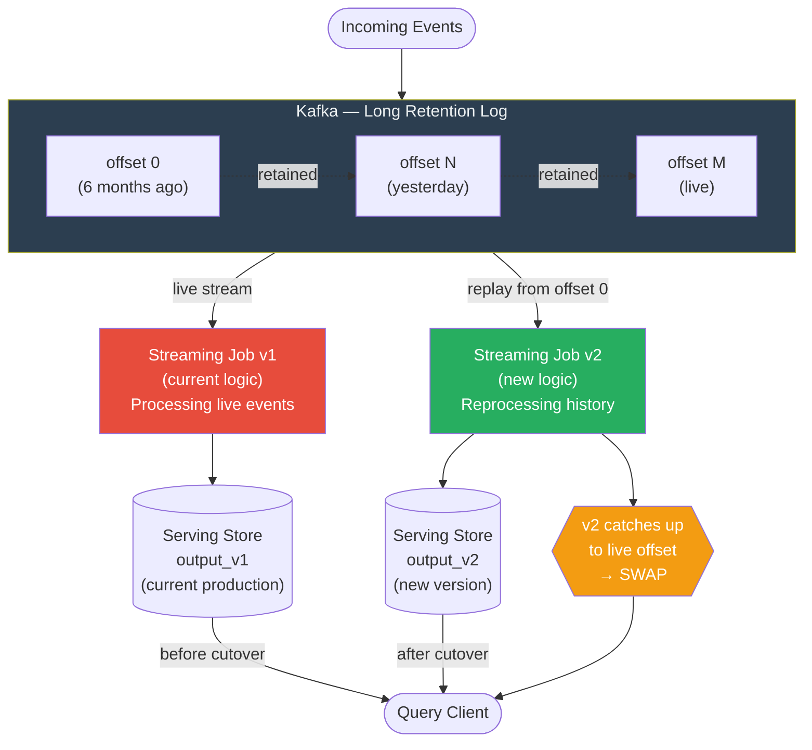

# κ Kappa Architecture

> [!abstract] TL;DR
> Kappa Architecture eliminates Lambda's batch layer entirely. A single streaming pipeline handles both real-time processing and historical reprocessing — made possible by replaying the full event log from Kafka. One codebase, one system to operate, same results. The key enabler: Kafka's long log retention means "batch reprocessing" is just a streaming job starting from offset 0.

---

## Intuition — Analogy First

**The DVR analogy:** Lambda Architecture is like having two employees watching live TV simultaneously — one writes a running summary (speed layer) and one reviews the recorded full archive weekly (batch layer). Kappa says: you only need one employee, because the DVR records everything. When you need to reprocess history, you just rewind the DVR to the beginning and let your one employee watch from the start. The live feed and the historical replay use the exact same viewing process — no duplication.

**Jay Kreps' core insight** (2014, O'Reilly): The batch layer in Lambda exists to enable reprocessing — replaying history when you find a bug or change your computation. But Kafka already does this: it's an immutable, replayable log with configurable retention. If you can replay all your data through the same streaming job, the batch layer is redundant.

The simplification from Lambda to Kappa is: **remove the batch layer, replace it with Kafka replay**.

---

## How It Works

### The Two Jobs Model

Kappa Architecture runs (at most) two versions of a streaming job simultaneously:

**Job v1 (current production job):** processes the live Kafka stream, writes to the current serving store. This is your normal real-time pipeline.

**Job v2 (new version during reprocessing):** when you change the business logic, spin up a new streaming job (v2) starting from offset 0 of the Kafka topic. It processes the entire history in the same way it will process future events. It writes to a **new** output table or index, not the current production one.

When Job v2 catches up to the current offset (within seconds of the live stream), you:
1. Swap the serving layer to point at v2's output
2. Shut down Job v1
3. Delete v1's old output

No downtime, no dual codebase, no reconciliation logic.

### Prerequisites

**Kafka long retention (or tiered storage):** Kappa only works if Kafka retains all historical data, or at least enough history for your reprocessing needs. Modern Kafka with tiered storage (infinite retention via S3/GCS) makes this practical even for petabyte-scale datasets.

**Fast streaming engine:** Historical reprocessing must complete in a reasonable time. Apache Flink's high-throughput replay can process years of data in hours. Slower systems make the reprocessing window impractically long.

**Idempotent output writes:** The new job may write slightly different keys/values for historical events compared to the live job. Your serving store must handle upserts cleanly so v2's historical writes don't corrupt production state.

### Handling Reprocessing — Step by Step

```
1. Deploy Job v2 alongside Job v1 (different consumer group ID)
2. Job v2 starts from offset 0, writing to output_v2 table
3. Job v2 processes months of history; v1 continues serving live queries
4. v2 catches up to live offset (lag approaches zero)
5. Atomic swap: serving layer reads from output_v2
6. Drain and shut down v1; clean up output_v1
```

---

## Mermaid Diagram



---

## Real-World Systems

**Uber's real-time data platform:** Uber migrated core analytics pipelines to a Kappa-style architecture using Apache Flink. Flink jobs process ride events, location updates, and payment events from Kafka. When fare calculation logic changes, a new Flink job replays historical Kafka data to backfill corrected metrics. The unified codebase reduced the oncall burden significantly compared to their earlier Lambda-era systems.

**Yelp's "pipeline" architecture:** Yelp publishes all database changes as events to Kafka via Debezium (CDC). Their analytics and search index pipelines consume this stream. Reprocessing for index rebuilds or schema changes is handled by replaying from the beginning of the relevant Kafka topic with a new consumer.

**LinkedIn's real-time analytics:** LinkedIn (Kafka's origin) uses Kafka-centric streaming architectures for activity feeds and metrics. Their Samza-based pipelines (Kafka Streams' predecessor) pioneered the idea of treating the log as the source of truth for both real-time and historical queries.

**Cloudflare DDoS detection:** Cloudflare processes billions of DNS/HTTP events per second through Kafka-backed streaming pipelines. The ability to replay and reprocess historical traffic patterns when detection algorithms change is essential for tuning detection thresholds.

---

## Trade-offs

| Dimension | Kappa | Lambda | Notes |
|-----------|-------|--------|-------|
| Operational complexity | Low (1 system) | High (2 systems) | Kappa's main advantage |
| Codebase complexity | Low (1 pipeline) | High (batch + stream code) | Kappa eliminates dual maintenance |
| Reprocessing speed | Medium (replay speed limited by Flink throughput) | Fast (Spark batch is optimized for bulk) | Lambda can parallelize better for cold reprocessing |
| Historical data access | Requires Kafka retention | Immutable store + Kafka | Lambda's batch store is independent of Kafka retention policy |
| Consistency during reprocessing | High (same code path) | Medium (two codebases may diverge) | Kappa eliminates consistency issues between layers |
| Infrastructure cost | Medium (Kafka storage + Flink) | High (Kafka + Spark cluster + Flink) | Kappa cheaper at scale |
| Failure recovery | Replay from Kafka offset | Re-run batch job | Both recoverable; Kappa simpler |

---

## When to Use vs Avoid

**Use Kappa Architecture when:**
- Your streaming engine (Flink) can reprocess historical data fast enough for your SLA
- Kafka retention can hold all the history you need (tiered storage makes this nearly unlimited)
- You want to eliminate the operational and code-maintenance burden of two separate systems
- Your team is small — one pipeline means one oncall rotation
- Business logic changes frequently and re-syncing two codebases is painful

**Avoid Kappa Architecture when:**
- Your data volume is so large that Kafka replay takes weeks (rare: Flink is fast)
- You have complex ad-hoc batch analytics requirements that don't fit the streaming model (e.g., full table scans, complex joins over entire dataset history)
- You need the batch layer as an authoritative backup that is independent of Kafka's log retention (regulatory archival requirements)
- Your organization has strong Hadoop/Spark expertise and limited streaming expertise — Lambda may be operationally easier for that team

---

## Common Pitfalls

- **Underestimating Kafka retention cost:** Long-retention Kafka clusters are expensive without tiered storage. Before committing to Kappa, validate that the cost of keeping all historical data in Kafka (or tiered to S3) is acceptable. Tiered storage is now standard in Confluent Cloud and Apache Kafka 3.x+.
- **Consumer group ID management:** During reprocessing, the new job must use a different Kafka consumer group ID to avoid interfering with the live job's offsets. A single mislabeled job can corrupt your production consumer group position.
- **Output store upsert semantics:** The reprocessing job writes the same keys as the live job, potentially out of order relative to recent live writes. Your serving store must handle "late" historical writes correctly — typically via idempotent upserts keyed on event ID + timestamp, not append-only inserts.
- **Treating Kappa as appropriate for all batch workloads:** Kappa is not a replacement for data warehouse workloads. Complex analytical queries over petabyte datasets with arbitrary grouping/aggregation still belong in Spark or BigQuery. Kappa excels at continuous, incremental computation — not ad-hoc exploration.
- **Reprocessing time underestimation:** Teams often discover that "we'll replay from the beginning" takes 72 hours of Flink processing. For time-sensitive fixes (e.g., a billing bug), this lag is a real business problem. Maintain checkpoints at regular intervals so partial replays are possible.

---

## Related Concepts

- [[_MOC_Data_Architecture|↑ Section MOC]]
- [[Lambda_Architecture]] — the architecture Kappa simplifies; understanding Lambda's two-path problem motivates Kappa's design
- [[Stream_Processing]] — the core technology enabling Kappa: Flink, Kafka Streams, Spark Structured Streaming
- [[Kafka]] — the immutable replayable log that makes Kappa feasible; long retention is the key enabler
- [[ETL_vs_ELT]] — Kappa can be viewed as the streaming equivalent of ELT: load raw events to Kafka, transform via streaming

---

## Review Questions

1. Kappa Architecture requires Kafka to retain all historical events. What operational and cost implications does this have, and what technology makes it practical at petabyte scale?
2. During a Kappa reprocessing job, Job v2 runs alongside Job v1 and catches up to the live stream. At the exact moment of cutover, there is a brief window where some events are being written by both jobs. How should the serving store handle this to avoid data corruption?
3. A team argues: "Kappa is strictly better than Lambda — we should always use Kappa." Describe a specific scenario where Lambda Architecture is the more appropriate choice and explain why.

---

## Sources

- [Questioning the Lambda Architecture — Jay Kreps (2014)](https://www.oreilly.com/radar/questioning-the-lambda-architecture/)
- [Kappa Architecture — Wikipedia](https://en.wikipedia.org/wiki/Kappa_architecture)
- [The Log: What every software engineer should know — Jay Kreps (LinkedIn)](https://engineering.linkedin.com/distributed-systems/log-what-every-software-engineer-should-know-about-real-time-datas-unifying)
- [Uber's Real-Time Data Infrastructure — Uber Engineering Blog](https://eng.uber.com/real-time-data-infrastructure/)

---

#SystemDesign #DataArchitecture #KappaArchitecture #StreamProcessing #Kafka #BigData
