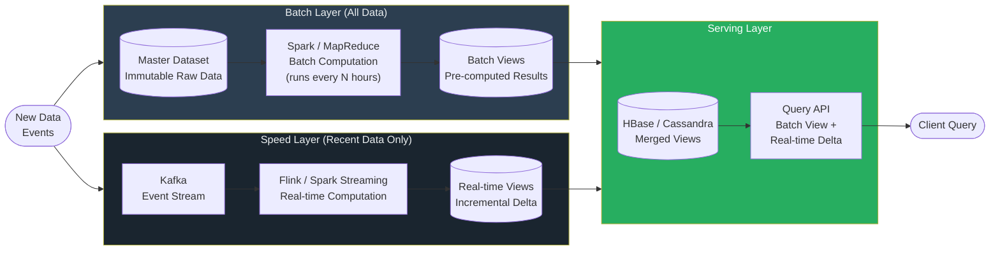

# λ Lambda Architecture

> [!abstract] TL;DR
> Lambda Architecture handles massive data volumes by running **two parallel pipelines**: a batch layer for accurate, complete historical computation and a speed layer for low-latency real-time views. The serving layer merges both. The core problem it solves is the tension between accuracy (batch) and freshness (streaming) — at the cost of maintaining two codebases doing the same computation.

---

## Intuition — Analogy First

**The accountant and the cashier analogy:** Imagine a large retailer. The cashier (speed layer) tracks today's running sales total in real time — fast but might miss some edge cases, and gets reset at end of day. Every night, the accountant (batch layer) goes through every single receipt ever issued, reconciles everything, and produces the official authoritative report. The manager (serving layer) answers "what are our total sales?" by combining the official report through yesterday with the cashier's live running tally. The result is both accurate and up-to-date — but you need both the accountant and the cashier doing overlapping work.

**The fundamental insight:** You cannot build a single system that is simultaneously low-latency, high-accuracy, and fault-tolerant over large historical datasets. Lambda Architecture accepts this and runs two systems: one optimized for each constraint.

---

## How It Works

### The Three Layers

**Batch Layer (Truth Store)**
- Stores the master dataset: immutable, append-only raw data going back to the beginning of time
- Periodically (hourly, daily) re-computes **batch views** from scratch over the entire dataset
- Uses MapReduce, Apache Spark, or Hive — high latency (hours), but perfectly accurate
- The batch layer is the authority; it can recompute anything by replaying all data
- Because computation is idempotent on immutable data, bugs are fixable by rerunning

**Speed Layer (Real-Time Views)**
- Processes only the most recent data (since the last batch run)
- Produces **real-time views** with low latency using Kafka + Flink or Spark Streaming
- Accuracy is "good enough" — handles the gap between the last batch view and now
- As soon as a new batch view is computed and replaces the old one, the corresponding real-time view is discarded
- Compensates for the high latency of the batch layer

**Serving Layer (Query Interface)**
- Merges batch views + real-time views to answer queries
- Technologies: Apache HBase, Cassandra, Druid, BigQuery
- A query for "total page views for user X all time" = batch view result + real-time delta since last batch run
- Handles random read access; must support fast indexed reads

### Data Flow

New data enters the system and is written to **both** the batch layer and the speed layer simultaneously. There is no coordination needed — the batch layer sees everything; the speed layer only cares about recent data.

### The Two-Path Problem

The critical flaw of Lambda Architecture: you must implement every computation **twice** — once in batch (e.g., Spark/MapReduce) and once in streaming (e.g., Flink/Kafka Streams). These are different APIs, different semantics, different operational concerns. When business logic changes (e.g., "a view only counts if the session lasted > 10 seconds"), both pipelines must be updated in sync. Bugs in one but not the other lead to inconsistent results between the batch and real-time views.

---

## Mermaid Diagram

---

## Real-World Systems

**LinkedIn (original use case):** Lambda Architecture was used for the news feed relevance pipeline. Batch Spark jobs computed features over months of historical interaction data; Kafka + Samza powered the real-time view of the last few hours. The serving layer merged both for feed ranking decisions.

**Netflix content analytics:** Netflix used Lambda for its content pipeline — batch jobs over viewing history (Spark on EMR) computed long-horizon content performance metrics, while Flink jobs tracked real-time viewing trends. Recommendations combined both views.

**Twitter's ad analytics:** Historical ad performance was computed via Hadoop; current campaign performance used Storm (an early streaming system). Aggregated results for advertisers blended both views in the serving layer.

**Apache Storm:** Twitter's Nathan Marz (who designed Lambda Architecture) built Storm specifically to serve as the speed layer in Lambda deployments.

---

## Trade-offs

| Dimension | Batch Layer | Speed Layer | Overall Lambda |
|-----------|-------------|-------------|----------------|
| Latency | High (hours) | Low (seconds) | Low end-to-end (via speed layer) |
| Accuracy | Perfect (full recompute) | Approximate (recent only) | High (speed layer compensates) |
| Fault tolerance | High (replay from immutable data) | Medium (at-least-once common) | High |
| Operational complexity | Medium | Medium | **High (two systems, two codebases)** |
| Debugging | Easy (idempotent recompute) | Hard (stateful streaming) | Hard |
| Infrastructure cost | High (cluster compute periodically) | Medium (always running) | **High** |
| Backfill / reprocessing | Easy (re-run batch job) | Hard (re-create stream state) | Medium |

---

## When to Use vs Avoid

**Use Lambda Architecture when:**
- You have genuinely massive historical datasets (petabyte scale) where streaming alone cannot reprocess history in reasonable time
- Your business requires both real-time dashboards and historically accurate analytics simultaneously
- The batch and real-time computations are simple enough that maintaining two implementations is manageable
- You're in a pre-Kappa era with limited stream processing maturity (e.g., early Flink adoption)

**Avoid Lambda Architecture when:**
- Your team is small — two pipelines means double the bugs, double the oncall incidents
- Your computation logic changes frequently — synchronizing changes across two codebases is the main operational pain point
- Your stream processing system (Flink) can replay historical data efficiently from Kafka with long retention — in this case, [[Kappa_Architecture]] is simpler
- The "batch layer accuracy" benefit is marginal — if your streaming pipeline already achieves exactly-once semantics (Flink), the batch layer's accuracy advantage nearly disappears

---

## Common Pitfalls

- **Inconsistent results between layers:** When the batch view and real-time view disagree (due to code divergence or bugs), the serving layer merges them into a wrong answer. Users see different numbers depending on whether they query during or after a batch run.
- **The recomputation window:** Batch jobs run on a schedule. If a batch job takes 6 hours and runs every 4 hours, you have overlapping jobs and undefined state. Capacity planning for batch compute is non-trivial.
- **Speed layer technical debt:** Teams often invest in the batch layer first (it's simpler) and bolt on the speed layer later. The speed layer ends up as a rough approximation that nobody fully trusts but everyone depends on.
- **Data skew in batch jobs:** Spark/MapReduce batch jobs over years of data frequently hit data skew issues (hot keys) that require careful partitioning strategies — debugging these is time-consuming.
- **Forgetting to expire real-time views:** If the serving layer doesn't properly discard old real-time views after a new batch view is published, queries may double-count events that appear in both layers.

---

## Related Concepts

- [[_MOC_Data_Architecture|↑ Section MOC]]
- [[Kappa_Architecture]] — the successor/simplification: eliminate the batch layer, use only streaming with Kafka replay
- [[Stream_Processing]] — the speed layer's underlying technology (Flink, Kafka Streams, Spark Streaming)
- [[ETL_vs_ELT]] — the batch layer is essentially an ETL pipeline over immutable data
- [[Kafka]] — the standard choice for the message bus feeding both layers
- [[MapReduce]] — the original batch computation model underlying Hadoop-era Lambda deployments

---

## Review Questions

1. A Lambda Architecture system shows different total sales numbers depending on whether a query is made one hour before vs one hour after the daily batch run. What is the root cause, and is this a bug or expected behavior?
2. Your team is considering migrating from Lambda to Kappa Architecture. What is the single most important prerequisite that your Kafka setup must satisfy for this migration to be feasible?
3. The batch layer in Lambda Architecture stores data as immutable, append-only records rather than updating records in place. Why is immutability essential to the batch layer's correctness guarantee?

---

## Sources

- [How to Beat the CAP Theorem — Nathan Marz](http://nathanmarz.com/blog/how-to-beat-the-cap-theorem.html)
- [Big Data: Principles and Best Practices — Nathan Marz & James Warren](https://www.manning.com/books/big-data)
- [Lambda Architecture — Wikipedia](https://en.wikipedia.org/wiki/Lambda_architecture)
- [The Log: What every software engineer should know — Jay Kreps (LinkedIn)](https://engineering.linkedin.com/distributed-systems/log-what-every-software-engineer-should-know-about-real-time-datas-unifying)

---

#SystemDesign #DataArchitecture #LambdaArchitecture #BigData #BatchProcessing #StreamProcessing
