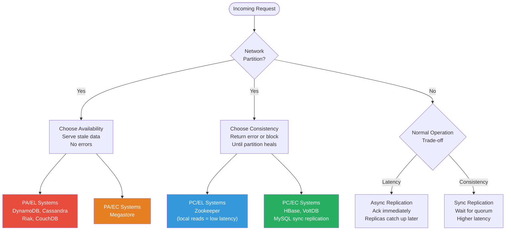

# ⚡ PACELC Theorem

> [!abstract] TL;DR
> PACELC extends CAP by adding the latency vs consistency trade-off that exists even during **normal operation** (no partition). Every distributed system must answer two questions: what do you sacrifice during a partition (A or C), and what do you sacrifice during normal operation (L or C)?

---

## Intuition — Analogy First

**The bank teller analogy:** CAP tells you what the bank does when the phone line to headquarters is cut — do they freeze accounts (consistency) or keep processing (availability)? PACELC asks a deeper question: even when the phone line is working perfectly, do you call headquarters to confirm every transaction before processing (strong consistency, adds latency) or process locally and sync later (low latency, risks temporary mismatch)? The partition scenario is the emergency; the normal-operation trade-off is the daily policy.

Think of it as: **partition** is a rare crisis, but the **latency/consistency tension is every single request**.

---

## How It Works

### The Two-Scenario Framework

PACELC was proposed by Daniel Abadi (2012) to address a blind spot in CAP: CAP only describes system behavior during network partitions, but partitions are rare. The latency vs consistency trade-off affects every read and every write under normal operating conditions and is often the more important design decision.

**The PACELC breakdown:**

| Scenario | Choice A | Choice B |
|----------|----------|----------|
| **P**artition occurs | **A**vailability | **C**onsistency |
| **E**lse (normal operation) | **L**atency | **C**onsistency |

**The core insight about normal operation:** To achieve strong consistency, every write must be synchronously replicated to a quorum of nodes before acknowledging success to the client. This synchronous step adds latency proportional to the round-trip time between replicas. Async replication (lower latency) means reads may see stale data. There is no free lunch.

### System Classifications

| System | Partition Behavior | Normal Behavior | Classification | Reasoning |
|--------|-------------------|-----------------|----------------|-----------|
| DynamoDB (default) | Availability | Low Latency | PA/EL | Async replication; eventual consistency default |
| Cassandra | Availability | Low Latency | PA/EL | Tunable; defaults to async; no single point of consistency |
| Riak | Availability | Low Latency | PA/EL | Designed for maximum availability |
| Zookeeper | Consistency | Low Latency | PC/EL | Strong consistency for coordination; but reads are local (low latency) |
| HBase | Consistency | Consistency | PC/EC | HDFS-backed; strong reads go through master |
| VoltDB | Consistency | Consistency | PC/EC | In-memory; synchronous replication; ACID |
| Megastore | Availability | Consistency | PA/EC | Paxos within regions (EC) but degrades to AP across regions |
| MySQL (async replication) | Availability | Low Latency | PA/EL | Async replica lag is common |
| MySQL (sync replication) | Consistency | Consistency | PC/EC | Semi-sync or Galera; every write waits for replica ACK |

### Cassandra's Tunable Consistency

Cassandra is particularly interesting because it can move along the PACELC spectrum dynamically via consistency levels:

- `ONE` → PA/EL: single replica acknowledgment, lowest latency
- `QUORUM` → PA/EC leaning: majority of replicas must agree, higher latency
- `ALL` → PC/EC: all replicas must agree, highest latency, full consistency

This tunability is a feature: different operations in the same application can make different trade-offs.

---

## Mermaid Diagram

---

## Real-World Systems

**DynamoDB (PA/EL):** Default reads are eventually consistent, returning immediately from the nearest replica. Strongly consistent reads (EC behavior) are available at 2× the cost and higher latency — this is PACELC in action as a literal pricing knob.

**Cassandra (PA/EL, tunable toward EC):** The `QUORUM` consistency level forces writes to be acknowledged by a majority of replicas before returning. This directly trades latency for consistency. Cassandra's multi-datacenter deployments make the latency cost especially visible — waiting for an ACK from a replica 100ms away is a real cost on every write.

**Zookeeper (PC/EL):** Uses ZAB (Zookeeper Atomic Broadcast) protocol — all writes go through the leader and are committed only after a quorum of followers acknowledge. During a partition, the minority partition stops accepting writes (PC). However, reads are served locally by any node (EL) — this is why it's PC/EL rather than PC/EC.

**VoltDB (PC/EC):** In-memory database with synchronous replication. Every transaction waits for replicas to confirm before committing. Strong consistency guarantees at the cost of latency — explicitly designed for use cases where correctness trumps speed.

---

## Trade-offs

| Dimension | PA/EL | PC/EC | PA/EC | PC/EL |
|-----------|-------|-------|-------|-------|
| Write latency | Low (async) | High (sync quorum) | Low | Medium |
| Read freshness | Eventual | Always fresh | Eventually fresh | Always fresh |
| Partition resilience | High | Low | High | Low |
| Operational complexity | Low | Medium | High | Medium |
| Best for | High-scale web apps | Financial systems | Cross-region with local consistency | Coordination services |

---

## When to Use vs Avoid

**Choose PA/EL when:**
- User-facing applications where latency directly affects UX (< 100ms SLA)
- Data can tolerate brief staleness (social feeds, product catalogs, shopping carts)
- Scale requirements make synchronous replication impractical (global user base)

**Choose PC/EC when:**
- Financial transactions where double-spend or lost writes are unacceptable
- Inventory management where overselling causes real business harm
- Any system where reading stale data leads to incorrect decisions with lasting consequences

**Choose PC/EL when:**
- Distributed coordination (leader election, distributed locks, service discovery)
- You need strong write consistency but can tolerate slightly stale reads
- Zookeeper-style metadata stores

**Avoid ignoring PACELC when:**
- Designing for multi-region deployments — the latency cost of EC across regions is significant
- Choosing a database — the PA/EL vs PC/EC axis is often more important than raw throughput numbers

---

## Common Pitfalls

- **Treating CAP as sufficient:** CAP tells you nothing about normal-operation behavior. A system can be classified PA (CP) but still have terrible latency characteristics during normal operation. PACELC completes the picture.
- **Assuming tunable consistency is free:** Cassandra's `QUORUM` consistency level solves the staleness problem but reintroduces the latency cost. There is no way to get both low latency and strong consistency simultaneously.
- **Ignoring the EL vs EC cost in multi-region:** Synchronous replication across regions adds round-trip latency (50–200ms). For high-volume write paths, this is often the bottleneck — PA/EL with async replication and careful conflict resolution is often the pragmatic choice.
- **Misclassifying Zookeeper as PC/EC:** Zookeeper reads are served locally (EL), not always through the leader. Only writes require quorum agreement. Reads may return slightly stale data unless you explicitly call `sync()` first.

---

## Related Concepts

- [[_MOC_Data_Architecture|↑ Section MOC]]
- [[CAP_Theorem]] — the foundation PACELC extends; covers partition behavior only
- [[Consistency_Patterns]] — strong, eventual, and weak consistency patterns that map to the C axis in PACELC
- [[Replication]] — the mechanism behind both the latency cost (sync) and the staleness risk (async)
- [[Availability_vs_Consistency]] — the foundational framing for all distributed system trade-offs
- [[Database_Replication]] — concrete replication strategies and their PACELC implications

---

## Review Questions

1. A DynamoDB table uses eventually consistent reads by default. Explain in PACELC terms why switching to strongly consistent reads costs more money and increases latency.
2. Zookeeper is classified PC/EL rather than PC/EC. What specific architectural decision makes its reads low latency despite its strong write consistency guarantees?
3. Your team is debating between Cassandra at `QUORUM` consistency and MySQL with synchronous replication for a global payments ledger. Using PACELC, frame the exact trade-off they are making and which you would recommend.

---

## Sources

- [PACELC — Daniel Abadi (2012)](https://dl.acm.org/doi/10.1145/2366316.2366337)
- [Consistency Tradeoffs in Modern Distributed Database Design — Abadi](http://cs-www.cs.yale.edu/homes/dna/papers/abadi-pacelc.pdf)
- [PACELC — Wikipedia](https://en.wikipedia.org/wiki/PACELC_theorem)
- [System Design Primer](https://github.com/donnemartin/system-design-primer)

---

#SystemDesign #DataArchitecture #PACELC #DistributedSystems #Consistency #Latency
