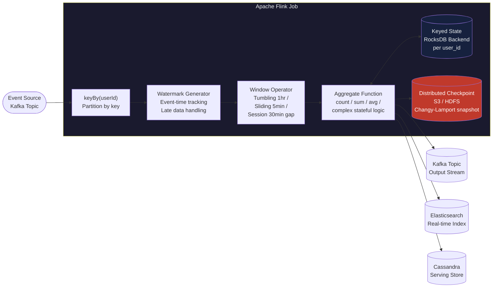

# 🌊 Stream Processing

> [!abstract] TL;DR
> Stream processing computes results on data records as they arrive, enabling low-latency analytics, real-time decisions, and continuous transformations. The core challenges are **windowing** (how to group infinite data), **time semantics** (event time vs processing time), **state management** (remembering context across events), and **fault tolerance** (exactly-once guarantees). Apache Flink is the most capable system; Kafka Streams is the simplest for Kafka-native workloads.

---

## Intuition — Analogy First

**The toll booth analogy:** Batch processing is like closing the highway at midnight, counting all the cars that passed in the last 24 hours, and publishing a daily report. Stream processing is like a live traffic counter mounted at the toll booth: it counts every car as it passes and can answer "how many cars in the last 5 minutes?" at any moment without waiting for the highway to close. The challenge: some cars take detours and arrive late — how do you handle a car that shows up 10 minutes after the window you're counting closed? That's the late-data problem stream processing must solve.

**Why batch is insufficient for real-time:** A recommendation system that recomputes suggestions once a day cannot detect that a user just searched for "camping gear" 30 seconds ago. Stream processing enables sub-second reaction to events, which batch cannot match.

---

## How It Works

### Core Concepts

#### 1. Windowing — Taming Infinite Streams

A stream is unbounded — it never ends. To compute aggregations (sum, count, average), you need to define a finite window of time or records.

**Tumbling windows:** Fixed-size, non-overlapping. Every event belongs to exactly one window.
- Example: count page views per hour → windows are [0:00–1:00), [1:00–2:00), [2:00–3:00)
- Use case: hourly billing reports, daily batch aggregations in streaming form

**Sliding windows:** Fixed size with a slide interval. Windows overlap; an event may belong to multiple windows.
- Example: "views in the last 5 minutes, updated every minute" → windows slide forward by 1 minute
- Use case: real-time moving averages, fraud detection over recent activity

**Session windows:** Gap-based. A new window starts after a configurable period of inactivity.
- Example: a user "session" ends when they're idle for 30 minutes; next event starts a new session
- Use case: user behavior analytics, e-commerce funnel analysis

**Global windows:** One window for all time. Requires a custom trigger to emit results.
- Use case: counting all-time unique users (with a periodic trigger)

#### 2. Time Semantics — Event Time vs Processing Time

**Processing time:** The wall-clock time when the streaming system processes the event. Simple to implement but creates inconsistent results when events are delayed — a network blip at 2:59:50 PM that delays events by 15 seconds will cause those events to be counted in the 3 PM window instead of the 2 PM window.

**Event time:** The timestamp embedded in the event itself — when the event actually occurred. Produces consistent, reproducible results regardless of when the event arrives at the processor. This is almost always the correct choice for analytics, but requires handling late-arriving data.

**Watermarks:** The mechanism Flink and Dataflow use to handle late data in event-time windows. A watermark is a signal: "I believe all events up to timestamp T have now arrived." When the watermark passes a window's end time, that window is closed and its result is emitted. The watermark's delay parameter controls the trade-off between latency (small delay) and completeness (large delay tolerates late events).

```
Event time:      10:00  10:01  10:02  10:03  (actual occurrence times)
Processing time: 10:03  10:03  10:04  10:03  (when they arrive at Flink, out of order)
Watermark:       10:00 → 10:01 → 10:02 → ...  (lags behind by configured delay)
Window [10:00–10:01) closes when watermark passes 10:01
```

#### 3. State Management — Memory Across Events

Stateless streaming is easy: filter, transform, route each event independently. Stateful streaming is powerful but complex: maintain context across events (e.g., "count events per user in the last hour," "detect the third failed login in 60 seconds").

**Keyed state (per-key partitioned):** Each parallel operator instance manages state for a subset of keys (e.g., user IDs). State is partitioned by key for parallelism. Example: a Flink operator keyed by `user_id` maintains a counter per user.

**Managed state backends:**
- **RocksDB (Flink):** State is stored on local disk (SSD) and asynchronously checkpointed to distributed storage (HDFS/S3). Enables state sizes exceeding available memory. The default for production Flink deployments.
- **Heap state backend:** State lives in JVM heap. Fast but limited to memory size; loses state on failure without checkpointing.

#### 4. Exactly-Once Semantics

The most challenging guarantee in distributed stream processing. Three levels:

| Guarantee | Description | Cost |
|-----------|-------------|------|
| At-most-once | Events may be dropped on failure | Lowest latency; data loss |
| At-least-once | Events may be reprocessed (duplicates possible) | Medium; requires idempotent sinks |
| Exactly-once | Each event affects output exactly once | Highest cost; requires distributed coordination |

**Flink's Chandy-Lamport distributed snapshots:** Flink achieves exactly-once by periodically injecting barrier messages into the data stream. When an operator receives a barrier, it snapshots its current state to durable storage before acknowledging. If Flink restarts after a failure, it restores all operators to the last successful snapshot and replays only the input data since that snapshot. The output sink must support idempotent writes or transactional commits to avoid writing duplicates.

#### 5. Stream Processing Systems

| System | Model | Exactly-Once | State | Best For |
|--------|-------|-------------|-------|----------|
| **Apache Flink** | True streaming | Yes (Chandy-Lamport) | RocksDB; large state OK | Complex stateful processing, exactly-once |
| **Kafka Streams** | True streaming (library) | Yes (via Kafka transactions) | RocksDB | Simple Kafka-native pipelines, no cluster needed |
| **Spark Structured Streaming** | Micro-batch | Yes | In-memory / RocksDB | Teams already using Spark; batch/stream unified API |
| **Google Dataflow** | True streaming | Yes | Managed by Google | GCP-native; auto-scaling |
| **Apache Samza** | True streaming | At-least-once | RocksDB | LinkedIn-scale Kafka consumption |

---

## Mermaid Diagram



---

## Real-World Systems

**Uber — surge pricing computation (Flink):** Uber's surge multiplier is computed in real-time by aggregating ride requests and driver availability over sliding windows (last 5 minutes, by geohash cell). Flink processes millions of location events per second. The state (driver positions, pending requests per cell) is managed in RocksDB. Sub-second latency is critical: a 5-second lag in surge detection means underpricing during demand spikes.

**Cloudflare — DDoS detection (Flink + Kafka):** Cloudflare processes billions of HTTP/DNS requests per second. Flink jobs maintain per-IP and per-ASN event rate counters in sliding windows. When a watermark closes a window and the count exceeds a threshold, a mitigation rule is emitted in under 2 seconds. This is impossible with batch processing.

**LinkedIn — activity feeds (Samza/Kafka Streams):** LinkedIn's "who viewed your profile" feed is a streaming aggregation over profile view events. Samza (their Kafka-native stream processor) maintains per-user view counts in RocksDB-backed state. Session windowing detects unique visits vs repeated reloads.

**Stripe — fraud detection:** Stripe uses streaming aggregations over transaction events to compute real-time features (velocity checks: "how many transactions from this card in the last 10 minutes?") fed into an ML model. At-most-one false positive is acceptable; missing actual fraud is not — session and sliding windows catch both.

---

## Trade-offs

| Choice | Advantage | Disadvantage |
|--------|-----------|--------------|
| Event time windowing | Consistent, reproducible results | Complex; requires watermarks; late-data handling |
| Processing time windowing | Simple, no watermarks needed | Inconsistent results under load/lag |
| Tumbling windows | Simple, no overlap, 1:1 window→result | No overlap means edge events straddling windows are split |
| Sliding windows | Captures trends over rolling periods | Higher compute: N/slide events per event |
| Large state in RocksDB | Handles petabytes of state | Disk I/O may be bottleneck; checkpoint time increases |
| Exactly-once | Correct aggregations, no duplicates | ~10–30% throughput cost vs at-least-once |
| Micro-batch (Spark Streaming) | Simpler mental model; batch SQL reuse | Higher latency (seconds) vs true streaming (milliseconds) |

---

## When to Use vs Avoid

**Use stream processing when:**
- You need decisions or results in seconds or milliseconds (fraud detection, surge pricing, DDoS mitigation)
- Data volume makes batch recomputation too slow or expensive for your SLA
- You need continuous pipeline execution with automatic handling of late data
- Building the speed layer in a [[Lambda_Architecture]] or a [[Kappa_Architecture]] pipeline

**Avoid stream processing when:**
- Ad-hoc, exploratory queries over historical data — use Spark, BigQuery, or Athena instead
- Computation requires access to the full dataset at once (e.g., global sort, cross-joins over full history) — stream processing is incremental; it doesn't do full scans efficiently
- Your team has no streaming expertise and the latency requirement is "next day" — batch ETL is simpler and more maintainable for many analytics use cases

---

## Common Pitfalls

- **Ignoring late data:** Using processing-time windows because event-time seems complex, then discovering that mobile events arrive 30–60 seconds late and are dropped. Event time + watermarks are not optional for user-facing analytics.
- **Unbounded state growth:** A Flink job that aggregates "all-time count per user" accumulates state forever. Without a TTL (time-to-live) policy on keyed state, the RocksDB state store grows until the cluster runs out of disk. Always set `StateTtlConfig` for long-running aggregations.
- **Checkpoint intervals too infrequent:** A job with 60-minute checkpoint intervals that fails after 59 minutes must reprocess 59 minutes of data. This can cause visible inconsistencies in downstream systems. 5-minute checkpoint intervals are a common default.
- **Treating micro-batch as true streaming:** Spark Structured Streaming's micro-batch model has minimum latency of ~500ms (one trigger interval). Teams expecting sub-100ms latency from Spark Streaming are surprised. Flink is the right tool for true low-latency requirements.
- **Skipping idempotency in sinks:** With at-least-once or exactly-once semantics, Flink may replay events after recovery. If your output sink (e.g., a counter in a database) does `UPDATE SET count = count + 1` for each event, replayed events double-count. Sinks must be idempotent (upsert by event ID) or transactional.

---

## Related Concepts

- [[_MOC_Data_Architecture|↑ Section MOC]]
- [[Kafka]] — the standard source and sink for stream processing pipelines; Kafka Streams runs inside Kafka
- [[Lambda_Architecture]] — stream processing serves as the speed layer; batch layer provides accuracy over history
- [[Kappa_Architecture]] — pure stream processing replaces both batch and speed layers
- [[ETL_vs_ELT]] — stream processing enables real-time ETL/ELT via CDC pipelines (Debezium → Kafka → Flink)
- [[Asynchronism]] — stream processing is the highest-sophistication form of async event processing

---

## Review Questions

1. A Flink job using event-time windows with a 10-second watermark delay is processing clickstream data. An event with event timestamp 14:59:55 arrives at processing time 15:01:03 (68 seconds late). Which 1-minute tumbling window does it belong to, and will Flink include it in the output of that window? Explain the watermark mechanics.
2. Your Flink job maintains a keyed state of "total spend per user" with no TTL policy. After 6 months of production, the cluster's disk usage is growing by 50 GB/week. What is the root cause and how do you fix it without losing data correctness?
3. You need to detect "3 failed login attempts from the same IP within 60 seconds." Which window type is appropriate, and why is a tumbling window a poor choice for this use case?

---

## Sources

- [Apache Flink Documentation — Streaming Concepts](https://nightlies.apache.org/flink/flink-docs-stable/docs/concepts/time/)
- [Streaming Systems — Tyler Akidau, Slava Chernyak, Reuven Lax](https://www.oreilly.com/library/view/streaming-systems/9781491983867/)
- [The Dataflow Model — Google Research (2015)](https://research.google/pubs/pub43864/)
- [Flink State Management and Fault Tolerance](https://nightlies.apache.org/flink/flink-docs-stable/docs/concepts/stateful-stream-processing/)
- [Uber's Real-Time Geospatial Pipeline with Flink](https://eng.uber.com/engineering-sql-support-on-apache-flink/)

---

#SystemDesign #DataArchitecture #StreamProcessing #Flink #KafkaStreams #Windowing #EventTime
