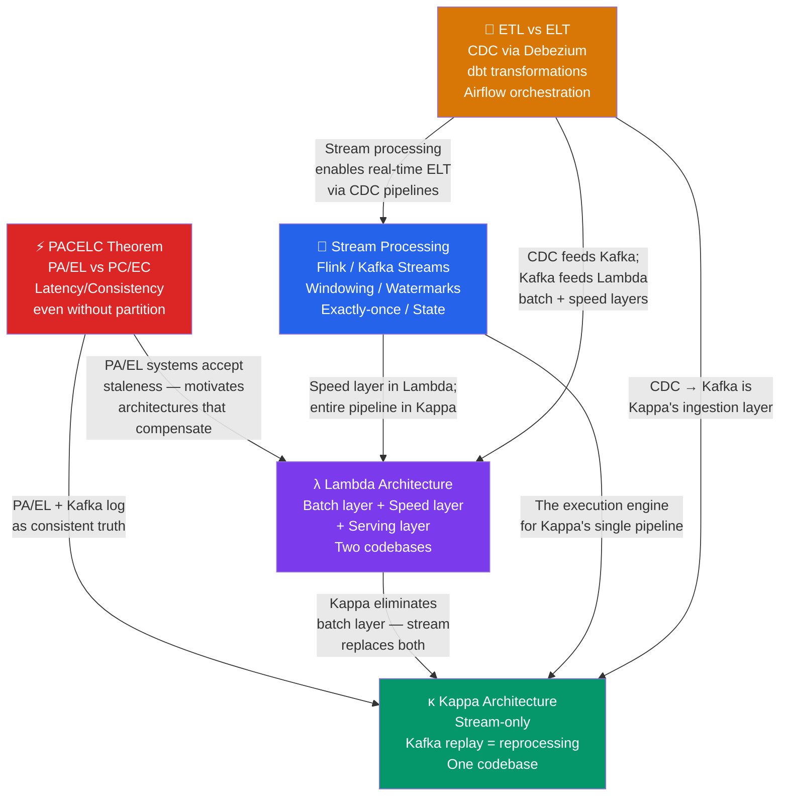

# 🗺️ Data Architecture — Map of Content

> [!abstract] What's in this section?
> This section covers the theoretical and architectural foundations for building large-scale data pipelines. Five notes form a layered stack: PACELC provides the theoretical consistency/latency framework that governs every design decision; Lambda and Kappa Architecture are the two major patterns for combining batch and streaming computation; Stream Processing is the implementation engine powering real-time pipelines; and ETL/ELT covers the data ingestion layer that feeds everything upstream. Together they answer how to move, process, and serve data at scale — from milliseconds to petabytes.

## Concept Map

## Learning Path

Recommended reading order — start with theory, then patterns, then implementation, then ingestion:

1. **[[PACELC_Theorem]]** — The theoretical foundation. PACELC extends CAP by quantifying the latency vs consistency trade-off during normal operation (not just during partitions). Every architecture decision in this section is shaped by the PA/EL vs PC/EC axis.
2. **[[Lambda_Architecture]]** — The classic two-layer pattern. Understand the batch layer (complete, accurate, high latency) and the speed layer (partial, approximate, low latency) and why they must be merged in a serving layer. Learn why maintaining two codebases is Lambda's fatal flaw.
3. **[[Kappa_Architecture]]** — Jay Kreps' answer to Lambda's complexity. A single streaming pipeline handles both real-time processing and historical reprocessing by replaying from Kafka offset 0. Understand the two-job swap pattern and the prerequisites (Kafka retention, fast Flink replay).
4. **[[Stream_Processing]]** — The implementation technology underpinning both Lambda's speed layer and all of Kappa. Master windowing (tumbling, sliding, session), event-time vs processing-time semantics, watermarks for late data, stateful keyed operators in RocksDB, and Flink's exactly-once Chandy-Lamport snapshots.
5. **[[ETL_vs_ELT]]** — The data ingestion layer. Understand why ELT (raw load then transform with dbt) has replaced ETL for cloud warehouses, and why CDC (Change Data Capture via Debezium reading the database WAL) is the modern standard for near-real-time ingestion into Kafka and downstream systems.

## All Notes at a Glance

| Note | Difficulty | What you'll learn |
|------|------------|-------------------|
| [[PACELC_Theorem]] | Intermediate | PA/EL vs PC/EC classification, latency/consistency trade-off in normal operation |
| [[Lambda_Architecture]] | Intermediate | Batch + speed + serving layers, two-path problem, when to use/avoid |
| [[Kappa_Architecture]] | Intermediate | Stream-only with Kafka replay, two-job swap pattern, Lambda vs Kappa trade-offs |
| [[Stream_Processing]] | Intermediate | Windowing, event time, watermarks, stateful operators, exactly-once (Flink) |
| [[ETL_vs_ELT]] | Beginner | ETL vs ELT comparison, CDC with Debezium, dbt for in-warehouse transforms |

## Key Questions This Section Answers

- How does PACELC extend the CAP theorem, and why is the latency vs consistency trade-off during normal operation often more important than the partition scenario?
- Why does Lambda Architecture require implementing every computation twice, and what specific operational burden does this create for a team?
- What is the single most important prerequisite that a Kafka setup must satisfy before a team can migrate from Lambda to Kappa Architecture?
- How does Apache Flink's Chandy-Lamport snapshot mechanism achieve exactly-once processing guarantees, and what must be true of the output sink?
- Why does event-time windowing produce consistent results while processing-time windowing does not, and what role does the watermark play in closing event-time windows?
- How does CDC (Change Data Capture) read the database WAL without impacting OLTP performance, and why can't a simple `WHERE updated_at > last_run` query replace it?
- In ELT, why is preserving raw data before transformation a critical capability that ETL destroys?

## Cross-Section Links

- Related: [[_MOC_Storage]] — Storage Systems covers the data lake and warehouse layers that Lambda/Kappa pipelines write into
- Related: [[_MOC_Event_Driven]] — Kafka is the backbone of Kappa Architecture and the speed layer of Lambda; Event-Driven Architecture covers Kafka in depth
- Related: [[_MOC_Databases]] — OLTP databases are the source systems that CDC taps into; PACELC applies to database replication trade-offs
- Related: [[_MOC_SystemDesign_Master]] — Master index for all System Design sections
