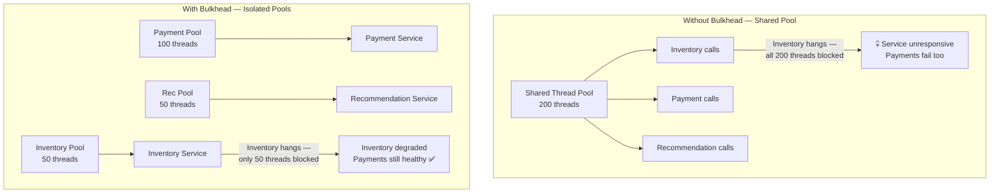

# 🚢 Bulkhead Pattern

> [!abstract] TL;DR
> The Bulkhead pattern partitions service consumers or downstream dependencies into isolated resource pools — separate thread pools, connection pools, or processes — so that a failure or slowdown in one pool cannot exhaust the shared resources of another. Named after the watertight compartments in a ship's hull that prevent a single breach from sinking the vessel.

## Intent

Isolate elements of an application into pools so that if one element fails or becomes overloaded, the others continue to function. Prevent a single slow or failing dependency from consuming all shared resources and causing system-wide failure.

## Problem It Solves

In a microservice that calls multiple downstream services (e.g., `Inventory`, `Payments`, `Recommendations`), all outbound calls typically share a single thread pool. If `Inventory` starts responding slowly — say, taking 10 seconds instead of 50ms — callers block waiting. Threads accumulate. Within seconds, all 200 threads in the shared pool are blocked on `Inventory` calls. Now `Payments` calls (which are fast and healthy) also queue up, waiting for a free thread. The entire service becomes unresponsive because of one slow dependency.

This is the cascading failure problem. The root cause is shared resources without isolation boundaries.

## Solution / How It Works



**Two implementation strategies:**

**Thread-pool isolation (heavyweight):** Each downstream dependency gets a dedicated thread pool. Calls to `Inventory` use threads from the `Inventory` pool only. When the pool is exhausted, new `Inventory` calls are rejected immediately — they do not spill into other pools. This provides the strongest isolation but has overhead: N+1 thread pools, context-switching cost.

**Semaphore isolation (lightweight):** A semaphore limits the number of concurrent calls to a dependency. No separate thread pool — the caller's thread is used, but only a maximum of N concurrent calls are allowed. Lighter weight, but blocking the caller's thread on a slow service still occurs. Best for operations that should be fast and where the primary concern is call volume rather than thread exhaustion.

**Additional Bulkhead dimensions:**
- **Connection pool bulkhead:** Each downstream service gets its own database connection pool limit.
- **Process/container bulkhead:** Critical services run in dedicated pods or VM groups, preventing a noisy-neighbour process from starving shared compute.
- **Deployment bulkhead (Availability Zone isolation):** Replicas are spread across AZs — an AZ failure takes only its fraction of capacity.

## When to Use

- Service calls multiple downstream dependencies with different criticality and reliability profiles.
- One dependency has known reliability issues; you need to prevent it from affecting other dependencies.
- Critical paths (e.g., checkout, authentication) must be protected from non-critical paths (e.g., recommendations, analytics).
- You need to limit blast radius — failures should degrade one feature, not the whole service.

## When NOT to Use

- Application calls only one downstream service — no cross-contamination is possible.
- All downstream calls are equally critical — isolation doesn't help if every pool can cause critical failures.
- The overhead of multiple thread pools is unacceptable for very resource-constrained environments (embedded systems, lambda cold starts).
- Service is entirely async/reactive and never blocks threads — semaphore or thread-pool bulkheads are irrelevant in a fully non-blocking model.

## Real-World Example

**Netflix:** Netflix's API server calls dozens of microservices. Each service gets a Hystrix thread-pool bulkhead with a fixed size (typically 5–20 threads). When the `SubtitleService` degrades (rare content edge case), its 10-thread pool fills up. New subtitle requests are rejected with a fallback (show no subtitles). The main video playback path — in a separate pool — is completely unaffected.

**Banking transaction processor:** A payment service calls: Core Banking (critical, 100-thread pool), Fraud Detection (important, 50-thread pool), Loyalty Points (non-critical, 10-thread pool). During a Loyalty API incident that causes 30-second responses, only the 10-thread loyalty pool fills. Core Banking and Fraud Detection continue at full throughput. The system degrades gracefully — points are not awarded but transactions succeed.

## Trade-offs

| Benefit | Drawback |
|---|---|
| Failure isolation — slow/failing dependency cannot exhaust shared resources | Increased resource consumption — N pools use more total threads/memory than one shared pool |
| Predictable degradation — individual features degrade, not the whole service | Thread pool sizing is difficult — over-provisioning wastes resources, under-provisioning causes unnecessary rejection |
| Faster failure detection — pool exhaustion is immediately visible per-dependency | More complex configuration and monitoring — each pool needs its own metrics |
| Pairs with [[Circuit_Breaker]] for layered resilience | Can mask performance issues — a bulkhead-rejected call may silently fail without surfacing the root cause |

## Implementation Considerations

- **Sizing thread pools:** Profile each dependency's expected concurrency. Formula: `pool_size = (requests_per_second × average_latency_seconds) + headroom`. For a service handling 100 RPS with 50ms average latency: `100 × 0.05 + 20% = 6 threads`. Be conservative — oversizing is safer than undersizing.
- **What to do on rejection:** When a bulkhead rejects a call (pool full), return a meaningful fallback or a 503 Service Unavailable immediately. Log the rejection metric — a high rejection rate signals the pool size needs reconfiguration.
- **Combine with Circuit Breaker:** The bulkhead limits the blast radius of a slow service; the [[Circuit_Breaker]] stops calling a failed service after it trips. Together they provide defence-in-depth: bulkhead prevents resource exhaustion first, circuit breaker trips once failures are confirmed.
- **Reactive / async alternatives:** In reactive frameworks (Project Reactor, RxJava), you can implement bulkheads via Reactor's `flatMap(n)` concurrency limit or dedicated schedulers per dependency, avoiding traditional thread pools entirely.

## Common Pitfalls

- **One pool for everything:** Creating a single shared bulkhead that still has the same problem as a shared thread pool — just with a smaller limit.
- **Ignoring rejection metrics:** A bulkhead that silently drops calls without logging or alerting masks capacity issues. Always measure `bulkhead.call.rejected.count` per dependency.
- **Static sizing that doesn't evolve:** Pool sizes configured at launch and never revisited. As traffic patterns change, outdated sizing causes either unnecessary rejections or under-isolation. Review quarterly.
- **Forgetting the client side:** Bulkheads on the server side (rate limiting per client) are different from bulkheads on the client side (isolating dependencies). You need both.

## Implementation Example

```java
// Resilience4j Bulkhead — Spring Boot
@Configuration
public class BulkheadConfig {

    @Bean
    public BulkheadRegistry bulkheadRegistry() {
        // Thread-pool bulkhead for Inventory (heavy isolation)
        ThreadPoolBulkheadConfig inventoryConfig = ThreadPoolBulkheadConfig.custom()
            .maxThreadPoolSize(20)
            .coreThreadPoolSize(10)
            .queueCapacity(5)         // 5 queued calls before rejection
            .keepAliveDuration(Duration.ofMillis(20))
            .build();

        // Semaphore bulkhead for Recommendations (lightweight)
        io.github.resilience4j.bulkhead.BulkheadConfig recConfig =
            io.github.resilience4j.bulkhead.BulkheadConfig.custom()
                .maxConcurrentCalls(10)  // max 10 concurrent calls
                .maxWaitDuration(Duration.ofMillis(100))
                .build();

        return BulkheadRegistry.ofDefaults();
    }
}

@Service
public class CatalogService {

    private final ThreadPoolBulkhead inventoryBulkhead;
    private final Bulkhead recommendationBulkhead;

    public CompletableFuture<Integer> getStock(String productId) {
        // Runs in Inventory's dedicated thread pool
        return inventoryBulkhead.executeSupplier(
            () -> inventoryClient.getStock(productId)
        ).toCompletableFuture()
         .exceptionally(e -> {
             log.warn("Inventory bulkhead rejected/failed: {}", e.getMessage());
             return -1; // fallback: unknown stock
         });
    }

    public List<String> getRecommendations(String userId) {
        // Semaphore-guarded call — uses caller's thread
        return Bulkhead.decorateSupplier(
            recommendationBulkhead,
            () -> recommendationClient.getRecommendations(userId)
        ).get();
    }
}
```

## Related Concepts

- [[_MOC_Cloud_Design_Patterns|↑ Section MOC]]
- [[Circuit_Breaker]] — the natural partner: bulkhead contains the blast radius while the circuit breaker stops futile calls once failures are confirmed
- [[Throttling]] — server-side rate limiting that prevents overload at ingress; bulkhead is client-side isolation of egress dependencies
- [[Competing_Consumers]] — consumer pools are naturally bulkheaded by queue topic/subscription — different consumer groups don't share thread pools
- [[Ambassador_Pattern]] — the Ambassador sidecar can implement bulkhead policies transparently without changing service code (Envoy circuit breaking + concurrency limits)

## Review Questions

1. A service calls three APIs: `Auth` (critical, fast), `Inventory` (important, sometimes slow), `Analytics` (non-critical, can be slow). Design the bulkhead configuration: what isolation type for each, what happens when `Inventory` degrades, and how does this protect `Auth` calls?

2. Your thread-pool bulkhead for `PaymentService` has a core pool of 10 and queue capacity of 5. Under load, you observe `bulkhead.call.rejected.count` rising to 50/second. Walk through the analysis: what does this metric tell you, what are the two root causes, and what do you check before increasing pool size?

3. Explain the difference between thread-pool isolation and semaphore isolation for a bulkhead. Give a concrete scenario where thread-pool isolation is the correct choice and one where semaphore isolation is sufficient.

## Sources

- [Microsoft Azure Architecture Center — Bulkhead pattern](https://learn.microsoft.com/en-us/azure/architecture/patterns/bulkhead)
- [Resilience4j documentation — Bulkhead](https://resilience4j.readme.io/docs/bulkhead)
- [Netflix Tech Blog — Fault Tolerance in a High Volume, Distributed System](https://netflixtechblog.com/fault-tolerance-in-a-high-volume-distributed-system-91ab4faae74a)
- [Michael Nygard — Release It! (Chapter 5: Stability Patterns)](https://pragprog.com/titles/mnee2/release-it-second-edition/)

#SystemDesign #CloudDesignPatterns #Availability #Bulkhead #Resilience #FaultIsolation #CascadingFailures
