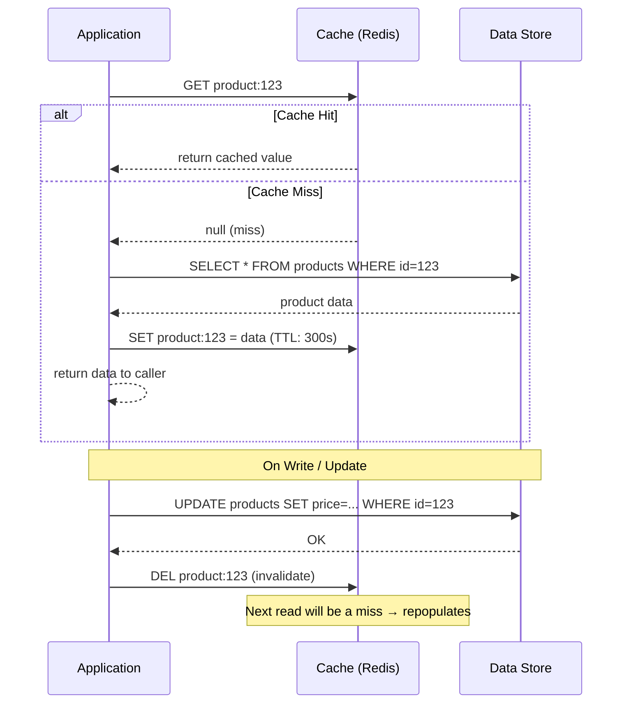

# 🗂️ Cache-Aside

> [!abstract] TL;DR
> In Cache-Aside (Lazy Loading), the application itself manages the cache. On a read, the application checks the cache first; on a miss, it fetches from the data store, writes the result into the cache, and returns it. Writes go directly to the data store and invalidate (or update) the cache entry. The cache is populated lazily — only with data that is actually requested.

## Intent

Load data into a cache on demand when it is first accessed rather than pre-loading the cache eagerly. The application is responsible for all cache interactions — reading from the cache, falling back to the store on a miss, and writing fetched data back to the cache.

## Problem It Solves

Databases and other data stores are expensive to query at high frequency. For data that is read far more often than it is written (e.g., product catalogue, user profile, configuration), serving every read from the primary store wastes compute, creates database load, and increases latency. At the same time, eagerly pre-loading all data into a cache wastes cache memory on data that may never be queried, and requires knowing the full dataset upfront.

A hybrid approach is needed: populate the cache only with data that is actually read, serve subsequent reads from the fast cache, and keep the cache reasonably consistent with the store on writes.

## Solution / How It Works



**Read path (lazy loading):**
1. Application receives read request for key K.
2. Application checks cache for K.
3. **Cache hit:** return cached value immediately.
4. **Cache miss:** query the data store for K. Write result to cache with a TTL. Return result.

**Write path:**
On a write to the data store, either:
- **Invalidate the cache entry** (delete key K): the next read repopulates from the fresh store data. Simpler but causes one cache miss after every write.
- **Update the cache entry** (write-through variant of Cache-Aside): write the new value into the cache immediately after the store write. Avoids the post-write miss but introduces a race condition (two writers can create inconsistency).

**TTL as a safety net:** Even if explicit invalidation is missed (e.g., direct database update bypassing the application), the TTL ensures cache entries eventually expire and are refreshed. TTL length is the consistency-vs-performance dial.

## When to Use

- Read-heavy workloads where the same data is requested frequently (hot items).
- Data that is expensive to compute or retrieve from the origin store.
- Data access patterns are unpredictable — Cache-Aside only loads what is actually needed, unlike eager loading.
- Acceptable to serve slightly stale data for a bounded period (TTL window).
- Multiple applications read the same data store — Cache-Aside allows them to share a cache without coupling their write logic.

## When NOT to Use

- Write-heavy workloads where the cache is constantly invalidated and rarely benefits reads.
- Data that is almost never re-read — the cache overhead is pure waste.
- When strict consistency is required — TTL-based expiry means reads may see stale data during the TTL window.
- When a read-through cache (where the cache fetches from the store automatically) is available and reduces application boilerplate.

## Real-World Example

**E-commerce product pages:** A product catalogue has 500,000 items but daily active queries are concentrated on the top 5,000. Cache-Aside with a 300-second TTL on Redis means 99%+ of read traffic is served from cache after warm-up. Only price/stock changes (relatively rare) trigger cache invalidation. The origin Postgres database goes from 50,000 RPS to under 500 RPS.

**GitHub repository metadata:** GitHub's API serves repository star counts, descriptions, and topics. Cache-Aside on Memcached stores per-repository metadata. A repo page that receives 10,000 views/minute only hits the database once every 60 seconds (TTL), absorbing flash crowds without database overload.

**Session data:** A web application stores user session tokens in Redis using Cache-Aside. On login, the session is written to both the database and Redis. On every request, the session is read from Redis first. On logout or expiry, the Redis key is deleted. The database is the authoritative source; Redis is the performance layer.

## Trade-offs

| Benefit | Drawback |
|---|---|
| Only caches data that is actually read — no wasted memory on cold data | Cache miss on first access — cold start or after invalidation has full store latency |
| Application controls cache key structure and TTL per data type | Application code is responsible for cache consistency — bugs cause stale reads |
| Resilient to cache failure — app falls back to store on miss | Thundering herd on cache miss: multiple concurrent misses for the same key all hit the store |
| Works with any combination of caching and storage technology | Write-invalidate race: two concurrent writers can leave an inconsistent cache state |
| TTL auto-heals consistency without explicit invalidation | Choosing the right TTL is non-trivial — too short wastes the cache, too long serves stale data |

## Implementation Considerations

- **Cache stampede / thundering herd:** When a popular key expires, many concurrent requests all miss and query the database simultaneously. Mitigations: (1) **Probabilistic early expiration** (refresh before expiry), (2) **Mutex/lock on miss** (first miss acquires a lock and fetches, others wait), (3) **Stale-while-revalidate** (serve the stale value while one background request refreshes).
- **Cache key design:** Use namespaced, deterministic keys: `product:{id}:v2`, `user:{id}:profile`, `config:feature_flags`. Include a version suffix when the cached data structure changes to avoid deserializing stale schema.
- **Serialization format:** Store as JSON (flexible, debuggable) or MessagePack/Protobuf (compact, faster). Avoid language-native serialization (Java's `Serializable`) — cross-service incompatibility and security issues.
- **Cache-aside vs. read-through:** Read-through caches (e.g., some managed cache services) handle the store fallback automatically. Cache-Aside puts that logic in the application — more control but more code. If your cache supports read-through natively, prefer it for simpler application logic.
- **Distributed cache consistency:** In microservice architectures, multiple service instances share a Redis cluster. Ensure invalidation is atomic (`DEL` is atomic in Redis). For multi-key consistency, use Redis transactions or Lua scripts.

## Common Pitfalls

- **Forgetting to invalidate on write:** Application writes to the database but forgets to delete or update the cache entry. Reads serve stale data until TTL expires. Make cache invalidation part of the data access layer, not a caller responsibility.
- **Caching null results:** A miss for a non-existent key (e.g., deleted record) results in repeated store queries. Cache negative results: `SET missing_product:999 = "NOT_FOUND" TTL 60s`.
- **TTL too long on mutable data:** Product prices, inventory levels, and user permissions change. A 24-hour TTL means price changes take a full day to propagate. Use event-driven invalidation (database change event → delete cache key) combined with a reasonable TTL as a safety net.
- **Caching sensitive data without encryption:** Storing PII or credentials in a shared Redis cache without encryption at rest or in transit. Encrypt sensitive cache values; avoid caching authorization tokens in shared caches.

## Implementation Example

```python
import redis
import json
from functools import wraps

r = redis.Redis(host='redis', port=6379, decode_responses=True)

class ProductRepository:
    def __init__(self, db_session):
        self.db = db_session

    def get_product(self, product_id: int) -> dict:
        cache_key = f"product:{product_id}"

        # 1. Check cache
        cached = r.get(cache_key)
        if cached:
            return json.loads(cached)  # Cache HIT

        # 2. Cache MISS — fetch from DB
        product = self.db.query(
            "SELECT * FROM products WHERE id = %s", (product_id,)
        ).fetchone()

        if product is None:
            # Cache negative result to avoid repeated DB queries
            r.setex(cache_key, 60, json.dumps(None))
            return None

        # 3. Populate cache (TTL = 300 seconds)
        r.setex(cache_key, 300, json.dumps(dict(product)))
        return dict(product)

    def update_product_price(self, product_id: int, new_price: float) -> None:
        # 1. Write to DB (source of truth)
        self.db.execute(
            "UPDATE products SET price = %s WHERE id = %s",
            (new_price, product_id)
        )
        self.db.commit()

        # 2. Invalidate cache
        r.delete(f"product:{product_id}")
        # Next read will repopulate from DB with fresh price
```

## Related Concepts

- [[_MOC_Cloud_Design_Patterns|↑ Section MOC]]
- [[Materialized_View]] — pre-computes and persists aggregations in the database layer; Cache-Aside caches them in a separate memory store
- [[Static_Content_Hosting]] — CDN-level caching for static assets; Cache-Aside handles dynamic, per-user or per-entity data
- [[Index_Table]] — an application-managed index in the data store; Cache-Aside caches the index lookups themselves
- [[Queue_Based_Load_Leveling]] — a complementary approach: instead of caching reads to absorb load, buffer writes to absorb write spikes

## Review Questions

1. A product catalogue service uses Cache-Aside with a 5-minute TTL. A flash sale starts and a discount is applied to 10,000 products. Describe the exact sequence of cache misses and database queries that occur in the first 5 minutes after the sale starts, and propose an event-driven invalidation strategy that limits stale data to under 5 seconds.

2. Your product service sees a "thundering herd" problem: when a cache entry expires, 500 concurrent requests all miss and query the database simultaneously. Describe two concrete mitigations, explain the trade-off of each, and implement the mutex-based approach in pseudocode.

3. You're designing the caching strategy for a user profile service. User profiles change infrequently (name, avatar) but permissions change frequently (role assignments). Explain why a single cache entry per user is problematic and design a split-key strategy with different TTLs.

## Sources

- [Microsoft Azure Architecture Center — Cache-Aside pattern](https://learn.microsoft.com/en-us/azure/architecture/patterns/cache-aside)
- [AWS ElastiCache — Lazy loading strategy](https://docs.aws.amazon.com/AmazonElastiCache/latest/red-ug/Strategies.html)
- [Redis documentation — Best practices](https://redis.io/docs/manual/patterns/)
- [Martin Fowler — Cache patterns](https://martinfowler.com/bliki/TwoHardThings.html)

#SystemDesign #CloudDesignPatterns #Availability #CacheAside #Caching #LazyLoading #Redis #Performance
