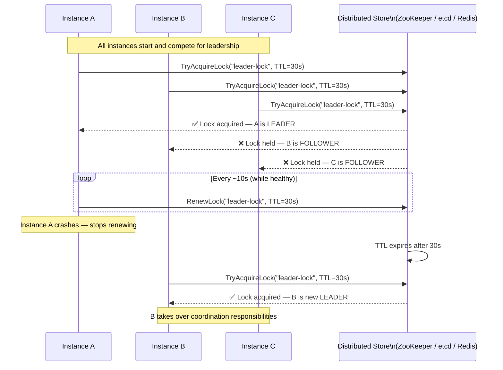

# 👑 Leader Election

> [!abstract] TL;DR
> In a distributed system where multiple identical service instances run concurrently, the Leader Election pattern designates one instance as the "leader" responsible for coordinating shared work — such as writing to a shared resource, running scheduled tasks, or managing distributed state. All other instances act as followers, ready to take over if the leader fails.

## Intent

Coordinate the actions of a collection of collaborating instances in a distributed application by electing one instance as the leader, which takes responsibility for managing shared resources, maintaining consistency, and coordinating distributed tasks — preventing conflicts that would arise from multiple instances acting independently on the same resource.

## Problem It Solves

Many distributed tasks are inherently non-parallelisable: running a scheduled cron job across a cluster (only one instance should send the emails), writing to a leader-follower database (only one writer to the primary), managing a lock on an external resource, or coordinating a distributed workflow. If every instance of a horizontally-scaled service attempts these tasks simultaneously, the result is duplicate work, data corruption, or conflicting state changes.

Simply deploying a dedicated singleton service sidesteps the problem but eliminates availability — if that single instance crashes, the coordinating function is lost. Leader Election gives you both: only one instance acts as coordinator at a time, but any instance can become the leader if the current one fails.

## Solution / How It Works



**Core mechanism — distributed lock with TTL:**

1. All instances attempt to acquire a distributed lock (via ZooKeeper, etcd, or Redis `SET NX EX`).
2. Only one instance acquires the lock — it becomes the leader.
3. The leader periodically renews the lock TTL (heartbeat). If the leader is healthy, the lock never expires.
4. If the leader crashes or becomes partitioned, it stops renewing the lock. After the TTL expires, follower instances compete to acquire the newly-available lock. One wins and becomes the new leader.

**Election algorithms (production implementations):**

- **Redis `SET NX EX` (simple, eventually consistent):** Leader sets `SET leader-key my-instance-id NX EX 30`. Followers poll for lock expiry. Risk: if the Redis node fails, a split-brain scenario is possible. Use Redis Sentinel or Cluster for HA.
- **ZooKeeper ephemeral nodes:** Each instance creates a numbered ephemeral znode (`/election/node-0001`). The instance with the lowest number is the leader. ZooKeeper ephemeral nodes auto-delete when the client's session expires — no manual TTL management needed.
- **etcd lease-based election:** Each instance creates a lease with a TTL and tries to put a key with its lease. The instance that creates the key first is the leader. etcd's watch API allows followers to react immediately when the key is deleted (leader dies) without polling.
- **Raft consensus (embedded):** Systems like etcd, CockroachDB, and Kubernetes' own control plane use the Raft protocol for leader election as part of consensus. Provides stronger consistency guarantees — no split-brain possible — at the cost of complexity.

## When to Use

- Scheduled/cron jobs in a horizontally-scaled service where only one instance should run the job at a time.
- Database leader-follower replication management where one instance drives writes.
- Distributed workflow coordinators (see [[Scheduling_Agent_Supervisor]]) where only one Scheduler manages state at a time.
- Cache warming, partition reassignment, or cleanup jobs that must run exactly once across a cluster.
- Any task where concurrent execution by multiple instances would produce duplicates, conflicts, or data corruption.

## When NOT to Use

- Tasks that are naturally idempotent and safe to run concurrently — the overhead of leader election is unnecessary.
- Single-instance deployments — no election needed.
- When all work can be decomposed into independent shards (e.g., Kafka partition per consumer) — [[Competing_Consumers]] with natural partitioning is simpler.
- Ultra-low-latency paths where the overhead of lock acquisition on every operation is unacceptable.

## Real-World Example

**Kubernetes Controller Manager:** Kubernetes runs multiple replicas of the controller manager for HA, but only one instance should reconcile each resource type at a time. It uses a `LeaderElection` mechanism backed by etcd: a `ConfigMap` or `Lease` object acts as the lock. The active leader continuously updates the `renewTime` field. If a leader pod crashes, the lease TTL (default 15 seconds) expires and another replica takes over.

**Spring Boot Scheduling in Kubernetes:** A Spring Boot application deployed with 5 replicas needs to run a nightly email digest job. Without leader election, all 5 replicas send the digest. Using ShedLock (backed by a Redis or database lock), only the instance that acquires the lock at job execution time runs the job. Others skip silently.

**Zookeeper-based Kafka Controller:** Apache Kafka (pre-KRaft) used ZooKeeper ephemeral nodes to elect a Controller broker. The Controller manages partition leadership assignments across the cluster. If the Controller broker fails, its ZooKeeper session expires, the ephemeral node is deleted, and a new Controller election occurs among the remaining brokers — typically completing in under 10 seconds.

## Trade-offs

| Benefit | Drawback |
|---|---|
| Prevents duplicate work and conflicting state modifications | Added complexity — distributed lock management is non-trivial to implement correctly |
| Automatic failover — new leader elected when current leader fails | Split-brain risk: brief window during failover where two instances think they are leader |
| All instances are equally capable — no single point of failure | Lock TTL tuning: too short causes frequent re-elections; too long causes slow failover |
| Follower instances remain warm and ready to take over instantly | Leader becomes a hot-spot — all coordination flows through one instance |
| Works with any horizontally-scaled stateless service | The distributed store itself (ZooKeeper, etcd, Redis) becomes a dependency to manage |

## Implementation Considerations

- **Split-brain window:** Between the leader crashing and the TTL expiring, there is a window where the old leader may still be running (paused GC, network partition) while a new leader takes over. Use **fencing tokens** (monotonically increasing lock version numbers) — any write to shared resources must include the fencing token. The resource rejects writes from an old leader with a stale token.
- **Heartbeat frequency vs. TTL:** A good rule of thumb: heartbeat interval = TTL / 3. With a 30-second TTL, heartbeat every 10 seconds. This provides 3 missed heartbeats before expiry, tolerating transient network hiccups without causing unnecessary re-elections.
- **Leader responsibilities:** Define exactly what the leader and followers do differently. Followers should remain active — they can still serve read requests, process queue messages via [[Competing_Consumers]], and perform other tasks. Only the uniquely-coordinating work should be gated on leadership.
- **Graceful leadership handoff:** When a leader is shutting down (e.g., rolling deployment), it should explicitly release the lock rather than waiting for TTL expiry. This minimises the re-election window from ~TTL to near-zero.

## Common Pitfalls

- **No fencing tokens:** Assuming that only one leader runs at a time and not protecting shared resources against split-brain. A paused Java GC on the old leader can cause it to briefly resume after the new leader has taken over — without fencing, both leaders write to the same resource simultaneously.
- **TTL too long:** A 5-minute TTL means failover takes up to 5 minutes — unacceptable for most production workloads. Use 30–60 second TTLs with 10–20 second heartbeat intervals.
- **Lock renewal in the application thread:** If the leader's main thread is busy (large batch job, GC pause), it fails to renew the lock, triggering an unintended re-election while the leader is still alive. Run lock renewal in a dedicated background thread.
- **Not handling `NOT_LEADER` gracefully:** Followers that receive a task routed to the leader (because routing hasn't updated yet) should return a redirect or forward the request, not process it and cause a conflict.

## Implementation Example

```java
// ShedLock — Spring Boot scheduled job with leader election via Redis
@Configuration
@EnableScheduling
@EnableSchedulerLock(defaultLockAtMostFor = "PT30S")
public class SchedulerConfig {
    @Bean
    public LockProvider lockProvider(RedisConnectionFactory connectionFactory) {
        // All instances share this Redis lock store
        return new RedisLockProvider(connectionFactory, "scheduler-lock");
    }
}

@Component
public class DigestEmailJob {

    @Scheduled(cron = "0 0 8 * * *")  // 8am daily
    @SchedulerLock(
        name = "digest-email-job",
        lockAtLeastFor = "PT5M",   // hold lock for at least 5 min (prevent re-run)
        lockAtMostFor = "PT15M"    // release after 15 min even if job hangs
    )
    public void sendDailyDigest() {
        // Only ONE instance executes this — others skip
        log.info("I am the leader — sending daily digest");
        emailService.sendDigestToAllUsers();
    }
}
```

```python
# Pure Redis leader election — Python
import redis
import socket
import threading
import time

class LeaderElection:
    def __init__(self, redis_url: str, lock_key: str = "leader-lock",
                 ttl: int = 30, heartbeat: int = 10):
        self.r = redis.from_url(redis_url)
        self.lock_key = lock_key
        self.ttl = ttl
        self.heartbeat = heartbeat
        self.instance_id = socket.gethostname()
        self._is_leader = False
        self._heartbeat_thread = None

    def try_acquire_leadership(self) -> bool:
        # SET NX EX — atomic acquire
        acquired = self.r.set(
            self.lock_key, self.instance_id,
            nx=True, ex=self.ttl
        )
        if acquired:
            self._is_leader = True
            self._start_heartbeat()
        return bool(acquired)

    def _start_heartbeat(self):
        def renew():
            while self._is_leader:
                # Renew only if we still own the lock (fencing)
                current = self.r.get(self.lock_key)
                if current and current.decode() == self.instance_id:
                    self.r.expire(self.lock_key, self.ttl)
                else:
                    self._is_leader = False  # Lost leadership
                    break
                time.sleep(self.heartbeat)
        self._heartbeat_thread = threading.Thread(target=renew, daemon=True)
        self._heartbeat_thread.start()

    def release(self):
        self._is_leader = False
        # Only delete if we own it (fencing check)
        if self.r.get(self.lock_key) == self.instance_id.encode():
            self.r.delete(self.lock_key)

    @property
    def is_leader(self) -> bool:
        return self._is_leader
```

## Related Concepts

- [[_MOC_Cloud_Design_Patterns|↑ Section MOC]]
- [[Scheduling_Agent_Supervisor]] — the Supervisor role in SAS is elected via Leader Election; only one Supervisor monitors and restarts crashed Schedulers at a time
- [[Competing_Consumers]] — the natural alternative when tasks CAN be parallelised; use Competing Consumers for independent work, Leader Election for inherently serialised coordination
- [[Bulkhead]] — isolate the leader's resource pool from follower pools; if the leader's work is resource-intensive, prevent it from starving followers that serve reads
- [[Circuit_Breaker]] — if the distributed lock store (Redis/etcd) degrades, a circuit breaker prevents the heartbeat renewal from hanging indefinitely and triggering unnecessary re-elections

## Review Questions

1. A Kubernetes deployment of 10 Spring Boot pods uses Redis-based leader election for a nightly batch job. The leader pod experiences a JVM full-GC pause of 45 seconds. The lock TTL is 30 seconds, so a new leader is elected. When the GC pause ends, the original leader resumes and also attempts to run the job. Describe the split-brain scenario and explain how fencing tokens prevent the double execution.

2. You are choosing between Redis `SET NX EX` and ZooKeeper ephemeral nodes for leader election in a payments processing coordinator. Compare the two on: split-brain risk, failover speed, operational complexity, and consistency guarantees. Which do you choose for a payments system and why?

3. A service uses leader election for a scheduled cleanup job that runs every hour. The leader crashes 10 minutes into the job, and the new leader takes over after the 30-second TTL expires. The cleanup job is not idempotent — it deletes processed records. What problems arise, and redesign the cleanup job to be both leader-election-aware and idempotent.

## Sources

- [Microsoft Azure Architecture Center — Leader Election pattern](https://learn.microsoft.com/en-us/azure/architecture/patterns/leader-election)
- [Kubernetes — Leader Election in Go client](https://pkg.go.dev/k8s.io/client-go/tools/leaderelection)
- [Martin Kleppmann — Designing Data-Intensive Applications (Chapter 8: The Trouble with Distributed Systems)](https://dataintensive.net/)
- [ShedLock — Distributed lock for Spring scheduled tasks](https://github.com/lukas-krecan/ShedLock)
- [etcd — Leader election recipe](https://etcd.io/docs/v3.5/dev-guide/api_concurrency_reference_v3/)

#SystemDesign #CloudDesignPatterns #Availability #LeaderElection #DistributedSystems #Coordination #ZooKeeper #etcd
