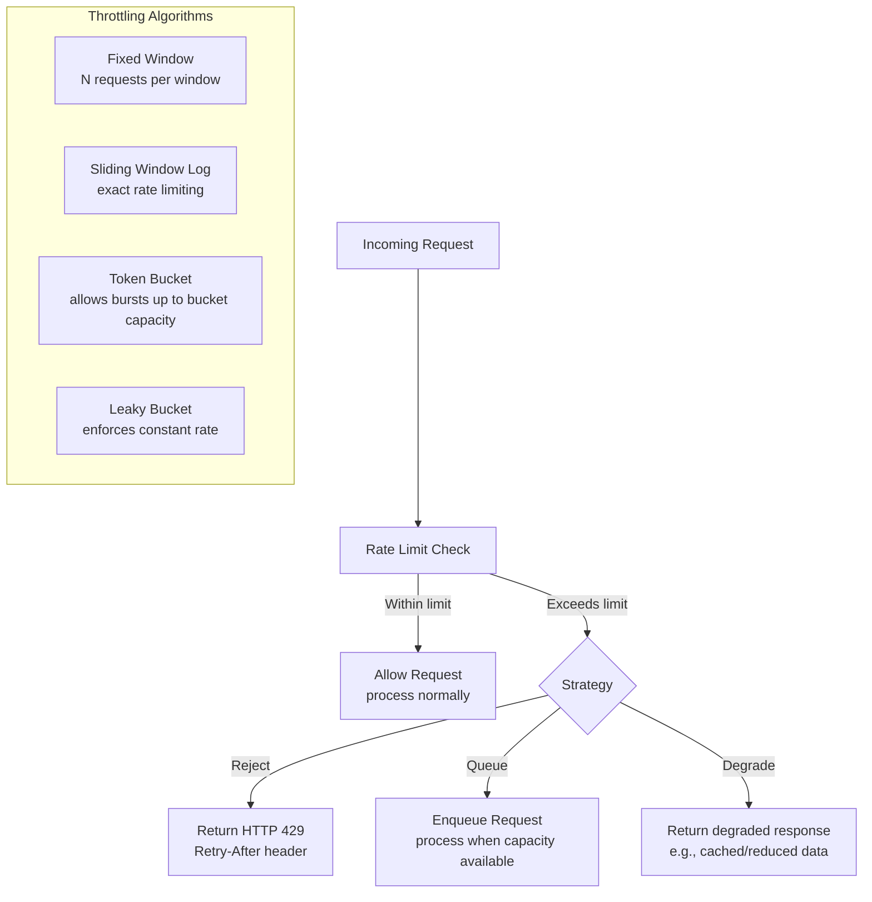

# 🚦 Throttling

> [!abstract] TL;DR
> Throttling controls the rate at which a system or resource is consumed, preventing overload and ensuring equitable resource distribution across consumers. Implementations include fixed window counters, sliding window logs, token buckets (allows bursts up to a limit), and leaky buckets (enforces a constant output rate). When limits are exceeded, requests are rejected (HTTP 429), queued, or degraded.

## Intent

Control the consumption of resources used by an instance of an application, an individual tenant, or an entire service to prevent overload, ensure fair resource distribution, and maintain agreed service levels under varying demand.

## Problem It Solves

Cloud services handle diverse consumers with highly variable request patterns. A single heavy consumer (or a buggy client in an infinite retry loop) can monopolise shared resources — CPU, database connections, downstream API rate limits — causing latency degradation for all other consumers. At the same time, traffic spikes (flash sales, viral events, DDoS) can overwhelm a system that is correctly sized for average load.

Without throttling, the system has two failure modes: (1) all consumers suffer when one misbehaves, and (2) the system collapses under unexpected load rather than degrading gracefully.

## Solution / How It Works



**Four core algorithms:**

**Fixed Window Counter:** Divide time into fixed windows (e.g., 1-minute buckets). Count requests per consumer per window. Reset counter at window boundary. Simple but has edge-case: a consumer can make 2× the limit in two seconds straddling a window boundary (burst at end of window + burst at start of next).

**Sliding Window Log:** Track exact timestamps of all recent requests in a log. On each request, remove timestamps older than the window and count remaining. Precise but memory-intensive — stores one timestamp per request.

**Token Bucket:** A bucket holds up to `capacity` tokens. Tokens refill at a fixed rate (e.g., 10 tokens/second). Each request costs 1 token. If the bucket has tokens, the request is allowed and a token is consumed. If empty, the request is throttled. Allows bursting: a consumer that has been idle can consume up to `capacity` requests instantly. This is the most widely used algorithm — it handles normal bursty HTTP traffic gracefully.

**Leaky Bucket:** Requests enter a queue (the "bucket") and are processed at a constant rate (the "leak rate"), regardless of input rate. Excess requests that overflow the bucket are rejected. Unlike token bucket, leaky bucket enforces a perfectly smooth output rate — no bursting. Better for rate-limiting writes to a downstream system that can't handle bursts.

| Algorithm | Burst | Precision | Memory | Best For |
|---|---|---|---|---|
| Fixed Window | Yes (boundary burst) | Medium | O(1) | Simple per-user limits |
| Sliding Window Log | No | Exact | O(N requests) | Strict API quotas |
| Token Bucket | Yes (controlled) | High | O(1) | General API rate limiting |
| Leaky Bucket | No | High | O(queue size) | Smoothing output to downstream |

## When to Use

- Multi-tenant SaaS: prevent one tenant's high usage from degrading all others.
- Public APIs: enforce per-key rate limits (free: 100 req/min, pro: 1,000 req/min).
- Protection against misbehaving clients: runaway retry loops, scrapers.
- Protecting downstream services with hard rate limits (third-party APIs with per-minute quotas).
- SLA differentiation: throttle lower-tier users more aggressively than premium users (see [[Priority_Queue_Pattern]]).

## When NOT to Use

- Internal service-to-service calls where trust is established and rate limiting adds latency without benefit.
- When you have unlimited capacity and want to maximise throughput — throttling artificially limits performance.
- When requests must never be lost and queuing is not acceptable — use capacity planning and [[Queue_Based_Load_Leveling]] instead.

## Real-World Example

**GitHub API:** GitHub enforces 5,000 authenticated requests/hour per user (token bucket per `Authorization` header). Responses include `X-RateLimit-Remaining` and `X-RateLimit-Reset` headers. When exhausted, clients receive HTTP 429 with a `Retry-After` header indicating when the bucket refills. OAuth Apps get 5,000/hour; GitHub Apps get 15,000/hour — tiered throttling.

**Stripe API:** Stripe uses a leaky bucket for payment requests: 100 write requests/second per account, measured as a rolling window. Read requests have a separate, higher limit. If a merchant's integration has a bug that sends thousands of charge attempts per second, Stripe throttles at 100/s, protecting Stripe's payment processors while returning clear `rate_limit_exceeded` errors that trigger alerting on the merchant side.

**AWS API Gateway:** Default throttle of 10,000 RPS with a burst limit of 5,000 (token bucket with capacity 5,000). Per-stage and per-method overrides allow fine-grained control. Throttled requests receive 429 `TooManyRequestsException`.

## Trade-offs

| Benefit | Drawback |
|---|---|
| Protects system stability under load — prevents overload-induced failures | Legitimate requests are rejected — poor UX without proper Retry-After guidance |
| Enables fair multi-tenant resource sharing | Distributed throttling requires shared state (Redis) — adds latency per request |
| Enables SLA tiers — premium users get higher limits | Rate limit configuration requires ongoing tuning as usage patterns evolve |
| Buys time for auto-scaling to respond to load spikes | Throttling a burst of legitimate traffic can cause business impact (missed sales) |
| Provides early signal of abuse or client bugs (spike in 429s) | Token bucket bursts can still overwhelm if capacity is misconfigured |

## Implementation Considerations

- **Distributed rate limiting:** In a stateless microservice with 50 replicas, each replica cannot enforce a per-user rate limit independently — a user could get 50× the limit by round-robining. Use a shared Redis counter (atomic `INCR` + `EXPIRE` or Lua scripts) or a dedicated rate-limiting service (Kong, AWS API Gateway, Nginx).
- **Redis Lua script for atomic token bucket:** Operations on multiple Redis keys (check + decrement) must be atomic to prevent race conditions. Use `EVAL` with Lua scripts for atomicity.
- **Return rich error responses:** HTTP 429 must include `Retry-After` (seconds to wait) and `X-RateLimit-Limit`, `X-RateLimit-Remaining`, `X-RateLimit-Reset` headers. Without these, clients cannot implement intelligent backoff and will hammer the API blindly.
- **Throttle dimensions:** Throttle on multiple dimensions: per-IP (DDoS protection), per-user, per-API-key (tenant), per-endpoint (expensive endpoints have lower limits). Stack them: an IP limit protects against scraping; a user limit enforces fair use; an endpoint limit protects expensive operations.
- **Graceful degradation vs. hard rejection:** For read APIs, returning a stale cached response instead of 429 may be preferable. For write APIs, queuing the request and returning HTTP 202 is better than rejection if the client can tolerate async processing.

## Common Pitfalls

- **No `Retry-After` header:** Clients that receive 429 without a `Retry-After` header retry immediately, creating a retry storm that worsens the overload. Always include retry guidance.
- **Rate limiting only at the edge:** Throttling at the API gateway but not within services means downstream microservices are still vulnerable to internal traffic spikes. Throttle at every tier.
- **Counting correctly in distributed systems:** Simple `INCR` + `EXPIRE` in Redis has a race condition (INCR before EXPIRE → if the process crashes, the key never expires and the user is permanently blocked). Use `SET NX PX` or Lua scripts for atomic check-and-set.
- **Ignoring 429s in your own client code:** Services that call external APIs (Stripe, Twilio) must handle 429 with exponential backoff and jitter. Treating 429 like a 500 and retrying immediately creates a feedback loop.

## Implementation Example

```python
import redis
import time
from typing import Tuple

r = redis.Redis(host='redis', port=6379)

def token_bucket_allow(user_id: str, capacity: int = 100, refill_rate: float = 10.0) -> Tuple[bool, dict]:
    """
    Token bucket throttle — allows bursts up to `capacity`,
    refills at `refill_rate` tokens per second.
    Returns (allowed: bool, headers: dict)
    """
    now = time.time()
    key = f"throttle:user:{user_id}"

    # Lua script for atomic check-and-update
    lua_script = """
    local key = KEYS[1]
    local capacity = tonumber(ARGV[1])
    local refill_rate = tonumber(ARGV[2])
    local now = tonumber(ARGV[3])

    local state = redis.call('HMGET', key, 'tokens', 'last_refill')
    local tokens = tonumber(state[1]) or capacity
    local last_refill = tonumber(state[2]) or now

    -- Refill tokens based on elapsed time
    local elapsed = now - last_refill
    tokens = math.min(capacity, tokens + elapsed * refill_rate)

    local allowed = tokens >= 1
    if allowed then tokens = tokens - 1 end

    redis.call('HMSET', key, 'tokens', tokens, 'last_refill', now)
    redis.call('EXPIRE', key, math.ceil(capacity / refill_rate) + 1)

    return {allowed and 1 or 0, math.floor(tokens), math.ceil((1 - tokens) / refill_rate)}
    """

    result = r.eval(lua_script, 1, key, capacity, refill_rate, now)
    allowed, remaining, retry_after = bool(result[0]), int(result[1]), int(result[2])

    headers = {
        "X-RateLimit-Limit": capacity,
        "X-RateLimit-Remaining": remaining,
        "Retry-After": retry_after if not allowed else 0,
    }
    return allowed, headers

# Usage in FastAPI middleware
@app.middleware("http")
async def rate_limit_middleware(request: Request, call_next):
    user_id = request.headers.get("X-User-ID", request.client.host)
    allowed, headers = token_bucket_allow(user_id)

    if not allowed:
        return JSONResponse(
            status_code=429,
            content={"error": "Rate limit exceeded"},
            headers=headers
        )

    response = await call_next(request)
    response.headers.update(headers)
    return response
```

## Related Concepts

- [[_MOC_Cloud_Design_Patterns|↑ Section MOC]]
- [[Bulkhead]] — while throttling limits the rate of incoming requests, Bulkhead isolates the downstream resource pools that handle them; pair them for defence-in-depth
- [[Circuit_Breaker]] — Throttling prevents overload; Circuit Breaker detects and reacts to downstream failure; together they form a complete resilience strategy
- [[Queue_Based_Load_Leveling]] — instead of rejecting throttled requests, queue them and process at a controlled rate — combines well with leaky bucket throttling
- [[Priority_Queue_Pattern]] — throttle lower-tier consumers more aggressively; high-priority requests get more quota or bypass throttling entirely

## Review Questions

1. A token bucket is configured with capacity=1000 and refill_rate=100/second. A user is idle for 10 seconds, then sends 1000 requests in 1 second. Trace what happens: how many are allowed, how many are throttled, and at what point does the user get throttled again? Compare this with a fixed-window (100 req/10s) approach.

2. You're implementing distributed rate limiting for an API gateway with 20 replicas. A user's limit is 1,000 requests/minute. Describe two architectural approaches (local-only vs. centralised Redis), the failure mode of each approach if Redis goes down, and which you'd choose for a payments API.

3. Your API returns HTTP 429 with no `Retry-After` header. A client SDK treats 429 the same as 500 and retries with 100ms fixed delay. Describe the thundering herd this creates and redesign the client behaviour with exponential backoff and jitter.

## Sources

- [Microsoft Azure Architecture Center — Throttling pattern](https://learn.microsoft.com/en-us/azure/architecture/patterns/throttling)
- [Stripe Rate Limiting — How we built rate limiting](https://stripe.com/blog/rate-limiters)
- [GitHub API rate limiting documentation](https://docs.github.com/en/rest/rate-limit)
- [AWS API Gateway throttling](https://docs.aws.amazon.com/apigateway/latest/developerguide/api-gateway-request-throttling.html)

#SystemDesign #CloudDesignPatterns #Availability #Throttling #RateLimiting #TokenBucket #LeakyBucket #APIGateway
