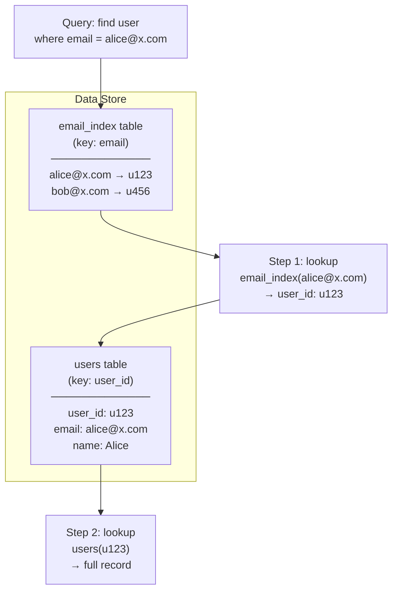

# 📑 Index Table Pattern

> [!abstract] TL;DR
> When your data store doesn't support secondary indexes natively, build them yourself: maintain a separate "index table" keyed on the alternate lookup field, whose values point back to the primary keys of matching records. You pay extra writes to get O(1) reads on any field.

## Intent

Create and maintain application-managed secondary index tables over fields in data stores that do not natively support efficient non-primary-key lookups, enabling O(1) query performance on alternate access patterns without full-table scans.

---

## Problem It Solves

NoSQL [[Key_Value_Store|key-value stores]] and [[Wide_Column_Store|wide-column stores]] are designed for lightning-fast primary key lookups. Query anything else and you face:

- **Full table scans** — O(n) cost, devastating at scale
- **No native secondary indexes** — or limited, eventually-consistent ones with throughput restrictions
- **Hotspot pressure** — adding GSIs in DynamoDB, for example, consumes additional WCU/RCU and can become a bottleneck
- **Cross-partition queries** — querying a field that is not the partition key requires fanning out to every partition

The pattern answers: *how do I efficiently find records by a field that is not the primary key?*

---

## Solution / How It Works

Maintain a parallel table keyed on the alternative lookup field. Each entry maps the alternate key to one or more primary keys of matching records. Reads use a two-step lookup: find the primary key via the index table, then fetch the actual record.



**Write path — keeping the index consistent:**

```
BEGIN (pseudo-transaction):
  1. Write record to primary table (key: user_id)
  2. Write entry to index table (key: email → value: user_id)
END
```

Because most NoSQL stores lack distributed transactions, these two writes are **not atomic**. Strategies to handle this:
- **Synchronous dual-write** with compensating rollback on failure
- **Event-driven** — write to primary, emit event, async worker updates index
- **Periodic reconciliation** job scans for orphaned index entries

**Index cardinality variants:**

| Variant | Index entry value | Use case |
|---------|------------------|---------|
| Unique | Single primary key | Email → user_id |
| Non-unique | List of primary keys | country → [user_id1, user_id2, ...] |
| Composite | Multiple fields combined | (country, city) → [user_ids] |
| Inverted | Term → document IDs | Word → [doc_ids] (full-text search) |

---

## When to Use

- Data store does not support secondary indexes natively (Redis, early DynamoDB, hand-rolled key-value stores)
- You have well-known, stable alternative access patterns (login by email, lookup order by customer)
- Read frequency on the alternative field justifies the write overhead
- You need to query across a partition boundary in a sharded store
- Building full-text search or tag-based lookup over a primary-key store

---

## When NOT to Use

- The data store already provides efficient native secondary indexing (PostgreSQL B-tree indexes, DynamoDB GSI for simple cases)
- The alternative field has extremely high cardinality with tiny result sets — the index table itself becomes huge with little benefit
- You cannot tolerate the consistency gap between primary and index table
- Write throughput is already a bottleneck — dual-writes will worsen it
- Access patterns are ad-hoc and unpredictable — you can't pre-model every index needed

---

## Real-World Example

**DynamoDB Global Secondary Index (GSI) — managed Index Table:**
DynamoDB's GSI is the managed cloud service implementation of this pattern. When you define a GSI on the `email` attribute, DynamoDB internally maintains a second partition structure keyed on `email`. It replicates relevant data asynchronously (hence GSI reads are eventually consistent by default). The Index Table pattern describes exactly what DynamoDB does under the hood — and what you'd implement manually in Redis or a simpler KV store.

**Cassandra secondary access patterns:**
Cassandra partitions by a primary partition key. To query by a non-partition field (e.g., `user_status`), you create a separate table with `user_status` as the partition key, storing lists of matching `user_id`s. This is a textbook Index Table.

**Redis inverted index (full-text search):**
A set per token: `SADD idx:token:apple doc1 doc3 doc7`. Query "apple AND banana": `SINTER idx:token:apple idx:token:banana` → instantly returns document intersection without scanning all docs.

---

## Trade-offs

| Benefit | Drawback |
|---------|----------|
| O(1) reads on non-primary fields instead of full scans | Write amplification — every write touches N+1 tables |
| Works on any KV store, no native index support needed | Consistency gap between primary and index (dual-write not atomic) |
| Query performance is predictable and bounded | Index tables grow with data; require separate storage and management |
| Enables multiple independent access patterns | Schema changes require rebuilding affected index tables |
| Fully application-controlled — can be tailored exactly | Developer burden: maintaining index on delete/update is error-prone |
| Can index computed/derived values | Hotspot risk if index key has low cardinality (all writes → one partition) |

---

## Implementation Considerations

1. **Define access patterns first (DynamoDB design methodology)** — know every lookup pattern before schema design; each pattern that can't use the primary key needs its own index table.
2. **Handle deletes carefully** — deleting a record must also delete its index entries. An orphaned index entry pointing to a deleted primary record causes phantom lookups. Use a transactional outbox or event-driven cleanup.
3. **Updates to indexed fields** — if a user changes their email, you must delete the old index entry and create a new one atomically. This is a read-modify-write cycle that needs care under concurrency.
4. **Eventual consistency window** — if using async index updates, design consumers to tolerate stale index results. Wrap results in a "lookup then verify primary" pattern.
5. **Index table hotspots** — a low-cardinality index key (e.g., `country = "US"`) will create a hot partition. Shard or bucket the index key to distribute load.
6. **Backfill on creation** — when adding a new index table to an existing system, backfill all existing records before enabling live queries against the new index.

---

## Common Pitfalls

- **Missing index on deletes** — code deletes the primary record but forgets to remove the index entry. The index accumulates stale pointers that return "ghost" results.
- **Not handling update of the indexed field** — updating `email` only in the primary table leaves the old email index entry pointing to the record and the new email returning nothing.
- **Assuming atomic dual-write** — writing to primary then crashing before writing to index leaves the system in an inconsistent state. Always design for partial failure.
- **One index table for everything** — trying to build a generic secondary index that handles every access pattern results in a monolithic index that becomes a bottleneck.
- **Unbounded index entries** — non-unique index with a very popular key (e.g., `status = "active"` with 100M users) causes a single index row with millions of values; paginate carefully.

---

## Related Concepts

- [[_MOC_Cloud_Design_Patterns|↑ Section MOC]]
- [[Database_Indexes]] — the native equivalent of this pattern inside a relational or indexed database engine
- [[Materialized_View]] — a broader version: pre-computes not just keys but entire denormalized records
- [[Key_Value_Store]] — the primary data store type that most commonly needs this pattern
- [[Wide_Column_Store]] — Cassandra's secondary table pattern is a direct application
- [[Database_Sharding]] — sharded stores need index tables that span shards (scatter-gather or separate index shard)
- [[CQRS]] — Index Tables are often the implementation mechanism for CQRS read-side projections

---

## Review Questions

1. **A DynamoDB table stores orders keyed by `order_id`. You need to efficiently fetch all orders for a given `customer_id`. Walk through the Index Table design: what does the index table look like, what happens on order creation, and what happens when an order is deleted?**

2. **What is the consistency model of a manually maintained Index Table, and what are two strategies to handle the atomicity problem when the primary write succeeds but the index write fails?**

3. **DynamoDB GSIs are described as "the managed version" of this pattern. What does DynamoDB do internally that you would have to build yourself if using a plain key-value store, and what consistency trade-off does DynamoDB's GSI still expose?**

---

## Sources

- [Microsoft Azure: Index Table Pattern](https://learn.microsoft.com/en-us/azure/architecture/patterns/index-table)
- [DynamoDB Best Practices: Secondary Indexes](https://docs.aws.amazon.com/amazondynamodb/latest/developerguide/bp-indexes.html)
- [Alex DeBrie: The DynamoDB Book — Access Patterns](https://www.dynamodbbook.com/)

#SystemDesign #CloudDesignPatterns #DataManagement #IndexTable #NoSQL #SecondaryIndex
