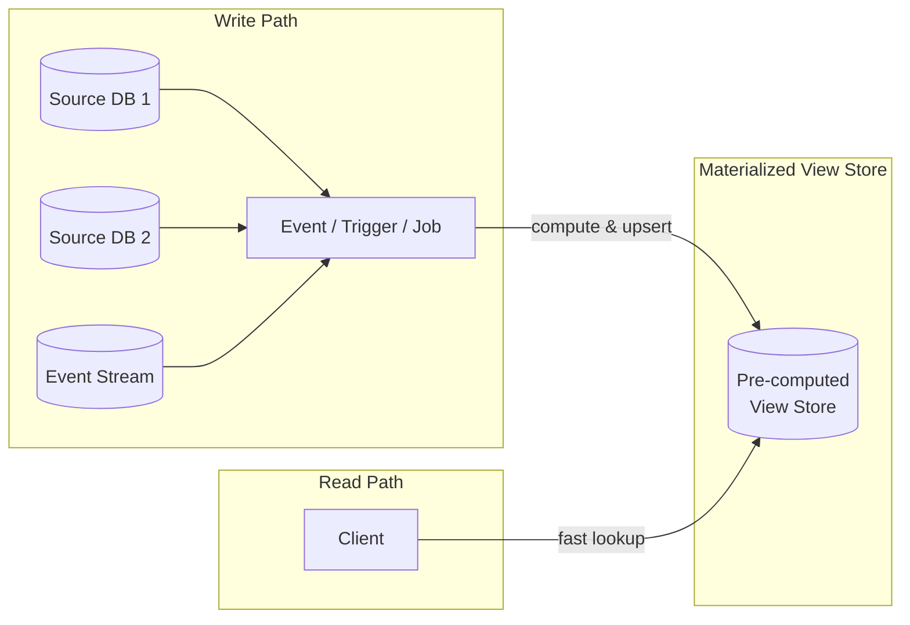

# 🗂️ Materialized View Pattern

> [!abstract] TL;DR
> Pre-generate a denormalized, query-optimized snapshot of data from one or more sources and store it as a ready-to-read view. Reads become trivially fast; the complexity is paid once at write/event time instead of at every query.

## Intent

Pre-compute and persist query results from one or more data sources into a dedicated, read-optimized store so that reads are O(1) lookups instead of expensive joins or aggregations.

---

## Problem It Solves

Complex analytical queries — joining multiple tables, aggregating millions of rows, spanning several microservices — are slow by definition. Running them on every read:

- Hammers the primary data store under load
- Produces unpredictable, high-tail latency
- Blocks OLTP workloads if sharing the same database
- Scales poorly because aggregation cost grows with data volume

The challenge: the cloud pattern is **not** a native DB materialized view feature. It is an architectural pattern where you maintain a separate pre-computed store as a first-class system component.

---

## Solution / How It Works

Data is written to source stores and simultaneously triggers (eagerly) or schedules (lazily) a computation job that builds the materialized view. Reads always hit the view, never the source.

**Refresh strategies:**

| Strategy | Trigger | Freshness | Cost |
|----------|---------|-----------|------|
| Eager (push-on-write) | Every source write fires an event | Near real-time | High write amplification |
| Lazy (on-demand) | First read after TTL expiry | Stale-on-read briefly | Low; computes only when needed |
| Scheduled batch | Cron job (e.g., every 5 min) | Bounded staleness | Simple ops |
| Incremental | Process only changed rows (CDC) | Near real-time | Low; efficient at scale |

---

## When to Use

- Read-heavy workloads where the same complex query is executed repeatedly
- [[CQRS]] read-side needs an optimized projection of events
- Cross-service data that requires joining data owned by different microservices
- Pre-computed dashboards, analytics, news feeds, or recommendation lists
- NoSQL stores that do not support ad-hoc aggregation efficiently
- Reducing read pressure on an OLTP primary database

---

## When NOT to Use

- Data must always be perfectly consistent in real time (strong consistency requirement)
- Source data changes so frequently that view maintenance cost exceeds read benefit
- Simple, low-traffic queries that are already fast
- The domain requires ad-hoc, unpredictable query shapes that cannot be pre-modeled
- Storage cost of duplicated, pre-computed data is prohibitive

---

## Real-World Example

**Twitter Home Timeline (push-on-write):**
When user A posts a tweet, Twitter's Fanout Service reads A's follower list and writes the tweet ID into each follower's pre-computed timeline store (Redis). When follower B opens their app, the home timeline is a single Redis range query — no joins, no aggregation. 450M users' timelines are served sub-millisecond because the computation happened at write time, amortized across fewer writes than reads.

**Facebook Social Graph Neighborhoods:** Pre-computed sets of mutual friends are cached so "People You May Know" resolves without traversing the graph on-demand.

**Elasticsearch as materialized view of Postgres:** Application writes to Postgres; a CDC pipeline (Debezium) streams changes into Elasticsearch, which holds a denormalized, full-text-indexed view. Search reads hit Elasticsearch; transactional writes stay in Postgres.

---

## Trade-offs

| Benefit | Drawback |
|---------|----------|
| Dramatically fast reads — O(1) lookup | Data is eventually consistent (staleness window) |
| Decouples read and write scaling | Write amplification — each source write triggers view update |
| Reduces load on primary OLTP store | Additional storage cost for duplicate, denormalized data |
| Enables cross-service read aggregation | View schema changes require full recomputation |
| Simplifies read-side query logic | Operational complexity: managing view refresh pipelines |
| Works with stores that lack aggregation | Debugging freshness/lag issues adds complexity |

---

## Implementation Considerations

1. **Choose refresh strategy upfront** — push-on-write suits user-facing feeds; scheduled batch suits analytics dashboards; incremental CDC suits large datasets.
2. **Version your view schema** — when the view's shape changes (new field), you need a backfill migration strategy without breaking live reads.
3. **Handle partial failures** — if the update job fails mid-way, the view may be partially stale. Use idempotent upserts and at-least-once processing.
4. **Expose staleness to consumers** — include a `last_updated_at` timestamp in the view so clients can decide whether the data is fresh enough.
5. **Technology choices:** Redis (feeds, counters), Elasticsearch (search projections), Cassandra/DynamoDB (wide-column pre-aggregations), dedicated OLAP stores (ClickHouse, BigQuery) for analytics.
6. **Bootstrap on first deploy** — a full backfill job is needed to populate the view from existing source data before the live update pipeline takes over.

---

## Common Pitfalls

- **Assuming the view is always fresh** — systems that treat materialized views as strongly consistent fail when staleness windows matter (e.g., billing).
- **No TTL / invalidation strategy** — stale entries accumulate silently; always define an expiry or an event-driven invalidation.
- **Fan-out storms** — if a single write triggers updates to millions of view entries (celebrity with 50M followers), write amplification can overwhelm downstream systems. Apply hybrid push/pull (pull for celebrities).
- **Schema drift** — source schema evolves but view schema doesn't, causing silent data corruption in the view.
- **Missing backfill on deploy** — shipping a new view without backfilling means reads return empty results until events gradually populate it.
- **Over-engineering** — creating materialized views for queries that are already fast wastes storage and operational effort.

---

## Related Concepts

- [[_MOC_Cloud_Design_Patterns|↑ Section MOC]]
- [[CQRS]] — Materialized View is the standard implementation for the read side of CQRS
- [[Event_Sourcing]] — Events are the triggers that rebuild projections/views
- [[Write_Through_Cache]] — Similar eager update pattern but at the cache layer
- [[Database_Denormalization]] — Same principle applied within a relational schema
- [[Index_Table]] — A targeted version of this pattern for secondary key lookups
- [[Content_Delivery_Network]] — CDN edge caches are materialized views of origin content

---

## Review Questions

1. **What is the fundamental difference between a database-native materialized view (e.g., PostgreSQL `MATERIALIZED VIEW`) and the Materialized View cloud design pattern?**
   - *Hint: think about where the view is stored and who owns the refresh logic.*

2. **Twitter uses push-on-write for normal users but pull-on-read for celebrities. Why does fan-out fail for high-follower accounts, and what does the hybrid approach look like?**

3. **You are designing a pre-computed analytics dashboard that aggregates sales data across 5 microservices. Walk through your choice of refresh strategy, storage technology, and how you handle a schema change to the view.**

---

## Sources

- [Microsoft Azure: Materialized View Pattern](https://learn.microsoft.com/en-us/azure/architecture/patterns/materialized-view)
- [Martin Fowler: CQRS and Event Sourcing](https://martinfowler.com/bliki/CQRS.html)
- [Twitter Engineering: Timelines at Scale](https://www.infoq.com/presentations/Twitter-Timeline-Scalability/)

#SystemDesign #CloudDesignPatterns #DataManagement #MaterializedView #CQRS #ReadOptimization
