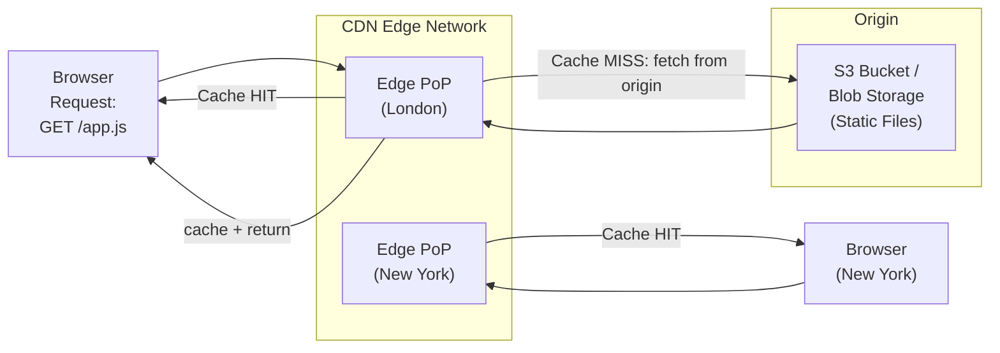

# 🌐 Static Content Hosting Pattern

> [!abstract] TL;DR
> Deploy static assets (HTML, CSS, JS, images, fonts, documents) directly to cloud object storage and serve them via CDN — no compute instances required. Zero-server reads; infinite-scale serving at a fraction of the cost.

## Intent

Deploy static, request-invariant content (assets that return the same bytes regardless of who requests them) to purpose-built cloud storage that can serve files directly to clients over HTTP, bypassing application servers entirely and leveraging CDN edge caching for global performance.

---

## Problem It Solves

Traditional web architectures serve all content — both dynamic (user-specific, database-driven) and static (JS bundles, CSS, images) — from the same compute tier. This is expensive and inefficient because:

- **Compute is wasted** — a web server process or Lambda function handling `GET /logo.png` is spending CPU on zero business logic; it's just reading a file and copying bytes
- **Static assets don't scale the same way as dynamic requests** — they need geographic distribution, not application logic
- **Cost is disproportionate** — serving a 2MB image from an EC2 instance costs ~100x more than from S3 + CloudFront
- **Operational burden** — compute instances need patching, auto-scaling, health checks; object storage needs none of that
- **SPAs and modern frontends are entirely static** — a React or Vue app compiled to `/dist` is 100% static files; there is no reason to serve them from a compute tier

---

## Solution / How It Works

Build static assets into files, upload to [[Object_Storage|object storage]] (S3, Azure Blob, GCS), configure the bucket for static website hosting, and front it with a [[Content_Delivery_Network|CDN]]. The CDN handles TLS, caching, compression, and global edge distribution.



**Standard deployment stack:**

| Layer | Technology |
|-------|------------|
| Build | `npm run build` → `/dist` folder |
| Storage | S3 bucket (website enabled), Azure Static Web Apps, GCS bucket |
| CDN | CloudFront (AWS), Azure CDN, Cloudflare |
| TLS | ACM certificate (AWS) or Cloudflare Universal SSL |
| Custom domain | CNAME/ALIAS record → CloudFront distribution |
| Cache invalidation | `aws cloudfront create-invalidation --paths "/*"` on deploy |

**Deployment pipeline flow:**

```
Git push → CI/CD build (npm build) → upload to S3 (aws s3 sync ./dist s3://my-bucket) 
→ CloudFront invalidation → new version live globally in <60s
```

---

## When to Use

- Single-Page Applications (React, Vue, Angular, Svelte) — the entire app is compiled static files
- Marketing / documentation sites where content changes infrequently
- Assets shared across multiple microservices (CSS design system, shared JS library)
- Media-heavy sites where images, videos, and PDFs represent the bulk of bytes served
- JAMstack architecture — static files + serverless functions for dynamic behavior
- Reducing origin server load by offloading all asset serving to CDN
- Content that is identical for all users (no personalization per-request)

---

## When NOT to Use

- Content is dynamic and user-specific (personalized dashboards, authenticated page renders with server-side data)
- Server-side rendering (SSR) is required for SEO or first-paint performance with frequently-changing data
- Content must be generated at request time (e.g., dynamically generated PDFs, images with user data)
- Assets contain sensitive user data that must not be publicly cached at CDN edge nodes
- Compliance requires all content served from specific geographic regions only (CDN PoPs may be globally distributed)

---

## Real-World Example

**React SPA → S3 + CloudFront (standard AWS pattern):**
A typical React production deployment: `npm run build` produces `index.html`, `main.abc123.js`, `vendor.xyz789.js`, and hashed asset files. These are synced to an S3 bucket (`aws s3 sync ./build s3://myapp-frontend --delete`). CloudFront is configured with the S3 bucket as origin, HTTPS redirect, and a custom domain. `index.html` has `Cache-Control: no-cache` (so routing changes take effect immediately); JS/CSS files have `Cache-Control: max-age=31536000, immutable` (content-hash in filename guarantees uniqueness).

**Netlify / Vercel (JAMstack platforms):**
Both are managed implementations of this pattern. `git push` → build pipeline → global CDN deployment. They additionally handle: branch preview deployments, form submissions (serverless), edge functions for minimal dynamic logic. The core serving is still static files on a CDN.

**Documentation sites (docs.stripe.com, docs.github.com):**
Built with static site generators (Docusaurus, Gatsby, Hugo), compiled to static HTML/CSS/JS, deployed to S3/GCS + CDN. Thousands of simultaneous readers served at near-zero compute cost.

---

## Trade-offs

| Benefit | Drawback |
|---------|----------|
| Near-zero compute cost for asset serving | Cannot serve personalized or truly dynamic content |
| Infinite horizontal scale — CDN handles any traffic burst | Cache invalidation on deploy requires coordination (CDN propagation delay) |
| Sub-millisecond response from CDN edge (content already at PoP) | SSR or dynamic rendering impossible without a compute tier alongside |
| No servers to patch, auto-scale, or monitor | Large number of small files can make `s3 sync` slow at deploy time |
| Built-in high availability — object storage SLAs are 99.99%+ | Single-region origin; CDN serves from cache but origin is still a potential failure point |
| Simplified deployment — `git push` → build → upload | First request to a cold CDN edge PoP incurs origin fetch latency |
| Works seamlessly with CI/CD pipelines | Content-hashing discipline required in build to enable long-lived CDN caching |

---

## Implementation Considerations

1. **Cache-Control headers are critical** — use content-hashed filenames for JS/CSS with `Cache-Control: max-age=31536000, immutable`. Use `no-cache` or short `max-age` for `index.html` so routing changes deploy immediately.
2. **SPA routing — configure 404 → index.html** — all routes in a React Router SPA must return `index.html`. Configure CloudFront custom error response: `404 → index.html, 200`. Without this, direct URL navigation (or refresh) returns a real 404.
3. **HTTPS everywhere** — redirect all HTTP traffic to HTTPS at the CDN level. Use ACM or Cloudflare for free TLS.
4. **Atomic deployments via content hashing** — old files remain at their hashed URLs until TTL expires; new files have new hashes. Users in the middle of a session won't get a mix of old HTML referencing new JS.
5. **Deploy invalidation vs. versioning** — invalidating the CDN after every deploy costs money and takes time; better practice is to version filenames (via hashing) so new content gets new URLs naturally. Only invalidate `index.html`.
6. **Restrict S3 bucket access to CloudFront only** — use an Origin Access Control (OAC) policy so the bucket is not publicly accessible directly; all traffic must go through CloudFront.
7. **Precompression** — pre-gzip or pre-brotli assets at build time (`gzip -k main.js`), upload both versions, configure CloudFront to negotiate encoding — avoids runtime compression CPU.

---

## Common Pitfalls

- **Forgetting SPA routing** — deploying a React app to S3 + CloudFront and wondering why `myapp.com/dashboard` returns 404 on direct navigation; must configure the custom error page to return `index.html`.
- **Long cache on `index.html`** — if `index.html` is cached for 1 year at CDN, users don't see new deployments for a year. Always `no-cache` or very short TTL on the HTML entry point.
- **No CDN in front of S3** — serving directly from S3 with static website hosting works but lacks: TLS on custom domains, global PoPs, request optimization. Always add CloudFront.
- **Public bucket without CloudFront restriction** — S3 bucket marked public allows anyone to access content without going through CloudFront, bypassing WAF, logging, or Geo restrictions.
- **Missing CORS headers** — if a CDN-hosted JS app fetches from an API on a different domain, the API needs proper CORS headers; alternatively the CDN can add them via response header policies.
- **Not cleaning up old assets** — if deploy uploads new hashed files but doesn't delete old ones (`aws s3 sync --delete` missing), the bucket grows indefinitely with orphaned assets.

---

## Related Concepts

- [[_MOC_Cloud_Design_Patterns|↑ Section MOC]]
- [[Content_Delivery_Network]] — the CDN layer that makes this pattern globally fast
- [[Push_vs_Pull_CDNs]] — deploying to S3 + CloudFront is pull CDN; some patterns pre-push to edge; understand the difference for invalidation strategy
- [[Object_Storage]] — S3, Azure Blob, GCS are the storage substrate
- [[Valet_Key]] — counterpart pattern: while Static Content Hosting is for serving, Valet Key is for uploading content directly to the same storage
- [[Microservices]] — frontends built as static SPAs are naturally decoupled from backend microservices
- [[API_Gateway]] — the dynamic complement to static content hosting; API Gateway handles the non-static requests the SPA makes

---

## Review Questions

1. **A React SPA is deployed to S3 + CloudFront. Users report that after a new release, some are seeing the old version for hours. What is the likely cause (focus on caching headers), and how should `index.html` and JS bundle files be cached differently?**

2. **Why is a CDN (e.g., CloudFront) strongly recommended in front of S3 even when S3 already supports static website hosting with a public URL? Name at least four capabilities the CDN adds that S3 website hosting alone lacks.**

3. **Compare Static Content Hosting to a traditional server-rendered application in terms of: deployment model, scaling behavior, and the trade-off with dynamic per-user content. When would you choose a hybrid (static hosting + SSR) approach?**

---

## Sources

- [Microsoft Azure: Static Content Hosting Pattern](https://learn.microsoft.com/en-us/azure/architecture/patterns/static-content-hosting)
- [AWS: Host a static website with S3 and CloudFront](https://aws.amazon.com/premiumsupport/knowledge-center/cloudfront-serve-static-website/)
- [Netlify: JAMstack Architecture](https://jamstack.org/what-is-jamstack/)

#SystemDesign #CloudDesignPatterns #DataManagement #StaticContentHosting #CDN #JAMstack #S3 #CloudFront
