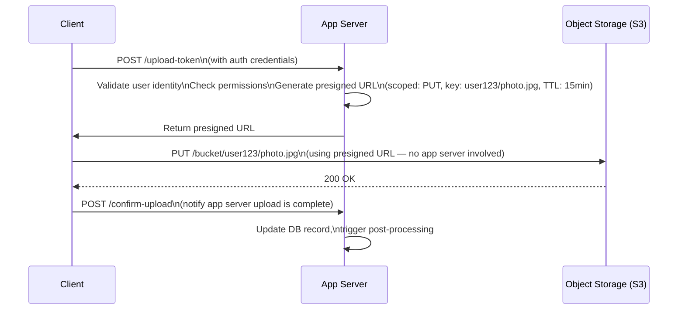

# 🔑 Valet Key Pattern

> [!abstract] TL;DR
> Issue clients a short-lived, scoped token (presigned URL, SAS token) that grants direct, restricted access to a specific cloud storage resource — bypassing the application server entirely for the actual data transfer. The app server acts only as the "key kiosk," not the data pipe.

## Intent

Provide clients with a time-limited, operation-scoped credential to access a specific storage resource directly, eliminating application server bandwidth and compute overhead for large data transfers while maintaining centralized access control.

---

## Problem It Solves

The naive architecture routes every file upload and download through application servers:

```
Client → App Server → Object Storage → App Server → Client
```

This creates severe problems at scale:
- **Bandwidth bottleneck** — app servers become the pipe for every byte of media; bandwidth costs multiply
- **Compute waste** — CPUs and memory processing data they don't need to touch (no business logic involved in streaming bytes)
- **Scaling mismatch** — media traffic patterns (bursty video uploads) are completely different from API traffic patterns; they shouldn't share the same fleet
- **Latency overhead** — each byte makes two hops instead of one; large file uploads are slow
- **Single point of failure** — app server going down kills uploads/downloads in progress

---

## Solution / How It Works

The app server's only job is **[[Authentication_and_Authorization|authorization]] and token issuance**. The actual data flows directly between the client and storage.



**Token properties (security constraints):**

| Property | Purpose | Example |
|----------|---------|---------|
| Time-limited TTL | Token expires even if stolen | 15 minutes |
| Resource-scoped | Only grants access to one specific object | `s3://bucket/user123/photo.jpg` |
| Operation-scoped | Read-only or write-only, not both | `PUT` only (not `GET` or `DELETE`) |
| IP-restricted | Optional; binds token to client IP | `Condition: aws:SourceIp` |
| Size-limited | Prevents over-large uploads | `Content-Length-Range: 0, 10485760` |

**Cloud implementations:**
- **AWS S3 Presigned URLs** — generated via `generate_presigned_url('put_object', ...)` using IAM credentials
- **Azure Blob SAS Token** — Shared Access Signature with start time, expiry, permissions, resource path
- **Google Cloud Signed URLs** — signed with service account key, time-bounded
- **Custom HMAC tokens** — for non-cloud or on-prem object stores

---

## When to Use

- Clients need to upload large files (images, videos, documents) directly to object storage
- Serving large media files (video streaming, file downloads) that don't require per-request business logic
- Need to offload bandwidth costs from app servers to cheaper object storage egress
- Mobile or browser clients uploading directly without routing through backend
- Sharing read access to private resources for a limited time (share a document link that expires in 24h)
- Multi-tenant systems where each tenant gets scoped access to their own storage prefix

---

## When NOT to Use

- Every file requires server-side processing before storage (virus scan, content moderation) — process after upload instead, not as a reason to route through the server
- Strong audit requirements mandate that every byte passes through a controlled inspection point
- The storage provider does not support capability-based access tokens
- Files are tiny (< 1KB) — the round-trip for token issuance costs more than just proxying the data
- Compliance requires that raw data never be accessible to client without mediation (HIPAA, PCI-DSS raw data)

---

## Real-World Example

**Instagram / Airbnb / Dropbox — Photo & Video Uploads:**
When you select a photo to upload on Instagram, the app first calls Instagram's API to request an upload token. Instagram's server validates your session, generates an S3 presigned URL scoped to `PUT` on `s3://instagram-uploads/user_id/timestamp_filename.jpg` with a 10-minute TTL. The app then uploads directly to S3 — Instagram's app servers never touch the image bytes. After upload, the app notifies Instagram's API, which triggers async processing (resizing, CDN distribution).

**Dropbox — File Sharing:**
When a Dropbox user shares a "anyone with the link" file, Dropbox generates a signed URL that encodes the user's identity, the file key, an expiry timestamp, and an HMAC signature. The recipient downloads directly from Dropbox's storage without hitting the app server per-byte.

**AWS S3 Presigned URL in code:**
```python
import boto3
s3 = boto3.client('s3')
url = s3.generate_presigned_url(
    'put_object',
    Params={'Bucket': 'my-bucket', 'Key': f'uploads/{user_id}/{filename}'},
    ExpiresIn=900  # 15 minutes
)
# Return this URL to the client; client PUTs directly to S3
```

---

## Trade-offs

| Benefit | Drawback |
|---------|----------|
| Eliminates app server bandwidth and compute for data transfer | Token theft within TTL window grants unauthorized access |
| Dramatically reduces app server cost and scaling requirements | Client must handle two-step flow (get token, then upload) — more complex client code |
| Object storage handles burst capacity automatically | Cannot intercept the upload mid-stream (content moderation must be post-upload async) |
| Token is fine-grained: scoped to one resource, one operation, one TTL | Token generation requires app server to be available before upload can start |
| Enables global edge upload directly to storage regions | Debugging upload failures is harder (bypasses app server logs) |
| Cloud-native implementations are built-in (S3, Azure Blob, GCS) | Confirmation step (notifying app after upload) adds complexity; can be replaced with S3 event notifications |

---

## Implementation Considerations

1. **Always confirm upload completion** — the client can call the storage URL and immediately die. Use S3 Event Notifications (S3 → SQS → Lambda) to detect completed uploads server-side rather than relying on client confirmation callbacks.
2. **Namespace keys by user/tenant** — scope the presigned URL to a path prefix owned by the requester: `uploads/{user_id}/{uuid}.jpg`. Never allow the client to specify arbitrary storage keys.
3. **Set maximum content length** — S3 presigned POST (not PUT) allows you to enforce a maximum upload size. Without this, a malicious client can upload arbitrarily large files.
4. **Short TTL by default** — 15 minutes is standard. Tokens for download links shared publicly can be longer (24h) but track usage.
5. **Post-upload processing pipeline** — trigger async jobs (virus scan, image resize, CDN warm) via S3 event notifications rather than inline in the upload path.
6. **Audit log the token issuance** — the app server generates the token; log `(user_id, resource_key, TTL, issued_at)` so you have an audit trail even though the actual transfer bypasses the app server.

---

## Common Pitfalls

- **Reusing tokens** — issuing a token once and caching it for reuse means a stolen token is valid forever. Always generate fresh tokens.
- **Too-long TTL** — a 24-hour presigned URL for an upload is a security risk; use the shortest TTL that the client's upload latency allows.
- **Client-controlled storage path** — letting the client specify the S3 key allows path traversal attacks or overwriting other users' files. Always generate the key server-side.
- **No post-upload confirmation** — assuming the upload succeeded because you issued the token. The upload could fail, and the DB record would be stale.
- **Missing CORS configuration** — browser-based direct uploads require the storage bucket to have CORS headers configured for the app's origin, or preflight OPTIONS requests will fail.
- **Serving private content without expiry** — generating permanent signed URLs for private content means revocation is impossible.

---

## Related Concepts

- [[_MOC_Cloud_Design_Patterns|↑ Section MOC]]
- [[Object_Storage]] — the destination storage tier that makes this pattern possible (S3, Azure Blob, GCS)
- [[Authentication_and_Authorization]] — the app server's primary role in this pattern is auth before token issuance
- [[API_Gateway]] — can serve as the token issuance endpoint with built-in auth integration
- [[Claim_Check]] — related pattern: store large payload in external storage, pass the reference (claim check) in messages; Valet Key enables clients to retrieve the claim
- [[CDNs]] — often combined: Valet Key for uploads, CDN with signed URLs for downloads
- [[Static_Content_Hosting]] — static assets served via object storage + CDN follow the same bypass-app-server philosophy

---

## Review Questions

1. **A mobile photo-sharing app routes all photo uploads through its API servers. Users are experiencing slow uploads and the API servers are saturating their bandwidth. Describe step-by-step how you would implement the Valet Key pattern to fix this, including what happens if the upload succeeds but the client never sends the confirmation callback.**

2. **An S3 presigned URL is stolen by an attacker within its 15-minute TTL window. What security properties of the Valet Key pattern limit the blast radius, and what additional controls (IP binding, post-upload hooks) can further reduce risk?**

3. **Compare the Valet Key pattern to the Claim Check pattern. In what scenario would you use Valet Key for uploads and Claim Check for the subsequent messaging pipeline, and how do the two patterns chain together?**

---

## Sources

- [Microsoft Azure: Valet Key Pattern](https://learn.microsoft.com/en-us/azure/architecture/patterns/valet-key)
- [AWS S3 Presigned URLs Documentation](https://docs.aws.amazon.com/AmazonS3/latest/userguide/using-presigned-url.html)
- [Azure Shared Access Signature (SAS)](https://learn.microsoft.com/en-us/azure/storage/common/storage-sas-overview)

#SystemDesign #CloudDesignPatterns #DataManagement #ValetKey #PresignedURL #ObjectStorage #Security
