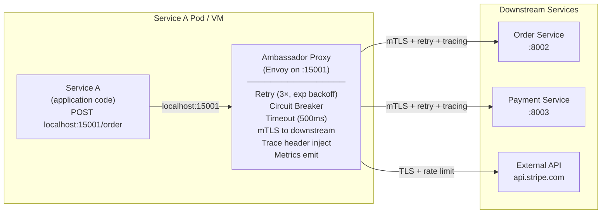

# 🤝 Ambassador Pattern

> [!abstract] TL;DR
> Co-locate a network proxy "ambassador" alongside a service to handle all outbound network communication concerns (retries, circuit breaking, service discovery, logging, tracing) on the service's behalf. The service talks to localhost; the ambassador handles the messy reality of distributed networking. Envoy proxy is the canonical ambassador.

## Intent

Create a helper proxy service that manages network communication on behalf of a consumer service, handling cross-cutting network concerns (retries, circuit breaking, observability, service discovery) transparently without requiring changes to the service's code.

---

## Problem It Solves

Every service in a distributed system making outbound calls needs to handle:

- **Transient failures** — network blips, downstream restarts; calls need automatic retry with backoff
- **[[Circuit_Breaker|Circuit breaking]]** — don't hammer a failing downstream service; open circuit when error rate exceeds threshold
- **Service discovery** — downstream service addresses change (Kubernetes pod IPs, ECS tasks); services must resolve current addresses
- **Distributed tracing** — propagate `X-Trace-ID` headers on every outbound call
- **Timeout management** — global and per-service timeout policies
- **Mutual TLS** — encrypt and authenticate service-to-service traffic
- **Load balancing** — distribute calls across multiple downstream instances

Building this into every service requires:
- The same libraries wired up in each service (often in different languages — a polyglot system)
- Updates to every service when networking policy changes
- Language-specific library support (what if the service is Python but the retry library is Java-centric?)

---

## Solution / How It Works

Deploy a network proxy (ambassador) as a co-located process or sidecar container. The service sends all outbound requests to the ambassador on `localhost`. The ambassador handles the cross-cutting network concerns and forwards to the actual downstream service. From the service's perspective, all calls go to `localhost`; the complexity of distributed networking is invisible.



**Ambassador vs. Sidecar — the key distinction:**

| Dimension | [[Sidecar_Pattern|Sidecar Pattern]] | Ambassador Pattern |
|-----------|----------------|-------------------|
| Scope | Any co-located helper (logging, config reload, file sync) | Specifically a network proxy for outbound calls |
| Traffic direction | Both inbound AND outbound (or neither, e.g., file helper) | Primarily OUTBOUND calls from the service |
| Examples | Log shipper, secret rotator, config watcher | Envoy, Linkerd2-proxy, Netflix Prana |
| Abstraction | Co-location model | Network proxy model |

**Note:** In [[Service_Mesh|service mesh]] architectures (Istio, Linkerd), the service mesh proxy (Envoy) acts as both an Ambassador (outbound) and an ingress proxy (inbound), deployed as a Sidecar — it combines all three patterns.

**Ambassador in a service mesh context:**
```
Inbound request → Envoy (sidecar, ingress) → Service → Envoy (sidecar, egress/ambassador) → Downstream
```

---

## When to Use

- Services are written in multiple languages — implementing retry/circuit-breaker once in an ambassador eliminates per-language library maintenance
- Networking policy needs to be updated independently of service deployments (change retry policy without redeploying 20 services)
- Legacy services that cannot be modified but need modern networking capabilities (retries, tracing, mTLS) added retroactively
- Service mesh adoption — Istio/Linkerd inject Envoy as an ambassador to every pod
- Services calling external third-party APIs that require rate limiting, retries, and circuit breaking applied consistently
- Polyglot architectures where consistent observability (tracing, metrics) across all languages would otherwise require per-language SDK integration

---

## When NOT to Use

- Simple single-service applications where the overhead of a proxy is not justified
- Ultra-low-latency systems where the additional localhost hop is unacceptable (sub-millisecond SLAs)
- When the service already uses a mature networking library (Resilience4j in Java, `httpx` with retries in Python) and the overhead of a proxy adds no value
- When the operational overhead of managing proxy configuration exceeds the benefit (small teams with few services)
- Stateful protocols that the proxy cannot transparently handle (raw TCP streaming, WebSockets with custom framing)

---

## Real-World Example

**Envoy Proxy (Lyft / CNCF):**
Envoy is the canonical ambassador implementation. Originally built by Lyft, Envoy is deployed as a sidecar/ambassador alongside every service. Services communicate via `localhost` ports configured in Envoy's configuration. Envoy handles: HTTP/2 and gRPC proxying, automatic retries with exponential backoff, circuit breaking with outlier ejection, distributed tracing via Zipkin/Jaeger integration, TLS termination and mTLS, and emitting Prometheus metrics per service call. The application team deploys their service; Envoy is injected by the platform team and is transparently updated without service redeployment.

**Netflix Prana:**
Before service meshes, Netflix built Prana — an ambassador sidecar for non-JVM services. Netflix's infrastructure was built around Java-centric libraries (Eureka for service discovery, Hystrix for circuit breaking). Non-Java services (Node.js, Python) couldn't use these directly. Prana was a small Java sidecar that proxied all outbound calls from non-JVM services, handling Eureka lookup, Hystrix circuit breaking, and Ribbon load balancing transparently.

**Istio with Envoy Sidecar:**
When Istio is enabled on a Kubernetes namespace, every pod has an Envoy container automatically injected (`istio-proxy`). A Python Flask service making a call to `http://order-service/orders` actually calls Envoy on `127.0.0.1:15001`. Envoy resolves the address via xDS service discovery, applies retry policy (from `VirtualService` CRD), enforces mTLS to the destination pod's Envoy, and records the call in distributed trace. The Flask service has zero networking code changes.

---

## Trade-offs

| Benefit | Drawback |
|---------|----------|
| Networking concerns removed from service code — no per-language library needed | Additional process/container per service — memory and CPU overhead (Envoy uses ~50MB RAM) |
| Policy changes (retry counts, timeouts) applied without redeploying services | Added localhost hop — typically < 1ms but present in every call |
| Language-agnostic — works identically for Java, Python, Go, Node.js services | Debugging is harder — network call goes through proxy; need proxy logs for full picture |
| Enables retroactive networking features on legacy services | Operational complexity — proxy configuration management becomes a discipline |
| Service mesh builds on this pattern for full observability and mTLS mesh | Proxy bugs or misconfigurations affect all services using it |
| Consistent metrics and tracing without per-service instrumentation | Stateful protocol support varies; not all protocols can be transparently proxied |

---

## Implementation Considerations

1. **Use xDS (gRPC-based) dynamic configuration if possible** — Envoy's xDS API allows routing config, cluster definitions, and policies to be updated without restarting Envoy. Static config (YAML files) requires restarts for any change.
2. **Tune circuit breaker thresholds per upstream** — default circuit breaker settings (50% error rate, 5 requests minimum) may be too aggressive or too lenient for specific upstreams. Configure per-cluster thresholds.
3. **Separate ambassador logs from service logs** — proxy logs (access logs, upstream connection events) should go to a different log stream than application logs. Mixing them makes debugging harder.
4. **Set connection pool limits** — Envoy's connection pool settings (`max_connections`, `max_pending_requests`, `max_requests`) prevent one service's call to a slow downstream from consuming all available connections and starving other services' calls.
5. **Test proxy configuration in staging** — a bad circuit breaker configuration (too-low threshold) deployed via service mesh control plane can trip all services at once. Test config changes in staging with load.
6. **Understand the Envoy lifecycle during pod shutdown** — when a Kubernetes pod is terminated, Envoy and the service container both receive SIGTERM. If Envoy exits before the service finishes draining in-flight requests, those requests fail. Configure `terminationGracePeriodSeconds` and Envoy's drain timeout carefully.

---

## Common Pitfalls

- **Infinite retry loops** — service A calls service B via ambassador with 3 retries; service B calls service C via ambassador with 3 retries. A single failure at C becomes 3×3 = 9 calls to C. Design retry budgets at the system level, not per-hop.
- **Misconfigured timeouts causing cascading failures** — if the ambassador timeout for downstream service B is longer than the client's timeout for calling service A, client timeouts pile up while the ambassador keeps retrying. Timeout budgets should decrease as they propagate downstream.
- **Trusting the ambassador for security** — the ambassador handles mTLS, but if a service can bypass it (call downstream directly on the pod network), the security guarantee is void. Use NetworkPolicy to enforce all traffic flows through the proxy.
- **Treating the ambassador as a blackbox** — teams deploy Envoy without understanding its circuit breaker state or retry configuration. When things go wrong, they have no intuition for what the proxy is doing. Invest in proxy dashboard familiarity (Kiali for Istio, Envoy admin API).
- **Proxy version drift** — in a large cluster, different pods may run different Envoy versions (from different deployment times). Envoy version differences can cause subtle behavior differences. Standardize on a consistent version and update uniformly.

---

## Related Concepts

- [[_MOC_Cloud_Design_Patterns|↑ Section MOC]]
- [[Sidecar_Pattern]] — the deployment model (co-located container); Ambassador is a Sidecar specialized for network proxying
- [[Service_Mesh]] — Istio, Linkerd, and Consul Connect are service mesh architectures built on the Ambassador pattern deployed as sidecars on every pod
- [[Circuit_Breaker]] — one of the primary network concerns handled by the ambassador proxy
- [[Retry_Pattern]] — automatic retry with exponential backoff and jitter, implemented in the ambassador
- [[Gateway_Offloading]] — similar concept but at the ingress gateway level (all inbound traffic); Ambassador handles outbound from individual services
- [[Strangler_Fig_Pattern]] — an ambassador can be introduced to intercept calls to a legacy service and gradually route them to the replacement

---

## Review Questions

1. **A Python service and a Go service both need to implement retries (3 attempts, exponential backoff), circuit breaking (50% error threshold, 10s recovery), and Zipkin trace propagation when calling downstream services. Compare two implementations: (a) using language-specific libraries in each service, and (b) using an Ambassador proxy. What are the trade-offs in terms of code ownership, policy updates, and operational complexity?**

2. **Explain the "retry amplification" problem in a multi-service call chain where each service's ambassador independently retries. Service A calls B (3 retries) which calls C (3 retries) which calls D (3 retries). If D is experiencing a transient failure, how many total requests does D receive from one initial call from A, and what is the correct architectural fix?**

3. **What is the difference between Gateway Offloading and the Ambassador Pattern? Both handle cross-cutting network concerns — explain the traffic direction, deployment location, and scope of each, and describe when you would use both simultaneously in the same system.**

---

## Sources

- [Microsoft Azure: Ambassador Pattern](https://learn.microsoft.com/en-us/azure/architecture/patterns/ambassador)
- [Envoy Proxy Documentation](https://www.envoyproxy.io/docs)
- [Netflix Tech Blog: Prana — Netflix Sidecar](https://netflixtechblog.com/prana-a-sidecar-for-your-netflix-paas-based-applications-and-services-258a5790a015)
- [Istio Architecture](https://istio.io/latest/docs/ops/deployment/architecture/)

#SystemDesign #CloudDesignPatterns #DesignAndImplementation #AmbassadorPattern #ServiceMesh #Envoy #Sidecar #CircuitBreaker
