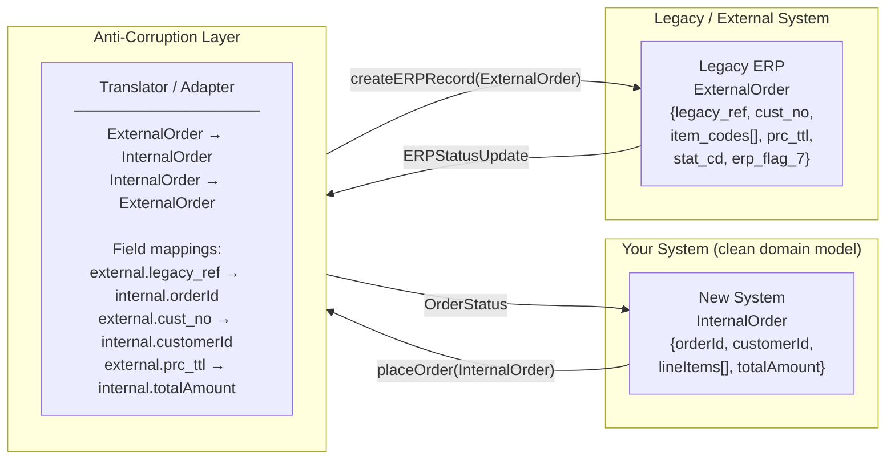

# 🛡️ Anti-Corruption Layer Pattern

> [!abstract] TL;DR
> Insert a translation layer between your system and an external/legacy system whose domain model is incompatible with yours. The ACL translates between models in both directions, so neither system's concepts contaminate the other — your clean domain model stays clean.

## Intent

Implement a translation and adaptation layer between two systems with incompatible domain models, preventing the concepts, terminology, and data structures of one system from corrupting the domain model of the other.

---

## Problem It Solves

Systems don't exist in isolation. Your application must integrate with:
- Legacy systems with outdated models (a 20-year-old ERP system with Byzantine data structures)
- Third-party APIs (a payment provider whose `Order` concept is nothing like your `Order`)
- External [[Microservices|microservices]] owned by other teams with different bounded contexts
- COTS (commercial off-the-shelf) software with its own rigid data model

Without an isolation layer:
- Your domain objects start acquiring fields that only exist because the external system needs them: `legacy_order_ref`, `erp_customer_code`, `payment_vendor_status_code_3`
- Developers learn the external system's concepts and terminology and start mixing them into your codebase
- Changing external systems is painful because their model has leaked into your core domain
- Tests mock the external system's model directly, coupling your tests to the integration

The term "corruption" comes from Domain-Driven Design: the external model's alien concepts corrupt the purity and consistency of your domain model.

---

## Solution / How It Works

Create an explicit translation layer — the Anti-Corruption Layer — that sits between your system and the external system. All cross-boundary communication passes through the ACL, which:
1. Translates external model concepts into your domain model (inbound)
2. Translates your domain model concepts into the external model (outbound)
3. Adapts protocols, data formats, and field structures



**ACL implementation patterns:**

| Pattern | When to Use |
|---------|-------------|
| Adapter | Converts interface of external class to interface your system expects |
| Facade | Simplifies a complex external API surface into a clean, focused interface |
| Translator | Pure data mapping — converts external DTOs to internal domain objects |
| Gateway | Wraps all communication with the external system (network + translation) |

**Bidirectional translation example:**

```python
# Anti-Corruption Layer: translates between your Order domain and LegacyERP's model
class LegacyERPAdapter:
    def create_order(self, internal_order: Order) -> None:
        # Translate: your model → legacy ERP model
        erp_payload = {
            "legacy_ref": str(internal_order.order_id),
            "cust_no": internal_order.customer_id,
            "item_codes": [item.sku for item in internal_order.line_items],
            "prc_ttl": str(internal_order.total_amount.amount),
            "curr_cd": internal_order.total_amount.currency_code,
            "erp_flag_7": "Y"  # required by ERP, irrelevant to your domain
        }
        self._erp_client.post("/orders", erp_payload)

    def get_order_status(self, order_id: OrderId) -> OrderStatus:
        # Translate: legacy ERP status codes → your domain's OrderStatus enum
        erp_order = self._erp_client.get(f"/orders/{order_id}")
        status_map = {
            "PEND": OrderStatus.PENDING,
            "PROC": OrderStatus.PROCESSING,
            "SHIP": OrderStatus.SHIPPED,
            "CNCL": OrderStatus.CANCELLED
        }
        return status_map.get(erp_order["stat_cd"], OrderStatus.UNKNOWN)
```

---

## When to Use

- Integrating with a legacy system whose domain model is fundamentally different from yours and cannot be changed
- Consuming a third-party API (payment processor, shipping provider) whose data model uses concepts foreign to your domain
- [[Strangler_Fig_Pattern|Strangler Fig]] migration — the ACL isolates the legacy system during incremental replacement; when migration is complete, remove the ACL
- Integrating across bounded context boundaries in a DDD architecture — each bounded context has its own model; the ACL translates between them
- Preventing a "big bang" rewrite — instead of replacing everything at once, wrap the legacy system in an ACL and replace it piece by piece
- Protecting your domain model from external API changes — when the external API changes its schema, only the ACL needs updating

---

## When NOT to Use

- The external system's model is compatible with yours — adding a translation layer adds overhead without benefit
- You control both systems and can align their models — prefer a shared model or shared kernel over a translation layer
- The integration is trivial and temporary — a simple field rename for a one-off script doesn't need a full ACL
- The ACL becomes more complex than the integration it protects — if translation logic is overwhelmingly complex, consider whether a different integration strategy is needed

---

## Real-World Example

**Strangler Fig + ACL for ERP Migration:**
A retail company's monolith integrates directly with SAP ERP. Every order domain object has `sap_material_number`, `sap_plant_code`, and `sap_valuation_class` fields that mean nothing to the order domain. During a modernization project, they introduce an ACL (`SAPOrderGateway`) that translates between the new Order microservice's clean domain model and SAP's BAPI interface. The new microservice works with `Product`, `Warehouse`, and `ValuationType` in its own terms; the ACL handles the SAP-specific mapping. When SAP is eventually replaced, only the ACL changes.

**Payment Provider Integration:**
Stripe's concept of a `PaymentIntent` with states like `requires_payment_method`, `requires_confirmation`, and `succeeded` is nothing like your internal `Payment` domain with states `PENDING`, `AUTHORIZED`, `CAPTURED`, `FAILED`. An ACL (`StripePaymentAdapter`) translates Stripe's webhooks into your domain events, maps Stripe's error codes to your domain's error taxonomy, and converts your internal `CapturePayment` command into the correct Stripe API calls.

**DDD Bounded Context integration:**
In a DDD system, the `Catalog` bounded context defines `Product` differently from the `Order` bounded context. When `Order` needs product data, instead of importing `Catalog`'s `Product` class directly (which would couple the bounded contexts), an ACL translates `Catalog.Product` into `Order.ProductSummary` — a lean view containing only what the Order context needs.

---

## Trade-offs

| Benefit | Drawback |
|---------|----------|
| Protects your domain model from external contamination | Added complexity — another layer to design, build, test, and maintain |
| External system changes are absorbed by the ACL, not your domain | Translation logic can become complex and bug-prone for complex models |
| Enables safe incremental migration (Strangler Fig) | Performance overhead — translation adds CPU cost and (if network-based) latency |
| Decouples your domain from vendor-specific concepts | ACL can become a catch-all dumping ground for ad-hoc transformation code |
| Tests for your domain no longer need to mock the external model | If both systems change frequently, ACL maintenance becomes ongoing work |
| Enables protocol adaptation (REST ↔ SOAP, XML ↔ JSON) | Bidirectional translation logic can have subtle semantic loss |

---

## Implementation Considerations

1. **Put the ACL at the boundary of your bounded context** — the ACL lives inside your context's infrastructure layer (hexagonal architecture ports-and-adapters). Domain code never imports from the external system; only the ACL does.
2. **Test the translation logic independently** — write unit tests for every field mapping. Semantic translation bugs (a wrong status code mapping, a currency unit mismatch) are silent and catastrophic.
3. **Version the external model separately** — when the external API releases a new version, update the ACL's model of the external system independently of your domain model. Your domain remains stable.
4. **Log raw external payloads** — before translation, log the raw external system's payload (respecting PII rules). When translation bugs occur, you need the original data to diagnose what went wrong.
5. **Handle external model evolution** — external APIs add fields, rename fields, or deprecate them. The ACL's translation should be defensive: use unknown fields as opaque pass-through where safe; alert on unexpected values in critical fields.
6. **Consider a separate deployment for the ACL** — for large integrations, the ACL can be a separate service (an "integration service") rather than a library inside the consumer. This allows it to be independently deployed and scaled.

---

## Common Pitfalls

- **Thin ACL that leaks external concepts** — an ACL that just passes through external types with a thin wrapper. The external model's concepts still leak into callers. Ensure the ACL produces genuine domain types, not "external type with a new name."
- **Business logic in the ACL** — the ACL starts making decisions based on external field values ("if erp_flag_7 == 'Y' then set priority to HIGH"). Business logic belongs in the domain; the ACL should be pure translation.
- **Synchronous ACL on unreliable external systems** — if the external system is a slow or unreliable legacy ERP, a synchronous ACL creates availability coupling. Use async integration (event queue + ACL worker) to decouple availability.
- **No semantic validation** — translating `erp_priority_code = 9` to `Priority.URGENT` without validating that 9 is a known code. Unknown external values should fail loudly with a mapping error, not silently produce wrong domain values.
- **Not removing the ACL after migration** — the ACL was introduced to enable the Strangler Fig migration. After the legacy system is fully replaced, the ACL is dead code that adds confusion. Remove it.
- **Forgetting the outbound direction** — many teams build the inbound translation (external → internal) but forget to translate outbound (internal → external) with equal care, leading to semantic errors in data written to the external system.

---

## Related Concepts

- [[_MOC_Cloud_Design_Patterns|↑ Section MOC]]
- [[Strangler_Fig_Pattern]] — the migration strategy that almost always uses an ACL to isolate the legacy system during incremental replacement
- [[API_Gateway]] — can host a basic ACL for protocol translation (XML→JSON, SOAP→REST), though complex domain translation belongs in a dedicated service
- [[Gateway_Routing]] — the gateway can route to the ACL as a translation endpoint before forwarding to the target service
- [[Microservices]] — bounded context boundaries in microservices architectures are enforced through ACLs between contexts
- [[Sidecar_Pattern]] — a sidecar can implement a lightweight ACL for protocol adaptation (translating a legacy protocol to REST) without modifying the primary service

---

## Review Questions

1. **Your e-commerce platform's Order service needs to call a 15-year-old SOAP-based inventory system that uses XML, has different field names, and represents quantities in "warehouse units" rather than standard units. Walk through designing an Anti-Corruption Layer: what does the ACL's interface look like to the Order service, what does the SOAP client look like inside the ACL, and where do you write unit tests?**

2. **During a Strangler Fig migration of a legacy monolith, when is the Anti-Corruption Layer introduced, what does it translate between, and — critically — when and how is it removed once migration is complete?**

3. **What is the difference between an Anti-Corruption Layer and a simple Adapter pattern? When does an Adapter become an ACL, and what is the DDD concept of "domain model corruption" that the pattern name references?**

---

## Sources

- [Microsoft Azure: Anti-Corruption Layer Pattern](https://learn.microsoft.com/en-us/azure/architecture/patterns/anti-corruption-layer)
- [Eric Evans: Domain-Driven Design — Anti-Corruption Layer](https://martinfowler.com/bliki/AntiCorruptionLayer.html)
- [Martin Fowler: Strangler Fig Application](https://martinfowler.com/bliki/StranglerFigApplication.html)

#SystemDesign #CloudDesignPatterns #DesignAndImplementation #AntiCorruptionLayer #DDD #LegacyIntegration #BoundedContext
