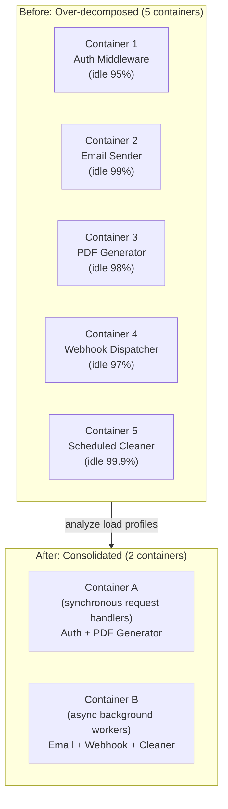

# 🖥️ Compute Resource Consolidation Pattern

> [!abstract] TL;DR
> Consolidate multiple compatible tasks or services into a single compute unit (process, container, or VM) when they have similar load profiles, lifecycle, and resource needs — reducing the idle-resource waste that comes from over-decomposed microservices, each consuming a minimum allocation even at zero load.

## Intent

Improve resource utilization and reduce operational cost by co-locating multiple tasks or services within the same compute unit when their load patterns, isolation requirements, and operational lifecycle make consolidation safe and beneficial.

---

## Problem It Solves

[[Microservices]] dogma ("one service per container") applied indiscriminately creates resource waste at scale:

- **Minimum allocation waste** — every container needs a minimum memory allocation (e.g., 256MB) and CPU reservation. A system with 50 microservices each idle 99% of the time wastes 50 × 256MB = 12.8GB just keeping containers alive.
- **Cold-start overhead** — serverless functions and containers have per-instance cold-start costs; if a function is called infrequently, it cold-starts on almost every invocation.
- **[[Kubernetes_for_SD|Kubernetes]] overhead** — each pod has kube-proxy, pause containers, and control-plane overhead. Hundreds of rarely-used pods impose cluster management cost disproportionate to their value.
- **Network latency between tiny services** — services so fine-grained that their primary work is calling each other add network hop latency and serialization overhead that would disappear if co-located.
- **Operational sprawl** — 80 microservices each with their own CI/CD pipeline, health checks, logging config, and dashboards creates enormous DevOps overhead.

The pattern is the **pragmatic counter-balance** to over-decomposition — not a rejection of microservices, but a recognition that decomposition has a cost that must be weighed against its benefits.

---

## Solution / How It Works

Group tasks by compatibility criteria and run them in the same process or container. Identify natural groupings: tasks that scale together, share load profiles, share data, or have the same operational lifecycle.

**Consolidation decision framework — group tasks that share:**

| Criterion | Compatible for Consolidation | Incompatible (keep separate) |
|----------|-----------------------------|-----------------------------|
| Load pattern | Both idle or both peak together | One peaks when other is idle (anti-correlated) |
| Resource profile | Both CPU-bound or both memory-bound | One is CPU-heavy, other is I/O-bound (compete for CPU) |
| Scaling trigger | Scale on same metric | Scale on fundamentally different metrics |
| Security boundary | Same trust domain, same tenant | Different security contexts, different compliance scope |
| Failure impact | OK for one failure to affect the other | One failure must not impact the other |
| Team ownership | Same team owns both | Different teams — coupling is organizationally painful |
| Deployment frequency | Deploy together | Need to deploy independently without coordination |

---

## When to Use

- Small teams where operational overhead of many services outweighs decomposition benefits
- Services that are idle the vast majority of the time but still consume minimum resource allocations
- Services with strongly correlated load — they peak and trough together, so co-locating them doesn't create resource contention
- Early-stage products where requirements are not yet stable enough to justify permanent service boundaries
- "Majestic Monolith" architectural choice — well-structured modular monolith that deploys as one unit but maintains internal module boundaries
- Consolidating Lambda functions with similar triggers to amortize cold-start overhead

---

## When NOT to Use

- Services have different security requirements — consolidating a public-facing service with an admin service increases attack surface
- Different scaling requirements — a read-heavy service and a write-heavy service will compete for resources at their respective peaks
- Different failure domains — a crash in consolidated Service A should not take down Service B; keep them separate
- Different teams own the services — organizational boundaries are real; forcing code co-location across team boundaries creates coordination problems
- Resource contention at peak — if both services need 100% CPU during their respective peaks, consolidation causes degraded performance during overlapping peaks
- Compliance or regulatory separation — PCI-DSS, HIPAA, or SOC 2 requirements may mandate process isolation

---

## Real-World Example

**"Majestic Monolith" architectural choice:**
Basecamp (DHH/37signals) deliberately runs their application as a single Rails monolith rather than microservices. The entire product — projects, todos, messages, schedules — is one deployed unit. Internally it uses module boundaries and Rails engines to organize code, but it deploys as one process. The team is small, the codebase is well-structured, and the operational simplicity of one service pays dividends that microservices would not justify at their scale.

**Lambda consolidation — "Lambda monolith" or "Lambdalith":**
An AWS Lambda function per HTTP route (one Lambda for `GET /users`, another for `POST /users`, another for `GET /orders`, ...) results in dozens of Lambdas each with cold-start overhead on infrequent calls. A common optimization: consolidate into one Lambda that handles all routes for a domain using an internal router (Express.js in Node.js). One Lambda stays warm from high-traffic routes, benefiting all routes in the function.

**Kubernetes sidecar consolidation:**
A service mesh like Istio injects an Envoy [[Sidecar_Pattern|sidecar]] into every pod. For clusters with hundreds of pods, this is one Envoy per pod. In low-traffic environments, consolidating related services so fewer pods are needed directly reduces the total number of Envoy sidecars and their associated memory overhead.

---

## Trade-offs

| Benefit | Drawback |
|---------|----------|
| Reduced resource cost — fewer minimum allocations | Reduced isolation — a crash in one task can take down all co-located tasks |
| Simpler operations — fewer deployments, pipelines, dashboards | Harder to scale individual components independently |
| Lower latency for in-process calls (no network hop) | If one task has a memory leak, it affects all co-located tasks |
| Reduced cold-start overhead for serverless | Deployment coupling — deploying one task requires redeploying all consolidated tasks |
| Easier local development — one service to run | Security blast radius — a vulnerability in one task exposes all co-located tasks |
| Reduced Kubernetes control-plane overhead | Over time, consolidation boundaries may calcify into an actual monolith |

---

## Implementation Considerations

1. **Maintain internal module boundaries even when consolidating** — co-locating code in one process should not mean merging codebases into spaghetti. Use clear module/package boundaries, explicit interfaces, and enforce architectural rules with linting (ArchUnit, Dependency Cruiser).
2. **Profile before consolidating** — measure actual resource usage per service before deciding to consolidate. Many "idle" services are actually idle less than you think. Consolidating two bursty services that happen to burst at the same time creates contention.
3. **Plan for eventual decomposition** — consolidation is often a pragmatic choice for early-stage products. Design the internal module boundaries to match future service boundaries so decomposition is surgical rather than painful.
4. **Use process-level isolation where possible** — if co-locating in one VM/node rather than one process, use separate processes (but same node) to preserve OS-level isolation while sharing hardware.
5. **Monitor consolidated tasks individually** — even in one process, emit separate metrics per logical task. When you eventually split them, you'll have historical data on their individual resource profiles.
6. **Feature flag for decomposition** — design consolidations that can be inverted; if the consolidated task starts creating problems, you want to extract it cleanly without a rewrite.

---

## Common Pitfalls

- **Consolidating for the wrong reason** — consolidating because "microservices are complex" without understanding the actual resource waste being avoided. Know your utilization numbers.
- **Merging different team's code** — forcing consolidation across organizational boundaries creates coordination overhead that erases the operational benefit.
- **Noisy-neighbor CPU starvation** — one task that occasionally spikes CPU (e.g., PDF generation) can starve other co-located tasks. Set CPU limits per goroutine pool or use separate thread pools with bounded sizes.
- **Forgetting isolation at scale** — what works consolidated at 10 req/s becomes problematic at 10,000 req/s when tasks start competing. Revisit consolidation decisions as load grows.
- **Over-consolidating into a new monolith** — the goal is pragmatic grouping, not recreating the monolith that was broken apart. One consolidated unit per team, per domain, not one unit for everything.
- **No exit strategy** — consolidating with no plan for how to split services later makes the future split painful. Document which co-located tasks are candidates for extraction as traffic grows.

---

## Related Concepts

- [[_MOC_Cloud_Design_Patterns|↑ Section MOC]]
- [[Microservices]] — the opposite architectural direction; consolidation is the pragmatic counter-balance to over-decomposition
- [[Kubernetes_for_SD]] — Kubernetes resource requests/limits and pod scheduling are the mechanism for consolidation decisions in container environments
- [[Serverless_Architecture]] — Lambda consolidation ("Lambdalith") is the serverless application of this pattern
- [[Sidecar_Pattern]] — a form of consolidation at the infrastructure level: a sidecar is co-located with the primary service on the same pod
- [[Strangler_Fig_Pattern]] — often used to gradually decompose a monolith; Compute Resource Consolidation is the reverse (deliberately maintaining or creating the monolith)
- [[Service_Discovery]] — when services are split back out from a consolidated unit, service discovery becomes necessary; absence of this concern is a consolidation benefit

---

## Review Questions

1. **You run 40 microservices in Kubernetes, each with a memory request of 128Mi. Half of them handle < 1 request per hour. Calculate the wasted memory from idle minimum allocations, and propose a consolidation strategy that groups these 20 idle services into 4 containers grouped by domain — describe your grouping criteria.**

2. **A team consolidates their `EmailSender` and `PDFGenerator` services into one container because "they're both small." Two months later, a large PDF generation job monopolizes the CPU for 30 seconds, causing email sending to queue up and SLA violations for time-sensitive notifications. What went wrong, and how could the consolidation have been designed differently to prevent this?**

3. **Explain the "Majestic Monolith" philosophy. Under what conditions is a well-structured modular monolith a superior architectural choice to a microservices decomposition, and what internal engineering disciplines must be maintained to prevent the monolith from becoming a "big ball of mud"?**

---

## Sources

- [Microsoft Azure: Compute Resource Consolidation Pattern](https://learn.microsoft.com/en-us/azure/architecture/patterns/compute-resource-consolidation)
- [DHH: The Majestic Monolith](https://m.signalvnoise.com/the-majestic-monolith/)
- [AWS: Lambda function consolidation patterns](https://docs.aws.amazon.com/lambda/latest/operatorguide/monolith.html)

#SystemDesign #CloudDesignPatterns #DesignAndImplementation #ComputeConsolidation #Microservices #ResourceOptimization #MajesticMonolith
