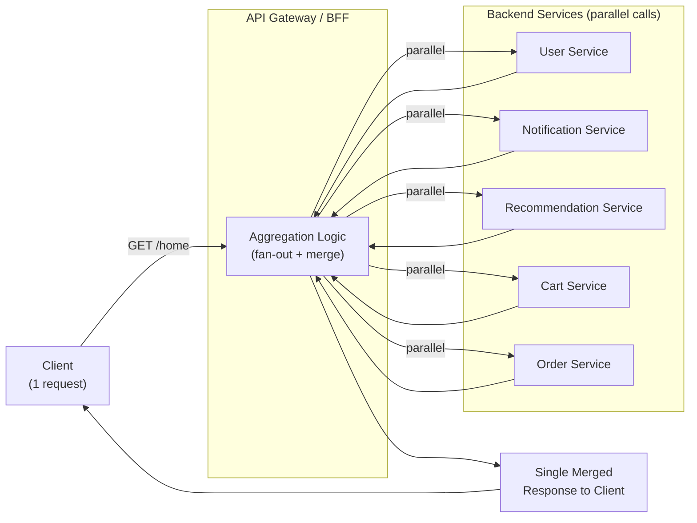

# 🔀 Gateway Aggregation Pattern

> [!abstract] TL;DR
> The gateway fans out a single client request to multiple backend services in parallel, waits for all responses, merges them into one payload, and returns a single response to the client. One round trip replaces N round trips — dramatically cutting page-load latency on chatty interfaces.

## Intent

Use a gateway or aggregation layer to combine multiple individual backend service requests into a single client-facing request, reducing network round trips and hiding service decomposition from clients.

---

## Problem It Solves

When a UI page needs data from multiple [[Microservices|microservices]], the naive approach makes a separate API call for each:

```
Mobile app loads home page:
GET /api/user-profile          → User Service     (80ms)
GET /api/notifications          → Notif Service   (60ms)
GET /api/recommendations        → ML Service      (200ms)
GET /api/cart                   → Cart Service    (70ms)
GET /api/recent-orders          → Order Service   (90ms)
```

If these calls happen sequentially, total latency = 500ms **plus** each call's network RTT overhead. On mobile (50ms RTT per call), that's 500ms + 5×50ms = 750ms just for one page.

Problems with chatty client-service interfaces:
- **High round-trip latency** — each HTTP request incurs setup cost (connection, TLS handshake on HTTP/1.1)
- **Mobile/edge clients suffer most** — high latency links amplify per-request overhead
- **Brittle client code** — client must know which services exist, their endpoints, and how to merge their data
- **Backend refactoring breaks clients** — splitting one service into two requires client code changes

---

## Solution / How It Works

The gateway receives one request from the client, fans out to multiple backend services **in parallel**, and returns one aggregated response. Backend service decomposition is invisible to the client.



**Latency improvement:**
- Sequential: 80 + 60 + 200 + 70 + 90 = **500ms**
- Parallel: max(80, 60, 200, 70, 90) = **200ms** (gated by slowest service)
- Round-trip savings: 4 fewer round trips to mobile client

**Response merging strategies:**

| Strategy | Behavior | Use When |
|----------|----------|---------|
| Wait-all | Return only when all services respond | All data is required on the page |
| Best-effort | Return available data; null/empty for slow/failed services | Non-critical services (recommendations) |
| Timeout + partial | Wait up to N ms; include whatever responded | Strict latency budgets |
| Prioritized | Critical services block response; optional services best-effort | Fold-above vs fold-below content |

---

## When to Use

- Page or screen requires data from 3+ microservices to render
- Mobile clients on high-latency connections where each round trip is expensive
- Hiding the number and decomposition of backend services from clients (reduces coupling)
- Implementing a [[BFF_Pattern|Backend-for-Frontend (BFF)]] layer that tailors data to each client type (mobile BFF vs web BFF)
- GraphQL gateway aggregating multiple REST or gRPC backends into one unified schema
- Replacing an over-chatty REST API with a single-call aggregated endpoint

---

## When NOT to Use

- Client requires only one backend service — no fan-out needed
- Services have hard dependencies (B's response depends on A's result) — cannot parallelize; use orchestration instead
- All required services must succeed or the response is useless — partial results create confusing UX
- Aggregation logic is complex business logic — the gateway should be dumb orchestration, not a service
- Gateway becomes a hotspot aggregating every possible combination — use GraphQL or a dedicated BFF service instead

---

## Real-World Example

**Netflix Home Page API:**
Netflix's home page displays: user info, continue watching, trending, personalized rows, notifications, and account status. Each comes from a different microservice. Netflix's API gateway fans out to ~20+ microservices in parallel, with a strict 250ms timeout. Services that don't respond in time return empty arrays — the page renders with whatever data arrived. This "best-effort aggregation" means a slow recommendation service never delays showing the user's continue-watching list.

**GraphQL Federation (Apollo):**
Apollo Federation composes multiple GraphQL subgraphs (User subgraph, Product subgraph, Order subgraph) into a single federated schema. A client sends one GraphQL query; Apollo's query planner determines which subgraphs to call, fans out in parallel, and stitches the results into a single response. The client never knows it's talking to multiple services.

**React page with Gateway Aggregation (BFF):**
```
Client: GET /bff/home-page
BFF (Node.js):
  const [user, cart, recs, orders] = await Promise.all([
    userService.getProfile(userId),
    cartService.getCart(userId),
    mlService.getRecommendations(userId),
    orderService.getRecentOrders(userId, limit=5)
  ]);
  return { user, cart, recommendations: recs, recentOrders: orders };
```

---

## Trade-offs

| Benefit | Drawback |
|---------|----------|
| Reduces client round trips from N to 1 | Aggregation layer is now in the critical path — must be highly available |
| Parallel fan-out cuts latency to slowest-service time (not sum) | Failure isolation is harder — one service failure can fail the whole aggregated response |
| Hides backend service decomposition from clients | Aggregation logic can become complex — risk of it accumulating business logic |
| Single integration point for client teams | Adds a network hop between client and aggregation layer |
| Enables BFF pattern — different aggregations per client type | Caching aggregated responses is complex (each component has its own TTL) |
| Simplifies client code — one call, one response | Schema evolution — adding a new service means updating the aggregation contract |

---

## Implementation Considerations

1. **Always use parallel fan-out** — `Promise.all()` in Node.js, `CompletableFuture.allOf()` in Java, `asyncio.gather()` in Python. Sequential fan-out defeats the purpose.
2. **Set per-service timeouts** — don't let one slow service hold up the entire response. Set aggressive timeouts (e.g., 200ms for non-critical services) and return partial data.
3. **Design for partial failure** — define which services are "critical" (response is empty/error if they fail) and which are "optional" (return null/empty array gracefully if they fail or time out). Never let a recommendation service failure break the checkout flow.
4. **Caching aggregated responses** — cache the full aggregated response only if all components have the same or compatible staleness tolerance. Alternatively, cache each service's response independently in the aggregation layer.
5. **Avoid aggregation of aggregations** — don't call BFF from BFF from BFF. Keep the aggregation one level deep.
6. **Correlate errors back to source services** — when an aggregated response has missing data, the client should be able to see (via response metadata or logs) which upstream service failed, for debugging.
7. **Consider GraphQL for complex aggregation** — if aggregation shapes vary per client query, GraphQL's declarative aggregation model (each client specifies exactly what fields they need) is more maintainable than hardcoded BFF aggregations.

---

## Common Pitfalls

- **Sequential fan-out** — calling services one after another inside the aggregation layer; total latency becomes the sum instead of the max. Always parallelize independent calls.
- **No timeout on individual service calls** — one slow upstream service (e.g., a cold ML recommendation service taking 5s) holds the entire aggregated response. Set aggressive, independent timeouts.
- **Business logic creep** — aggregation layer starts making decisions (if user has premium, include X; else include Y). This is business logic that belongs in a service, not in infrastructure.
- **Monolithic BFF** — one BFF that aggregates for all client types (mobile, web, TV, third-party) becomes overloaded and unmanageable. Create separate BFFs per client type or use GraphQL.
- **Not handling partial failures gracefully** — returning a 500 when the recommendation service is slow causes the whole page to fail. Return a 200 with empty `recommendations: []` instead.
- **Coupling aggregation contracts to service schemas** — when a backend service changes its response shape, it breaks the aggregation layer. Use anti-corruption mapping inside the BFF.

---

## Related Concepts

- [[_MOC_Cloud_Design_Patterns|↑ Section MOC]]
- [[API_Gateway]] — the platform hosting aggregation logic (or a dedicated BFF service)
- [[Gateway_Routing]] — companion: routing determines which backend to send to; aggregation fans out to multiple
- [[Gateway_Offloading]] — companion: offloading handles cross-cutting concerns; aggregation handles data merging
- [[Microservices]] — the architectural style that creates the need for aggregation (services are decomposed)
- [[Circuit_Breaker]] — should be applied to each upstream call within the aggregation to prevent cascade failures
- [[Materialized_View]] — alternative approach: pre-aggregate data server-side at write time so reads are already merged

---

## Review Questions

1. **A mobile app makes 8 separate API calls to load the home screen. You are asked to implement Gateway Aggregation. Walk through: how you parallelize the calls, how you set timeouts, how you handle 3 of the 8 services being "critical" vs. "optional", and what the response shape looks like when 2 optional services time out.**

2. **What is the relationship between Gateway Aggregation and the BFF (Backend for Frontend) pattern? Why might you create separate BFFs for mobile and web clients rather than a single aggregation layer, and what problems does this solve?**

3. **Compare GraphQL Federation to a handcoded BFF aggregation layer. In what scenarios is GraphQL's declarative aggregation model superior, and when does a handcoded BFF offer advantages?**

---

## Sources

- [Microsoft Azure: Gateway Aggregation Pattern](https://learn.microsoft.com/en-us/azure/architecture/patterns/gateway-aggregation)
- [Netflix Tech Blog: Optimizing the Netflix API](https://netflixtechblog.com/optimizing-the-netflix-api-5c9ac715cf19)
- [Apollo GraphQL Federation](https://www.apollographql.com/docs/federation/)

#SystemDesign #CloudDesignPatterns #DesignAndImplementation #GatewayAggregation #BFF #Microservices #LatencyOptimization
