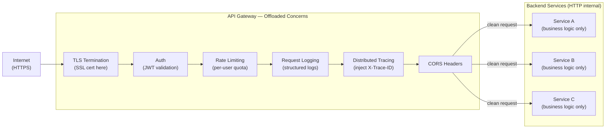

# ⚙️ Gateway Offloading Pattern

> [!abstract] TL;DR
> Move shared, cross-cutting infrastructure concerns (SSL termination, auth, [[Rate_Limiting|rate limiting]], logging, tracing) from every individual [[Microservices|microservice]] into the [[API_Gateway|API gateway]]. Services receive pre-processed, already-authenticated requests and focus purely on business logic — no boilerplate duplication.

## Intent

Offload shared non-business functionality from individual backend services to an API gateway, ensuring consistent cross-cutting policy enforcement without code duplication across services.

---

## Problem It Solves

In a microservices architecture, every service independently needs to handle a set of cross-cutting concerns:

- **SSL/TLS termination** — every service needs a cert, a TLS library, cert rotation logic
- **[[Authentication_and_Authorization|Authentication]]** — every service must validate JWT tokens, check expiry, verify signatures
- **Rate limiting** — every service needs rate-limit logic and shared state (Redis) to track quotas
- **Request logging** — every service must log incoming requests in a consistent format
- **Distributed tracing** — every service must propagate and create trace spans
- **CORS headers** — every public service must handle preflight OPTIONS requests
- **Compression** — every service must gzip responses

The result without offloading:
- The same code reimplemented (or the same library wired up) in dozens of services
- Inconsistent behavior when one service's rate-limiting logic differs from another's
- Security gaps when a new service forgets to add authentication middleware
- Update burden — changing the JWT library requires updating every service

---

## Solution / How It Works

The gateway sits at the network perimeter and executes cross-cutting logic **once** before forwarding clean, processed requests to backend services. Services receive requests that are already authenticated, rate-checked, traced, and TLS-terminated.



**What to offload vs. what stays in the service:**

| Concern | Offload to Gateway? | Reason |
|---------|-------------------|--------|
| SSL/TLS termination | YES | Cert management centralized; internal traffic can be plain HTTP |
| JWT signature validation | YES | Stateless verification; same logic for all services |
| Basic RBAC (role from JWT) | YES | Role claim extracted from token; no domain knowledge needed |
| Fine-grained authorization | NO | "Can user X delete order Y?" requires domain data from service |
| Rate limiting (per API key) | YES | Shared quota state; consistent enforcement |
| Request/response logging | YES | Uniform format; no service code needed |
| Distributed trace propagation | YES | Inject `X-Trace-ID`; services add spans internally |
| CORS preflight | YES | Static header policy; no business logic |
| Response compression (gzip) | YES | Content-agnostic; applied universally |
| Business data validation | NO | Domain-specific; service owns schema |
| Data transformation | Sometimes | Simple protocol translation yes; complex mapping no |

---

## When to Use

- Multiple microservices sharing the same cross-cutting concerns (auth, logging, rate limiting)
- Teams building new services who should not be required to re-implement infrastructure boilerplate
- Enforcing consistent security policy across all services — one place to update when policy changes
- Reducing the blast radius of cross-cutting concern bugs (fix once in gateway, all services benefit)
- Migrating legacy services that have no modern auth middleware
- Regulatory compliance — ensure all traffic is logged and authenticated without trusting individual teams

---

## When NOT to Use

- Fine-grained business authorization (cannot be done without domain context)
- Complex data transformations that require business knowledge
- Gateway becomes a bottleneck — if offloaded processing is too heavy, every request is affected
- Tight latency requirements where the offloading overhead is unacceptable (< 1ms SLAs)
- Simple single-service architectures where a gateway adds cost without benefit

---

## Real-World Example

**Kong API Gateway:**
Kong runs as a reverse proxy with a plugin architecture. Deploying Kong with the `jwt`, `rate-limiting`, and `http-log` plugins means every service behind Kong automatically gets JWT validation (with configurable key sets), per-consumer rate limits stored in Redis, and structured HTTP logs shipped to a logging backend — without a single line of code added to any service.

**AWS API Gateway Authorizers:**
AWS Lambda Authorizers sit in front of every API route. When a request arrives, API Gateway calls the Lambda Authorizer with the token. The authorizer validates the JWT and returns an IAM policy. API Gateway caches the auth decision (TTL configurable) and forwards the request with user context injected as headers. Services downstream receive `X-User-Id` and `X-User-Role` headers already set.

**Nginx `auth_request` module:**
```nginx
location /api/ {
    auth_request /validate-token;   # calls internal auth endpoint
    auth_request_set $user_id $upstream_http_x_user_id;
    proxy_set_header X-User-Id $user_id;
    proxy_pass http://backend;
}
```

---

## Trade-offs

| Benefit | Drawback |
|---------|----------|
| Eliminates cross-cutting code duplication across services | Gateway becomes a critical path for every request — must be highly available |
| Consistent policy enforcement — one update applies everywhere | Gateway can become a bottleneck if offloaded logic is CPU-intensive |
| New services automatically inherit all gateway policies | Complex offloading logic makes gateway harder to test and reason about |
| Security gaps are prevented — auth cannot be forgotten | Fine-grained auth still needs to move to the service level anyway |
| Reduces onboarding burden for new service teams | Gateway vendor lock-in — deep reliance on Kong plugins or AWS API GW features |
| Centralized audit log of all traffic | Debugging is harder — a request failure could be gateway-side or service-side |

---

## Implementation Considerations

1. **Auth caching** — JWT validation involves cryptographic verification on every request. Cache the validation result (by token hash or JTI claim) with a TTL shorter than the token's expiry to reduce CPU overhead.
2. **Pass user context downstream as headers** — after the gateway validates the JWT, extract claims (`user_id`, `roles`) and inject them as internal headers (`X-User-Id: 123`, `X-User-Roles: admin`). Services trust these headers (internal network only — block them from external access).
3. **Rate limit storage** — per-user or per-API-key rate limits require shared state. Use Redis behind the gateway cluster so all gateway instances share quotas. Without shared state, rate limits are per-instance (easily bypassed by hitting different gateway pods).
4. **Gateway high availability** — the gateway is now in the critical path. Deploy at minimum 3 instances across AZs. Use health checks and auto-replace. Plan for gateway version upgrades with zero downtime.
5. **Separate concerns into independent middleware units** — each concern (auth, rate-limit, logging) should be independently configurable and disableable per route. A gateway that tightly couples all concerns is harder to maintain.
6. **Distinguish network-layer from application-layer offloading** — TLS termination and compression are true network-layer offloads. Auth and rate limiting are application-layer. A [[Service_Mesh|service mesh]] handles network-layer offloading at a finer granularity; gateway handles application-layer.

---

## Common Pitfalls

- **Offloading business logic into the gateway** — rate-limiting business rules that depend on subscription tier or account balance belong in a service, not the gateway. Gateways should offload infrastructure concerns, not make business decisions.
- **Missing internal network trust boundary** — offloading auth to the gateway only works if internal service-to-service traffic also goes through the gateway or uses mutual TLS. If services can be called directly (bypassing the gateway), auth offloading is security theater.
- **No fallback when gateway is down** — if the gateway handles auth and it goes down, all services become inaccessible. Design circuit breakers and fallback behavior.
- **Over-loading the gateway** — adding response transformation, complex aggregation, and business validation to the gateway turns it into a new monolith.
- **Ignoring gateway latency contribution** — each plugin/middleware in the gateway chain adds latency. Measure gateway-added latency via p99 and p999 percentiles; remove unnecessary plugins from latency-sensitive routes.

---

## Related Concepts

- [[_MOC_Cloud_Design_Patterns|↑ Section MOC]]
- [[API_Gateway]] — the platform where this pattern is implemented (Kong, AWS API Gateway, Apigee, Nginx)
- [[Gateway_Routing]] — companion pattern: routing decides where requests go; offloading decides what happens to them before they arrive
- [[Rate_Limiting]] — one of the primary concerns offloaded to the gateway
- [[Authentication_and_Authorization]] — the most critical offloaded concern; validate JWT once at the gateway
- [[Service_Mesh]] — Istio/Linkerd also offloads concerns (mutual TLS, retries, tracing) but at the sidecar level, not the gateway level; they complement each other
- [[Gateway_Aggregation]] — third gateway companion: aggregate multiple service responses into one

---

## Review Questions

1. **Your microservices architecture has 12 services, each with a custom JWT validation middleware. The security team updates the JWT signing algorithm. How many services need to be updated? Now redesign with Gateway Offloading — how does the update process change, and what risk does it eliminate?**

2. **Explain why fine-grained authorization (e.g., "can user 42 edit order 789?") cannot be offloaded to the API gateway, even though basic role-based auth can. What is the fundamental difference, and how should fine-grained authz be implemented in a microservices system?**

3. **A Kong API Gateway handles JWT validation via a plugin. Under heavy load, the gateway's CPU spikes to 100% during JWT verification. What are three techniques to reduce the CPU cost of JWT validation at the gateway level?**

---

## Sources

- [Microsoft Azure: Gateway Offloading Pattern](https://learn.microsoft.com/en-us/azure/architecture/patterns/gateway-offloading)
- [Kong API Gateway Plugin Hub](https://docs.konghq.com/hub/)
- [AWS API Gateway Lambda Authorizers](https://docs.aws.amazon.com/apigateway/latest/developerguide/apigateway-use-lambda-authorizer.html)

#SystemDesign #CloudDesignPatterns #DesignAndImplementation #GatewayOffloading #APIGateway #CrossCuttingConcerns #Security
