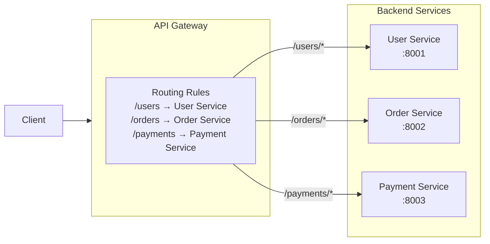

# 🚦 Gateway Routing Pattern

> [!abstract] TL;DR
> A single gateway endpoint routes incoming requests to the correct backend service based on request properties (URL path, hostname, headers, HTTP method). Clients see one address; the gateway handles the map of "what goes where" — hiding backend topology and enabling flexible traffic management.

## Intent

Use a single entry-point gateway to route requests to one or more backend services based on configurable request properties, decoupling client addressing from backend service topology.

---

## Problem It Solves

In a [[Microservices|microservices]] architecture, services are decomposed by domain (User Service, Order Service, Payment Service). Without a gateway, clients face:

- **Multiple endpoints to know and maintain** — clients must hardcode or discover each service's address
- **Backend changes break clients** — refactoring services (splitting, merging, renaming) requires updating all clients
- **No centralized routing control** — cannot do A/B testing, canary deployments, or version routing without client-side logic
- **Cross-origin issues** — browser clients must deal with CORS for every service domain separately
- **No uniform entry point for security policies** — each service must independently handle its own exposure

---

## Solution / How It Works

All clients connect to a single gateway address. The gateway inspects request properties and forwards to the appropriate backend service based on routing rules.



**Routing rule types:**

| Rule Type | Condition | Use Case |
|-----------|-----------|---------|
| Path-based | `/api/v1/users` → User Service | Standard microservice routing |
| Host-based | `mobile.api.com` vs `web.api.com` | [[BFF_Pattern|BFF]] pattern (separate backends per client type) |
| Header-based | `X-Client-Version: 2.0` → v2 service | Feature flag routing, gradual migration |
| Method-based | `GET /items` → read replica, `POST /items` → write primary | CQRS at the gateway level |
| Weight-based | 90% → v1, 10% → v2 | Canary deployments, A/B testing |
| Query param | `?debug=true` → debug service instance | Diagnostic routing |

**Traffic management capabilities built on routing:**
- **Version routing** — `/v1/users` → `user-service:v1`; `/v2/users` → `user-service:v2` — enables zero-downtime API versioning
- **Canary deployments** — 5% of traffic → new version; observe error rates; gradually increase percentage
- **Blue/green switching** — flip 100% from blue to green at the routing layer; instant rollback by flipping back
- **Geographic routing** — route EU requests to EU data-center services (combined with DNS)

---

## When to Use

- Microservices architecture where clients should not need to know individual service addresses
- Supporting multiple API versions simultaneously without code duplication
- Implementing canary deployments or A/B testing at the infrastructure level
- Providing a single secure perimeter around multiple backend services
- BFF (Backend for Frontend) pattern — route mobile and web clients to different backend variants
- Migrating a monolith to microservices — route some paths to new services, others to the monolith

---

## When NOT to Use

- Single-service architecture — routing overhead adds latency for zero gain
- Services that require extremely low latency and cannot afford gateway hop overhead
- When services have radically different protocols that the gateway cannot proxy (custom TCP, UDP)
- Gateway becomes a bottleneck — if throughput exceeds gateway capacity; plan for gateway horizontal scaling
- Complex routing logic that encodes business rules — routing should be structural, not business-logic-aware

---

## Real-World Example

**Netflix Zuul / Spring Cloud Gateway:**
Netflix pioneered gateway routing at scale. Zuul routes traffic across hundreds of backend microservices based on request path and headers. Traffic for `/api/streaming` goes to the streaming service; `/api/search` goes to the search service. Zuul also enables canary deployments by routing a percentage of specific user cohorts to new service versions.

**AWS API Gateway + ALB Routing:**
AWS API Gateway routes based on path, method, and stage (`/prod/users` vs `/dev/users`). Application Load Balancer (ALB) provides path-based routing at Layer 7 without a full API gateway, routing `/images/*` to the image service and `/api/*` to the application tier.

**Nginx path-based routing:**
```nginx
location /api/users/ {
    proxy_pass http://user-service:8001;
}
location /api/orders/ {
    proxy_pass http://order-service:8002;
}
```

---

## Trade-offs

| Benefit | Drawback |
|---------|----------|
| Single endpoint for all clients — simple client configuration | Gateway is a single point of failure (mitigated by making it highly available) |
| Backend services can be refactored without breaking clients | Additional network hop adds latency (typically 1-5ms) |
| Enables canary deployments and version routing centrally | Gateway configuration can become complex as routing rules multiply |
| Centralized access point for security policy enforcement | Gateway must be scaled independently as traffic grows |
| Decouples client API contracts from service implementation | Routing rules as config can drift from reality if not audited |
| Enables zero-downtime API versioning | Header/cookie-based routing adds client-side complexity |

---

## Implementation Considerations

1. **Make the gateway stateless and horizontally scalable** — the gateway itself should not hold session state; it should scale horizontally behind a load balancer.
2. **Separate routing config from deployment** — use infrastructure-as-code (Terraform, Helm) for gateway routing rules so they are version-controlled and auditable.
3. **Define routing rule priority** — when multiple rules match a request (e.g., `/api/users/orders` could match `/api/users` or `/api/orders`), the gateway must have a deterministic priority order (longest prefix wins, or explicit priority values).
4. **Canary deployment infrastructure** — track which users are in the canary group (via cookie, header, or consistent hashing on user ID) to ensure a user doesn't get routed to different versions on subsequent requests.
5. **Circuit breaker per route** — if a backend service is unhealthy, the gateway should [[Circuit_Breaker|circuit-break]] that route rather than letting requests pile up, returning a 503 immediately.
6. **Timeout configuration per route** — different services have different SLAs; a payment service may tolerate 30s timeouts, a search service should fail fast at 500ms.

---

## Common Pitfalls

- **Single gateway becomes a monolith** — routing rules accumulate until the gateway becomes a complex configuration nightmare. Periodically audit and simplify.
- **Business logic in routing rules** — routing rules should be structural (path prefix, header presence). When routing depends on database lookups or business state, you've moved business logic into infrastructure.
- **No gateway high availability** — running a single gateway instance without redundancy creates a single point of failure worse than the problem it solves. Always deploy gateways in multiple AZs.
- **Stale routing config** — service addresses change (Kubernetes pod IPs, ECS task IPs) but routing rules reference hardcoded addresses. Use service discovery integration (Consul, Kubernetes Service DNS) instead of IP addresses.
- **Missing request tracing headers** — gateway should inject `X-Request-ID` and `X-Trace-ID` on every request passing through, enabling distributed tracing across backend services.

---

## Related Concepts

- [[_MOC_Cloud_Design_Patterns|↑ Section MOC]]
- [[API_Gateway]] — the implementation platform for this pattern (AWS API Gateway, Kong, Nginx, Envoy)
- [[Load_Balancers]] — Layer 7 load balancers implement routing; gateway routing extends this with richer rule sets
- [[Microservices]] — the architectural style that necessitates gateway routing
- [[Gateway_Offloading]] — companion pattern: once routed, the gateway also offloads cross-cutting concerns
- [[Gateway_Aggregation]] — companion pattern: gateway can aggregate responses from multiple backends
- [[Service_Discovery]] — gateway needs to know live service addresses; service discovery provides this dynamically

---

## Review Questions

1. **You are migrating a Rails monolith to microservices. The first microservice extracted is the User Service. How would you configure gateway routing to route `/api/users/*` to the new User Service while sending everything else to the monolith? What does a rollback look like if the User Service has bugs?**

2. **Design a canary deployment strategy using Gateway Routing for a payment service upgrade. How do you ensure a given user consistently gets routed to the same version across multiple requests in the same session? What metric thresholds trigger full cutover vs. rollback?**

3. **What is the difference between Gateway Routing and a simple Layer 4 Load Balancer? In what scenarios is the richer Layer 7 routing the gateway provides necessary, and what is the overhead cost?**

---

## Sources

- [Microsoft Azure: Gateway Routing Pattern](https://learn.microsoft.com/en-us/azure/architecture/patterns/gateway-routing)
- [Netflix Tech Blog: Zuul Architecture](https://netflixtechblog.com/announcing-zuul-edge-service-in-the-cloud-ab3af5be08ee)
- [AWS API Gateway Developer Guide](https://docs.aws.amazon.com/apigateway/latest/developerguide/)

#SystemDesign #CloudDesignPatterns #DesignAndImplementation #GatewayRouting #APIGateway #Microservices #TrafficManagement
