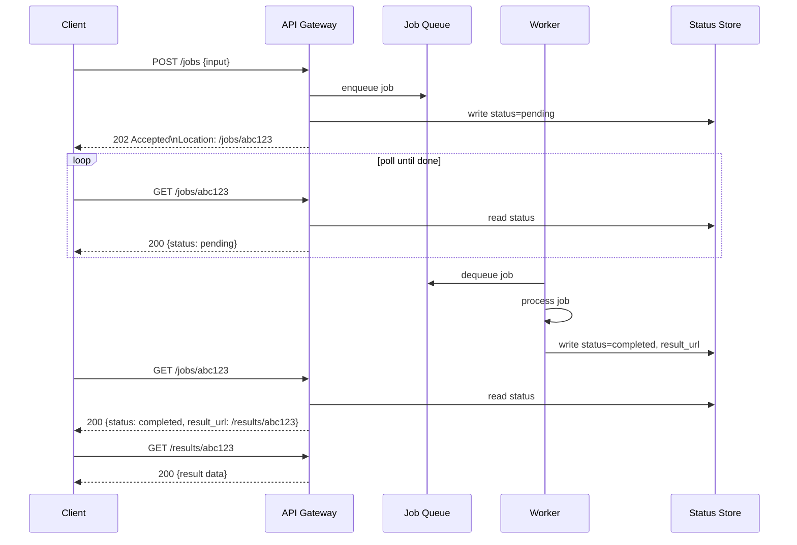

# ⏳ Async Request-Reply

> [!abstract] TL;DR
> Decouple long-running backend operations from the frontend using the HTTP 202 Accepted pattern: the client submits a job, gets an immediate 202 + a polling URL, and checks the status endpoint until the job completes — or registers a webhook for a push notification instead of polling.

## Intent

Decouple a frontend request from a long-running backend operation by returning an immediate acknowledgement with a status-polling endpoint, allowing the client to check progress without holding an open HTTP connection.

## Problem It Solves

HTTP is a synchronous protocol — the client waits for the server's response. Standard HTTP timeouts are typically 30–60 seconds for load balancers and API gateways. Many operations take longer:

- Video transcoding: 5–20 minutes.
- Large report generation: 2–10 minutes.
- ML model training: hours.
- Batch data export: minutes to hours.
- Third-party payment processing: variable, can exceed 1 minute.

If a server holds an open HTTP connection for the duration, several problems arise:
- Load balancers and API gateways time out and return 504 Gateway Timeout to the client.
- Server threads are blocked, consuming resources for the entire duration.
- Network interruptions cause the client to lose the result even if processing succeeded.
- Scaling the frontend doesn't help — long-held connections exhaust thread pools.

## Solution / How It Works

Split the operation into three phases:

1. **Submit:** client sends a `POST` request. Server enqueues the work and immediately responds with `HTTP 202 Accepted` + a `Location` header pointing to a status endpoint. The response body contains the job ID.
2. **Poll:** client periodically `GET`s the status URL. Server returns the current job status (`pending`, `processing`, `completed`, `failed`) and, when complete, a link to the result.
3. **Retrieve:** when status is `completed`, client fetches the result (from the status response body or from a separate result URL).

**Alternative to polling — Webhooks (push model):** the client registers a callback URL in the initial POST. When the job completes, the server POSTs the result to that URL. No polling needed; better for server-initiated delivery.



**HTTP response contract:**

```
POST /reports                 → 202 Accepted
                                Location: /reports/job-uuid
                                Retry-After: 30

GET /reports/job-uuid         → 200 OK
                                {
                                  "jobId": "job-uuid",
                                  "status": "processing",
                                  "progress": 42,
                                  "estimatedCompletionAt": "2026-07-26T11:05:00Z"
                                }

GET /reports/job-uuid (done)  → 200 OK
                                {
                                  "jobId": "job-uuid",
                                  "status": "completed",
                                  "resultUrl": "/reports/job-uuid/result",
                                  "completedAt": "2026-07-26T11:04:47Z"
                                }

GET /reports/job-uuid/result  → 200 OK  (the actual report data)
```

**`Retry-After` header:** tells the client how many seconds to wait before polling again. Prevents clients from hammering the status endpoint every 100ms.

## When to Use

- Operations that take longer than HTTP timeout thresholds (30–120 seconds).
- Clients need to submit work and check back later without holding an open connection.
- The server cannot guarantee a response within a synchronous window (dependency on third-party APIs, heavy computation, batch processing).
- Multiple clients may want to observe the same job's progress.
- Mobile or browser clients that may go offline and reconnect later to retrieve results.

## When NOT to Use

- Operations complete in under 5 seconds — synchronous response is simpler and provides a better UX.
- The client cannot poll (fire-and-forget) and does not support webhooks.
- The result must be streamed to the client as it is produced (use Server-Sent Events or WebSockets instead).
- The polling endpoint introduces unacceptable load (millions of jobs × poll frequency = high QPS on status endpoint; use webhooks or SSE in this case).

## Real-World Example

**GitHub Actions API:** `POST /repos/{owner}/{repo}/actions/workflows/{id}/dispatches` triggers a workflow and returns `204 No Content` (acknowledging the dispatch). The client then polls `GET /repos/{owner}/{repo}/actions/runs?workflow_id={id}` to track run status. GitHub returns `status: queued → in_progress → completed`.

**AWS Batch:** submit a job via `aws batch submit-job` — returns `jobId`. Poll `aws batch describe-jobs --jobs {jobId}` to get `SUBMITTED → PENDING → RUNNABLE → STARTING → RUNNING → SUCCEEDED/FAILED`.

**Stripe payment processing:** `POST /v1/payment_intents` returns immediately with a `PaymentIntent` object in `requires_payment_method` or `processing` state. The client polls or registers a webhook. Stripe sends `payment_intent.succeeded` webhook when the payment completes asynchronously.

## Trade-offs

| Benefit | Drawback |
|---|---|
| No HTTP timeout issues — server responds immediately | Client must implement polling logic (complexity) |
| Server threads not held open for long-running work | Polling adds load to the status endpoint (N jobs × poll frequency) |
| Network interruptions don't lose the result | Increased roundtrip latency vs. synchronous if job completes quickly |
| Naturally works with [[Queue_Based_Load_Leveling]] for the backend | Job state must be persisted durably for status queries |
| Clients can disconnect and reconnect to retrieve results | Webhook variant requires the client to expose a public HTTPS endpoint |

## Implementation Considerations

- **[[Idempotent_Operations|Idempotent]] job submission:** provide an idempotency key on the `POST` so that retrying the submit (e.g., client times out waiting for 202) does not create duplicate jobs.
- **Job status TTL:** status records in the database should expire after a reasonable period (e.g., 7 days). Without TTL, the status store grows unboundedly.
- **`Retry-After` header:** always include this on the 202 response and on 200 polling responses with status `pending`/`processing`. It tells clients when to poll next and prevents thundering-herd polling.
- **Webhook reliability:** if using webhooks, implement retry with exponential backoff when the client's callback URL returns an error. Consider a webhook delivery log for debugging.
- **Status endpoint caching:** cache the status response (especially for `completed`) at the CDN or API layer so repeated client polls don't hit the database.
- **Result storage:** for large results, store them in object storage (S3) and provide a presigned download URL in the completed status response. Combine with [[Claim_Check]] pattern.

## Common Pitfalls

- **No `Retry-After` header:** clients default to polling every 100ms, hammering the status endpoint with millions of requests under load.
- **Non-idempotent job submission:** a client retries a timed-out POST and creates duplicate jobs — duplicate charges, duplicate reports, duplicate emails.
- **Infinite job retention:** job status records accumulate forever in the database without a TTL or cleanup job.
- **Missing error state in status response:** clients poll indefinitely if the status can only be `pending`, `processing`, or `completed` — add `failed` with an error message.
- **Webhook without retry:** the server fires the webhook once; if the client's server is momentarily down, the notification is lost and the client never knows the job completed.
- **Result URL that expires before client retrieves it:** a presigned S3 URL that expires in 10 minutes but the client only polls every 15 minutes — client gets 403 on result retrieval.

## Related Concepts

- [[_MOC_Cloud_Design_Patterns|↑ Section MOC]]
- [[REST]] — the HTTP protocol this pattern extends with the 202 pattern
- [[Webhooks]] — the push alternative to polling in this pattern
- [[Queue_Based_Load_Leveling]] — the backend mechanism that enables immediate 202 responses
- [[Message_Queues]] — the job queue underlying the async processing
- [[Claim_Check]] — for returning large results via object storage reference
- [[Saga_Pattern]] — for workflows where the long-running operation spans multiple services

## Review Questions

1. A client submits a `POST /reports` and receives `202 Accepted + Location: /reports/job-456`. The client then polls every 5 seconds. The report takes 3 minutes to generate. How many polling requests does the client make, and how does adding the `Retry-After: 30` header change this? Calculate the request reduction.

2. A user on a mobile app submits a video for transcoding. The phone goes offline for 20 minutes and comes back. How does Async Request-Reply handle this scenario better than a long-lived WebSocket connection, and what specific design choices make this robust?

3. Your status endpoint is receiving 50,000 requests/second from clients polling active jobs. The status database is overwhelmed. Propose two architectural changes to reduce database load on the status endpoint without breaking the client contract.

## Sources

- [Microsoft Azure Architecture Center — Asynchronous Request-Reply pattern](https://learn.microsoft.com/en-us/azure/architecture/patterns/async-request-reply)
- [IETF RFC 7231 — HTTP 202 Accepted semantics](https://datatracker.ietf.org/doc/html/rfc7231#section-6.3.3)
- [GitHub REST API — Workflow runs](https://docs.github.com/en/rest/actions/workflow-runs)
- [Stripe Webhooks documentation](https://stripe.com/docs/webhooks)

#SystemDesign #CloudDesignPatterns #Messaging #AsyncRequestReply #HTTP202 #Polling #Webhooks #REST
