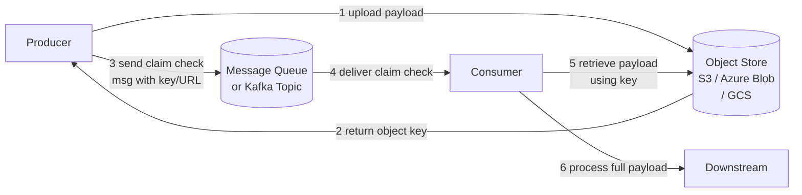

# 🎫 Claim Check

> [!abstract] TL;DR
> When a payload is too large for a message queue's size limit, store the payload in external blob/object storage and put only a lightweight reference (the "claim check") in the message. Consumers retrieve the full payload using the reference when they need to process it.

## Intent

Separate a large message payload from its reference, storing the payload in external storage and transmitting only a small token through the messaging infrastructure, to overcome message size limits and reduce messaging system load.

## Problem It Solves

Every major messaging system imposes a maximum message size:

| System | Default Max Message Size |
|---|---|
| AWS SQS | 256 KB |
| Azure Service Bus | 1 MB (256 KB Standard tier) |
| Apache [[Kafka]] | 1 MB (configurable, but large messages hurt performance) |
| [[RabbitMQ]] | No hard limit, but large messages exhaust memory quickly |
| Google Pub/Sub | 10 MB |

Many real-world payloads exceed these limits: high-resolution images (5–20 MB), video files (100 MB+), large XML/JSON documents (2–50 MB), PDF reports, and multi-record CSV exports. Simply increasing the message size limit has second-order effects: broker memory is consumed, throughput drops, replication is slower, and other small messages are delayed.

## Solution / How It Works

Treat the message bus like a luggage claim at an airport: you don't carry a heavy suitcase through security — you check it in and carry only the claim ticket. The ticket gets you the suitcase at the other end.



**Claim check payload (the message on the queue):**
```json
{
  "messageId": "msg-uuid-123",
  "correlationId": "order-456",
  "payloadRef": {
    "bucket": "processing-payloads",
    "key": "invoices/2026/07/invoice-456.pdf",
    "size": 4200000,
    "contentType": "application/pdf"
  },
  "metadata": {
    "uploadedAt": "2026-07-26T10:00:00Z",
    "expiresAt": "2026-07-27T10:00:00Z"
  }
}
```

**Two variants:**

| Variant | Upload timing | Best for |
|---|---|---|
| Producer-initiated upload | Producer uploads first, then enqueues claim check | Producer controls payload lifecycle |
| Consumer-initiated download | Broker or interceptor stores payload, message contains auto-generated ref | Transparent to producer (message interceptor pattern) |

**Presigned URLs:** instead of an object key, the claim check can contain a time-limited presigned URL. The consumer downloads directly without needing AWS credentials. The URL expires after the expected processing window, reducing the risk of stale payload access.

## When to Use

- Payloads regularly exceed the message queue's size limit.
- Messaging infrastructure cost is a concern — large payloads increase replication, storage, and transfer costs in the broker.
- The same large payload is sent to multiple consumers (fan-out) — store once in object storage, reference in N messages instead of duplicating the payload N times.
- Payload contains sensitive data that should not travel through the message bus (the broker never holds the raw data).
- Processing of the payload is deferred and the consumer doesn't always need the full payload immediately.

## When NOT to Use

- Payloads are always small (well within queue limits) — the pattern adds latency and complexity for no benefit.
- Processing requires ultra-low latency — the extra object-storage read hop adds 10–200ms.
- Object storage availability must match message queue availability — if S3 goes down, consumers cannot process any messages.
- The consumer environment does not have access to the object storage system (different cloud, network-isolated).

## Real-World Example

**Document processing pipeline:** A legal firm uploads contracts (5–50 MB PDFs) via a web API. The API service:
1. Stores the PDF in S3 (`legal-docs/contracts/{id}.pdf`).
2. Enqueues a Kafka message with `{ contractId, s3Key, uploadedAt }`.
3. Returns HTTP 202 to the client.

A downstream NLP extraction service consumes the Kafka message, downloads the PDF from S3, runs entity extraction, and writes results to a database. The Kafka topic never holds PDF bytes — only 200-byte claim check JSON messages.

**Email with large attachments:** An email service stores attachments in Azure Blob Storage and sends a Service Bus message with the blob reference. The delivery worker downloads the attachment only when actually sending the email, and only to the SMTP relay — not through the Service Bus.

## Trade-offs

| Benefit | Drawback |
|---|---|
| Overcomes messaging system size limits | Adds a second I/O hop (object store write + read) — extra latency |
| Reduces broker memory, storage, and replication cost | Object store is an additional dependency; its failure blocks processing |
| Same payload can be referenced by multiple messages (fan-out) | Object lifecycle management (cleanup) must be explicit |
| Payload never sits in the queue broker — reduced exposure | Consumer must have permissions to object storage |
| Payload can be accessed by non-messaging systems via the same reference | Presigned URL expiry must outlast processing time |

## Implementation Considerations

- **Object lifecycle / TTL:** set an S3 lifecycle rule or Azure Blob TTL to automatically delete payloads after they are guaranteed to have been processed (e.g., after 7 days). Without this, object storage grows indefinitely.
- **Reference expiry vs. processing time:** if using presigned URLs, the URL must remain valid for the duration between message enqueue and consumer processing. Under heavy load, messages may wait hours in the queue — set URL expiry accordingly (e.g., 24 hours).
- **Consumer error handling:** if the consumer fails to download the payload (network error, object deleted prematurely), should it retry? Dead-letter? Design this explicitly.
- **Security:** the claim check reference (especially a presigned URL) is effectively a capability token. Treat it as a secret — encrypt the queue message at rest, and prefer object keys with server-side credential resolution over plain presigned URLs for sensitive data.
- **Atomic upload-and-enqueue:** the producer must upload to object storage before enqueueing the claim check. If the enqueue step fails after upload, the object is orphaned. Consider a cleanup job for orphaned objects older than N hours.

## Common Pitfalls

- **Premature object deletion:** an admin cleanup job deletes objects after 24 hours, but the queue has a 48-hour retention. Messages reference objects that no longer exist.
- **Presigned URL expiry too short:** URL is valid for 1 hour, but during a traffic spike, messages sit in the queue for 2 hours. Consumer receives a 403 Forbidden when downloading — message appears "processed" but payload was never retrieved.
- **No cleanup of orphaned objects:** producer uploads payload, then the application crashes before enqueueing. The object sits in S3 forever, accumulating cost.
- **Large object in hot-path:** using Claim Check for a 512 KB payload when SQS has a 256 KB limit is correct, but wrapping a 1 KB payload in Claim Check just to follow the pattern adds unnecessary latency.
- **Missing [[Dead_Letter_Queue|DLQ]] for download failures:** if object storage is temporarily unavailable, consumers fail. Without a DLQ and retry mechanism, messages are lost.

## Related Concepts

- [[_MOC_Cloud_Design_Patterns|↑ Section MOC]]
- [[Object_Storage]] — S3, Azure Blob, GCS — the payload store
- [[Message_Queues]] — the channel carrying the claim check reference
- [[Kafka]] — common pipe implementation; Kafka's 1 MB default limit is exactly why this pattern exists
- [[Queue_Based_Load_Leveling]] — often used alongside Claim Check in async processing pipelines
- [[Competing_Consumers]] — the consumer pattern that retrieves payloads using claim checks
- [[Dead_Letter_Queue]] — for handling consumer failure to retrieve the payload

## Review Questions

1. You implement Claim Check with presigned S3 URLs valid for 2 hours. During a Black Friday sale, your SQS queue backs up to a 6-hour processing delay. Describe exactly what happens to consumers and what two architectural changes fix this.

2. Compare storing large payloads directly in the message (by base64-encoding) versus using Claim Check for a system with 10,000 messages/second and an average payload of 2 MB. Quantify the impact on your Kafka broker.

3. A producer uploads a payload to S3 and then crashes before enqueueing the Kafka message. The S3 lifecycle policy deletes objects after 24 hours. Describe how you detect and clean up the orphaned object, and whether this is strictly necessary.

## Sources

- [Microsoft Azure Architecture Center — Claim-Check pattern](https://learn.microsoft.com/en-us/azure/architecture/patterns/claim-check)
- [Enterprise Integration Patterns — Claim Check](https://www.enterpriseintegrationpatterns.com/patterns/messaging/StoreInLibrary.html)
- [AWS S3 Presigned URLs documentation](https://docs.aws.amazon.com/AmazonS3/latest/userguide/using-presigned-url.html)

#SystemDesign #CloudDesignPatterns #Messaging #ClaimCheck #ObjectStorage #S3 #Kafka #LargePayload
