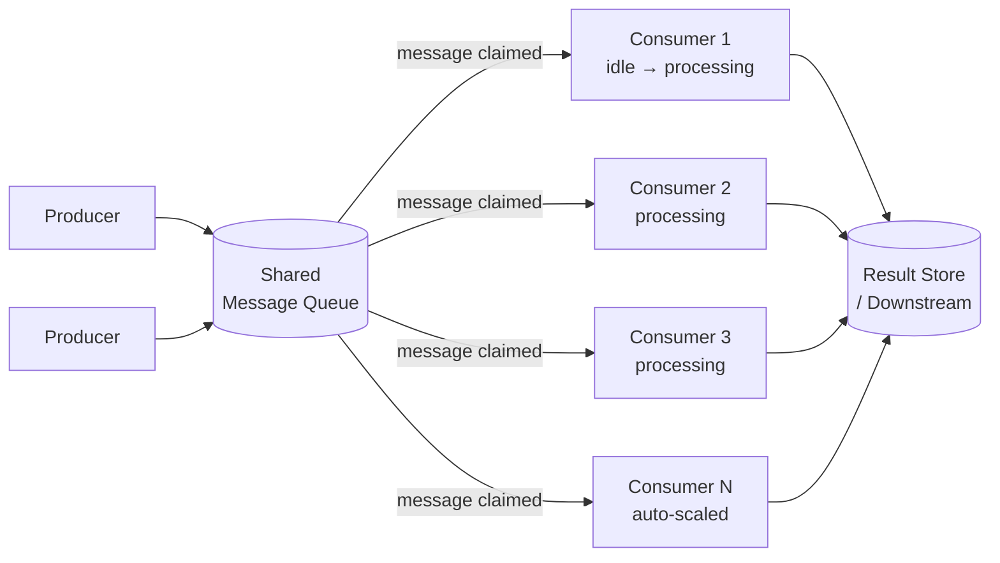

# 🏃 Competing Consumers

> [!abstract] TL;DR
> Multiple concurrent consumer instances all read from the same queue — whichever is free picks up the next message. This maximises throughput by parallelising processing while the queue ensures each message is processed exactly once (or at-least-once with idempotent handlers).

## Intent

Enable multiple concurrent consumers to process messages received on the same messaging channel to increase throughput, improve availability, and support horizontal scaling of message processing.

## Problem It Solves

A single consumer processing messages one-at-a-time creates a throughput ceiling: it can only process as fast as one machine allows. If messages arrive faster than one consumer can handle them, the queue grows without bound. When the consumer crashes, processing halts entirely.

Additionally, processing time per message may vary — some messages take 10ms, others take 2 seconds. A single-threaded consumer is blocked by slow messages while fast ones wait.

## Solution / How It Works

Multiple consumer instances all listen on the same queue. When a message arrives (or when a consumer is idle), the first free consumer claims it. The broker ensures only one consumer receives each message — consumers "compete" for messages.

**Message locking mechanism (visibility timeout):**

1. Consumer polls queue and receives message M.
2. Broker makes M **invisible** to all other consumers for the duration of the visibility timeout (SQS default: 30s).
3. Consumer processes M and **deletes** it from the queue on success.
4. If consumer crashes before deleting, M becomes **visible again** after timeout → another consumer picks it up.

This mechanism provides **at-least-once delivery**: a message is guaranteed to be processed at least once, but may be processed more than once if the consumer crashes after processing but before deleting.

**[[Kafka]] Consumer Groups:** Kafka's implementation assigns each partition to exactly one consumer in a group. Consumers within the group do not share messages within a partition — but multiple partitions allow parallelism. Adding more consumers than partitions is wasteful (excess consumers are idle).

| Queue System | Competing Consumer Mechanism |
|---|---|
| AWS SQS | Visibility timeout; multiple pollers claim different messages |
| [[RabbitMQ]] | Message acknowledgement; unacked messages requeue on consumer disconnect |
| Kafka | Consumer groups; partition-to-consumer assignment |
| Azure Service Bus | Message lock; competing receivers on same queue |

## When to Use

- High-throughput message processing where a single consumer cannot keep up.
- Processing time is variable — some messages are fast, some slow; parallel consumers absorb the variance.
- High availability is required — if one consumer crashes, others continue processing.
- Auto-scaling is desired: scale consumers out during peak load, in during quiet periods.
- Tasks are stateless and independent (each message can be processed without knowledge of others).

## When NOT to Use

- Messages must be processed in order — competing consumers break ordering within a partition/queue. Use [[Sequential_Convoy]] instead.
- Processing is inherently single-threaded due to shared mutable state that cannot be safely accessed concurrently.
- Message volume is very low — the complexity of multiple consumers is unnecessary.
- The downstream system cannot handle concurrent writes (e.g., a database with strict serialization requirements).

## Real-World Example

**AWS SQS + Lambda:** An S3 event triggers an SQS message when a file is uploaded. Lambda auto-scales from 0 to 1,000 concurrent executions based on SQS queue depth. Each Lambda invocation independently processes one file. If one Lambda times out, SQS delivers that message to another Lambda after the visibility timeout.

**RabbitMQ worker pools (Celery):** A Django application enqueues background tasks (send email, resize image, generate report) to a RabbitMQ queue. 20 Celery worker processes consume from the same queue, each picking up the next available task when free. Worker pool scales horizontally — deploy more Celery workers on additional EC2 instances during high load.

**Kafka consumer group:** A microservice reads from Kafka topic `orders` with 10 partitions. 10 consumer instances (one per partition) process orders concurrently. When load increases, increase partitions to 20 and scale consumers to 20.

## Trade-offs

| Benefit | Drawback |
|---|---|
| Horizontal throughput scaling — add more consumers to process faster | At-least-once delivery — consumers must be [[Idempotent_Operations|idempotent]] |
| High availability — consumer crash does not stop processing | No ordering guarantee across consumers on the same queue |
| Auto-scaling signal is queue depth — simple and observable | Visibility timeout misconfiguration causes duplicate processing |
| No code changes to add consumers — purely operational scaling | Shared queue can become a bottleneck at very high message rates |
| Consumers can be heterogeneous (different sizes/speeds) | Consumer coordination overhead (group rebalancing in Kafka) |

## Implementation Considerations

- **Idempotency is mandatory:** since at-least-once delivery means messages may be processed twice, every consumer must produce the same outcome regardless of how many times it processes the same message. Use idempotency keys, conditional writes, or deduplication tables.
- **Visibility timeout tuning:** set the visibility timeout to at least the 99th percentile processing time for your messages. If processing takes up to 5 minutes for some messages, set timeout to 6+ minutes.
- **Max receive count + DLQ:** configure a max delivery count (e.g., 5). After 5 failed delivery attempts, route the message to a Dead Letter Queue for manual inspection. Without this, a poison message cycles forever.
- **Auto-scaling triggers:** use queue depth (absolute or per-consumer) as the scaling metric. AWS: CloudWatch SQS `ApproximateNumberOfMessagesVisible` → scale Lambda or ECS.
- **Prefetch count (RabbitMQ):** set `prefetch_count` = 1 so each worker holds only one unacknowledged message at a time, enabling fair dispatch to the least-busy worker.

## Common Pitfalls

- **Non-idempotent consumers:** a consumer sends an email and then crashes before deleting the message. The message is redelivered; the user receives a duplicate email.
- **Visibility timeout too short:** processing takes 45 seconds but timeout is 30 seconds — the same message is delivered to two consumers simultaneously, causing duplicate processing even without a crash.
- **Too many consumers for too few partitions (Kafka):** adding 20 consumers to a Kafka topic with 10 partitions leaves 10 consumers permanently idle, wasting resources.
- **No DLQ configured:** a malformed message causes every consumer to fail on it, cycling through all consumers repeatedly and consuming worker capacity.
- **Shared mutable state between consumers:** consumers writing to the same in-memory cache or global variable introduce race conditions that the queue isolation was supposed to prevent.

## Related Concepts

- [[_MOC_Cloud_Design_Patterns|↑ Section MOC]]
- [[Queue_Based_Load_Leveling]] — the producer-side pattern that pairs with this consumer-side pattern
- [[Message_Queues]] — underlying infrastructure
- [[Sequential_Convoy]] — when ordering within a group must be preserved
- [[Idempotent_Operations]] — mandatory design consideration for competing consumers
- [[Dead_Letter_Queue]] — safety net for messages that always fail
- [[Kafka]] — partition-based implementation with consumer groups
- [[Priority_Queue_Pattern]] — extension for tiered message priority

## Review Questions

1. A competing consumer setup processes financial transactions. The visibility timeout is 30 seconds and average processing takes 25 seconds. Explain the race condition this creates under failure and calculate the minimum safe visibility timeout given p99 processing time of 28 seconds.

2. You have a Kafka topic with 10 partitions and 15 consumer instances in one consumer group. Describe exactly what happens to the 5 extra consumers, and how you fix the resource waste without reducing consumer count.

3. An e-commerce system uses Competing Consumers for order fulfilment. A consumer deducts inventory and then crashes before acknowledging the message. The message is redelivered to another consumer which tries to deduct inventory again. How do you design the inventory deduction to be idempotent?

## Sources

- [Microsoft Azure Architecture Center — Competing Consumers pattern](https://learn.microsoft.com/en-us/azure/architecture/patterns/competing-consumers)
- [AWS SQS — Visibility timeout documentation](https://docs.aws.amazon.com/AWSSimpleQueueService/latest/SQSDeveloperGuide/sqs-visibility-timeout.html)
- [Kafka documentation — Consumer groups](https://kafka.apache.org/documentation/#intro_consumers)
- [RabbitMQ — Consumer Prefetch](https://www.rabbitmq.com/consumer-prefetch.html)

#SystemDesign #CloudDesignPatterns #Messaging #CompetingConsumers #SQS #Kafka #RabbitMQ #HorizontalScaling
