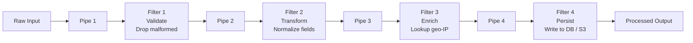

# 🔩 Pipes and Filters

> [!abstract] TL;DR
> Decompose a complex processing task into a sequence of independent, stateless processing stages (filters) connected by channels (pipes). Each filter transforms data and passes it forward. Filters are independently deployable, scalable, and reusable — rearrange or replace them without touching others.

## Intent

Decompose complex data-processing logic into a sequence of discrete, stateless processing components (filters) connected by message channels (pipes), enabling independent development, deployment, and scaling of each processing stage.

## Problem It Solves

Complex data transformation pipelines tend to grow into monolithic blobs of code where ingestion, validation, transformation, enrichment, and persistence are all tangled together. This makes it hard to:

- Reuse a single processing step (e.g., validation) in a different pipeline.
- Scale the expensive part (e.g., ML inference) independently from the cheap part (e.g., format validation).
- Replace or upgrade one step without touching unrelated code.
- Test individual processing logic in isolation.
- Reason about throughput bottlenecks (which stage is slowest?).

## Solution / How It Works

Each processing stage is a **filter**: a component that reads from its input pipe, transforms the data, and writes to its output pipe. Filters have no knowledge of each other — they only know the data contract on their input and output pipes. Pipes are message channels (queues, Kafka topics, in-memory channels).

**Key properties of filters:**

| Property | Description |
|---|---|
| Stateless | Each message processed independently; no state carried between messages |
| Single responsibility | Each filter does exactly one transformation |
| Composable | Filters can be rearranged or combined into new pipelines |
| Independently scalable | Bottleneck filters get more instances; fast filters get fewer |

**Parallelism patterns within a pipeline:**

- **Linear pipeline:** filters execute sequentially (F1 → F2 → F3). Simple, ordered.
- **Fan-out:** one filter sends to multiple downstream filters in parallel (validation splits into enrichment paths).
- **Merge:** multiple filters converge to a single filter (aggregation step).

**Real pipeline implementations:**

| System | Pipes | Filters |
|---|---|---|
| Apache [[Kafka]] + Kafka Streams | Kafka topics | Stream processor nodes |
| AWS Step Functions | State machine transitions | Lambda functions per step |
| Logstash | Internal queue | Input → Filter → Output plugins |
| Unix shell | `|` operator | Shell commands |
| Azure Data Factory | Activity links | Activities (Copy, Transform, Script) |

## When to Use

- Processing tasks that naturally decompose into sequential stages with clear data contracts at each boundary.
- Different stages have different scaling requirements (one is CPU-heavy, another is I/O-bound).
- Multiple pipelines share common stages (reuse validation filter across pipelines).
- You want to run filters in different languages or on different infrastructure.
- ETL / data engineering workflows where transformation logic evolves independently of ingestion.

## When NOT to Use

- Processing is inherently stateful and requires sharing state across messages (use stream processing with state stores instead).
- The pipeline has very few steps and adding pipe infrastructure (queues between filters) would be over-engineering.
- Latency is critical and the overhead of inter-stage message passing is unacceptable.
- Steps have complex conditional branching requiring orchestration logic — consider a workflow engine instead.

## Real-World Example

**Log processing with Logstash:**
1. **Input (source):** reads raw logs from Filebeat agents (pipe: TCP input).
2. **Filter — parse:** Grok pattern extracts timestamp, severity, service name.
3. **Filter — enrich:** geo-IP plugin looks up IP addresses to add country/city.
4. **Filter — transform:** renames fields to match Elasticsearch schema.
5. **Output (sink):** writes enriched log documents to Elasticsearch index.

Each Logstash filter plugin is independently configurable. Adding a new enrichment step requires only inserting a new filter block — no other filter is changed.

**Kafka Streams pipeline for clickstream:**
Topic `raw-clicks` → Consumer (Filter: validate, drop bots) → Topic `valid-clicks` → Consumer (Filter: enrich with user profile from Redis) → Topic `enriched-clicks` → Consumer (Filter: aggregate by session) → Topic `sessions` → Consumer (persist to DynamoDB).

Each consumer group is independently deployed and can be scaled by adding partitions and consumer instances.

## Trade-offs

| Benefit | Drawback |
|---|---|
| Independent development and deployment per filter | Added latency from inter-stage message passing |
| Fine-grained horizontal scaling per bottleneck stage | More infrastructure to manage (N queues/topics instead of 1) |
| Reuse of individual filters across pipelines | Stateless requirement limits what each filter can do |
| Easy to test each filter in isolation | End-to-end debugging harder — must trace across all stages |
| Fault isolation — one filter failure doesn't crash others | Data contract versioning between stages requires coordination |

## Implementation Considerations

- **Data contracts:** define and version the schema at each pipe. Use schema registries (Confluent Schema Registry for Kafka, JSON Schema, Avro/Protobuf) to prevent breaking changes.
- **Error routing:** a filter that fails to process a message should route it to an error pipe ([[Dead_Letter_Queue|DLQ]]) rather than dropping it or crashing. Downstream filters should not receive malformed data.
- **[[Back_Pressure|Back-pressure]]:** if a downstream filter is slow, the upstream pipe (queue/topic) will grow. Monitor queue depth per pipe and scale the slow filter accordingly.
- **Idempotency:** at-least-once delivery between pipes means a filter may receive a duplicate message. Design filters to be [[Idempotent_Operations|idempotent]].
- **Observability:** add tracing IDs to messages at the first filter so you can trace a single event through all stages. Emit per-filter metrics (throughput, error rate, latency).

## Common Pitfalls

- **Filters with shared mutable state:** a filter that writes to a shared database and reads back state from it is no longer stateless — it creates ordering dependencies and race conditions.
- **Fat filters:** a single filter doing validation + transformation + enrichment defeats the purpose; the stage can't be independently replaced or scaled.
- **Ignoring back-pressure:** a slow final filter causes the pipe between stages 3 and 4 to grow unboundedly. Without monitoring and auto-scaling, the pipeline degrades silently.
- **Tight coupling via shared schema changes:** changing the output schema of Filter 2 breaks Filter 3 if schema versioning is not in place.
- **Missing error pipe:** messages that fail in a filter are silently dropped or cause the filter to crash in a loop.

## Related Concepts

- [[_MOC_Cloud_Design_Patterns|↑ Section MOC]]
- [[Message_Queues]] — the pipe implementation between filters
- [[Kafka]] — common pipe implementation for high-throughput pipelines
- [[Stream_Processing]] — extension of this pattern with stateful operations across messages
- [[ETL_vs_ELT]] — Pipes and Filters is the architectural pattern underlying ETL
- [[Competing_Consumers]] — the consumer pattern used to scale individual filters
- [[Dead_Letter_Queue]] — the error pipe for failed filter processing

## Review Questions

1. A Kafka Streams pipeline has 4 topics (T1 → T2 → T3 → T4) and 4 consumer groups. Topic T3's consumer is a CPU-heavy ML inference step and is falling behind. Without changing the pipeline topology, how do you scale this specific filter, and what constraint must already be in place for this to work?

2. Explain why statelessness is a core requirement for Pipes and Filters filters. Give an example of a filter that appears stateless but is actually stateful, and explain the failure mode.

3. Compare Pipes and Filters to a monolithic sequential processor for a 5-step log transformation pipeline. In what scenarios does the added complexity of Pipes and Filters pay off, and when does it not?

## Sources

- [Microsoft Azure Architecture Center — Pipes and Filters pattern](https://learn.microsoft.com/en-us/azure/architecture/patterns/pipes-and-filters)
- [Enterprise Integration Patterns — Pipes and Filters](https://www.enterpriseintegrationpatterns.com/patterns/messaging/PipesAndFilters.html)
- [Kafka Streams documentation](https://kafka.apache.org/documentation/streams/)

#SystemDesign #CloudDesignPatterns #Messaging #PipesAndFilters #DataPipeline #StreamProcessing #Kafka
