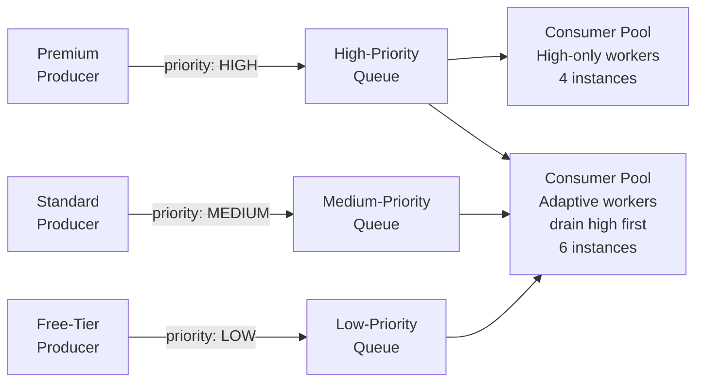

# 🔼 Priority Queue Pattern

> [!abstract] TL;DR
> Requests with higher priority are received and processed before lower-priority ones. Implement using multiple queues (one per priority tier) with dedicated consumer pools that drain high-priority queues first, ensuring premium requests are never blocked by lower-tier bulk work.

## Intent

Ensure that high-priority requests are always processed before lower-priority ones, even when system load is high, by routing messages to tiered queues and allocating consumer resources proportionally to priority.

## Problem It Solves

In a standard [[Queue_Based_Load_Leveling]] setup, all messages share a single queue and are processed in FIFO order. This treats a critical alert from a paying enterprise customer identically to a bulk batch job from a free-tier user. Under load:

- A 100,000-message bulk export job blocks a 10-message urgent notification.
- SLA violations occur for premium customers because free-tier work consumed all worker capacity.
- There is no mechanism to jump the queue for urgent system events.

## Solution / How It Works

Define priority tiers and assign each a dedicated queue. Consumer workers drain queues in priority order: check the high-priority queue first; only process lower-priority queues when higher ones are empty.

**Implementation approaches:**

| Approach | How | Best for |
|---|---|---|
| Separate queues + separate consumer pools | N queues, N fixed consumer groups | Strict isolation, predictable cost |
| Separate queues + shared adaptive consumers | N queues, consumers poll high first | Flexibility, resource efficiency |
| Single priority queue (min-heap) | Broker-native ([[RabbitMQ]] `x-max-priority`) | Simple topology, <10 priority levels |
| Weighted round-robin | Router distributes 5:3:1 messages per cycle | Proportional fairness, no starvation |

**Starvation prevention:** with strict draining (always high before low), low-priority messages may never be processed under sustained high load. Mitigations:
- **Time-based escalation:** after a message waits > T seconds, bump its priority.
- **Minimum processing slots:** reserve a percentage of workers exclusively for lower tiers (e.g., 10% always drains the low queue).
- **[[Rate_Limiting|Rate limiting]] high producers:** cap the rate at which high-priority producers can enqueue.

**Platform specifics:**
- **AWS SQS:** no built-in priority — use separate SQS queues with separate Lambda event source mappings, each with different concurrency limits.
- **RabbitMQ:** native priority queues via `x-max-priority` header (up to 255 levels); messages with higher priority value are delivered first.
- **[[Kafka]]:** no native priority within a topic — use separate topics per priority tier.
- **Azure Service Bus:** supports `Priority` property; broker delivers higher-priority messages first from the same queue.

## When to Use

- Multiple classes of service (premium vs. free, critical vs. batch) share the same processing infrastructure.
- SLA requirements differ across request types (enterprise: < 1s, standard: < 10s, bulk: best-effort).
- System is under load and you must preserve capacity for the most important work.
- Regulatory requirements mandate that certain request types (fraud alerts, payment confirmations) are processed ahead of routine work.

## When NOT to Use

- All requests have equal business value — priority adds complexity for no benefit.
- The system is never under load — FIFO is simpler and sufficient.
- Lower-priority work has a hard deadline — strict prioritization may cause those messages to expire.
- Producers can self-regulate and should not be able to classify their own requests as high-priority (abuse risk without access control).

## Real-World Example

**API gateway for a SaaS product:**
- `HIGH`: payment webhooks, fraud detection alerts (< 50ms SLA).
- `MEDIUM`: user-initiated actions — export, report generation (< 5s SLA).
- `LOW`: background ML retraining jobs, audit log archival (best effort).

Three SQS queues. The high-priority queue has 10 dedicated Lambda concurrencies. A shared pool of 20 Lambdas polls high → medium → low. During a traffic spike, the high queue is always drained first; if still under load, the medium queue is next. Low-priority jobs wait.

**RabbitMQ example:** a notification service uses a single queue with `x-max-priority: 10`. Security alerts are published with `priority: 10`, marketing emails with `priority: 1`. Under load, security alerts are always delivered first.

## Trade-offs

| Benefit | Drawback |
|---|---|
| SLA compliance for high-priority tiers even under load | Low-priority messages can starve under sustained high load |
| Clear capacity allocation per business tier | More queues = more infrastructure to operate and monitor |
| Consumers can be independently scaled per priority | Priority abuse risk — producers may inflate priority to jump queue |
| Native support in RabbitMQ and Azure Service Bus | AWS SQS requires separate queues (no single-queue priority) |
| Works with existing [[Queue_Based_Load_Leveling]] infrastructure | Weighted consumers add routing complexity |

## Implementation Considerations

- **Starvation monitoring:** track queue depth and age of oldest message for each priority tier. Alert when low-priority messages exceed a maximum wait threshold.
- **Access control on priority assignment:** do not let clients self-assign priority. Let the server-side classification logic assign priority based on subscription tier, request type, or urgency rules.
- **Cost model:** high-priority queues with dedicated fast workers cost more. Make this explicit in the business tier pricing model.
- **DLQ per priority queue:** each priority queue needs its own [[Dead_Letter_Queue]] so failed high-priority messages don't disappear silently.
- **[[Idempotent_Operations|Idempotent]] consumers:** messages may be redelivered; design processing to be side-effect-free on retry regardless of priority.

## Common Pitfalls

- **No starvation prevention:** a sustained flood of high-priority messages causes low-priority messages to never be processed and eventually expire from the queue.
- **Priority inflation:** without enforcement, all producers eventually mark their messages high-priority, turning the system back into a FIFO queue.
- **Missing monitoring for low-priority queues:** operators focus on the high-priority queue SLA and only discover that low-priority messages have been backed up for days during an incident.
- **Too many priority levels:** more than 3–5 tiers adds complexity without meaningful differentiation; collapse to fewer tiers.
- **Forgetting DLQ per queue:** a poison message in the high-priority queue blocks critical processing if there is no DLQ and the message keeps being redelivered.

## Related Concepts

- [[_MOC_Cloud_Design_Patterns|↑ Section MOC]]
- [[Queue_Based_Load_Leveling]] — the baseline pattern this extends with priority
- [[Competing_Consumers]] — consumer-side model used within each priority tier
- [[Message_Queues]] — underlying infrastructure
- [[Rate_Limiting]] — complementary control to prevent producer abuse of high-priority tier
- [[Dead_Letter_Queue]] — needed per priority queue for failed message handling
- [[Back_Pressure]] — when the queue overwhelms consumers, back-pressure signals producers to slow down

## Review Questions

1. You implement Priority Queue with 3 tiers (HIGH / MEDIUM / LOW) using strict draining (always empty HIGH before MEDIUM, MEDIUM before LOW). Describe the starvation scenario and two concrete mitigation strategies.

2. A product manager wants to add a priority queue to an AWS-based system. AWS SQS does not support priority within a single queue. Describe the architecture you would use with SQS to achieve three priority tiers, including how you handle consumer scaling for each tier.

3. Producers in a multi-tenant system self-classify their messages as HIGH, MEDIUM, or LOW priority. Within a week, 80% of messages are HIGH priority. What went wrong architecturally, and how would you redesign the system to prevent priority abuse?

## Sources

- [Microsoft Azure Architecture Center — Priority Queue pattern](https://learn.microsoft.com/en-us/azure/architecture/patterns/priority-queue)
- [RabbitMQ Priority Queue documentation](https://www.rabbitmq.com/priority.html)
- [AWS — Fan-out pattern with SQS and SNS](https://docs.aws.amazon.com/sns/latest/dg/sns-sqs-as-subscriber.html)

#SystemDesign #CloudDesignPatterns #Messaging #PriorityQueue #SQS #RabbitMQ #SLAManagement
