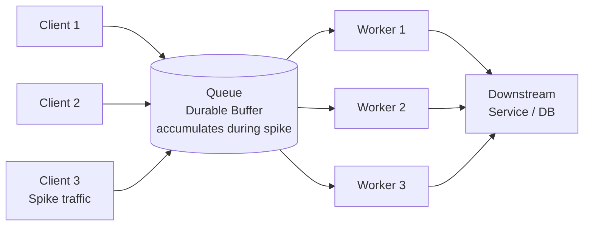

# 🧱 Queue-Based Load Leveling

> [!abstract] TL;DR
> Place a durable queue between producers and consumers to absorb traffic spikes. Producers write at burst speed; consumers process at a sustainable rate. The queue acts as a shock absorber — the downstream service never sees more load than it can handle.

## Intent

Use a queue as a buffer between a task producer and a service consumer so that intermittent heavy loads do not overwhelm the service, enabling it to process work at its optimal sustained rate.

## Problem It Solves

Services are designed and scaled for an average or expected load, not for the highest conceivable spike. When bursty traffic (a flash sale, end-of-day batch, viral event) arrives simultaneously:

- The service becomes overwhelmed and starts failing or degrading.
- Elastic auto-scaling can react, but it introduces startup latency (30–120 seconds to spin up a new instance) and costs money even for short spikes.
- Clients receive errors or timeouts because the service cannot respond in time.

Simply scaling up permanently for peak load is wasteful — a service dimensioned for Black Friday traffic is over-provisioned for 364 other days.

## Solution / How It Works

Insert a durable message queue between producers and the processing service. Producers enqueue requests immediately and return — they are never blocked by downstream capacity. The service (consumers) dequeues and processes at its maximum sustainable rate, regardless of how fast messages arrive.

**During a traffic spike:** messages accumulate in the queue. The queue depth grows but the service processes at its max stable throughput — no overload.

**After the spike:** the queue drains as the service works through the backlog. No spike was ever felt by the service.

**Scaling dimension:** queue depth is the signal for auto-scaling consumers (CloudWatch → SQS queue depth → scale Lambda concurrency or ECS tasks).

**Comparison with elastic auto-scaling alone:**

| Dimension | Auto-scaling only | Queue-Based Load Leveling |
|---|---|---|
| Reaction time | 30–120 seconds | Immediate (queue absorbs) |
| Cost during spike | High (instances spun up) | Low (queue is cheap) |
| Request fate during warm-up | Errors/timeout | Queued, processed later |
| Suitable for synchronous requests | Yes | No (adds latency) |

## When to Use

- Processing requests that can be handled **asynchronously** and where the client does not need an immediate result.
- Services that experience bursty or unpredictable load patterns (image processing, email sending, report generation, order processing).
- You want to protect a rate-limited or expensive downstream service (third-party API, database) from being overwhelmed.
- Cost optimisation: prefer to process work slowly and cheaply rather than spin up many expensive instances for short bursts.

## When NOT to Use

- **Real-time / synchronous requests:** if the client needs a response in < 1 second, adding a queue makes this impossible without a polling or webhook mechanism.
- **Strict SLA on processing time:** if every message must be processed within 2 seconds, the queue latency under load may breach that SLA.
- **Very low-volume, steady-state traffic:** the infrastructure cost and complexity of a queue is not justified if load is predictable and flat.
- When the producer and consumer must share a transaction boundary — a queue decouples them, making atomicity harder.

## Real-World Example

**Video transcoding pipeline (AWS):** When users upload videos to S3, a Lambda writes an SQS message with the S3 key. An ECS service reads from SQS and transcodes video. During a marketing campaign, 50,000 uploads arrive in an hour. Without the queue, the transcoding service would crash. With SQS, all 50,000 messages queue up; the ECS cluster scales from 10 to 40 tasks based on queue depth and processes the backlog over the next few hours — no user upload fails.

**Email sending service:** A promotional email blast to 2 million users is triggered at 9 AM. Instead of hammering the SMTP relay directly, the application writes 2 million messages to SQS. Workers send emails at the SMTP relay's max rate of 100/second, completing the blast in ~5.5 hours without rate-limit errors.

## Trade-offs

| Benefit | Drawback |
|---|---|
| Protects downstream service from overload | Adds latency — not suitable for synchronous real-time flows |
| Producers never fail due to consumer capacity | Queue becomes a dependency; queue outage = no processing |
| Cheap spike absorption vs. elastic scaling cost | Messages can accumulate indefinitely if consumers are too slow |
| Enables independent scaling of producers and consumers | Requires DLQ strategy for failed messages |
| Natural back-pressure signal (queue depth) | At-least-once delivery requires [[Idempotent_Operations|idempotent]] consumers |

## Implementation Considerations

- **[[Dead_Letter_Queue|Dead Letter Queue]] (DLQ):** configure a DLQ to capture messages that fail after N delivery attempts. Without a DLQ, poison messages block processing indefinitely.
- **Message visibility timeout:** set this longer than your longest expected processing time. If the consumer doesn't complete before timeout, the message becomes visible again and is redelivered.
- **Queue depth alarms:** set CloudWatch/Azure Monitor alarms on queue depth to detect when consumers cannot keep up. This signals the need to scale consumers or investigate bottlenecks.
- **Message TTL:** set a message expiry so stale messages (e.g., a user has already cancelled their order) are not processed hours later.
- **Idempotency:** the same message may be delivered more than once (SQS is at-least-once). Consumers must handle duplicate delivery without side effects.

## Common Pitfalls

- **Treating queue as synchronous RPC:** building a system that enqueues a request and then blocks waiting for a response on a reply queue — this defeats the latency benefit and is better served by a proper request-reply pattern.
- **Ignoring queue depth growth:** a queue that grows indefinitely signals consumers are too slow. Without monitoring, you discover the problem hours later when processing is days behind.
- **Not setting a DLQ:** a single malformed message that always fails processing blocks or consumes worker cycles forever.
- **Incorrect visibility timeout:** setting timeout too low causes the same message to be picked up by multiple workers simultaneously, causing duplicate processing.
- **Coupling producer to consumer schema:** the queue is an interface boundary; changing message schema without versioning breaks consumers.

## Related Concepts

- [[_MOC_Cloud_Design_Patterns|↑ Section MOC]]
- [[Message_Queues]] — the underlying infrastructure
- [[Competing_Consumers]] — the consumer-side pattern that pairs naturally with this
- [[Dead_Letter_Queue]] — essential safety net for failed messages
- [[Back_Pressure]] — complementary flow control mechanism
- [[Task_Queues]] — application-level abstraction (Celery, Sidekiq) built on this pattern
- [[Priority_Queue_Pattern]] — extension that adds priority ordering to the queue

## Review Questions

1. An image processing service handles 100 requests/second normally but receives 10,000 requests in a 30-second spike. Without queue-based load leveling, what happens? Walk through exactly what happens with the pattern in place, including queue depth over time.

2. You set the SQS visibility timeout to 30 seconds, but image processing takes an average of 45 seconds. Describe the exact failure mode this causes and how you fix it.

3. A product manager asks why premium users' image conversions are taking hours during a spike. You're using Queue-Based Load Leveling with a single queue. What architectural change would address this, and what pattern does it introduce?

## Sources

- [Microsoft Azure Architecture Center — Queue-Based Load Leveling pattern](https://learn.microsoft.com/en-us/azure/architecture/patterns/queue-based-load-leveling)
- [AWS — Using Amazon SQS as a buffer for high-throughput workloads](https://docs.aws.amazon.com/AWSSimpleQueueService/latest/SQSDeveloperGuide/welcome.html)
- [Enterprise Integration Patterns — Message Channel](https://www.enterpriseintegrationpatterns.com/patterns/messaging/MessageChannel.html)

#SystemDesign #CloudDesignPatterns #Messaging #QueueBasedLoadLeveling #SQS #Scalability #AsyncProcessing
