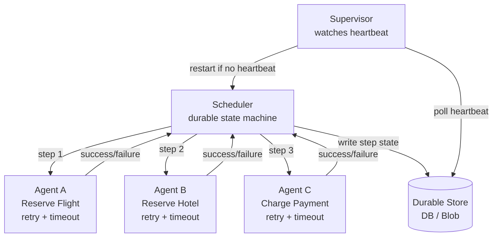

# 🎛️ Scheduling Agent Supervisor

> [!abstract] TL;DR
> Coordinate distributed actions as a single resilient operation using three roles: a Scheduler that orchestrates steps, Agents that wrap individual remote actions with retry/timeout logic, and a Supervisor that monitors the Scheduler and restarts it on failure.

## Intent

Coordinate a set of distributed actions as a single operation, with automated recovery if any action or the coordinator itself fails, without relying on [[Distributed_Transactions|distributed transactions]].

## Problem It Solves

Long-running workflows that call multiple remote services face two compounding failure modes:

1. **Individual action failure:** a remote service times out, returns an error, or becomes temporarily unavailable mid-workflow.
2. **Coordinator failure:** the process orchestrating the workflow crashes partway through, leaving the system in an unknown intermediate state.

Standard retry logic handles transient errors in a single service call, but it cannot recover a multi-step workflow whose orchestrator itself has failed. Distributed transactions (2PC) could provide atomicity, but most modern cloud services do not support them, and they introduce tight coupling and scalability problems.

## Solution / How It Works

Three distinct roles collaborate:

- **Scheduler:** maintains a state machine for the overall workflow. Records each step's status in durable storage before executing it. On restart, reads stored state and resumes from the last successful step.
- **Agent:** wraps a single remote action. Handles retries, timeouts, and idempotent invocation. Reports success/failure back to the Scheduler.
- **Supervisor:** periodically checks the Scheduler's heartbeat. If the Scheduler stops responding (crash, hang, or timeout), the Supervisor restarts it. The restarted Scheduler reads durable state and continues.



**State transitions stored durably:**

```
STEP_FLIGHT: PENDING → IN_PROGRESS → COMPLETED
STEP_HOTEL:  PENDING → IN_PROGRESS → COMPLETED
STEP_PAYMENT: PENDING → IN_PROGRESS → COMPLETED
```

Each Agent marks a step `IN_PROGRESS` before calling the remote service and `COMPLETED` after success. If the Scheduler restarts and finds a step `IN_PROGRESS`, it retries that step (requiring [[Idempotent_Operations|idempotent]] remote calls).

**Compensation:** if a later step fails permanently, the Scheduler can invoke compensating Agents to undo earlier completed steps (similar to Saga compensation).

## When to Use

- Workflows that coordinate multiple remote services with no global transaction support.
- Long-running operations (minutes to hours) that must survive process crashes.
- Scenarios where the Scheduler process itself is unreliable (preemptible VMs, spot instances, container restarts).
- Operations involving third-party APIs that cannot be rolled into a single atomic unit.

## When NOT to Use

- Short-lived, in-process operations — the overhead of durable state and a supervisor is unnecessary.
- When a simple [[Saga_Pattern]] with choreography suffices — SAS adds the supervisor role which is only valuable if the orchestrator itself is crash-prone.
- When all services support distributed transactions — 2PC may be simpler and more consistent.
- Workflows that must complete in milliseconds — durable state writes add latency.

## Real-World Example

**Travel booking:** Booking a trip requires reserving a flight (Amadeus API), a hotel (Expedia API), and a rental car (Enterprise API) — three separate external services. The Scheduler records each reservation step to a database. Agent A retries the flight reservation up to 3 times with exponential backoff. If the process crashes after the flight is reserved but before the hotel, the Supervisor restarts the Scheduler, which reads its state, skips the flight step (already `COMPLETED`), and continues with the hotel.

**E-commerce order fulfillment:** Steps: validate payment → reserve inventory → notify warehouse → update order status. Each step is wrapped in an Agent. If the payment gateway times out, Agent retries. If the fulfillment service crashes mid-workflow, Supervisor restarts it and the Scheduler resumes from the last checkpoint.

## Trade-offs

| Benefit | Drawback |
|---|---|
| Survives coordinator crashes via Supervisor restart | Significantly more complex than simple orchestration |
| No distributed transaction required | All remote actions must be idempotent (retries happen after restarts) |
| Fine-grained retry and timeout per Agent | Durable state store is a required infrastructure dependency |
| Clear separation of concerns (orchestrate vs. act vs. supervise) | Supervisor itself is a single point of failure unless it is also clustered |
| Works with third-party services that don't support 2PC | Debugging multi-role failures is harder than debugging a monolithic workflow |

## Implementation Considerations

- **Idempotency keys:** every Agent call must use an idempotency key derived from the workflow instance + step name. Remote services must honour it to prevent duplicate side effects on retry.
- **Heartbeat granularity:** the Scheduler should write a heartbeat to the durable store every N seconds. The Supervisor's polling interval should be > N to avoid false restarts. Typical: heartbeat every 10s, Supervisor polls every 30s.
- **Supervisor availability:** if the Supervisor itself crashes, no one restarts the Scheduler. Run the Supervisor as a separate highly-available service (or use a managed workflow engine that embeds this pattern).
- **Step timeout vs. Agent timeout:** distinguish between an Agent's per-retry timeout and the Scheduler's maximum time allowed for a step. Exceeding the step timeout may trigger compensation.
- **Compensating actions:** design each Agent's compensation counterpart upfront. Not all actions are compensatable (a sent email cannot be unsent); plan for non-compensatable steps.

## Common Pitfalls

- **Non-idempotent remote calls:** restarting a step that already completed (status was `IN_PROGRESS` at crash time) causes duplicate actions — double charges, duplicate reservations.
- **Missing Supervisor HA:** running a single Supervisor process makes it a new single point of failure.
- **Overly aggressive Supervisor timeouts:** restarting the Scheduler while it is legitimately waiting for a slow remote call causes unnecessary disruption.
- **State store as bottleneck:** every step writes to the durable store; if the store is slow or unavailable, the workflow stalls.
- **Conflating Scheduler with Agent logic:** mixing orchestration and remote-call concerns makes the Scheduler untestable and hard to recover correctly.

## Related Concepts

- [[_MOC_Cloud_Design_Patterns|↑ Section MOC]]
- [[Saga_Pattern]] — related pattern; SAS adds the explicit Supervisor role for process-level recovery
- [[Distributed_Transactions]] — the alternative SAS avoids
- [[Circuit_Breaker]] — Agents can embed circuit breakers for repeated failures
- [[Retry_Pattern]] — Agents implement retry; SAS adds workflow-level recovery
- [[Competing_Consumers]] — can be used to run multiple Scheduler instances (only one active at a time via leader election)
- [[Event_Sourcing]] — durable state store often modelled as an event log

## Review Questions

1. Explain why idempotency is non-negotiable in the Scheduling Agent Supervisor pattern. Give a concrete example of what happens if the payment Agent is not idempotent and the Scheduler restarts mid-step.

2. How does SAS differ from a Saga with orchestration? In what specific scenario does the Supervisor role add value that a plain Saga orchestrator does not provide?

3. Design the durable state schema for a three-step travel booking workflow (flight, hotel, car). Include the fields needed for the Supervisor to determine whether the Scheduler needs restarting and for the Scheduler to resume correctly after a crash.

## Sources

- [Microsoft Azure Architecture Center — Scheduler Agent Supervisor pattern](https://learn.microsoft.com/en-us/azure/architecture/patterns/scheduler-agent-supervisor)
- [Enterprise Integration Patterns — Process Manager](https://www.enterpriseintegrationpatterns.com/patterns/messaging/ProcessManager.html)
- [Designing Distributed Systems — O'Reilly (Burns, 2018)]

#SystemDesign #CloudDesignPatterns #Messaging #SchedulingAgentSupervisor #DistributedSystems #Resilience
