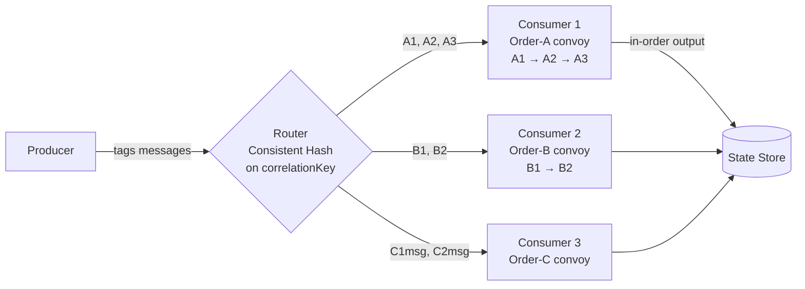

# 🚂 Sequential Convoy

> [!abstract] TL;DR
> Process related messages in a defined order without blocking other unrelated message groups. Route messages with the same correlation key to the same consumer so each group (convoy) is processed sequentially, while different groups run in parallel.

## Intent

Route correlated messages to a dedicated consumer so that messages within the same group are always processed in order, while independent groups proceed concurrently.

## Problem It Solves

In distributed systems with multiple competing consumers reading from a shared queue, messages belonging to the same logical session or entity can be picked up by different consumers and processed out of order. For example, three events for order #123 — `OrderPlaced`, `PaymentConfirmed`, `OrderShipped` — might be processed as `PaymentConfirmed` before `OrderPlaced` because different workers grabbed them simultaneously. This breaks business logic that assumes sequential state transitions.

Simply using a single consumer eliminates the parallelism benefit. The challenge is maintaining order *within* a correlated group while still processing *across* groups concurrently.

## Solution / How It Works

Assign a **correlation key** (session ID, order ID, account ID) to every message. Use consistent hashing or partitioning to route messages with the same correlation key to the same consumer. Each consumer processes its assigned convoys sequentially; consumers run in parallel across different convoys.

**Implementation approaches:**

| Approach | Mechanism | Example |
|---|---|---|
| Topic partitioning | Hash key → partition, one consumer per partition | Kafka partition key |
| Session-aware queues | Broker locks a session to one consumer | Azure Service Bus Sessions |
| Consistent hashing at router | Custom router directs to consumer pool slot | Custom middleware |

**[[Kafka]] example:** set the message key to the correlation ID. Kafka routes all messages with the same key to the same partition. Each partition is consumed by exactly one consumer in a consumer group — order is guaranteed within a partition.

**Azure Service Bus Sessions:** set `SessionId` on messages. The broker assigns a session lock to one consumer at a time; other consumers pick up different sessions.

## When to Use

- Messages represent state transitions of an entity (order, account, workflow) that must be applied in sequence.
- You need ordered processing within a group but can tolerate (and benefit from) parallelism across groups.
- The system uses event sourcing or event-driven state machines.
- Financial transaction processing per account.

## When NOT to Use

- Messages are completely independent — ordering doesn't matter; use plain [[Competing_Consumers]] for better throughput.
- The correlation cardinality is too low (e.g., only 3 distinct groups) — hot partitions will be underutilised.
- Strict global ordering across all messages is needed — this pattern only guarantees per-group order.
- Consumer failure must not stall a convoy — failover handling adds significant complexity.

## Real-World Example

**E-commerce order processing:** Every event for order #5001 (`OrderCreated` → `PaymentProcessed` → `InventoryReserved` → `ShipmentDispatched`) must be applied in sequence to build correct order state. Using Kafka with `orderId` as the partition key, all five events land on the same partition and are consumed in offset order by one consumer thread.

**Banking ledger:** All debit/credit events for account `ACC-789` are routed to the same partition. The consumer applies each transaction in arrival order, computing running balance correctly without race conditions.

## Trade-offs

| Benefit | Drawback |
|---|---|
| Guaranteed in-order processing within a group | Hot partitions if key distribution is skewed |
| Full parallelism across different groups | Consumer failure stalls its entire convoy until reassigned |
| Works natively with Kafka partitions and Service Bus sessions | Rebalancing (adding/removing consumers) may temporarily disrupt assignment |
| No application-level sequencing logic needed | Ordering guarantee only within a correlation group, not globally |
| Scales horizontally by adding more partitions/sessions | Fixed partition count in Kafka limits maximum consumer count |

## Implementation Considerations

- **Key cardinality:** choose a correlation key with high cardinality (order ID, user ID) to distribute load evenly across partitions/consumers.
- **Consumer failure:** when a consumer dies mid-convoy, the broker reassigns the session/partition. Design consumers to be [[Idempotent_Operations|idempotent]] and resume from the last committed offset/checkpoint.
- **Poison messages:** a single bad message in a convoy can stall the entire group. Implement a maximum delivery count and [[Dead_Letter_Queue|dead-letter]] after N retries.
- **Partition count planning (Kafka):** you cannot reduce Kafka topic partitions after creation. Plan ahead — the partition count is the hard ceiling on parallelism.
- **Session timeout (Service Bus):** set an appropriate `LockDuration` and `SessionIdleTimeout` so crashed consumers release their session lock quickly.

## Common Pitfalls

- **Using low-cardinality keys:** routing all events for a single customer tier to one partition creates a hot spot and eliminates parallelism.
- **Assuming global order:** the pattern guarantees per-key order only; don't design logic that depends on cross-group sequencing.
- **Ignoring rebalance windows:** during Kafka consumer group rebalance, consumers pause. Brief out-of-order delivery is possible at the seam — make state transitions idempotent.
- **Not dead-lettering stuck messages:** a single malformed message halts the convoy forever if no DLQ strategy is in place.
- **Mutable correlation keys:** changing the session/partition key of a message mid-flight breaks the convoy guarantee.

## Related Concepts

- [[_MOC_Cloud_Design_Patterns|↑ Section MOC]]
- [[Competing_Consumers]] — the base pattern this extends with ordering
- [[Message_Queues]] — underlying infrastructure
- [[Kafka]] — native partition-based implementation
- [[PubSub_Pattern]] — broadcast model this pattern can be layered on top of
- [[Saga_Pattern]] — related pattern for distributed multi-step workflows
- [[Dead_Letter_Queue]] — essential for handling stuck convoys

## Review Questions

1. You have an order processing system with 50,000 distinct orders per day. You configure Kafka with 10 partitions and use `orderId` as the partition key. What is the maximum number of parallel consumers you can run, and what happens if you add an 11th?

2. A consumer in your Sequential Convoy setup crashes while processing message A2 of convoy A (A1 was already committed, A3 is waiting). Explain the exact sequence of events from crash to recovery, including what guarantees are maintained.

3. Compare Azure Service Bus Sessions vs. Kafka partition keys as implementations of Sequential Convoy. In what scenario would you prefer Service Bus Sessions over Kafka partitioning?

## Sources

- [Microsoft Azure Architecture Center — Sequential Convoy pattern](https://learn.microsoft.com/en-us/azure/architecture/patterns/sequential-convoy)
- [Azure Service Bus Sessions documentation](https://learn.microsoft.com/en-us/azure/service-bus-messaging/message-sessions)
- [Kafka documentation — Partitions and ordering](https://kafka.apache.org/documentation/#intro_topics)

#SystemDesign #CloudDesignPatterns #Messaging #SequentialConvoy #Kafka #EventDriven
