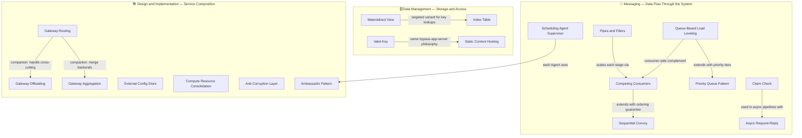

# 🗺️ Cloud Design Patterns — Map of Content

> [!abstract] What's in this section?
Enterprise-grade cloud architectural patterns organized into three practical categories: **Messaging** (how data flows asynchronously between components), **Data Management** (how data is stored, indexed, and accessed efficiently), and **Design & Implementation** (how services are composed, deployed, and configured). These 19 patterns address structural challenges common to cloud-native systems — from absorbing traffic spikes without cold-start delay (Queue-Based Load Leveling) to protecting clean domain models from legacy integrations (Anti-Corruption Layer). Many patterns here deliberately complement foundational patterns already covered in other vault sections (Pub/Sub, CQRS, Cache-Aside); cross-references are listed at the bottom rather than duplicated here.

## Concept Map

## Learning Path

Recommended reading order with one-line note descriptions.

### Messaging — Start Here

1. **[[Competing_Consumers]]** — Multiple workers share one queue; the first free worker claims the next message, enabling horizontal throughput scaling.
2. **[[Queue_Based_Load_Leveling]]** — A durable queue acts as a shock absorber between producers and consumers, smoothing out traffic spikes without expensive elastic scaling.
3. **[[Priority_Queue_Pattern]]** — Tiered queues with dedicated consumer pools ensure high-priority requests are never blocked by bulk free-tier work.
4. **[[Pipes_and_Filters]]** — Decompose a complex data pipeline into independent, stateless processing stages connected by message channels; each stage is independently scalable.
5. **[[Sequential_Convoy]]** — Route correlated messages (all events for the same order) to the same consumer to guarantee in-order processing per group while keeping cross-group parallelism.
6. **[[Claim_Check]]** — When a payload exceeds queue size limits, store it in object storage and pass only a lightweight reference token in the message.
7. **[[Async_Request_Reply]]** — Return HTTP 202 Accepted immediately with a polling URL; decouples long-running backend work from synchronous HTTP request timeouts.
8. **[[Scheduling_Agent_Supervisor]]** — Coordinate multi-step distributed workflows across three roles: a Scheduler (durable state machine), per-step Agents (retry + timeout), and a Supervisor (restarts crashed coordinators).

### Data Management

9. **[[Materialized_View]]** — Pre-compute and persist denormalized, query-optimized snapshots so reads are O(1) lookups instead of expensive joins across multiple services.
10. **[[Index_Table]]** — Maintain application-managed secondary index tables so any non-primary field in a KV store can be queried in O(1) without a full scan.
11. **[[Valet_Key]]** — Issue clients short-lived, operation-scoped tokens for direct object-storage access, eliminating app-server bandwidth bottlenecks for large file uploads and downloads.
12. **[[Static_Content_Hosting]]** — Upload static assets (HTML, CSS, JS, images) to object storage fronted by a CDN — zero compute cost for asset delivery at any scale.

### Design and Implementation

13. **[[Gateway_Routing]]** — A single gateway entry point routes incoming requests to the correct backend service based on path, hostname, headers, or traffic weight.
14. **[[Gateway_Offloading]]** — Move shared cross-cutting concerns (TLS termination, JWT validation, rate limiting, logging) from every individual service into the gateway.
15. **[[Gateway_Aggregation]]** — The gateway fans out a single client request to multiple backends in parallel and merges the results into one response, cutting N round trips to 1.
16. **[[External_Config_Store]]** — Externalize all configuration into a centralized, versioned store so config changes (feature flags, connection strings, timeouts) never require a redeployment.
17. **[[Anti_Corruption_Layer]]** — Insert an explicit translation layer between incompatible domain models to prevent legacy or external concepts from corrupting your clean bounded context.
18. **[[Ambassador_Pattern]]** — Co-locate a network proxy with each service to handle outbound network concerns (retries, circuit breaking, distributed tracing) without touching service code — Envoy is the canonical implementation.
19. **[[Compute_Resource_Consolidation]]** — Co-locate compatible, low-utilization microservices in one compute unit to reduce the idle-resource waste caused by over-decomposition.

## All Notes at a Glance

| Note | Category | What you'll learn |
|------|----------|-------------------|
| [[Competing_Consumers]] | Messaging | Horizontal throughput scaling via parallel workers on a shared queue |
| [[Queue_Based_Load_Leveling]] | Messaging | Queues as traffic-spike shock absorbers between producers and consumers |
| [[Priority_Queue_Pattern]] | Messaging | Tiered queues and consumer pools for SLA-differentiated message processing |
| [[Pipes_and_Filters]] | Messaging | Independent, stateless pipeline stages connected by message channels |
| [[Sequential_Convoy]] | Messaging | Per-group message ordering (Kafka partition key / Service Bus sessions) |
| [[Claim_Check]] | Messaging | Large payload handling: store in object storage, pass reference in message |
| [[Async_Request_Reply]] | Messaging | HTTP 202 + polling pattern for operations that exceed HTTP timeout windows |
| [[Scheduling_Agent_Supervisor]] | Messaging | Three-role pattern for crash-resilient distributed workflow coordination |
| [[Materialized_View]] | Data Management | Pre-computed read-optimized snapshots for O(1) query performance |
| [[Index_Table]] | Data Management | Application-managed secondary indexes for non-primary-key lookups in KV stores |
| [[Valet_Key]] | Data Management | Short-lived scoped tokens for direct client-to-storage data transfer |
| [[Static_Content_Hosting]] | Data Management | CDN-fronted object storage for zero-compute static asset delivery |
| [[Gateway_Routing]] | Design & Implementation | Single gateway routes requests by path, host, header, or traffic weight |
| [[Gateway_Offloading]] | Design & Implementation | Centralize cross-cutting concerns at the gateway; services get clean requests |
| [[Gateway_Aggregation]] | Design & Implementation | Fan-out + parallel merge pattern for chatty multi-service page loads |
| [[External_Config_Store]] | Design & Implementation | Runtime-updatable centralized configuration without service redeployment |
| [[Anti_Corruption_Layer]] | Design & Implementation | Bidirectional domain model translation with legacy and external systems |
| [[Ambassador_Pattern]] | Design & Implementation | Language-agnostic outbound network proxy sidecar (Envoy, Netflix Prana) |
| [[Compute_Resource_Consolidation]] | Design & Implementation | Co-location of compatible idle services to reduce minimum-allocation waste |

## Key Questions This Section Answers

1. **My backend gets overwhelmed during traffic spikes — how do I absorb bursts without cold-start delays from elastic scaling?** → [[Queue_Based_Load_Leveling]]
2. **How do I guarantee all events for order #5001 are processed in sequence while different orders run in parallel?** → [[Sequential_Convoy]]
3. **My premium enterprise customers' requests are delayed by free-tier bulk jobs — how do I fix this architecturally?** → [[Priority_Queue_Pattern]]
4. **A page load requires data from 8 microservices — how do I cut the mobile round-trip cost from 8 calls to 1?** → [[Gateway_Aggregation]]
5. **I need retries, circuit breaking, and tracing on a legacy Python service without modifying its code — how?** → [[Ambassador_Pattern]]
6. **My Kafka messages reference 50MB PDF payloads that far exceed the 1MB default limit — what's the pattern?** → [[Claim_Check]]
7. **How do I integrate a 15-year-old ERP system without letting its bizarre field names and status codes corrupt my order domain model?** → [[Anti_Corruption_Layer]]

## Patterns Already Covered Elsewhere

These canonical patterns belong to this domain but already exist in other vault sections — reference them, do not duplicate:

| Pattern | Vault Location |
|---------|---------------|
| Publisher / Subscriber | [[PubSub_Pattern]] in `20_Event_Driven` |
| CQRS | [[CQRS]] in `20_Event_Driven` |
| Event Sourcing | [[Event_Sourcing]] in `20_Event_Driven` |
| Cache-Aside | [[Cache_Aside]] in `13_Caching` |
| Strangler Fig | [[Strangler_Fig_Pattern]] in `11_ApplicationLayer` |
| Sidecar | [[Sidecar_Pattern]] in `11_ApplicationLayer` |
| Leader Election | [[Consensus_and_Raft]] in `24_Distributed_Systems` |
| BFF (Backend for Frontend) | [[BFF_Pattern]] in `11_ApplicationLayer` |
| Database Sharding | [[Database_Sharding]] in `12_Databases` |

## Cross-Section Links

- [[_MOC_Event_Driven]] — Pub/Sub, CQRS, and Event Sourcing are the foundational patterns that this section's messaging patterns build directly on top of
- [[_MOC_API_Gateway]] — Gateway Routing, Offloading, and Aggregation together define the full capability set of an API gateway; the API Gateway section covers the platform, this section covers the patterns
- [[_MOC_Asynchronism]] — Queue-Based Load Leveling, Competing Consumers, and Async Request-Reply are the cloud-pattern elaborations of core async fundamentals covered in section 14
- [[_MOC_Reliability_Patterns]] — The Ambassador and Scheduling Agent Supervisor patterns implement the retry and distributed recovery strategies covered in depth in section 28
- [[_MOC_SystemDesign_Master]] — Return to the master index
