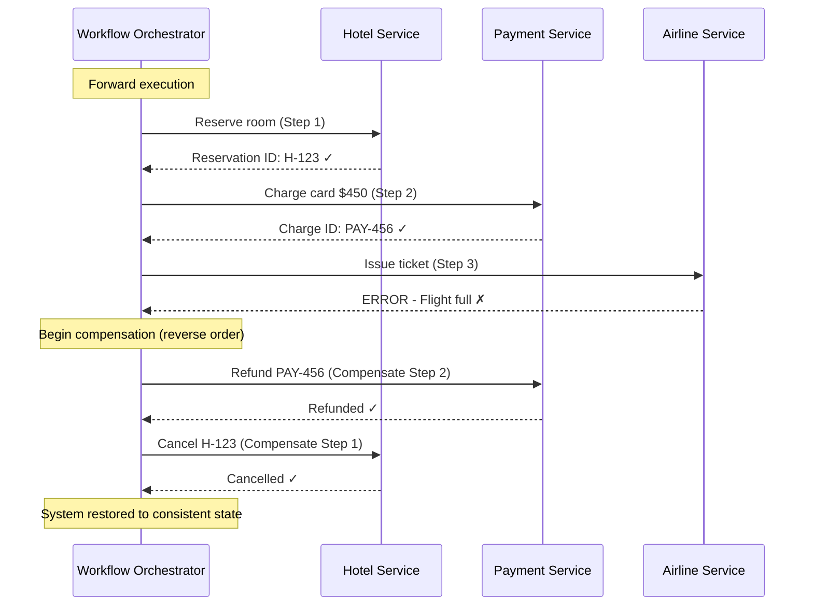

# ↩️ Compensating Transaction

> [!abstract] TL;DR
> When a multi-step distributed workflow fails midway, execute compensating actions — semantic "undo" operations — in reverse order to bring the system back to a consistent state. Unlike database rollbacks, compensating transactions operate at the business logic level and must be explicitly designed, idempotent, and guaranteed to eventually succeed.

## Intent

Undo the effects of a series of steps that form a logical business operation when one or more steps fail, in distributed systems where classic ACID transactions (with atomic rollback) are not feasible across service boundaries.

## Problem It Solves

Modern distributed systems often execute multi-step business workflows that span multiple services, databases, and external APIs. Traditional database transactions with ACID guarantees work within a single database, but fail across service boundaries:

- **2-Phase Commit (2PC) is impractical at scale** — requires all participants to hold locks during the entire commit phase, creating massive latency and availability risk. If the coordinator fails, participants are locked forever (blocking protocol).
- **No atomic rollback across services** — if step 3 of a 5-step workflow fails, there is no native mechanism to "undo" the effects of steps 1 and 2 that already committed to different services/databases.
- **Partial state is inconsistent and visible** — a booking that debited a credit card but never confirmed the hotel reservation leaves the system in an inconsistent, user-visible state.
- **Long-running workflows can't hold locks** — a flight booking workflow that spans minutes (user is comparing options) cannot hold database locks for its duration.

**The core challenge**: how do you maintain business-level consistency across a multi-step distributed workflow when any step can fail?

## Solution / How It Works

For each step in the workflow, design a corresponding **compensating action** that semantically reverses the business effect of the original step. When a step fails, execute the compensating actions for all previously completed steps **in reverse order**.

### Key Properties of Compensating Actions

| Property | Explanation |
|---|---|
| **[[Idempotent_Operations|Idempotent]]** | Running the compensation N times produces the same result as running it once. Required because compensation may be retried. |
| **Must eventually succeed** | Compensations are retried (with exponential backoff) until they succeed. They cannot be optional. |
| **Semantic reversal, not binary rollback** | A compensation does not restore the exact original state — it applies a business-level undo (cancel, refund, release) that semantically reverses the effect. |
| **Designed explicitly** | Compensations don't emerge automatically; each step's compensation must be designed and implemented as part of the workflow definition. |

### Workflow Example: Travel Booking

```
Forward steps:
  Step 1: Reserve hotel room           → Hotel Service
  Step 2: Charge credit card            → Payment Service
  Step 3: Issue flight ticket           → Airline Service  ← FAILS

Compensation (executed in reverse order):
  Compensate Step 2: Refund credit card → Payment Service (idempotent: refund API with booking ID)
  Compensate Step 1: Cancel hotel room  → Hotel Service   (idempotent: cancel API with reservation ID)
  Step 3 compensation: Not needed (step 3 never succeeded)
```

### Why Reverse Order?

Compensation in reverse order respects data dependencies. Step 2 (charge) depends on Step 1 (reserve) having succeeded. If you cancelled the hotel first and then tried to refund the payment, the refund service might reference a reservation that no longer exists. Reverse order unwinds dependencies cleanly.

### Mermaid Diagram



### Compensating Transaction vs. Rollback

| Dimension | Database Rollback | Compensating Transaction |
|---|---|---|
| **Mechanism** | Database engine undoes log entries | Application executes business logic |
| **Consistency** | Mathematically exact (byte-level) | Semantically equivalent (business-level) |
| **Cross-service** | No — single database only | Yes — works across service boundaries |
| **Time** | Milliseconds | Minutes or hours (for long-running sagas) |
| **Side effects** | No external side effects | External side effects may have already occurred (emails sent, etc.) |
| **Guarantees** | Atomic, guaranteed | Must be designed to be idempotent and retried until success |

### Relationship to Saga Pattern

> [!note] Compensating Transaction vs. Saga
> **Compensating Transaction** is the **building block** — the individual "undo" operation for a single step.
> **[[Saga_Pattern|Saga Pattern]]** is the **architectural pattern** that orchestrates a sequence of steps and their corresponding compensating transactions into a complete long-running transaction protocol.
> You build a Saga by composing multiple Compensating Transactions with an orchestration or choreography mechanism.

## When to Use

- **Multi-step workflows crossing service boundaries** where ACID transactions are not available (microservices, external APIs).
- **Long-running business processes** (order fulfillment, travel booking, loan origination) that cannot hold database locks for their duration.
- **E-commerce order workflows** — reserve inventory → charge payment → ship order; any step failure must reverse prior steps.
- **Financial transfer workflows** — debit source → credit destination; if crediting fails, the debit must be reversed.
- **Any distributed saga implementation** — compensating transactions are the fundamental building block of sagas.

## When NOT to Use

- **Within a single database** — use native ACID transactions (`BEGIN/ROLLBACK`); they are simpler, faster, and mathematically guaranteed.
- **When side effects are truly irreversible** — some actions cannot be compensated: a physical parcel already delivered, a concrete structure built. In these cases, the workflow must be designed to prevent failure after the irreversible step, or accept a different form of reconciliation.
- **When all steps are idempotent and can simply be retried** — if a workflow can be safely replayed from the beginning without side effects, retry is simpler than compensation.
- **High-frequency, millisecond-latency paths** — compensating transactions add orchestration overhead. For high-throughput, latency-sensitive operations, design for idempotency and at-least-once delivery instead.

## Real-World Example

- **Hotel/Flight Booking (Expedia, Booking.com)**: A booking workflow reserves multiple components (hotel, car, flight). If the flight leg fails after hotel and car are reserved, compensating cancellations are sent to hotel and car services. The user's card is refunded via a compensation on the payment step.
- **E-commerce Order Fulfillment (Amazon)**: An order workflow decrements inventory → creates shipment → charges card. If card charge fails after inventory was decremented, the inventory decrement is compensated (items restored to available stock).
- **Bank Wire Transfer**: Debit source account → credit destination account. If crediting fails (e.g., destination account frozen), the debit is compensated with a credit back to the source — a refund transaction with the same amount and idempotency key.
- **Azure Durable Functions (long-running sagas)**: Azure Durable Functions provides first-class support for compensating transactions via the `try/compensate` pattern in orchestration functions. Each activity function has a corresponding compensation function that the orchestrator calls on failure.

## Trade-offs

| Benefit | Drawback |
|---|---|
| Enables consistency across distributed services without 2PC | Compensations must be explicitly designed for every step — no automatic "undo" |
| Works across service boundaries, external APIs, and long time horizons | Temporary inconsistency is visible — the system is in a partial state between forward failure and compensation completion |
| No long-held distributed locks — services release resources quickly | Some compensations are "best effort" — a cancelled hotel may still bill a no-show fee (semantic, not exact reversal) |
| Compatible with microservices and event-driven architectures | Complex to implement correctly — idempotency, ordering, retry logic all must be handled |
| Enables long-running workflows that span user interaction time | Debugging and tracing failed sagas across services is operationally difficult |
| Each service remains autonomous — no shared transaction coordinator | Concurrent modifications (a user modifies the booking mid-saga) can conflict with in-progress compensation |

## Implementation Considerations

1. **Idempotency keys on every compensation**: Tag every compensation call with the original forward-step's transaction ID. `POST /refund {idempotency_key: "booking-789-step-2-compensation"}`. This allows safe retry if the compensation call fails or times out.
2. **Persistent saga state**: The orchestrator must persist the workflow state (which steps completed, which compensations are pending) to a durable store. If the orchestrator crashes mid-compensation, it must be able to resume from exactly where it left off on restart.
3. **Retry compensations with exponential backoff**: Compensations must eventually succeed. If `cancel_hotel` returns a 503, retry it with exponential backoff until it succeeds. Never skip a compensation.
4. **Dead-letter queue for stuck compensations**: If a compensation cannot succeed after many retries (e.g., the hotel service is down for 24 hours), escalate to a dead-letter queue for human-assisted resolution. Have a runbook for manual compensation execution.
5. **Design compensations for concurrent safety**: Multiple saga instances may compensate the same shared resource concurrently. Use optimistic locking or conditional updates (`cancel reservation H-123 only if status = PENDING`) to prevent races.
6. **Communicate temporary inconsistency to users**: The UI should display "cancellation in progress" or "refund processing" rather than erroring out. Compensations take time; users need status visibility.
7. **Test compensation paths explicitly**: Compensation paths are rarely exercised in testing but critical in production. Use chaos engineering to inject failures at each step and verify compensation executes correctly and fully.

## Common Pitfalls

- **Non-idempotent compensations**: A compensation that can only be called once will fail if retried after a transient error. Always design compensations to be safe to call multiple times with the same effect.
- **Swallowing compensation failures**: A compensation fails and the orchestrator marks the saga as "done" anyway, leaving the system in a partially compensated state. Every compensation failure must be retried or escalated — never ignored.
- **No mechanism for irreversible steps**: A saga that sends a confirmation email or ships a physical package as step 2 cannot undo that action. The workflow must be designed so that irreversible steps come last, after all reversible preconditions are confirmed.
- **Missing reverse ordering**: Compensating in forward order (compensating step 1 before step 2) can violate data dependencies and cause compensation failures.
- **Distributed deadlock in compensation**: Service A's compensation calls Service B, which is waiting for Service A to release a resource. Design compensations to not hold resources or to use timeouts.
- **Compensation scope mismatch**: A compensation that does "too much" or "too little" compared to the forward step leaves residual side effects. Carefully scope each compensation to exactly reverse one step's business effect.

## Related Concepts

- [[_MOC_Reliability_Patterns|↑ Section MOC]]
- [[Saga_Pattern]] — The architectural pattern that orchestrates compensating transactions into a complete distributed transaction protocol
- [[Distributed_Transactions]] — The problem space that compensating transactions address; understand why 2PC doesn't scale
- [[Idempotent_Operations]] — Prerequisite for safe retry of compensating actions
- [[ACID_and_Transactions]] — The contrast: what you get within a single database vs. what you must build manually across services
- [[Event_Driven]] — Choreography-based sagas trigger compensations via domain events rather than direct orchestrator calls
- [[Background_Jobs]] — Compensation workflows are often implemented as durable background jobs

## Review Questions

1. **A hotel booking saga has three steps: (1) reserve room, (2) charge card, (3) send confirmation email. Step 3 fails. In what order are compensations executed, and what is the practical challenge with compensating step 3 vs. steps 1 and 2?** Compensations execute in reverse: first compensate step 2 (refund the card), then compensate step 1 (cancel the reservation). Step 3 (email) was never completed, so no compensation is needed. The practical challenge: if step 3 HAD succeeded (email sent) and then step 4 failed, you cannot "un-send" an email. This is why irreversible side effects like email sends should be placed as the FINAL step in a saga, only after all reversible preconditions are confirmed. If email is placed early, the compensation path must send a follow-up "cancellation" email rather than truly reversing the effect.

2. **What is the difference between a Compensating Transaction and a database ROLLBACK? When would you use each?** Database ROLLBACK is an engine-level atomic operation that discards all changes within a transaction as if they never happened — exact, instant, byte-level reversal within a single DB transaction boundary. Compensating Transaction is application-level business logic that semantically reverses committed operations across service boundaries — it may cancel a reservation, issue a refund, or restore inventory, but does not restore exact byte-level state (e.g., a refund creates a new credit transaction rather than deleting the original debit). Use ROLLBACK when all operations touch a single database and can be wrapped in a BEGIN/COMMIT block. Use Compensating Transactions when operations span multiple services, external APIs, or long time durations that prevent holding database locks.

3. **A payment compensation (refund) fails with a 503 from the payment provider. What should the saga orchestrator do, and what happens if the payment provider is down for 48 hours?** Immediately: retry the refund with exponential backoff and jitter. Mark the saga state as "compensation-in-progress" (persisted durably). After N retries (e.g., over 1–2 hours): escalate to a dead-letter queue or an operations alert for human-assisted intervention. The 48-hour scenario: the orchestrator's retry job keeps attempting (with increasing backoff, capped at e.g., 1 hour between attempts). The customer is in a "pending refund" state — the UI should reflect this. When the payment provider recovers, the next retry succeeds and the saga completes. The customer should receive a notification. This is why SLAs with payment providers must include recovery time guarantees, and why the orchestrator must be durable (not lose state across restarts).

## Sources

- [Microsoft Azure Architecture Center — Compensating Transaction Pattern](https://learn.microsoft.com/en-us/azure/architecture/patterns/compensating-transaction)
- [Microsoft Azure Architecture Center — Saga Distributed Transactions Pattern](https://learn.microsoft.com/en-us/azure/architecture/reference-architectures/saga/saga)
- Garcia-Molina, H. & Salem, K. — "Sagas" (1987 SIGMOD paper — the original Saga paper)
- Richardson, Chris — *Microservices Patterns*, Chapter 4 (Managing Transactions with Sagas)
- [Azure Durable Functions — Compensating Transactions](https://learn.microsoft.com/en-us/azure/azure-functions/durable/durable-functions-error-handling)

#SystemDesign #ReliabilityPatterns #Resiliency #CompensatingTransaction #Saga #DistributedTransactions #Idempotency #Microservices
