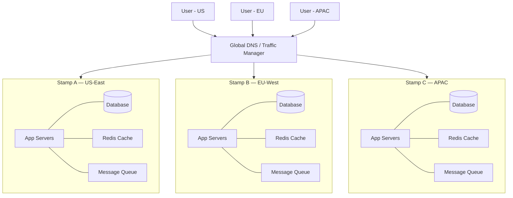

# 🏷️ Deployment Stamps

> [!abstract] TL;DR
> Deploy multiple independent copies ("stamps") of your full application stack — app servers, database, cache, queues — so each stamp serves a distinct tenant group or region in complete isolation. One stamp failing never affects another.

## Intent

Deploy self-contained, independent replicas of the entire application stack to limit blast radius, enforce data sovereignty, and enable independent scaling per tenant or geographic region.

## Problem It Solves

As a system scales, a single shared infrastructure creates dangerous coupling:

- **Blast radius is global** — a noisy-neighbor tenant or a bad deployment tanks the entire user base simultaneously.
- **Compliance is impossible in a shared stack** — EU GDPR requires customer data to remain in the EU; a single global database violates this.
- **Scaling one tenant affects all** — one viral customer's traffic spike degrades everyone else's experience.
- **Deployment risk** — a buggy release rolls out to all tenants at once with no staged exposure.

The fundamental challenge: **how do you serve many tenants/regions without coupling their failure domains?**

## Solution / How It Works

A **stamp** is an independently deployable unit containing the full application stack:
- Application servers / containers
- Relational or NoSQL database (with its own data)
- Cache (Redis/Memcached)
- Message queues
- Any supporting services (search index, blob storage, etc.)

A **global routing layer** (DNS, Traffic Manager, or a lightweight [[Load_Balancers|load balancer]]) directs each request to the appropriate stamp based on a routing key — typically tenant ID, region, or a combination.

### Stamp Deployment Variants

| Variant | Routing Key | Use Case |
|---|---|---|
| **Tenant-based** | Customer/tenant ID | B2B SaaS with isolated data per customer |
| **Geographic** | User's region | Low-latency global apps, data residency |
| **Hybrid** | Tenant + Region | Enterprise SaaS with both compliance and latency needs |

### Mermaid Diagram



### Routing and Tenant Mapping

A **stamp router** or **tenant registry service** maps each tenant to its stamp. This mapping is typically stored in a lightweight global metadata store (NOT in any individual stamp). Each request carries a tenant ID in the JWT/session, and the router resolves the correct stamp before forwarding.

```
GET /api/orders
Authorization: Bearer <JWT with tenantId=acme-corp>

Router: acme-corp → Stamp B (EU-West)
Forward → https://eu-west-stamp.internal/api/orders
```

## When to Use

- **Multi-tenant SaaS** where large enterprise tenants demand data isolation.
- **Data sovereignty / compliance** — GDPR, HIPAA, or country-specific data residency laws require data to stay within a jurisdiction.
- **Independent scaling** — different tenants have radically different traffic patterns and require separate capacity planning.
- **Blast radius reduction** — you want a bad deployment or a noisy tenant to affect only their own stamp.
- **Staged rollouts** — deploy a new version to Stamp A (lower-risk tenants) before Stamp B (premium tenants).
- **High-value tenant isolation** — one enterprise customer paying 80% of revenue gets their own stamp for SLA guarantees.

## When NOT to Use

- **Cross-tenant operations are frequent** — if your core product requires joining or querying data across tenants (e.g., a marketplace where buyers and sellers are different tenants), stamps create enormous complexity.
- **Small scale** — if you have < 100 tenants with modest and uniform traffic, the operational overhead is not justified.
- **Tight latency budget for tenant resolution** — routing adds a lookup step; if every millisecond counts, re-evaluate.
- **Tenants frequently change stamps** — migrating a tenant between stamps (moving their data) is expensive and risky.
- **Strong consistency across tenants required** — stamps are inherently isolated; cross-stamp consistency is not natively provided.

## Real-World Example

- **GitHub Enterprise (ghe-scale)**: GitHub uses independent deployment units for large enterprise customers. Each "ghe-scale" unit contains isolated compute, storage, and database for that enterprise, preventing one org's activity from affecting another.
- **Salesforce Pods**: Salesforce has long partitioned customers across isolated "pods" (org clusters). Each pod is a complete Salesforce stack serving a subset of orgs. Pod `NA1` through `NA100+` each run independently.
- **Shopify Shards / Pods**: Shopify assigns merchants to database shards that function like mini-stamps. A massive Black Friday spike on one merchant's shard does not degrade merchants on other shards.
- **Azure Deployment Stamps**: The official Azure Architecture Center documents this pattern for AKS-based multi-tenant SaaS, where each stamp is a full AKS cluster with its own Cosmos DB and Redis instance.

## Trade-offs

| Benefit | Drawback |
|---|---|
| Failure is isolated to one stamp — no global outage from a single incident | Data is duplicated across stamps — storage costs scale with stamp count |
| Data sovereignty by design — EU data literally cannot leave EU stamp | Cross-stamp reporting (e.g., global analytics dashboard) requires aggregating from all stamps |
| Independent scaling — scale Stamp A without touching Stamp B | Infrastructure cost scales linearly with stamp count — N stamps = N full stacks |
| Staged rollouts — test new versions on one stamp before all | Operational complexity multiplies — you manage N separate databases, N caches, N monitoring stacks |
| Tenants can be migrated between stamps to rebalance load | Tenant migrations are expensive, risky data-movement operations |
| SLA isolation — premium tenants guaranteed headroom | Inconsistent features if stamp versions drift (versioning discipline required) |

## Implementation Considerations

1. **Tenant routing registry**: Store the `tenantId → stampId` mapping in a **global, low-latency, highly available** store (e.g., Azure Cosmos DB or a globally replicated Redis). This registry is on the critical path of every request.
2. **Stamp templating / IaC**: Use Terraform modules or Helm charts to define a stamp as a parameterized template. Every stamp must be deployed from the same template — configuration drift is your enemy.
3. **Monitoring per stamp + global aggregation**: Each stamp emits metrics to its own namespace (e.g., `stamp=us-east`), but you need a global dashboard that aggregates across all stamps to spot systemic problems.
4. **Uniform deployment pipeline**: Stamp rollouts should use the same CI/CD pipeline with only the stamp-specific parameters varying. Never hand-roll changes on a single stamp.
5. **Capacity planning per stamp**: Assign tenants to stamps based on expected load. Keep a "headroom" buffer on each stamp — avoid packing stamps to 100% utilization.
6. **Tenant migration tooling**: Even if rare, you will need to move tenants between stamps (rebalancing, decommissioning a stamp). Build this tooling before you need it in an emergency.
7. **Cross-stamp aggregation service**: For global reporting, deploy a dedicated aggregation service that reads from all stamps and presents a unified view. Never let individual stamps talk to each other.

## Common Pitfalls

- **Stamps that share a component** — sharing a single global database "just for reference data" defeats isolation. Replicate reference data into each stamp.
- **No versioning discipline** — allowing stamps to drift to different application versions makes debugging cross-stamp issues a nightmare. Enforce synchronized versioning.
- **Routing registry becomes a SPOF** — if the global tenant registry goes down, all routing fails. It must be at least as available as your SLA target.
- **Underestimating migration cost** — teams build stamps with no plan for moving tenants. When a stamp is overloaded, they have no recourse.
- **Alert fatigue from N separate monitoring stacks** — multiply your current alert volume by N stamps. Invest in centralized observability from day one.
- **Neglecting the "empty stamp" problem** — newly provisioned stamps have cold caches, leading to temporary performance degradation when first tenants are assigned.

## Related Concepts

- [[_MOC_Reliability_Patterns|↑ Section MOC]]
- [[Geodes]] — Active-active globally distributed nodes; contrast with stamps (stamps are isolated, geodes share data globally)
- [[Database_Sharding]] — Stamps are conceptually similar to sharding at the full-stack level
- [[Consistent_Hashing]] — Used to assign tenants to stamps in a balanced, migration-friendly way
- [[Availability_Patterns]] — Parent category of reliability and availability architectural strategies
- [[Microservices]] — Stamps often contain microservices internally; stamp isolation is at the deployment level
- [[CDNs]] — Often combined with stamps; CDN handles static assets globally while stamps handle dynamic data regionally

## Review Questions

1. **What is the key structural difference between a Deployment Stamp and simple horizontal scaling?** Horizontal scaling adds more instances of the same service sharing common infrastructure (database, cache). A stamp is a complete, self-contained replica of the ENTIRE stack — each stamp has its own dedicated database, cache, and queues, ensuring true failure isolation between tenant groups.

2. **You have a SaaS product and a large EU enterprise client signs up with a strict GDPR requirement that their data never leaves the EU. How would Deployment Stamps address this, and what operational challenge does this introduce?** Deploy a dedicated EU stamp (hosted in an EU region) and map that tenant exclusively to it via the tenant routing registry. The data is physically isolated in the EU-based database. The operational challenge is that cross-tenant analytics (e.g., "how many total users across all of Europe?") now requires aggregating from multiple stamps via a separate cross-stamp aggregation service.

3. **A stamp serving your highest-revenue tenant group becomes CPU-saturated during peak hours. What options do you have, and what is the risk of the most straightforward option?** Options: (a) Scale the stamp vertically/horizontally (add more app servers to that stamp); (b) Create a new stamp and migrate some tenants off the saturated one. The risk of option (b) is that tenant migration is a data-movement operation — it requires copying a tenant's data to the new stamp, cutting over their routing entry, and verifying data integrity, all ideally without downtime.

## Sources

- [Microsoft Azure Architecture Center — Deployment Stamps Pattern](https://learn.microsoft.com/en-us/azure/architecture/patterns/deployment-stamp)
- [Salesforce Pod Architecture Overview](https://developer.salesforce.com/docs/atlas.en-us.api.meta/api/sforce_api_guidelines_pod.htm)
- [Shopify Engineering — Resiliency at Scale](https://shopify.engineering/resiliency-scale)
- Martin Fowler — *Patterns of Enterprise Application Architecture* (partitioning strategies)

#SystemDesign #ReliabilityPatterns #Availability #DeploymentStamps #MultiTenancy #DataSovereignty
