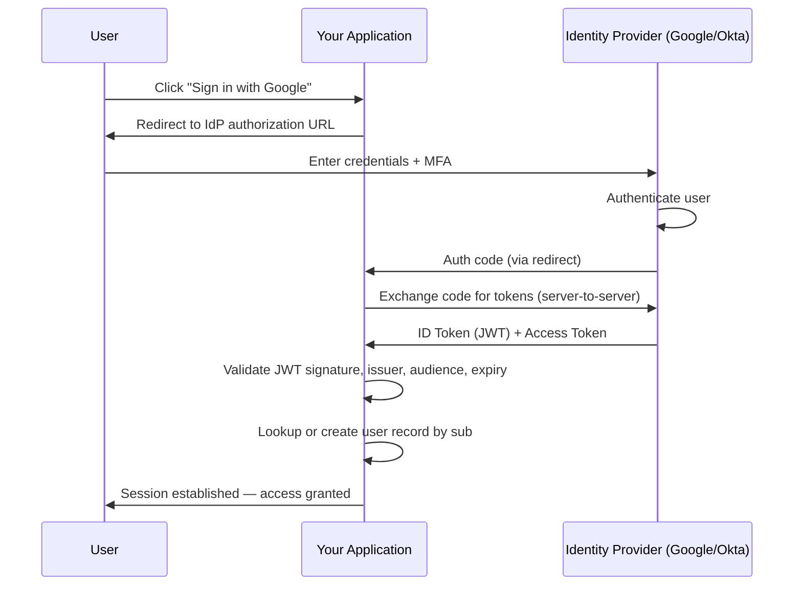

# 🔑 Federated Identity

> [!abstract] TL;DR
> Delegate authentication to an external, trusted Identity Provider (IdP) so users authenticate once with their existing credentials (Google, GitHub, corporate Okta/Azure AD) and your application validates the token the IdP issues — without ever handling passwords directly. Eliminates credential management complexity, enables SSO, and leverages the IdP's security hardening.

## Intent

Delegate authentication to an external Identity Provider that users already trust, allowing the application to accept and validate tokens issued by that IdP rather than managing credentials directly — enabling Single Sign-On across applications and reducing the attack surface of the application's authentication layer.

## Problem It Solves

Managing authentication in-house is a deceptively complex, high-risk problem:

- **Password management burden** — hashing, salting, breach detection, forced rotation policies, forgotten-password flows, MFA enrollment: each is a full engineering project.
- **Credential stuffing attacks** — attackers use leaked credentials from other breaches to try to access your app. Users reuse passwords; you inherit risk from every other service they use.
- **No SSO** — if your organization has 30 internal SaaS tools each with their own login, employees manage 30 sets of credentials, causing support tickets and shadow credential storage (spreadsheets, sticky notes).
- **Every app reinvents authentication** — each service implements its own login page, session management, and MFA. Duplication with diverging security postures.
- **Compliance** — SOC 2, ISO 27001, and enterprise procurement teams require centralized identity management with audit logs, provisioning/deprovisioning workflows, and policy enforcement.

**Core goal**: authentication should be handled by a hardened, specialized party — not every app team.

## Solution / How It Works

Federated Identity separates **Identity** (who you are — managed by the IdP) from **Access** (what you can do — managed by your app). The IdP asserts identity; your app trusts that assertion.

### Key Components

| Component | Role | Examples |
|---|---|---|
| **Identity Provider (IdP)** | Authenticates the user; issues cryptographically signed tokens | Google, GitHub, Microsoft Azure AD, Okta, Auth0, Keycloak |
| **Service Provider / Relying Party** | Your application; consumes tokens from the IdP | Your API, web app, mobile app |
| **Identity Token** | Signed assertion from IdP: "User X authenticated at time T" | JWT (OIDC), SAML Assertion |
| **Trust Relationship** | Your app trusts the IdP's public key for signature verification | Pre-configured in your app via JWKS endpoint or metadata URL |

### Standards and Protocols

| Standard | Format | Use Case |
|---|---|---|
| **SAML 2.0** | XML | Enterprise SSO (legacy; still dominant in many corp environments) |
| **[[OAuth_and_JWT|OAuth 2.0]]** | JSON | Authorization delegation (social login, API access) |
| **OpenID Connect (OIDC)** | JSON (built on OAuth 2.0) | Authentication (identity layer on top of OAuth 2.0) |

> [!important] OAuth 2.0 vs. OIDC
> **OAuth 2.0** is an *authorization* framework — it grants tokens that authorize access to resources. It does NOT specify what the user's identity is.
> **OpenID Connect (OIDC)** adds an *authentication* layer on top of OAuth 2.0 — the ID Token contains the user's identity claims (email, name, sub).
> For federated identity (knowing *who* the user is), always use OIDC, not raw OAuth 2.0.

### OIDC Authentication Flow (Authorization Code Flow)

```
1. User clicks "Sign in with Google" on your app
2. Your app redirects the user to Google's Authorization Endpoint:
   GET https://accounts.google.com/o/oauth2/auth
     ?client_id=YOUR_APP_CLIENT_ID
     &redirect_uri=https://yourapp.com/auth/callback
     &response_type=code
     &scope=openid email profile
     &state=<random-csrf-token>

3. User authenticates at Google (enters Google credentials, passes MFA)
4. Google redirects back to your app:
   GET https://yourapp.com/auth/callback?code=AUTH_CODE&state=<same-csrf-token>

5. Your backend exchanges the code for tokens (server-to-server):
   POST https://oauth2.googleapis.com/token
     client_id=YOUR_APP_CLIENT_ID
     client_secret=YOUR_CLIENT_SECRET
     code=AUTH_CODE
     grant_type=authorization_code

6. Google returns:
   { "id_token": "<JWT>", "access_token": "...", "expires_in": 3600 }

7. Your app validates the ID Token JWT:
   - Verify signature using Google's JWKS (public keys)
   - Check issuer (iss) = "https://accounts.google.com"
   - Check audience (aud) = your CLIENT_ID
   - Check expiry (exp) > now
   - Check nonce matches (replay attack prevention)

8. Extract user identity from validated claims:
   { "sub": "118293847561234", "email": "alice@example.com", "name": "Alice" }

9. Create or retrieve your app's user record (sub is the stable identifier)
10. Issue your app's session cookie or API token
```

### Mermaid Diagram



### ID Token Claims (JWT Payload Example)

```json
{
  "iss": "https://accounts.google.com",
  "sub": "118293847561234",
  "aud": "your-app-client-id",
  "exp": 1753574400,
  "iat": 1753570800,
  "email": "alice@example.com",
  "email_verified": true,
  "name": "Alice Smith",
  "picture": "https://lh3.googleusercontent.com/...",
  "hd": "example.com"
}
```

The `sub` claim is the stable, unique identifier for the user within this IdP — use it as the foreign key in your user table, NOT email (emails can change).

## When to Use

- **Any application where users already have an identity with a trusted provider** — consumer apps (Google/GitHub/Apple), enterprise apps (Azure AD/Okta).
- **Enterprise B2B SaaS** — enterprise customers require SSO via their corporate IdP (Okta, Azure AD, ADFS). Without federated identity support, you lose enterprise deals.
- **Reducing credential management liability** — any breach of a self-managed credential store is a severe reputational and legal risk. Delegating to an IdP removes this entirely.
- **Multi-application environments** — if you have multiple internal tools or microservices, federated identity enables users to authenticate once and access all of them.
- **Compliance** — SOC 2 Type II and ISO 27001 typically require centralized identity management with proper MFA, provisioning, and audit logs — all handled by the IdP.

## When NOT to Use

- **Applications that cannot rely on external network calls** — air-gapped systems or offline applications that cannot reach an IdP during authentication.
- **When users have no existing identity with a suitable IdP** — niche B2B scenarios where tenants use a highly custom or proprietary identity system that doesn't support SAML/OIDC. (Very rare today.)
- **Highly latency-sensitive first-call paths** — federation adds a redirect-and-callback roundtrip to the authentication flow. This is acceptable for login (which users expect to take a moment) but not for inline, millisecond-budget authentication.
- **Solo developer projects with simple auth needs** — for a personal project with 5 users, a simple username/password with bcrypt may be simpler. Federation adds configuration overhead.

## Real-World Example

- **Stack Overflow — "Sign in with Google"**: Stack Overflow integrates OIDC with Google as an IdP. Users who sign in with Google never create a Stack Overflow password — Google asserts their identity, Stack Overflow validates the ID token and creates/retrieves the user record.
- **GitHub OAuth for Third-Party Apps**: When you authorize a CI/CD tool (CircleCI, Vercel) to access your GitHub repositories, you're using OAuth 2.0 delegation. The tool receives an access token that GitHub validates — federated authorization.
- **Corporate SSO — Okta/Azure AD**: A company configures 50 SaaS tools (Salesforce, Jira, Slack, Figma) to trust their corporate Okta IdP via SAML 2.0 or OIDC. Employees log in once via Okta; all 50 tools accept their Okta token. Leaving the company = deprovisioning Okta = immediate loss of access to all 50 tools.
- **AWS Cognito with Social Login**: AWS Cognito acts as a federation broker — it trusts Google, Apple, and Facebook as IdPs, normalizes their tokens, and issues its own tokens to your app. Your app only needs to trust Cognito, not each individual social provider.

## Trade-offs

| Benefit | Drawback |
|---|---|
| Eliminates credential management — no password hashing, storage, or breach risk | External dependency — if the IdP is down, your login flow fails (mitigated by multiple IdP options) |
| Users benefit from the IdP's security hardening — MFA, anomaly detection, breach monitoring | Trust in the IdP — if the IdP is compromised (e.g., Google account hijack), your app is implicitly compromised |
| SSO across multiple applications from a single authentication event | Token validation adds latency on every authenticated request (mitigated by caching JWKS) |
| Simplified onboarding — users sign in with accounts they already have | OIDC/SAML configuration requires setup with each IdP — client IDs, redirect URIs, scopes |
| Enterprise procurement requires SSO — federated identity enables B2B sales | User data arrives from IdP at login; synchronizing profile updates (email change) requires webhook integration |
| Audit trail and deprovisioning managed centrally by the IdP | Sub claim portability — if a user loses their Google account and uses Apple instead, they're a different user in your system |

## Implementation Considerations

1. **Use `sub` as the user identifier, not `email`**: Emails can change; `sub` is the stable, IdP-assigned identifier for a user. Store `{idp: "google", sub: "118293847561234"}` as the foreign key. Allow a user to link multiple IdPs to one app account.
2. **Validate ALL JWT claims**: Never skip validation steps. Minimum required: `sig` (signature via JWKS), `iss` (expected issuer), `aud` (your client ID), `exp` (not expired). Missing any of these creates exploitable vulnerabilities.
3. **Cache JWKS keys appropriately**: Google's JWKS endpoint (public keys for signature verification) should be fetched and cached with respect to the Cache-Control header. Do not fetch it on every request. Do not cache it forever (keys rotate periodically).
4. **State parameter for CSRF protection**: Always generate a random `state` value, store it in the user's session, send it to the IdP, and verify the IdP returns the same value in the callback. Prevents CSRF attacks on the OAuth flow.
5. **Handle account linking**: A user may sign in with Google on Monday and Apple on Tuesday. Without account linking, they get two separate app accounts. Implement email-based linking (if emails match and email_verified is true) with appropriate security confirmations.
6. **Implement token refresh**: OIDC access tokens expire (typically 1 hour). Use the refresh token to get a new access token without requiring user re-authentication. Store refresh tokens securely (HTTP-only cookies or server-side, not localStorage).
7. **Multi-IdP strategy**: Do not commit to a single IdP. Support at least 2 (e.g., Google + Microsoft) so an IdP outage doesn't lock out all users. For enterprise, support SAML/OIDC dynamically per tenant.

## Common Pitfalls

- **Using `email` as the user identifier**: Emails change. Users who change their Google account email become unrecognizable to your app. Always use `sub` as the stable identifier.
- **Not validating the `aud` claim**: If you don't validate that the token's `aud` matches your application's client ID, a token issued for Application B can be presented to Application A and accepted. This is a critical security flaw.
- **Storing tokens in localStorage**: Access tokens stored in localStorage are accessible to any JavaScript on the page, making them vulnerable to XSS attacks. Use HTTP-only, Secure cookies for token storage.
- **PKCE omission for SPAs/mobile apps**: Browser-based and mobile apps cannot securely store client secrets. Without PKCE (Proof Key for Code Exchange), the Authorization Code Flow is vulnerable to code interception attacks. PKCE is mandatory for public clients.
- **Redirect URI wildcards**: Registering `https://yourapp.com/*` as a valid redirect URI allows attackers to craft redirect URIs that point to attacker-controlled pages. Register exact redirect URIs only.
- **Trusting ID tokens from the frontend**: Never trust an ID token passed from the frontend without validating its signature server-side. Frontend JavaScript could have constructed or modified a token.

## Related Concepts

- [[_MOC_Reliability_Patterns|↑ Section MOC]]
- [[Authentication_and_Authorization]] — Federated identity is a specific approach to implementing authentication; authorization remains the application's responsibility
- [[OAuth_and_JWT]] — JWT is the token format used in OIDC; OAuth 2.0 is the underlying authorization framework
- [[TLS_and_HTTPS]] — All federated identity flows must use HTTPS; token interception over HTTP completely undermines the pattern
- [[API_Security]] — Federated identity tokens are used for API authentication; understand token scopes and validation in API contexts
- [[Gatekeeper]] — A gatekeeper may validate federated tokens at the perimeter before requests reach backend services

## Review Questions

1. **Explain why `sub` must be used as the stable user identifier instead of `email` in a federated identity system, and describe a concrete scenario where using `email` causes a production bug.** `sub` (subject) is the IdP-assigned, immutable identifier for a user — it never changes as long as the user exists in the IdP. `email` is mutable: a user can change their Gmail address, or a corporate user can have their email updated when they change departments (alice@corp.com → a.smith@corp.com). Concrete bug: a user authenticates with Google (email: alice@old.com, sub: 11829...), has an account in your DB keyed by email. They change their Gmail address to alice@new.com. Next login: OIDC returns sub=11829... but email=alice@new.com. Your app looks up by email, finds no record for alice@new.com, and creates a NEW account — the user has lost all their history, data, and settings. With sub-based lookup, the same user is recognized regardless of email change.

2. **What is the difference between OAuth 2.0 and OpenID Connect (OIDC), and why is OIDC required for federated identity (authentication) while OAuth 2.0 alone is insufficient?** OAuth 2.0 is an *authorization* framework — it provides `access_tokens` that grant permission to access protected resources (e.g., read a user's Google Calendar). OAuth 2.0 deliberately does NOT specify what the user's identity is; an access token is an opaque credential for resource access. OpenID Connect extends OAuth 2.0 by adding an `id_token` — a JWT with standardized claims about the user's identity (`sub`, `email`, `name`, `iss`, `aud`, `exp`). OIDC answers "who is this user?" while OAuth 2.0 only answers "is this client authorized to access this resource?". For authentication (knowing the user's identity), you need the OIDC `id_token`, not just an OAuth `access_token`.

3. **A security auditor flags that your app accepts Google OIDC tokens but does not validate the `aud` claim. Explain the exact attack vector this enables.** An attacker registers their own application (Application B) with Google OIDC. They receive a valid Google ID token where `aud` = Application B's client ID. If your application (Application A) does not validate `aud`, it accepts this token — even though Google issued it for Application B, not your app. The attacker can present Application B's token to your app's API as if they were a legitimate user. This is an "audience confusion" attack. Practically: a malicious app that shares a Google user with your service could impersonate that user in your app by forwarding the Google token issued to the malicious app. Mitigation: always assert `token.aud === YOUR_CLIENT_ID` during JWT validation and reject any token where the assertion fails.

## Sources

- [Microsoft Azure Architecture Center — Federated Identity Pattern](https://learn.microsoft.com/en-us/azure/architecture/patterns/federated-identity)
- [OpenID Connect Core 1.0 Specification](https://openid.net/specs/openid-connect-core-1_0.html)
- [OAuth 2.0 RFC 6749](https://datatracker.ietf.org/doc/html/rfc6749)
- [Auth0 — What is OpenID Connect?](https://auth0.com/docs/authenticate/protocols/openid-connect-protocol)
- [OWASP — OAuth 2.0 Security Best Practices](https://cheatsheetseries.owasp.org/cheatsheets/OAuth2_Cheat_Sheet.html)

#SystemDesign #ReliabilityPatterns #Security #FederatedIdentity #SSO #OIDC #OAuth #JWT #Authentication
