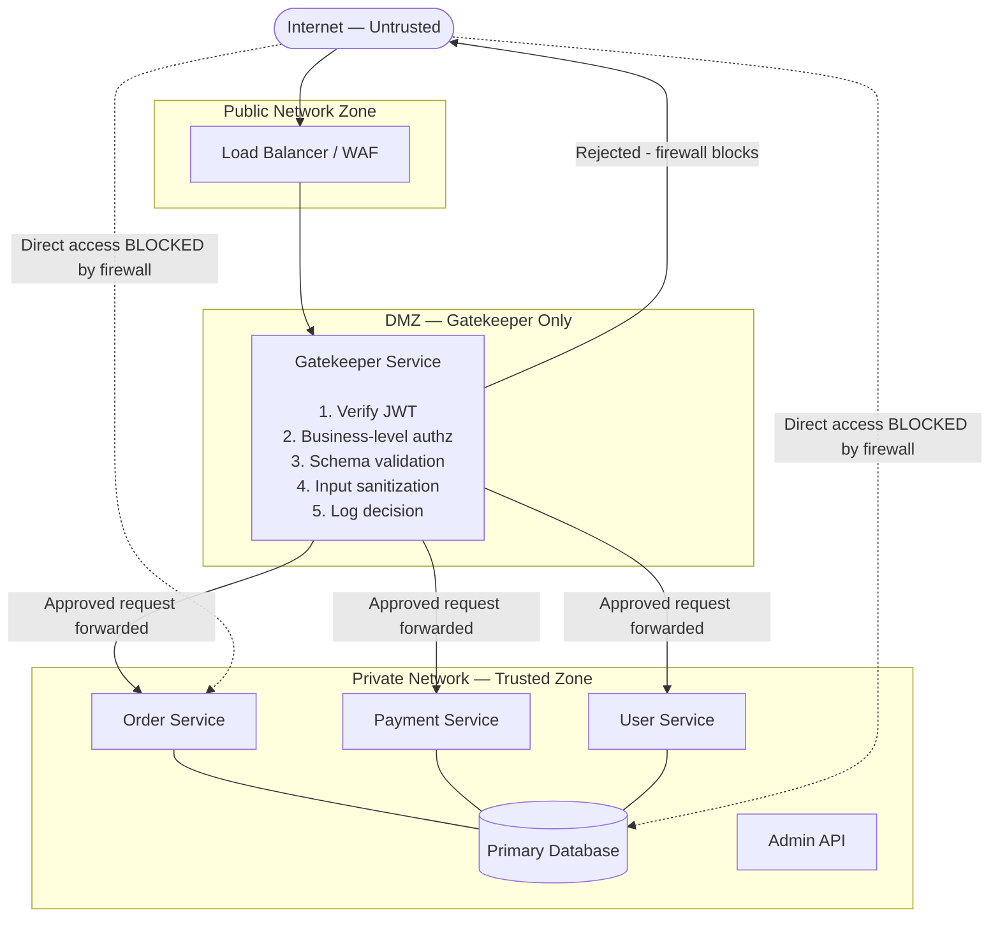

# 🛡️ Gatekeeper

> [!abstract] TL;DR
> Place a dedicated, hardened broker service between the internet and your backend services. The gatekeeper validates, sanitizes, and authorizes every request at the business-logic level — only forwarding requests it explicitly approves. Backend services are unreachable from the internet directly, making the gatekeeper the single, heavily scrutinized attack surface.

## Intent

Protect services and data stores by interposing a dedicated host instance that acts as a broker between clients and backend services — validating and sanitizing requests, enforcing business-level authorization, and forwarding only verified, safe requests to trusted backend components that are not directly accessible from the public network.

## Problem It Solves

General-purpose infrastructure components ([[Load_Balancers|load balancers]], [[API_Gateway|API gateways]]) handle cross-cutting concerns (TLS termination, rate limiting, authentication token validation) but lack business context to enforce fine-grained, domain-specific validation:

- **Input injection vulnerabilities** — a backend service that receives raw user input is vulnerable to SQL injection, XSS, path traversal, and command injection if the input is not sanitized before use. Every backend service re-implementing sanitization leads to inconsistent protection.
- **Business-rule authorization bypass** — an API gateway can verify a JWT is signed by the right IdP, but cannot check whether "user Alice is allowed to read tenant B's data based on their subscription tier and current role." That logic lives in the business domain.
- **Attack surface on multiple services** — if 15 backend microservices are directly accessible from the internet, each is individually vulnerable. A flaw in any one is exploitable.
- **Privileged resource access** — databases, internal queues, and admin APIs must never be directly accessible from untrusted networks. A misconfigured firewall rule can expose them; the gatekeeper enforces this architecturally.
- **Compliance validation** — PCI DSS, HIPAA, and SOC 2 require that sensitive data is only accessed through validated, audited paths. A gatekeeper provides this enforcement point.

**The fundamental problem**: how do you systematically prevent malformed, malicious, or unauthorized requests from ever reaching your backend, without burdening each backend service with its own validation layer?

## Solution / How It Works

The gatekeeper is a **minimal, hardened, purpose-built service** that sits between the public internet and all backend services. Backend services are not accessible from the public internet — all inbound traffic must pass through the gatekeeper.

### What the Gatekeeper Does

1. **[[Authentication_and_Authorization|Authenticates]] the request** — validates the bearer token (JWT signature, issuer, audience, expiry)
2. **Authorizes the request** — checks business-level authorization rules (can this user access this specific resource?)
3. **Validates and sanitizes input** — schema validation (required fields, types, length limits), injection sanitization, content-type enforcement
4. **Enforces request format** — strips unknown headers and fields before forwarding
5. **Forwards only clean requests** — if all checks pass, the gatekeeper forwards the sanitized request to the appropriate backend over a private network
6. **Logs all decisions** — every allow/deny decision is logged with caller identity, request details, and timestamp for audit

### What the Gatekeeper Does NOT Do

- Heavy business logic (that lives in the backend)
- Database operations (the gatekeeper doesn't touch data stores directly)
- Stateful session management (session state stays in the backend or a dedicated session store)
- Complex computation (the gatekeeper must be lightweight and fast)

### Mermaid Diagram



### Gatekeeper vs. API Gateway — The Critical Distinction

| Dimension | API Gateway | Gatekeeper |
|---|---|---|
| **Primary function** | Routing, load balancing, TLS termination, basic auth | Business-level validation, input sanitization, domain-specific authorization |
| **Authorization depth** | "Is this a valid JWT?" | "Is this user allowed to access this tenant's invoice #4521 based on their role and subscription?" |
| **Input validation** | Content-type, basic size limits | Schema validation, field-level sanitization, injection prevention |
| **Business context** | None | High — the gatekeeper understands the domain |
| **Hardening requirement** | Standard hardening | Extreme hardening — minimal code, no dependencies, heavily audited |
| **Typical operator** | Infrastructure team | Security team + application team jointly |
| **Examples** | AWS API Gateway, Kong, Nginx | Custom-built; similar to WAF + application-specific validation layer |

> [!tip] In practice, both can coexist: an API Gateway handles infrastructure routing and basic auth, while the Gatekeeper handles business-level validation downstream of the gateway.

### Input Validation Scope

```
REQUEST:
  POST /api/invoices/4521/approve
  Authorization: Bearer <JWT>
  Content-Type: application/json
  Body: { "approver_id": "user-123", "comment": "<script>alert(1)</script>" }

GATEKEEPER CHECKS:
  ✓ JWT signature valid, not expired, correct issuer/audience
  ✓ User "user-123" exists and has role "finance-approver"
  ✓ Invoice "4521" belongs to the same tenant as user-123
  ✓ User-123 has not already approved this invoice (no double-approval)
  ✓ "comment" field: strip HTML tags → sanitized: "alert(1)"
  ✓ "comment" length: 280 chars max → pass
  ✗ Unknown field "exploit_payload" in body → strip field before forwarding

FORWARDED TO BACKEND:
  { "approver_id": "user-123", "comment": "alert(1)" }
  (with sanitized, validated payload; unknown fields stripped)
```

## When to Use

- **PCI DSS compliance** — the Payment Card Industry requires that cardholder data is only accessible through highly controlled, audited pathways. The gatekeeper is the mandatory broker for all cardholder data access.
- **HIPAA-compliant healthcare systems** — Protected Health Information (PHI) must only be accessible via validated, authorized, and audited access paths. A gatekeeper enforces this architecturally.
- **High-value, sensitive data stores** — financial systems, government records, identity data. Any system where unauthorized access has severe legal, reputational, or safety consequences.
- **Microservices with complex cross-cutting authorization** — when business authorization rules (RBAC, ABAC, tenant isolation) are too complex to implement consistently in each microservice independently.
- **Defense-in-depth strategy** — as a layer in a multi-layered security model (WAF → API Gateway → Gatekeeper → Backend), so no single failure exposes the backend.
- **[[Zero_Trust_Architecture|Zero-trust architectures]]** — the gatekeeper enforces "never trust, always verify" at the application layer.

## When NOT to Use

- **Internal service-to-service calls** — adding a gatekeeper to every internal microservice call adds latency and complexity with diminishing security returns. Reserve it for the public perimeter and high-value data.
- **Low-sensitivity CRUD APIs** — a public blog API or a read-only product catalog doesn't need this level of scrutiny. An API gateway with standard JWT validation is sufficient.
- **When the gatekeeper becomes a monolith** — if the gatekeeper accumulates too much business logic over time, it becomes a tightly coupled bottleneck. Maintain strict discipline: the gatekeeper validates, never executes business workflows.
- **Teams without security expertise** — a poorly implemented gatekeeper gives false confidence. If the team cannot properly maintain it, a well-configured API gateway with WAF may provide better actual security.

## Real-World Example

- **PCI DSS Cardholder Data Environments**: Organizations processing credit card payments must implement a Cardholder Data Environment (CDE) that is strictly segmented. All access to the CDE goes through a dedicated, network-isolated validation proxy that authenticates callers, validates input, and logs all activity — a textbook gatekeeper.
- **Azure Trusted Subsystem Pattern**: Azure documentation describes the Gatekeeper as a "Trusted Subsystem" — the gatekeeper (running as a managed identity with elevated permissions) is the only service with access to the backend data store. All external requests go through it.
- **Healthcare PHI Access Broker**: Healthcare systems that expose APIs to third-party EHR integrations route all PHI-touching requests through a dedicated validation broker that enforces patient consent, request scoping, and FHIR resource access rules before proxying to the underlying data store.
- **Bastion Host (Infrastructure analog)**: The network-level equivalent is a bastion host — the only entry point to a private network. All SSH access to production servers goes through the bastion, which enforces authentication, logs sessions, and prevents direct exposure of production hosts. The Gatekeeper pattern is this concept applied at the application layer.
- **Google's BeyondCorp / Application-Level Proxy**: Google's internal security model routes all employee access to internal apps through an application-level access proxy that validates identity, device posture, and context before forwarding requests — a gatekeeper at enterprise scale.

## Trade-offs

| Benefit | Drawback |
|---|---|
| Drastically reduces backend attack surface — backends are never directly exposed | Single point of failure — if the gatekeeper goes down, ALL requests are blocked (mitigated by redundant deployment) |
| Centralizes input validation and sanitization — consistent security posture across all backends | Performance overhead — every request adds a proxy hop with validation latency |
| Provides a comprehensive audit log of all request decisions | The gatekeeper itself becomes a high-value attack target — its hardening requirements are extreme |
| Enables fine-grained, business-aware authorization without burdening backend services | Feature creep risk — teams add business logic to the gatekeeper, turning it into a bottleneck |
| Defense-in-depth — one layer in a multi-layer security model | Requires significant ongoing maintenance and security review as business rules evolve |
| Compliance enforcement point — a natural location for PCI DSS, HIPAA audit logging | Tight coupling to business domain — changes in authorization rules require gatekeeper updates |

## Implementation Considerations

1. **Minimize the gatekeeper's code footprint**: Every line of code in the gatekeeper is an attack surface. Use well-established, audited libraries for JWT validation and input sanitization. Avoid writing custom crypto or parsing logic. The smaller the codebase, the easier it is to audit completely.
2. **Network-level enforcement of the isolation**: The gatekeeper's access control must be enforced at the NETWORK level (security groups, firewall rules, VPC peering policies) — not just by convention. Backend services should be literally unreachable from the public internet at the network layer, independent of the gatekeeper's application logic.
3. **Deploy the gatekeeper with high availability**: The gatekeeper is on the critical path for all requests. Deploy at least 2 instances behind a load balancer. Use auto-scaling to handle traffic spikes. A gatekeeper outage = total service outage for all guarded backends.
4. **Structured, immutable audit logs**: Every request decision (approved/denied, requester identity, resource, timestamp, reason) must be logged to an immutable, append-only log store (e.g., AWS CloudTrail, Azure Monitor Logs). Tamper-evident audit logs are a compliance requirement in PCI DSS and HIPAA.
5. **Distinguish sanitization from transformation**: Sanitization removes or escapes dangerous content (HTML tags, SQL metacharacters) while preserving the semantic value. Transformation changes the data's meaning. The gatekeeper should sanitize; it should not transform business data.
6. **Formal threat modeling**: Before building a gatekeeper, run a STRIDE threat model on the design. Identify: what assets it protects, what attacks it prevents, and what its own attack surface is. Use this to drive hardening requirements.
7. **Regular penetration testing**: The gatekeeper's validation logic should be tested by red-team exercises and automated vulnerability scanning. Validation rules that seemed correct at design time may have gaps discovered only under adversarial testing.

## Common Pitfalls

- **Gatekeeper with no network isolation**: The gatekeeper validates requests in code, but backend services are still reachable directly from the internet via a misconfigured security group rule. This is the most common failure — the gatekeeper is bypassed entirely. Enforce isolation at the network layer.
- **Validation logic drift**: The gatekeeper's validation rules are written once and never updated as the backend API evolves. New fields are not validated, deprecated fields are still accepted. Validation logic must be co-evolved with the API contract.
- **Performance bottleneck under load**: A gatekeeper doing synchronous database lookups for every authorization check becomes a bottleneck. Cache authorization decisions for short TTLs. Use async/non-blocking I/O. Set aggressive timeouts.
- **Trusting internal traffic unconditionally**: Once past the gatekeeper, internal services treat all traffic as trusted. An attacker who compromises one internal service can access all others. Apply zero-trust principles internally too (mutual TLS, service-to-service authentication).
- **Monolithic gatekeeper**: Starting as a thin validator, the gatekeeper accumulates business workflows, data transformation logic, and orchestration code over months. It becomes a bottleneck and a maintenance nightmare. Enforce strict scope boundaries — the gatekeeper validates, not orchestrates.
- **Excessive validation latency**: A gatekeeper that takes 500ms to validate a request adds 500ms to every API call. Keep validation paths O(1) or O(log n) with appropriate caching.

## Related Concepts

- [[_MOC_Reliability_Patterns|↑ Section MOC]]
- [[API_Gateway]] — The infrastructure-level routing layer that typically sits upstream of the Gatekeeper; the Gatekeeper adds business-aware validation the gateway cannot provide
- [[Federated_Identity]] — The Gatekeeper validates identity tokens issued by federated IdPs; the two patterns are tightly integrated
- [[Zero_Trust_Architecture]] — The Gatekeeper is a core enforcement mechanism in a Zero Trust model
- [[API_Security]] — Input sanitization, injection prevention, and request validation are covered in depth in API Security
- [[Authentication_and_Authorization]] — The Gatekeeper's two primary functions are authentication (verify identity) and authorization (verify permission)

## Review Questions

1. **What is the critical difference between an API Gateway and a Gatekeeper, and why can't an API Gateway alone provide the protection that the Gatekeeper pattern targets?** An API gateway handles infrastructure-level concerns: TLS termination, request routing, rate limiting, and token signature validation ("Is this a valid JWT?"). It has no business context. A Gatekeeper adds business-level validation: "Is this specific user allowed to approve invoice #4521 based on their role in this tenant, their subscription tier, and the current approval workflow state?" This requires knowledge of the application domain — data relationships, user permissions, business rules — that a generic API gateway cannot possess. Additionally, the Gatekeeper sanitizes input at the field level (removing script tags from text fields, enforcing field-specific length limits) in ways that a generic gateway cannot without domain knowledge.

2. **Describe the defense-in-depth architecture that combines WAF, API Gateway, and Gatekeeper. What does each layer protect against?** Layer 1 — WAF (Web Application Firewall): protects against known attack signatures (OWASP Top 10 signatures, DDoS, known malicious IPs, request rate limits). Layer 2 — API Gateway: handles TLS termination, routes to correct backend, validates JWT signature and basic claims (expiry, issuer), enforces API-level rate limits, handles request/response transformation. Layer 3 — Gatekeeper: validates business-level authorization (can this user access this resource?), sanitizes input for domain-specific injection risks, enforces business rules, logs all access decisions for compliance audit trails. Each layer has a clear responsibility. A failure at one layer (e.g., a WAF bypass) is caught by the next. No single layer failure exposes the backend.

3. **The gatekeeper must validate whether user Alice (role: finance-approver, tenant: Acme Corp) can approve invoice #4521. What information does the gatekeeper need to fetch, and how would you prevent the authorization lookups from becoming a performance bottleneck?** The gatekeeper needs: (1) Alice's identity and role from the JWT claims. (2) Invoice #4521's tenant ID (to verify Alice and the invoice belong to the same tenant) — lookup from a data source. (3) Whether Alice has already approved this invoice (to prevent double-approval) — lookup from a data source. (4) Whether Alice's subscription tier includes multi-level approval workflows — lookup from the tenant's subscription record. Performance mitigations: cache Alice's role and tenant membership with a short TTL (30–60s) using a fast cache (Redis) so most requests never hit the database. Use read-through caching. Set hard timeouts on authorization lookups (50ms max); if the lookup times out, fail closed (deny the request). Pre-compute and cache complex authorization decisions for the most frequent request patterns. For invoice approval specifically, validate ownership via invoice tenant_id embedded in the JWT's custom claims, avoiding a database lookup entirely for the common case.

## Sources

- [Microsoft Azure Architecture Center — Gatekeeper Pattern](https://learn.microsoft.com/en-us/azure/architecture/patterns/gatekeeper)
- [PCI DSS v4.0 — Requirement 1 (Network Security Controls)](https://www.pcisecuritystandards.org/document_library/)
- [Google BeyondCorp — A New Approach to Enterprise Security](https://cloud.google.com/beyondcorp)
- [OWASP — Input Validation Cheat Sheet](https://cheatsheetseries.owasp.org/cheatsheets/Input_Validation_Cheat_Sheet.html)
- [NIST Zero Trust Architecture (SP 800-207)](https://csrc.nist.gov/publications/detail/sp/800-207/final)

#SystemDesign #ReliabilityPatterns #Security #Gatekeeper #InputValidation #ZeroTrust #DefenseInDepth #PCI #HIPAA
