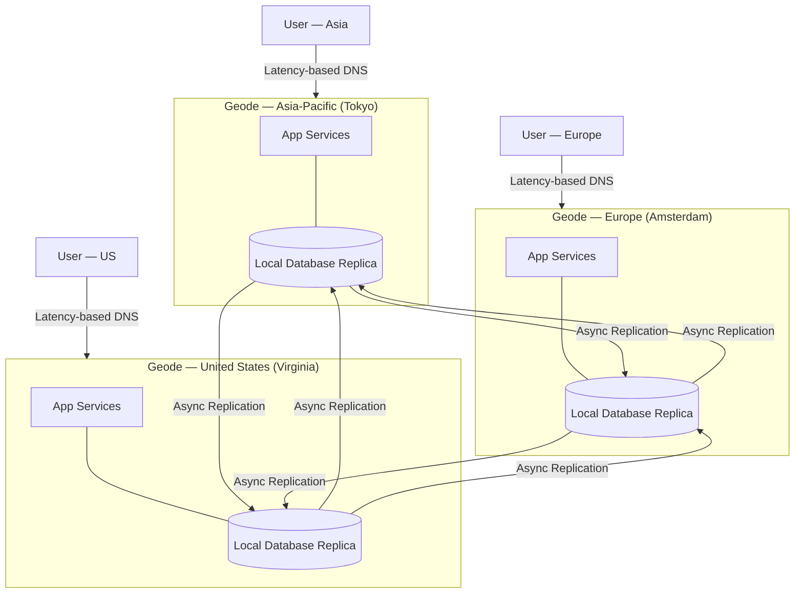

# 🌍 Geodes

> [!abstract] TL;DR
> Deploy full-capability backend nodes ("geodes") in multiple geographic regions so that ANY geode can serve ANY user request. Unlike Deployment Stamps (tenant-isolated silos), geodes share data globally through replication — users always hit their nearest geode but get a consistent, fully-capable response.

## Intent

Deploy geographically distributed, active-active service nodes that each possess full capability to handle any request, routing users to the nearest node via anycast/latency-based DNS while replicating state globally so no node is a single point of failure or a designated "primary."

## Problem It Solves

Global applications face a fundamental tension:

- **Latency vs. consistency** — a single central data center has consistent data but forces distant users (Asia hitting a US server) through high-latency intercontinental links (100–300ms RTT).
- **Active-passive regional failover is slow** — promotion of a passive replica during a regional outage takes minutes (DNS TTL propagation, failover orchestration), creating visible downtime.
- **Deployment stamps isolate too aggressively** — stamps prevent cross-tenant or cross-region data sharing, which is wrong for consumer apps where a user's session should follow them globally.
- **Regional primary-replica read scaling is asymmetric** — reads scale regionally, but all writes still funnel to a single primary, bottlenecking write-heavy workloads.

The goal: **serve any user from any region with low latency, while maintaining global state coherence, with no single region as a critical dependency.**

## Solution / How It Works

A **geode** is a full-capability node deployed in a region. Unlike a CDN edge node (cache only) or a replica (reads only), a geode:

- Accepts both **reads AND writes**
- Maintains a **local copy of data** (full dataset or relevant partition)
- **Asynchronously replicates** writes to all other geodes
- Responds to users from its **local data store** — no cross-region synchronous calls on the critical path

### Routing: Anycast / Latency-Based DNS

Users are routed to their geographically nearest geode using:
- **Anycast routing** (BGP-level — same IP, different physical endpoints) — used by Cloudflare
- **Latency-based DNS** (Azure Traffic Manager, AWS Route 53 latency routing) — DNS resolves the record to the nearest geode's IP
- **GeoDNS** — DNS returns different IPs based on the querying client's inferred region

### Data Replication

Geodes achieve consistency through **asynchronous multi-master replication**:
- A write to Geode Asia is immediately acknowledged to the client
- The write propagates asynchronously to Geode EU and Geode US
- **Conflict resolution** is required if two geodes accept conflicting writes on the same record (Last-Write-Wins, CRDT, application-level merge)
- Target: **eventual consistency** with [[Replication|replication]] lag typically < 1 second across regions with low jitter

### Mermaid Diagram

### Geodes vs. Deployment Stamps — Key Distinction

| Dimension | Deployment Stamps | Geodes |
|---|---|---|
| **Write model** | Each stamp is the only writer for its tenants | All geodes accept writes |
| **Data sharing** | Stamps do NOT share data | Geodes replicate data globally |
| **Routing** | Tenant-to-stamp mapping (registry lookup) | Nearest-geode routing (DNS/anycast) |
| **Failure impact** | One stamp's failure is isolated | Users rerouted to next-nearest geode |
| **Use case** | B2B SaaS tenant isolation | Consumer apps, global APIs, CDN-like services |
| **Consistency** | Strong within a stamp | Eventual across geodes |

## When to Use

- **Consumer-facing global applications** where users span continents and sub-100ms latency matters (social networks, streaming platforms, gaming).
- **High availability with zero regional dependency** — if any single region going dark should not degrade your service.
- **Read-heavy globally distributed workloads** where you want reads served locally in every region.
- **Write-scalable global APIs** where writing only to a single primary creates a geographic bottleneck.
- **Active-active redundancy** as a stronger alternative to active-passive regional failover.

## When NOT to Use

- **Strong consistency is non-negotiable** — if your business logic requires guaranteed linearizability across all regions (e.g., financial ledger, inventory with exact counts), multi-master geodes create unacceptable conflict risk. Use a single-region primary or distributed consensus (e.g., CockroachDB, Spanner) instead.
- **Simple applications with a regional user base** — if 90% of your users are in one country, geodes add enormous complexity for minimal latency benefit.
- **Data sovereignty / compliance requirements** — if EU data must NEVER leave the EU, geodes that replicate globally can violate compliance. Use Deployment Stamps instead.
- **Teams without distributed systems expertise** — conflict resolution, replication lag handling, and split-brain scenarios require specialized knowledge to implement correctly.

## Real-World Example

- **Cloudflare's Global Network**: Every Cloudflare PoP (point of presence) is a geode — it does not merely cache; it processes requests including WAF rules, Workers (serverless compute), and DDoS mitigation entirely locally. If one PoP fails, Anycast routing seamlessly shifts traffic to the next-nearest PoP.
- **Azure Cosmos DB with Multi-Region Writes**: Cosmos DB's multi-master mode is a direct implementation of the geode data layer. Each configured region accepts writes and asynchronously replicates to all other regions. Azure Traffic Manager routes application traffic to the nearest region.
- **Akamai's Edge Platform**: Akamai's origin shield and EdgeWorkers product lets compute execute at any edge node globally — full geode behavior, not just caching.
- **Amazon DynamoDB Global Tables**: Fully managed multi-master replication across AWS regions. Any region accepts writes; conflicts are resolved via Last-Write-Wins (timestamp-based). Paired with Route 53 latency routing for true geode behavior.

## Trade-offs

| Benefit | Drawback |
|---|---|
| Users hit their nearest region — minimal cross-continental latency | Eventual consistency — reads may return stale data immediately after a write in another geode |
| No single region is critical — any geode outage is transparent to users | Conflict resolution complexity — concurrent writes to the same record in different geodes require a merge strategy |
| Writes scale horizontally across regions — no single-primary write bottleneck | Replication amplification — a write to one geode triggers N−1 replication operations |
| Automatic failover via DNS/anycast — no manual intervention | Debugging is hard — a bug in one geode replicates globally before it is caught |
| Reduces the blast radius of regional cloud provider outages | Higher cost — full data storage replicated in every region |
| Active-active enables zero-downtime regional deployments | Replication lag (even if < 1s) can cause read-your-own-write violations without careful client-side handling |

## Implementation Considerations

1. **Choose a database with native multi-region write support**: Cosmos DB, DynamoDB Global Tables, CockroachDB, YugabyteDB, or Cassandra with multi-DC write topology. Do not build multi-master replication from scratch.
2. **Define a conflict resolution policy up front**: Choose from Last-Write-Wins (simplest), Custom Merge Procedures, or CRDT-based data structures. Document which entities can conflict and how.
3. **Read-your-own-write sessions**: After a user writes data in Geode Asia, their next read (which may hit Geode EU if they travel) should reflect the write. Implement session-sticky reads (always read from the region you wrote to for a short window) or use read-your-own-write tokens.
4. **Replication monitoring**: Track per-geode replication lag as a first-class metric. Alert on lag > 5 seconds. High replication lag is an early signal of a geode health problem.
5. **Fallback routing**: Configure health checks on each geode. If a geode's health check fails, latency-based DNS must automatically exclude it and route to the next-nearest geode.
6. **Test geode isolation failure**: Run chaos experiments where you partition one geode from the replication network and verify the other geodes continue serving correctly, with the isolated geode re-syncing on reconnect.
7. **Versioned data model**: Include a `last_modified` timestamp and `source_geode_id` on all mutable records to aid conflict resolution and debugging.

## Common Pitfalls

- **Assuming geodes behave like a single database** — geodes have eventual consistency, not ACID transactions across regions. Developers treating the system as strongly consistent introduce subtle correctness bugs.
- **Ignoring replication lag in UI** — users who write a post and immediately refresh may not see their own post if the read hits a different geode. This is jarring UX. Implement read-your-own-write or optimistic UI updates.
- **No conflict resolution strategy** — many teams defer conflict resolution to "we'll handle it when it happens." In a write-heavy multi-master system, conflicts happen daily at scale. Define the policy in the data model design phase.
- **Deploying a geode in a region with poor replication connectivity** — if a geode is in a region with high jitter to others (e.g., due to geographic isolation), replication lag spikes and conflicts increase. Measure cross-region RTT before adding a geode.
- **Replicating non-idempotent side effects** — if writes trigger email sends or payment charges, and those operations are replicated rather than deduplicated, users get double-charged or double-emailed. Ensure side effects are idempotent and fired exactly once.

## Related Concepts

- [[_MOC_Reliability_Patterns|↑ Section MOC]]
- [[Deployment_Stamps]] — Geographic isolation without global data replication; the contrasting pattern
- [[Replication]] — The foundational database mechanism that enables geodes
- [[Failover]] — Geodes eliminate the failover window by being active-active rather than active-passive
- [[CDNs]] — CDNs are read-only geodes for static content; the Geode pattern extends this to dynamic compute and writes
- [[CAP_Theorem]] — Geodes choose AP (Availability + Partition Tolerance) over CP; understand this trade-off before adopting
- [[Consistency_Patterns]] — Eventual consistency is the consistency model geodes rely on; understand its implications

## Review Questions

1. **A user in Tokyo writes a profile update that gets committed to the Asia geode. 500ms later, the same user's mobile app (now connected via a different ISP that resolves to the EU geode) requests their profile. What problem might occur, and what implementation strategy addresses it?** The EU geode may not yet have received the replication of the write (replication lag), returning the old profile. This is a read-your-own-write violation. Solutions: (a) session-sticky reads — pin the user's reads to the geode where they wrote for a short TTL window; (b) optimistic UI — display the locally submitted update immediately without waiting for a server read; (c) include a "write token" (lamport timestamp) in the write response, and the client includes it in subsequent reads so the geode waits for that version before responding.

2. **Geodes vs. Deployment Stamps: a global consumer social network vs. a B2B SaaS CRM — which pattern fits each and why?** Social network → Geodes: users travel globally and expect their data to follow them; data is shared (anyone can view anyone's public post); write-scalability across regions matters; eventual consistency is acceptable. CRM → Deployment Stamps: enterprises demand data isolation (one company's CRM data must never be visible to another); data sovereignty (EU customer data stays in EU); failure isolation (one enterprise's incident shouldn't degrade another's).

3. **What [[CAP_Theorem|CAP theorem]] position do Geodes occupy, and what does this mean practically for a banking transfer between two accounts?** Geodes choose Availability + Partition Tolerance (AP) — they sacrifice strong Consistency during network partitions. For banking transfers, this is typically unacceptable: if a $1,000 debit writes to Geode US and the credit writes to Geode EU while a network partition prevents replication, the system could temporarily show the debit without the credit or allow a double-spend. Banking systems should use CP databases (e.g., Spanner, CockroachDB with serializable isolation) or a single-region primary for financial ledger operations.

## Sources

- [Microsoft Azure Architecture Center — Geodes Pattern](https://learn.microsoft.com/en-us/azure/architecture/patterns/geodes)
- [Cloudflare — How Cloudflare's Global Anycast Network Works](https://www.cloudflare.com/learning/cdn/glossary/anycast-network/)
- [AWS — DynamoDB Global Tables](https://docs.aws.amazon.com/amazondynamodb/latest/developerguide/GlobalTables.html)
- [Azure Cosmos DB — Multi-Region Writes](https://learn.microsoft.com/en-us/azure/cosmos-db/high-availability#multi-region-writes)
- Kleppmann, Martin — *Designing Data-Intensive Applications*, Chapter 5 (Replication), Chapter 9 (Consistency and Consensus)

#SystemDesign #ReliabilityPatterns #Availability #Geodes #GlobalDistribution #ActiveActive #DistributedSystems
