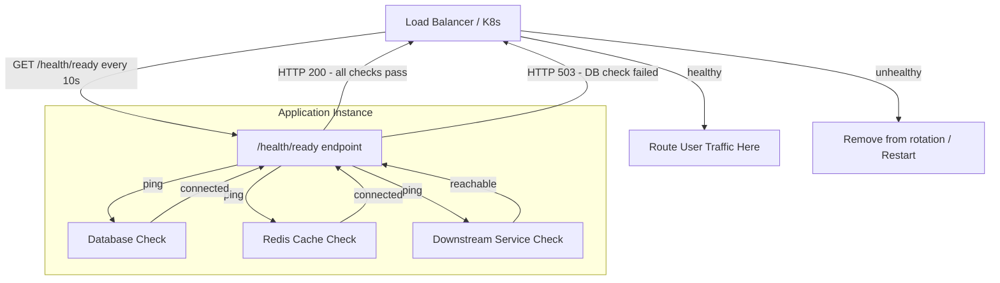

# 🩺 Health Endpoint Monitoring

> [!abstract] TL;DR
> Expose a dedicated `/health` endpoint that automated systems ([[Load_Balancers|load balancers]], orchestrators, monitoring tools) probe at regular intervals to determine if an instance is alive, ready to serve traffic, and functionally healthy — including its dependencies. Unhealthy instances are automatically removed from rotation before users hit them.

## Intent

Implement functional health checks in an application that external monitoring tools can probe at regular intervals to make automated, data-driven decisions about traffic routing, instance replacement, and alerting.

## Problem It Solves

In distributed systems, processes can be alive but broken in subtle ways:

- **Silent failures** — a web server process is running (ping responds) but its database connection pool is exhausted. Every incoming request will fail, but the load balancer routes traffic to it anyway.
- **Slow death** — an instance is experiencing memory leaks and is 10 seconds from OOM-kill, but looks healthy from the outside.
- **Dependency failures** — the app itself is fine, but the Redis cache it depends on is unreachable. The app silently falls back to degraded behavior that no one notices until users complain.
- **Startup race conditions** — a container starts and the process is running, but initialization (DB migrations, loading ML models) is not complete. Requests fail until initialization finishes.
- **No automated remediation** — without programmatic health signals, ops teams must manually detect failures and remove instances from rotation.

The fundamental question: **how do infrastructure automation tools know whether an instance should be sent real user traffic?**

## Solution / How It Works

The application exposes one or more dedicated HTTP endpoints (typically `/health`, `/health/live`, `/health/ready`) that:
1. Perform lightweight internal checks on the application and its dependencies
2. Return a structured response indicating health status
3. Use HTTP status codes for machine-readable signaling (200 = healthy, 503 = unhealthy)

### Three Health Check Levels

| Probe Type | Question | What It Checks | Action on Failure |
|---|---|---|---|
| **Liveness** | "Is the process alive?" | Process is running and not deadlocked | Restart the container |
| **Readiness** | "Is it ready for traffic?" | Dependencies (DB, cache) are reachable; initialization complete | Remove from load balancer rotation |
| **Startup** | "Has it finished starting up?" | One-time initialization completed | Delay liveness/readiness checks until startup passes |

> [!tip] [[Kubernetes_for_SD|Kubernetes]] uses all three probe types against separate endpoints:
> - `livenessProbe` → `/health/live`
> - `readinessProbe` → `/health/ready`
> - `startupProbe` → `/health/startup`

### Standard Response Format

```json
GET /health/ready

HTTP 200 OK
{
  "status": "healthy",
  "version": "2.4.1",
  "timestamp": "2026-07-26T08:15:30Z",
  "checks": [
    { "name": "database", "status": "healthy", "latencyMs": 3 },
    { "name": "redis_cache", "status": "healthy", "latencyMs": 1 },
    { "name": "payment_service", "status": "degraded", "latencyMs": 890, "message": "High latency detected" },
    { "name": "blob_storage", "status": "healthy", "latencyMs": 12 }
  ]
}
```

```json
GET /health/ready

HTTP 503 Service Unavailable
{
  "status": "unhealthy",
  "checks": [
    { "name": "database", "status": "unhealthy", "error": "Connection refused: postgres:5432" },
    { "name": "redis_cache", "status": "healthy", "latencyMs": 1 }
  ]
}
```

### Mermaid Diagram



### Health Check Depth Guidelines

| Dependency | Include in Readiness? | Include in Liveness? | Rationale |
|---|---|---|---|
| Primary database | Yes | No | DB failure = not ready; app itself may still be alive |
| Redis cache | Yes (if critical) | No | Degraded without cache but not dead |
| Third-party API | No (or separately) | No | External failure shouldn't kill your pod |
| Disk space | Yes if critical | Optionally | Disk full = can't write logs or data |
| Thread pool exhaustion | Yes | Yes | No threads = effectively dead |

## When to Use

- **Always** — health endpoint monitoring is a foundational pattern for any service that runs in an orchestrated environment (Kubernetes, ECS, App Service).
- **Load-balanced applications** — the load balancer uses health checks to decide which backends are eligible to receive traffic.
- **[[Microservices|Microservices]]** — with many independent services, automated health checking is the only scalable way to detect and respond to failures.
- **Auto-healing infrastructure** — if you want Kubernetes to automatically restart unhealthy pods or if you want ASGs to replace unhealthy EC2 instances.
- **Pre-production gating** — use readiness probes to ensure a new deployment is fully initialized before receiving production traffic (zero-downtime rolling deployments).

## When NOT to Use

- **Health checks should not be complex business logic** — do not run expensive SQL queries or business rule validations in health checks. Keep them lightweight (target < 50ms total response time).
- **Avoid cascading health check failures** — if your health check hits every downstream dependency, and one unrelated dependency is down, your pod gets killed even though it could still serve most requests. Be selective about which dependencies are checked.
- **Do not expose sensitive data** — health endpoints are often publicly accessible. Never include connection strings, credentials, or internal topology information in health responses.

## Real-World Example

- **Spring Boot Actuator**: Spring Boot's `/actuator/health` endpoint is the canonical implementation. It auto-discovers registered health indicators (DataSource, Redis, Kafka) and aggregates their status. Returns `UP`, `DOWN`, or `OUT_OF_SERVICE` with per-component details.
- **Django Health Check library**: `django-health-check` provides pluggable health check backends for database, cache, storage, and custom checks, exposed at a configurable URL.
- **AWS ALB Target Group Health Checks**: Application Load Balancer pings a configured health check path (default: `GET /`) at regular intervals. Instances with 2+ consecutive failures (configurable) are marked unhealthy and removed from the target group — no manual intervention required.
- **Kubernetes Probes**: Kubernetes' liveness and readiness probes are the most sophisticated deployment of this pattern. A pod failing its readiness probe is removed from all Service endpoints (stops receiving traffic) without being restarted. A pod failing its liveness probe is killed and replaced with a fresh container.
- **Azure App Service Health Check**: Azure's health check feature monitors a custom path and replaces instances that fail health checks, rerouting traffic to healthy instances automatically.

## Trade-offs

| Benefit | Drawback |
|---|---|
| Automated failure detection — no human needed to notice and respond | Health checks add CPU/network overhead on every instance at every interval |
| Load balancers stop sending traffic to broken instances before users notice | Overly aggressive checks can cause flapping — instances cycling in/out of rotation on transient errors |
| Kubernetes can auto-restart deadlocked containers via liveness probes | Health endpoint itself can become a bottleneck if it performs heavy dependency checks |
| Provides a machine-readable operational signal for dashboards and alerting | False positives (a briefly unreachable dependency causing permanent removal) can reduce capacity unexpectedly |
| Enables zero-downtime deployments — new pods only receive traffic when ready | Developers may not keep health checks current as dependencies change, creating stale signals |
| Standard interface across services enables uniform monitoring tooling | Publicly exposed health endpoints leak internal architecture if not carefully designed |

## Implementation Considerations

1. **Separate liveness from readiness**: Liveness (is the process alive?) and readiness (can it serve traffic?) are different questions. Conflating them causes Kubernetes to restart pods that are merely waiting for a dependency to recover — wasting time and creating churn.
2. **Health check timeout and response time**: Health checks must complete quickly (target < 200ms). Set an explicit timeout on each dependency check (e.g., DB ping timeout = 50ms). A slow health check blocks the probe and may be treated as a failure.
3. **Authentication on health endpoints**: Liveness endpoints should be publicly accessible (the orchestrator needs them). Detailed readiness/startup responses (with component names and latencies) should require authentication or be on a private network interface only.
4. **Graceful degradation vs. unhealthy**: Not every dependency failure means the service is fully unhealthy. Use a `degraded` status for non-critical dependency failures. Only return 503 for failures that genuinely prevent the service from fulfilling its primary function.
5. **[[Circuit_Breaker|Circuit breaker]] integration**: Do not call a dependency in the health check that is already tripped by a circuit breaker. If the circuit breaker is open, report that dependency as degraded (not healthy) without making a live call that adds load to the struggling dependency.
6. **Include version and build information**: `{"version": "2.4.1", "commit": "abc123", "deployedAt": "..."}` — this is invaluable when debugging which version is running in a canary or rolling deployment scenario.
7. **Alert on sustained health check failures, not single failures**: One failed health check can be a transient blip. Alert when an instance has been unhealthy for > 60 seconds or when > N% of instances in a region are unhealthy simultaneously.

## Common Pitfalls

- **Health endpoint that always returns 200** — developers implement the endpoint as a stub that always passes. The load balancer "trusts" unhealthy instances. Health checks must actually check things.
- **Checking the wrong dependencies** — checking an optional CDN in the health endpoint while not checking the primary database means the instance gets marked unhealthy for irrelevant reasons and healthy for critical ones.
- **Liveness probe that checks dependencies** — if the liveness probe calls the database and the DB is temporarily unreachable (30s outage), Kubernetes kills and restarts every pod, making the DB outage far worse due to reconnection storms.
- **Health check interval too aggressive** — probing every 1 second at 500 replicas generates 500 req/s of synthetic traffic to your health endpoint. Set realistic intervals (10–30s for readiness, 30–60s for liveness).
- **No health check on third-party dependencies you don't control** — if your app calls a payment gateway, do not include it in your readiness probe. You cannot control that service; its downtime should not take your instances out of rotation.
- **Forgetting to update health checks as architecture evolves** — a team adds a new critical dependency (new message queue) but doesn't add it to the health check. Failures go undetected by automation.

## Related Concepts

- [[_MOC_Reliability_Patterns|↑ Section MOC]]
- [[Monitoring]] — Health endpoints feed into the broader monitoring and observability strategy
- [[Circuit_Breaker]] — Circuit breakers protect against dependency failures; health endpoints report their state
- [[Load_Balancers]] — The primary consumer of health endpoint signals for traffic routing decisions
- [[Failover]] — Health monitoring enables automated failover by detecting failure before manual intervention
- [[Kubernetes_for_SD]] — Kubernetes liveness, readiness, and startup probes are the canonical deployment of this pattern
- [[Microservices]] — Health endpoint monitoring is essential at microservices scale where manual monitoring is infeasible

## Review Questions

1. **Kubernetes has three probe types: liveness, readiness, and startup. For each, explain what it checks, what Kubernetes does when it fails, and give a concrete scenario where using the wrong probe type causes problems.** Liveness checks if the process is alive (failure → restart pod). Readiness checks if it can serve traffic (failure → remove from Service endpoints). Startup checks if initialization is complete (failure → keep liveness/readiness probes paused). Wrong probe example: putting a database connectivity check in the liveness probe. If the DB has a 30-second network blip, ALL pods fail liveness and Kubernetes restarts them simultaneously, creating a reconnection storm that worsens the DB recovery.

2. **Design a health endpoint for a payment processing microservice that depends on: primary PostgreSQL database (critical), Redis session cache (critical), a third-party fraud-scoring API (non-critical, can degrade gracefully), and S3 audit log storage (non-critical).** Liveness (`/health/live`): only checks process-internal signals (thread pool, event loop). Readiness (`/health/ready`): checks PostgreSQL (500 → 503 if unreachable) and Redis (500 → 503). Fraud API and S3 are checked and reported as `degraded` in the response body but do NOT cause a 503 — the service can still process payments with degraded fraud scoring and local audit buffering. Response includes all four checks with their latencies and statuses.

3. **What is the difference between a "health check" and "monitoring," and why do you need both?** Health checks are pull-based, automated, low-latency signals that infrastructure systems (load balancers, orchestrators) use to make real-time routing and restart decisions. They are binary (healthy/unhealthy) and designed for machines, not humans. Monitoring is the broader collection, storage, visualization, and alerting on metrics, logs, and traces over time — it tells you WHY something is unhealthy, how long it has been degraded, what the trend is, and which users were affected. Health checks trigger automated remediation; monitoring enables root cause analysis, capacity planning, and SLA reporting. You need both: health checks for immediate automated response, monitoring for understanding and improvement.

## Sources

- [Microsoft Azure Architecture Center — Health Endpoint Monitoring Pattern](https://learn.microsoft.com/en-us/azure/architecture/patterns/health-endpoint-monitoring)
- [Kubernetes — Configure Liveness, Readiness and Startup Probes](https://kubernetes.io/docs/tasks/configure-pod-container/configure-liveness-readiness-startup-probes/)
- [Spring Boot Actuator — Health Information](https://docs.spring.io/spring-boot/docs/current/reference/html/actuator.html#actuator.endpoints.health)
- [AWS — ALB Target Group Health Checks](https://docs.aws.amazon.com/elasticloadbalancing/latest/application/target-group-health-checks.html)

#SystemDesign #ReliabilityPatterns #Availability #HealthEndpoint #Monitoring #Kubernetes #LoadBalancing
