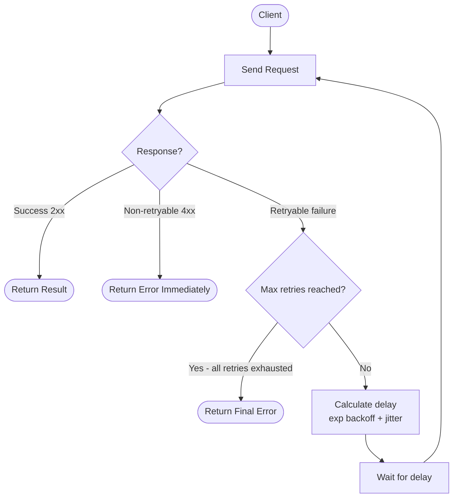

# 🔄 Retry Pattern

> [!abstract] TL;DR
> Automatically retry a failed operation a limited number of times with increasing delays (exponential backoff) and randomized timing (jitter) before declaring failure. Essential for handling the transient faults that are ubiquitous in distributed systems — but only for safe-to-retry (idempotent) operations.

## Intent

Enable an application to transparently handle transient failures when connecting to a service or network resource by automatically retrying failed operations with configurable delay strategies, preventing single transient faults from propagating as errors to the caller.

## Problem It Solves

Distributed systems experience transient failures constantly. Unlike permanent failures (a service is decommissioned), transient failures are brief, self-correcting conditions:

- **Network packet loss** — a TCP packet drops in a congested network; the operation fails but the same request would succeed 100ms later.
- **Brief service overload** — a downstream service returns `503 Service Unavailable` during a momentary traffic spike; it recovers in 2 seconds.
- **Database connection pool exhaustion** — a pool timeout occurs during peak load, but a connection frees up within milliseconds.
- **Cloud provider throttling** — AWS S3 returns `503 SlowDown` when request rate exceeds a bucket's throughput; back off and retry.
- **Cold start latency** — a serverless function cold-starting returns a timeout; the second call hits a warm instance.

Without retries, every transient fault becomes a visible user error. With naive retries (retry immediately, retry forever), you create **[[Retry_Storm|retry storms]]** that amplify load on an already-struggling service, making failures worse and longer.

The goal: **recover transparently from transient failures while avoiding contribution to cascading overload.**

## Solution / How It Works

The retry pattern intercepts failures and applies a retry policy before surfacing the error to the caller. A complete retry policy defines:

### 1. What to Retry (Retryable vs. Non-Retryable)

| HTTP Status | Retry? | Reason |
|---|---|---|
| `503 Service Unavailable` | Yes | Transient overload |
| `429 Too Many Requests` | Yes (with backoff) | Rate limited; back off and retry |
| `500 Internal Server Error` | Conditionally | Depends on idempotency |
| `408 Request Timeout` | Yes (if [[Idempotent_Operations|idempotent]]) | Network timeout |
| `400 Bad Request` | Never | Client error; retrying won't fix malformed data |
| `401 Unauthorized` | Never | Retrying without fixing credentials fails again |
| `404 Not Found` | Never | Resource doesn't exist; retry won't create it |
| `409 Conflict` | Never (or with logic) | Optimistic lock conflict; retry may need to reload data |

**Rule**: Only retry on **idempotent operations** OR ensure the operation is designed to be idempotent. Retrying a non-idempotent POST that already succeeded (creating a record) duplicates data.

### 2. Delay Strategies

```
Fixed delay:           attempt 1 → 1s → attempt 2 → 1s → attempt 3
Linear backoff:        attempt 1 → 1s → attempt 2 → 2s → attempt 3 → 3s
Exponential backoff:   attempt 1 → 1s → attempt 2 → 2s → attempt 3 → 4s → attempt 4 → 8s
Exp backoff + jitter:  attempt 1 → rand(0,1)s → attempt 2 → rand(0,2)s → attempt 3 → rand(0,4)s
```

### Exponential Backoff with Full Jitter (AWS-recommended formula)

```
delay = random_between(0, min(cap_ms, base_ms × 2^attempt))

Example (base=100ms, cap=10000ms):
  attempt 0: random(0, 100ms)
  attempt 1: random(0, 200ms)
  attempt 2: random(0, 400ms)
  attempt 3: random(0, 800ms)
  attempt 4: random(0, 1600ms)
  attempt 5: random(0, 3200ms)
  attempt 6+: random(0, 10000ms)  ← capped
```

**Why jitter?** Without jitter, all clients that hit an error at the same time (e.g., a brief service hiccup at T+0) will ALL retry at T+1s simultaneously, creating a synchronized retry storm — a second wave of load even larger than the original. Jitter spreads retries across time, smoothing the load curve.

### Mermaid Diagram



### Key Configuration Parameters

| Parameter | Typical Value | Notes |
|---|---|---|
| `max_retries` | 3–5 | More retries = longer total latency on failure |
| `base_delay_ms` | 100–500ms | Starting backoff delay |
| `max_delay_ms` | 5000–30000ms | Cap to prevent infinite delay growth |
| `jitter` | Full or decorrelated | Full jitter (AWS recommendation) |
| `retry_on_status` | [408, 429, 500, 503] | Explicitly enumerate retryable codes |
| `total_timeout` | 30s–120s | Hard wall clock limit across ALL attempts |

## When to Use

- **All outbound network calls** to external services, databases, and message brokers in distributed systems — transient faults are inevitable.
- **Cloud service SDK calls** — AWS, Azure, and GCP services have documented transient error codes; always retry them.
- **Message queue consumers** — if processing fails, re-enqueue the message with a backoff rather than immediately retrying.
- **Database operations** — connection pool timeouts, deadlock-related errors, and brief replication lag failures are candidates.
- **API calls to third-party services** — payment gateways, email services, and SMS providers all experience transient failures.

## When NOT to Use

- **Non-idempotent operations without idempotency keys** — retrying a payment charge without an idempotency key double-charges the customer. Either add an idempotency key or do not retry.
- **Permanent failures (4xx errors)** — retrying a `404` or `400` wastes time and resources; the result will be the same every time.
- **When a [[Circuit_Breaker|circuit breaker]] is open** — if the circuit breaker has detected the downstream is overwhelmed and opened, retrying sends more load to a struggling service. The retry pattern must integrate with circuit breaker state.
- **Long-running operations with side effects** — if an operation creates external state (writes to a ledger, sends a notification), naive retry logic without idempotency violates data integrity.
- **Real-time / latency-critical paths** — retrying with exponential backoff can add hundreds of milliseconds or seconds to P99 latency. For user-facing, sub-50ms paths, fail fast instead and use fallbacks.

## Real-World Example

- **AWS SDK**: All AWS SDKs implement exponential backoff with full jitter by default for retryable errors. The SDK transparently retries `ThrottlingException`, `RequestTimeout`, and transient `InternalError` codes without application code knowing.
- **Stripe API**: Stripe's client libraries automatically retry idempotent requests (GET, DELETE, POST with `Idempotency-Key` header) on network errors and `500`/`503` responses with exponential backoff. The idempotency key guarantees that retried POSTs do not double-charge customers.
- **Polly (.NET)**: Polly is the de facto retry/resiliency library for .NET. It provides a fluent API for defining retry policies: `Policy.Handle<HttpRequestException>().WaitAndRetryAsync(3, attempt => TimeSpan.FromSeconds(Math.Pow(2, attempt)))`.
- **Resilience4j (Java)**: The Java equivalent of Polly for Spring Boot applications. Provides `RetryRegistry` with configurable retry policies that integrate with `@Retry` annotations.
- **Google Cloud Client Libraries**: GCP client libraries use exponential backoff with jitter for all API calls, respecting `Retry-After` headers from `429` responses.

## Trade-offs

| Benefit | Drawback |
|---|---|
| Transparent recovery from transient faults — users never see brief blips | Retries increase latency on the failure path — P99 latency can be several multiples of P50 |
| Dramatically reduces error rates for transient failure scenarios | Without jitter, synchronized retries amplify load (retry storm antipattern) |
| Simple to implement with library support (Polly, Resilience4j) | Incorrect retry configuration on non-idempotent operations causes data duplication |
| Standardized behavior across the codebase when using a shared policy | Retries can mask systemic issues — a dependency that's failing 20% of the time looks "healthy" if retries paper over failures |
| Respects downstream service rate limits when combined with `Retry-After` | Adds complexity to request lifecycle — harder to trace a single request across multiple attempts |

## Implementation Considerations

1. **Idempotency first**: Before adding retry logic to any write operation, ensure it is idempotent. Use idempotency keys (a unique request ID passed in a header), optimistic locking, or upsert semantics so that retrying the same request N times produces the same result as executing it once.
2. **Distinguish retry from timeout**: Set a `total_timeout` that is the hard limit across all retry attempts. Do not let retries extend indefinitely: `total_timeout = initial_timeout + sum(backoff_delays_for_max_retries)`.
3. **Propagate retry metadata**: Pass a `X-Retry-Count` header or correlation ID downstream so the receiving service knows this is a retry. This enables the server to deduplicate based on idempotency keys.
4. **Log all retry attempts**: Log at `WARN` level on each retry with the attempt number, delay, and error code. Log at `ERROR` on final failure after all retries exhausted. This makes root cause analysis tractable.
5. **Respect `Retry-After` headers**: If the server returns a `429 Too Many Requests` with a `Retry-After: 5` header, honor it — do not retry before that time regardless of your backoff calculation.
6. **Integrate with circuit breaker**: The retry policy should check if the circuit breaker for the target service is open. If open, fail immediately without retrying — you're not helping the recovering service by adding more load.
7. **Test failure scenarios explicitly**: Write tests that simulate transient failures (e.g., using WireMock or a fault injection proxy) and verify that your retry policy recovers correctly within the expected number of attempts.

## Common Pitfalls

- **Retry storms (the thundering herd problem)**: All clients fail simultaneously, all retry simultaneously, all create a second wave of traffic. Fix: add full jitter to all retry delays. This is the #1 retry antipattern.
- **Retrying non-idempotent operations**: A payment service retries a charge API call after a network timeout. The first call already succeeded (the timeout was on the response, not the request). The customer gets charged twice. Fix: use idempotency keys or only retry operations confirmed not yet executed.
- **Infinite retry loops**: A misconfigured retry policy with no `max_retries` or no `total_timeout` runs forever, tying up threads and connections. Always set both.
- **Masking systemic failures**: A service that should be failing with high error rate looks "healthy" because retries absorb the errors. The team doesn't notice degradation until retries can no longer paper over the failure rate. Fix: track and alert on `retry_rate` as a metric independently of final error rate.
- **Retrying on 500 without idempotency context**: A `500 Internal Server Error` from a POST might mean the operation half-completed. Retrying causes inconsistent state. Either make the operation idempotent or do not retry `500` on non-idempotent POSTs.
- **Not backing off enough under sustained load**: Using `base_delay=10ms` means 5 retries take < 300ms total, effectively creating a tight retry loop. Under sustained service degradation, use a base delay of at least 500ms–1s.

## Related Concepts

- [[_MOC_Reliability_Patterns|↑ Section MOC]]
- [[Circuit_Breaker]] — Circuit breakers prevent retrying when a dependency is known to be down; the two patterns are always used together
- [[Idempotent_Operations]] — Prerequisite for safe retries on write operations; understand before applying retry to non-GET calls
- [[Exponential_Backoff]] — The mathematical foundation of retry delay calculation
- [[Ambassador_Pattern]] — An ambassador sidecar can implement retry logic centrally for all services in a cluster, removing per-service retry code
- [[Health_Endpoint_Monitoring]] — Health checks detect when retries are consistently failing, signaling systemic failure
- [[Background_Jobs]] — Message queue consumers implement retry via dead-letter queues and requeue-with-delay patterns

## Review Questions

1. **Explain why exponential backoff alone is insufficient and jitter is required. Describe the retry storm scenario that jitter prevents.** Without jitter, if 1,000 clients all experience a failure at T=0 (e.g., the service returns 503 for 500ms due to a brief overload), they all calculate their first retry delay as exactly 1 second (with exponential backoff). At T=1s, all 1,000 clients retry simultaneously, creating a thundering herd of exactly the same magnitude as the original traffic — potentially overloading the just-recovering service again. With full jitter, each client's retry delay is independently randomized (e.g., between 0 and 1s), spreading 1,000 retries across 1 second of time and reducing instantaneous load by ~1000x compared to synchronized retries.

2. **A payment service retries a `POST /charges` request after receiving a network timeout. The customer's bank reports a double charge. What went wrong, and how would you redesign the retry logic?** The network timeout occurred on the response, not the request — the first POST was successfully processed by the payment provider (charge created), but the response never made it back to the caller due to network failure. The retry sent a second identical POST, creating a second charge. Fix: include an `Idempotency-Key: <uuid>` header (unique per user payment intent) with every POST. The payment provider deduplicates requests with the same idempotency key within a time window (e.g., 24h), returning the result of the original request instead of processing a new charge.

3. **You are implementing retry logic for calls to a third-party weather API that rate-limits to 100 req/min and returns `429` with `Retry-After: 30` when exceeded. What does your retry policy look like, and what would be wrong about applying standard exponential backoff here?** Standard exponential backoff starts at 100–500ms, which is far shorter than the 30-second `Retry-After` requirement — your retry would fail again immediately (the rate limit window hasn't reset). The correct policy: detect `429` specifically, extract the `Retry-After` header value, and wait exactly that duration (30s) before retrying, ignoring the standard backoff calculation for this specific error code. Additionally, add a circuit breaker that opens after 3 consecutive `429s` (you're being rate-limited; retrying more just burns through your remaining quota faster).

## Sources

- [Microsoft Azure Architecture Center — Retry Pattern](https://learn.microsoft.com/en-us/azure/architecture/patterns/retry)
- [AWS Architecture Blog — Exponential Backoff And Jitter](https://aws.amazon.com/blogs/architecture/exponential-backoff-and-jitter/)
- [Stripe — Idempotent Requests](https://stripe.com/docs/api/idempotent_requests)
- [Polly .NET Resilience Library](https://github.com/App-vNext/Polly)
- [Resilience4j Documentation — Retry](https://resilience4j.readme.io/docs/retry)

#SystemDesign #ReliabilityPatterns #Resiliency #Retry #ExponentialBackoff #Jitter #TransientFaults #Idempotency
