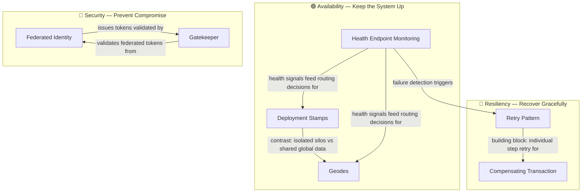

# 🗺️ Reliability Patterns — Map of Content

> [!abstract] What's in this section?
Patterns for building highly available, resilient, and secure distributed systems, organized into three conceptual groups: **Availability** (keeping the system up and routing traffic correctly), **Resiliency** (ensuring the system recovers gracefully from failures), and **Security** (ensuring the system cannot be compromised or bypassed). The 7 patterns here range from architectural-scale availability decisions (Deployment Stamps for tenant isolation, Geodes for active-active global distribution) to request-level resilience (Retry Pattern with exponential backoff) and security enforcement (Gatekeeper for business-level validation). Several closely related patterns — Circuit Breaker, Bulkhead, Rate Limiting, and general Health Monitoring — are already covered in other vault sections and are cross-referenced rather than duplicated.

## Concept Map

## Learning Path

Recommended reading order with one-line note descriptions.

### Availability — Start With Architecture

1. **[[Health_Endpoint_Monitoring]]** — Expose a `/health` endpoint that load balancers and orchestrators probe to automatically remove broken instances from rotation before users hit them.
2. **[[Deployment_Stamps]]** — Deploy self-contained, independent replicas of the full application stack per tenant or region so one stamp's failure never affects another.
3. **[[Geodes]]** — Deploy active-active backend nodes in multiple geographic regions, routing users to the nearest node via anycast/latency DNS while replicating state globally.

### Resiliency — Recovery Under Failure

4. **[[Retry_Pattern]]** — Automatically retry failed operations with exponential backoff and jitter; the foundational resilience primitive for transient fault handling.
5. **[[Compensating_Transaction]]** — When a multi-step distributed workflow fails midway, execute pre-designed semantic "undo" operations in reverse order to restore business-level consistency.

### Security — Enforce Boundaries

6. **[[Federated_Identity]]** — Delegate authentication to an external Identity Provider (Google, Okta, Azure AD); your application validates the signed token rather than managing credentials.
7. **[[Gatekeeper]]** — Place a dedicated, hardened broker between the internet and your backends; it validates, sanitizes, and authorizes requests at the business-logic level before any backend sees them.

## All Notes at a Glance

| Note | Category | What you'll learn |
|------|----------|-------------------|
| [[Health_Endpoint_Monitoring]] | Availability | `/health` endpoints for automated traffic routing and instance replacement |
| [[Deployment_Stamps]] | Availability | Full-stack per-tenant/region isolation for blast-radius containment and data sovereignty |
| [[Geodes]] | Availability | Active-active globally distributed nodes with anycast routing and async replication |
| [[Retry_Pattern]] | Resiliency | Exponential backoff with full jitter; idempotency prerequisites; retry storm prevention |
| [[Compensating_Transaction]] | Resiliency | Semantic rollback across service boundaries; the building block of Saga workflows |
| [[Federated_Identity]] | Security | OIDC authorization code flow; JWT validation; SSO across applications |
| [[Gatekeeper]] | Security | Business-level authz + input sanitization + network isolation of backend services |

## Key Questions This Section Answers

1. **How do I ensure a noisy-neighbor enterprise tenant cannot degrade other tenants — and keep EU customer data physically inside the EU?** → [[Deployment_Stamps]]
2. **My users are spread across Asia, Europe, and the US — how do I serve everyone with sub-100ms latency without a primary-region bottleneck?** → [[Geodes]]
3. **How does Kubernetes know whether to restart a pod, remove it from the load balancer, or wait for it to finish initializing?** → [[Health_Endpoint_Monitoring]]
4. **A network blip returns a 503 — how do I transparently recover without surfacing errors to the user, without triggering a retry storm?** → [[Retry_Pattern]]
5. **A 5-step booking workflow fails on step 4 — how do I undo the hotel reservation and payment charge that already committed?** → [[Compensating_Transaction]]
6. **How do I let users sign in with their Google or corporate Okta account without my app ever storing a password?** → [[Federated_Identity]]
7. **How do I prevent SQL injection, unauthorized tenant data access, and unknown field exploits from ever reaching my backend services?** → [[Gatekeeper]]

## Patterns Already Covered Elsewhere

These closely related patterns are referenced here but already exist in other vault sections:

| Pattern | Vault Location |
|---------|---------------|
| Bulkhead | [[Bulkhead_Pattern]] in `24_Distributed_Systems` |
| Circuit Breaker | [[Circuit_Breaker]] in `19_API_Gateway` |
| Rate Limiting / Throttling | [[Rate_Limiting]] in `19_API_Gateway` |
| Health Monitoring (general) | [[Health_Monitoring]] in `18_Monitoring` |
| Leader Election | [[Consensus_and_Raft]] in `24_Distributed_Systems` |
| Queue-Based Load Leveling | [[Queue_Based_Load_Leveling]] in `27_Cloud_Design_Patterns` |

## Cross-Section Links

- [[_MOC_Cloud_Design_Patterns]] — Section 27 covers the Scheduling Agent Supervisor (which embeds the Retry Pattern for each Agent) and the Ambassador Pattern (which implements circuit breaking and retries at the proxy level)
- [[_MOC_API_Gateway]] — Circuit Breaker and Rate Limiting are the API Gateway section's foundational resilience patterns; Gatekeeper sits downstream of the gateway and adds business-level validation
- [[_MOC_Security]] — TLS, OAuth/JWT, and API Security are covered in depth in section 22; Federated Identity and Gatekeeper are the architectural patterns that build on those primitives
- [[_MOC_Monitoring]] — Health Endpoint Monitoring feeds the broader observability strategy covered in section 18; health probes trigger automated remediation while monitoring explains why something failed
- [[_MOC_SystemDesign_Master]] — Return to the master index
