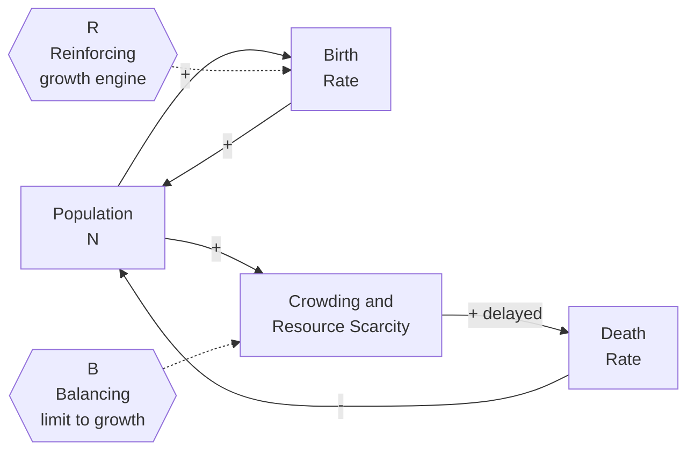

# 🔁 Feedback Loops and Causality

> [!abstract] TL;DR
> A **feedback loop** exists whenever a system's output loops back to become part of its own input, so a variable indirectly influences itself. **Reinforcing (positive) loops** amplify change and drive exponential growth or collapse (vicious and virtuous cycles); **balancing (negative) loops** counteract change and seek a goal (thermostats, homeostasis). The behavior of almost every interesting system, from populations to economies to your body temperature, is the tug-of-war between these two loop types, made unpredictable by **delays**, which turn smooth goal-seeking into overshoot and oscillation.

---

## Intuition

**Analogy — the shower with a lag.** You step into a shower that runs cold, so you crank the handle toward hot. Nothing happens for a few seconds (the hot water is still traveling up the pipe), so you crank it further. Suddenly scalding water hits you, so you yank it back toward cold, over-correct, and get an icy blast. You are a *balancing feedback loop* trying to reach a goal (comfortable temperature), but the *delay* between your action and its effect makes you overshoot in both directions. Now imagine a different loop: a rumor. Each person who hears it tells two more, who each tell two more. That is a *reinforcing loop* — the more it has spread, the faster it spreads.

Every system that surprises us is running these same two circuits. Straight-line "A causes B" thinking fails because in real systems **B also causes A**: causation runs in a circle, not a line. Learn to see the loops and you stop being surprised.

---

## How It Works

### From linear to circular causality

Ordinary reasoning is **linear**: *push harder on A, get more B*. But if B feeds back onto A, you have **circular causality** — a closed loop where a change propagates around the ring and returns, modified, to where it started. The character of a loop is decided by whether that returning signal *adds to* the original change or *subtracts from* it.

- **Reinforcing loop (R, positive):** the signal returns with the **same sign**. More begets more (or less begets less). An even number of negative links, or zero, around the loop. Produces exponential growth, exponential decay, or runaway collapse. Compound interest, viral spread, arms races, addiction, bank runs.
- **Balancing loop (B, negative):** the signal returns with the **opposite sign**. Any push is resisted; the loop drives the system toward a goal or equilibrium. An **odd** number of negative links around the loop. Produces goal-seeking and stability. Thermostats, body temperature, supply-and-demand pricing, a car's cruise control.

### Reading link polarity

In a **causal loop diagram (CLD)** every arrow carries a polarity:

- **"+"** (same direction): if the cause rises, the effect rises *above what it would otherwise have been* (and if the cause falls, the effect falls). Births "+" Population.
- **"-"** (opposite direction): if the cause rises, the effect falls below what it otherwise would. Deaths "-" Population.

**Identifying a loop's type:** trace all the way around and count the "-" links. **Odd number of negatives = balancing (B). Even (including zero) = reinforcing (R).** This counting rule always works, no matter how many variables the loop contains.

### Delays: why loops oscillate

A **delay** is a gap in time between a cause and its full effect. Delays are the reason feedback is hard to reason about:

- In a **reinforcing** loop, a delay just postpones and then unleashes the explosion (you underestimate how fast things will run away).
- In a **balancing** loop, a delay is dangerous. Because the corrective action is based on *stale information*, the system keeps correcting after it should have stopped, so it **overshoots** the goal, then over-corrects the other way. The result is **oscillation** — the shower, boom-bust inventory cycles, predator-prey population swings.

The stronger the loop gain and the longer the delay, the wilder the oscillation. Beyond a critical threshold the swings never damp out at all.

### Loop dominance and leverage

Real systems contain many loops running at once, and the one currently in charge is the **dominant loop**. Behavior changes character when dominance **shifts** — logistic growth is exactly a reinforcing loop (births) handing dominance to a balancing loop (crowding) as a population approaches its ceiling, bending exponential growth into an S-curve. **Leverage** means changing the *structure* of the loops (a link's polarity, a loop's gain, a delay's length) rather than pushing harder on a single variable; a small structural change to which loop dominates can transform the whole system's behavior.



*Trace the loops: **R** runs Population to Births to Population, zero negatives, so it amplifies. **B** runs Population to Crowding to Deaths to Population, exactly one negative, so it stabilizes. Early on R dominates and growth looks exponential; as N climbs, the delayed B loop takes over and, because of the delay, the population can overshoot its carrying capacity before settling.*

---

## Key Concepts

### Secondary (intuitive)

- **Feedback** = a result of an action feeds back to change the next action. A microphone near its own speaker (the screech) is feedback you can hear.
- **Reinforcing loop** = a snowball; the bigger it gets, the faster it grows. Good version = virtuous cycle (savings earning interest); bad version = vicious cycle (debt spiraling).
- **Balancing loop** = a thermostat; it pushes back toward a set target. Your body sweating to cool down is the same idea.
- **Delay** = a lag between doing something and seeing the effect, which is why the shower scalds you.

### Undergraduate (formal)

- **Sign convention & the counting rule:** label each causal link "+" or "-"; an odd count of "-" around a loop makes it balancing, an even count makes it reinforcing.
- **Growth laws:** an isolated reinforcing loop gives $\frac{dN}{dt}=rN \Rightarrow N(t)=N_0 e^{rt}$ (exponential). Add a balancing loop that depends on a limit and you get the **logistic** law $\frac{dN}{dt}=rN\left(1-\frac{N}{K}\right)$, an S-curve saturating at the carrying capacity $K$.
- **Goal-seeking:** a first-order balancing loop $\frac{dx}{dt}=-k\,(x-x^\*)$ decays exponentially to the goal $x^\*$ with time constant $1/k$; no delay means no overshoot.
- **Homeostasis** is a biological balancing loop; **compound interest** and **epidemics (early phase)** are reinforcing loops.

### Graduate (dynamics & control)

- **Delayed feedback and oscillation:** the delayed logistic (**Hutchinson equation**) $\frac{dN}{dt}=rN(t)\left(1-\frac{N(t-\tau)}{K}\right)$ undergoes a **Hopf bifurcation** at $r\tau=\pi/2$: below it the equilibrium is stable, above it a stable limit cycle (sustained oscillation) is born. Delay converts a stabilizing loop into an oscillator.
- **Predator-prey (Lotka-Volterra):** two coupled loops (prey feed predators "+", predators eat prey "-") with an inherent phase lag produce perpetual cycles — a canonical multi-loop system.
- **Loop dominance analysis / eigenvalue elasticity:** formal methods identify which loop's gain currently dominates the system's dominant eigenvalue, and predict when dominance will shift and behavior will change mode.
- **Control-theory bridge:** a balancing loop is negative feedback with a controller gain; excessive gain plus phase lag crosses a **stability margin** and the closed loop oscillates or diverges — the same mathematics as engineered feedback control.

---

## Python Demo

```python
# Simulate a system driven by a REINFORCING loop (births) and a
# BALANCING loop (resource-limited deaths) = logistic growth.
# Case 1: balancing loop acts instantly  -> smooth S-shaped growth.
# Case 2: balancing loop acts on DELAYED information -> overshoot + oscillation.
import numpy as np
import matplotlib.pyplot as plt

# --- Parameters ---
r  = 0.8       # intrinsic growth rate = strength of the REINFORCING loop
K  = 1000.0    # carrying capacity = goal of the BALANCING loop
N0 = 10.0      # initial population
dt = 0.01
T  = 60.0
steps = int(T / dt)
t = np.linspace(0, T, steps)

# --- Case 1: logistic growth, no delay ---
# dN/dt = r*N*(1 - N/K)
#   r*N        -> reinforcing loop (more N makes more N)
#   (1 - N/K)  -> balancing loop  (crowding brakes growth as N -> K)
N = np.zeros(steps)
N[0] = N0
for i in range(steps - 1):
    growth = r * N[i] * (1 - N[i] / K)
    N[i + 1] = N[i] + growth * dt

# --- Case 2: delayed logistic (Hutchinson equation) ---
# The crowding signal reflects the population tau time-units in the PAST,
# so the balancing loop keeps braking after it should have stopped.
# dN/dt = r*N(t) * (1 - N(t - tau)/K)
tau = 2.2                      # delay; note r*tau = 1.76 > pi/2 = 1.57 -> oscillates
lag = int(tau / dt)
Nd = np.zeros(steps)
Nd[0] = N0
for i in range(steps - 1):
    past = Nd[i - lag] if i - lag >= 0 else N0   # stale population estimate
    growth = r * Nd[i] * (1 - past / K)
    Nd[i + 1] = Nd[i] + growth * dt

# --- Plot ---
fig, ax = plt.subplots(figsize=(10, 5))
ax.axhline(K, color="grey", ls="--", lw=1, label="Carrying capacity K (the goal)")
ax.plot(t, N,  color="#27AE60", lw=2,
        label="No delay: reinforcing then balancing -> smooth S-curve")
ax.plot(t, Nd, color="#C0392B", lw=2,
        label="Delayed balancing loop -> overshoot & oscillation")
ax.set_xlabel("Time")
ax.set_ylabel("Population N")
ax.set_title("Reinforcing + Balancing loops: a delay turns goal-seeking into oscillation")
ax.legend(loc="lower right")
ax.grid(alpha=0.3)
plt.tight_layout()
plt.show()

# Quick numeric readout of the two behaviors
print(f"No-delay final N   : {N[-1]:.1f}  (settles at K without overshoot)")
print(f"Delayed peak N     : {Nd.max():.1f}  (overshoots K = {K:.0f})")
print(f"Delayed final N     : {Nd[-1]:.1f}  (still swinging around K)")
```

Running it shows the green curve gliding up in an S and parking on `K`, while the red curve blasts past `K`, falls back below it, and keeps ringing — the same population equation, made oscillatory purely by putting a **delay** in the balancing loop.

---

## Real-World Applications

- **Engineering / control:** a **thermostat** or cruise control is a textbook balancing loop; sensor lag or too-high gain makes it hunt and oscillate. The same math underlies PID controllers and closed-loop electronics.
- **Economics & business:** boom-bust **inventory cycles**, the **beer game**, housing-price swings, and bank runs are delayed balancing loops and self-reinforcing panics. **Compound interest** and network-effect platforms are reinforcing loops (winner-take-all).
- **Ecology:** **predator-prey** oscillations and **logistic** population growth toward carrying capacity are the archetypal two-loop and delayed-loop systems.
- **Physiology & medicine:** **homeostasis** (blood glucose, temperature, blood pressure) is balancing feedback; blood clotting and the fever/cytokine storm are reinforcing loops that must be capped.
- **Geopolitics & social systems:** **arms races** and escalating conflicts are reinforcing loops; addiction couples a reinforcing craving loop with an eroding-tolerance loop, which is why willpower alone (pushing on one variable) rarely wins against loop structure.

---

## Common Pitfalls

- **Linear thinking in a circular world** — assuming "A causes B" when B loops back onto A. You blame a single actor for what is really a loop producing the behavior, and your "fix" (pushing harder on one variable) gets neutralized by the balancing loop it triggers (**policy resistance**).
- **Ignoring delays** — the shower-handle mistake at scale. People over-correct because effects lag causes, converting a stable goal-seeking loop into destructive oscillation. Longer delay plus stronger action equals bigger swings.
- **Misjudging exponential (reinforcing) growth** — humans reason linearly and consistently underestimate compounding; the reinforcing loop looks harmless for a long time, then explodes "suddenly."
- **Mislabeling polarity** — forgetting the odd/even negative-link counting rule and calling a loop reinforcing when it is balancing (or vice versa), which inverts every prediction you make from the diagram.
- **Assuming loop dominance is fixed** — treating early exponential growth as permanent and missing the moment a balancing loop takes over (the S-curve's inflection), or vice versa. Behavior changes *because dominance shifts*.
- **Treating symptoms, not structure** — chasing the variable that hurts instead of finding the **leverage point** in the loop structure that generates it.

---

## Related Concepts

- [[Population_Ecology]] — logistic growth and predator-prey cycles are the canonical worked examples of a reinforcing loop handing off to (and oscillating against) a balancing loop.
- [[Homeostasis_and_the_Nervous_System]] — biological balancing feedback keeping temperature, glucose, and blood pressure at set points; a living negative-feedback controller.
- [[State_Feedback_Control]] — the engineering formalization of feedback: gains, poles, and stability margins are the quantitative version of loop dominance and oscillation.
- [[The_Power_of_Compounding]] — compound interest is a pure reinforcing loop; the financial face of exponential growth people chronically underestimate.
- [[BIBO_Stability]] — a feedback loop is stable when bounded inputs give bounded outputs; excessive gain plus delay is exactly what pushes a balancing loop into instability.

---

## Review Questions

1. **(Conceptual)** Explain the odd/even negative-link counting rule for classifying a causal loop. Why does a loop with two "-" links behave as *reinforcing* rather than balancing?
2. **(Scenario)** A city widens a highway to cut congestion, but within two years traffic is as bad as before. Draw the loops at work (including any delay), identify which is reinforcing and which is balancing, and explain the "policy resistance" in terms of loop dominance.
3. **(Trade-off / dynamics)** You have a balancing loop that reaches its goal too slowly. You increase the corrective gain to speed it up, but now it overshoots and oscillates. Explain, referencing the role of delay and the $r\tau=\pi/2$ threshold, why more aggressive correction can *destabilize* a goal-seeking system, and what you would change instead.

---

## Sources

- Meadows, Donella H. *Thinking in Systems: A Primer*. Chelsea Green, 2008.
- Sterman, John D. *Business Dynamics: Systems Thinking and Modeling for a Complex World*. McGraw-Hill, 2000.
- Forrester, Jay W. *Industrial Dynamics*. MIT Press, 1961.
- Hutchinson, G. E. "Circular Causal Systems in Ecology." *Annals of the New York Academy of Sciences* 50 (1948): 221-246.
- Strogatz, Steven H. *Nonlinear Dynamics and Chaos*. Westview Press, 2nd ed., 2015 (delay-induced oscillation and Hopf bifurcation).

---

#systems-thinking #feedback-loops #causality #causal-loop-diagram
