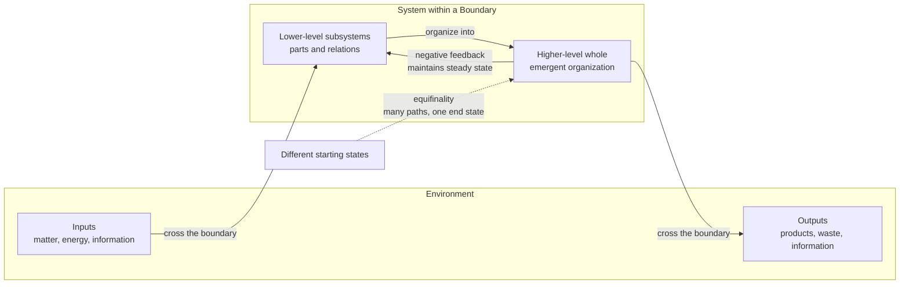

# 🌐 General Systems Theory

> [!abstract] TL;DR
> **General Systems Theory (GST)**, formulated by biologist **Ludwig von Bertalanffy** and consolidated in *General System Theory* (1968), argues that the same abstract principles — organization, wholeness, feedback, growth, steady state — recur across radically different domains, from cells to economies. Its central move is to study a system's **organization** rather than its material, so that a formal law discovered in physics can be an **isomorphism** of a law in biology or sociology. Key ideas: **open systems** that exchange matter and energy with an **environment** across a **boundary**, **equifinality** (the same end state reached from different starting points), **holism** over pure mechanism, and **hierarchy** of nested levels. It is a direct ancestor of cybernetics, control theory, and modern complexity science.

## Intuition

**Analogy:** Look at a whirlpool in a river, a candle flame, and a living cell. All three are *patterns that stay recognizably the same even though the stuff passing through them never stops changing*. Water molecules stream through the whirlpool and leave; wax and oxygen burn away in the flame and are replaced; a cell replaces nearly every atom in its body over months. Yet the whirlpool keeps its shape, the flame keeps its form, and you stay *you*. What persists is not the material — it is the **organization**, the pattern of relationships that maintains itself while matter and energy flow through.

General Systems Theory takes that observation and makes it a research program: if a whirlpool, a flame, and a cell all maintain a stable form by continuously exchanging matter with their surroundings, then perhaps there are laws of "systems that stay themselves by flowing" that hold regardless of whether the system is made of water, fire, protein, silicon, or people. Study the *pattern*, and one equation can describe them all.

---

## How It Works

### Core Mechanics

1. **A system is a set of interacting parts whose behavior as a whole is not reducible to the parts in isolation.** Bertalanffy's slogan: *the whole is more than the sum of its parts* — the "more" is the set of relationships. Cut the relationships and you lose the properties that only the organized whole exhibits (a working heart is more than a pile of its cells).

2. **Boundary, system, environment.** Every system is separated from its **environment** by a **boundary** that regulates what crosses. The boundary is what lets us say "this belongs to the system and that is outside." Where you draw the boundary is a modelling choice, and it determines what counts as input, output, and internal state.

3. **Open vs closed systems.** A **closed system** exchanges nothing with its environment; by the second law of thermodynamics it runs down toward maximum entropy and equilibrium (death, in biological terms). A **living or organizational system is open**: it continuously imports matter, energy, and information and exports products and waste. This import is what lets it *maintain order and even grow more ordered* over time without violating thermodynamics — the entropy is exported to the environment. This was Bertalanffy's key biological insight and the reason classical closed-system physics could not, on its own, explain life.

4. **Steady state and homeostasis.** An open system does not sit at thermodynamic equilibrium; it holds a **steady state** — a dynamic balance where inflows and outflows match, so state variables stay roughly constant while material keeps flowing (the flame's constant shape). Regulatory loops that push a variable back toward a set point give **homeostasis**.

5. **Equifinality.** In a closed mechanical system the final state is fixed by the initial conditions. In an open system, Bertalanffy observed, the *same* final state can be reached *from different initial conditions and by different paths* — this is **equifinality**. An embryo damaged early can still develop into a normal organism; two companies with different histories can converge on the same organizational structure. Equifinality means outcome is governed by present organization and constraints, not only by the past.

6. **Isomorphism across disciplines.** When the same formal structure — the same differential equation, the same feedback topology — describes phenomena in unrelated fields, we have an **isomorphism**. Exponential growth describes a bacterial colony, compound interest, and a chain reaction; logistic growth describes populations, product adoption, and epidemics. GST hunts for these shared forms so that mathematical results transfer between sciences.

7. **Hierarchy and levels of organization.** Systems nest: atoms in molecules, molecules in cells, cells in organisms, organisms in ecosystems, individuals in societies. Each level has **emergent** properties absent at the level below, and each level is simultaneously a whole (to its parts) and a part (of the level above). Arthur Koestler later called such two-faced units *holons*.

8. **Holism vs mechanism.** The 19th-century **mechanist** program explained a whole by decomposing it into independent parts and summing their behavior. GST is **holist** in a disciplined sense: it accepts analysis but insists that the *organization* of the parts is itself a legitimate object of study with its own laws, because emergent properties vanish under decomposition.

### Flow / Architecture



---

## Key Concepts

### Secondary
- **System:** a collection of parts that work together and produce behavior none of the parts shows alone.
- **Environment and boundary:** everything outside the system, and the dividing line that controls what goes in and out.
- **Open vs closed:** open systems trade matter and energy with the outside and can stay ordered; closed systems seal themselves off and run down.
- **The whole is more than the sum of its parts:** the relationships between parts create new properties.

### Undergraduate
- **Steady state:** a moving balance where a system's key quantities stay constant because inputs and outputs cancel, even though material keeps flowing through.
- **Equifinality:** an open system can reach the same final state from many different starting points and routes — outcome depends on present organization, not just initial conditions.
- **Isomorphism:** a shared formal structure (e.g., the same equation) linking phenomena in unrelated fields, letting mathematics transfer between them.
- **Hierarchy and emergence:** systems are nested in levels; each level has properties that emerge from, but are not reducible to, the level beneath it.
- **Holism vs mechanism:** two research styles — study the organized whole and its laws, versus decompose into independent parts and sum them.

### Graduate
- **Thermodynamic grounding:** living systems are dissipative open systems that maintain low internal entropy by exporting entropy to the environment; this reconciles biological order with the second law and prefigures Prigogine's dissipative structures and Schrödinger's "negative entropy."
- **Relation to cybernetics:** GST supplies the *ontology* (open systems, wholeness, hierarchy) while Wiener's **cybernetics** supplies the *mechanism* (feedback, control, information). They are complementary: cybernetics is essentially the control theory of the regulated systems GST describes.
- **From GST to complexity science:** GST's qualitative, discipline-spanning ambition was later given quantitative teeth by nonlinear dynamics, chaos theory, network science, and agent-based modelling — the Santa Fe Institute lineage of **complexity science** is GST's intellectual heir.
- **Organizational and social theory:** GST underpins Katz and Kahn's open-systems view of organizations, Luhmann's social-systems theory, and systems approaches in management and engineering (systems engineering, operations research).

---

## Python Demo

```python
# Demonstrates ISOMORPHISM: three unrelated physical processes obey the
# identical first-order linear ODE  dy/dt = -k * y, whose solution is
# y(t) = y0 * exp(-k t). Radioactive decay, Newtonian cooling (of the
# temperature EXCESS over ambient), and first-order drug elimination
# differ only in the constant k and units. Normalize each to start at 1
# and all three curves collapse onto one universal exponential-decay law.

import numpy as np
import matplotlib.pyplot as plt

def first_order_decay(y0, k, t):
    """Generic solution of dy/dt = -k*y."""
    return y0 * np.exp(-k * t)

# Three domains, three different rate constants and physical meanings.
# We express each on its own natural time axis, then normalize by its
# characteristic time tau = 1/k so the horizontal axis is dimensionless.

domains = {
    "Radioactive decay (Iodine-131, N atoms)":      dict(y0=1.0e9, k=np.log(2) / 8.02),   # k from half-life 8.02 days
    "Newtonian cooling (coffee, excess degC)":       dict(y0=60.0,  k=1.0 / 12.0),         # cooling time constant ~12 min
    "Drug elimination (plasma conc, mg/L)":          dict(y0=8.0,   k=np.log(2) / 4.0),    # elimination half-life 4 h
}

fig, (ax_raw, ax_norm) = plt.subplots(1, 2, figsize=(12, 4.5))

for label, p in domains.items():
    tau = 1.0 / p["k"]                     # each system's own characteristic time
    t = np.linspace(0, 5 * tau, 400)       # measure everyone in units of their own tau
    y = first_order_decay(p["y0"], p["k"], t)

    ax_raw.plot(t / tau, y, label=label, linewidth=2)     # raw magnitudes differ wildly
    ax_norm.plot(t / tau, y / p["y0"], linewidth=2, label=label)  # normalized -> identical

# Overlay the pure analytic law exp(-x) on the normalized panel.
x = np.linspace(0, 5, 400)
ax_norm.plot(x, np.exp(-x), "k--", linewidth=1.5, label="Universal law  exp(-x)")

ax_raw.set_title("Raw curves: different units, scales, and meanings")
ax_raw.set_xlabel("time / tau  (dimensionless)")
ax_raw.set_ylabel("quantity (native units)")
ax_raw.set_yscale("log")
ax_raw.legend(fontsize=8)
ax_raw.grid(True, alpha=0.3)

ax_norm.set_title("Normalized: three systems collapse to ONE isomorphic form")
ax_norm.set_xlabel("time / tau  (dimensionless)")
ax_norm.set_ylabel("fraction remaining  y / y0")
ax_norm.legend(fontsize=8)
ax_norm.grid(True, alpha=0.3)

plt.tight_layout()
plt.show()

# Sanity check: after one characteristic time every system is at 1/e ~ 0.368.
for label, p in domains.items():
    frac = first_order_decay(1.0, p["k"], 1.0 / p["k"])
    print(f"{label:45s} -> fraction at t=tau: {frac:.4f}")
```

Running it prints `0.3679` for all three systems and produces two panels: on the left the raw curves look nothing alike (billions of atoms vs. tens of degrees vs. milligrams), while on the right, once normalized, they lie exactly on top of one another and on the dashed `exp(-x)` curve. That single overlapping curve *is* the isomorphism — the point of GST made visible.

---

## Real-World Applications

- **Biology and physiology:** the open-system framing explains how organisms maintain order far from equilibrium; **homeostasis** and steady-state metabolism are textbook GST. Bertalanffy's own growth equations model organism size over time.
- **Ecology:** ecosystems modelled as energy-and-matter flow systems with trophic levels, feedback, and steady states descend directly from GST's open-system view.
- **Management and organization theory:** the "open-systems model of organizations" (Katz & Kahn) treats a firm as importing resources, transforming them, and exporting products, with feedback from the market — the dominant frame in modern organizational design.
- **Systems engineering and control:** GST's vocabulary of system, boundary, input/output, feedback, and steady state is the conceptual backbone of systems engineering, operations research, and control theory.
- **Software and IT architecture:** distributed systems reasoning about boundaries, interfaces, back-pressure (feedback), and steady-state load draws on the same open-system logic.
- **Family therapy and social work:** Bowen and structural family therapy explicitly model the family as a homeostatic system, where symptoms are properties of the whole, not just the individual.

---

## Common Pitfalls

- **Treating "the whole is more than the sum of its parts" as anti-analysis mysticism.** GST does not forbid decomposition; it says organization is an *additional* object of study. Using holism to excuse never measuring anything is a misreading.
- **Drawing the boundary carelessly.** Because boundary placement is a modelling choice, sloppy boundaries make the same phenomenon look like an input, an output, or internal state. Always state where the boundary is and why.
- **Confusing steady state with equilibrium.** Thermodynamic equilibrium is inert and closed (the flame is out); a steady state is dynamic and open (the flame burns steadily). Living systems are the second, never the first.
- **Over-generalizing an isomorphism.** A shared equation over a limited range does not mean two systems are "the same." Exponential growth breaks down once a resource constraint bites; forcing the analogy past its domain produces bad predictions.
- **The core critique — too abstract to predict.** Critics (including many working scientists) charge that GST's principles are so general they explain everything and therefore forbid nothing; without domain-specific mechanisms and math, GST risks being a vocabulary rather than a predictive theory. Its lasting value came when successors (cybernetics, nonlinear dynamics, complexity science) supplied the quantitative machinery GST itself lacked.

---

## Related Concepts

- [[Homeostasis_and_the_Nervous_System]] — the biological realization of GST's steady state and negative-feedback regulation in an open system.
- [[System_Properties]] — the engineering formalization of "system as input-to-output map," making GST's informal system concept mathematically precise (linearity, time-invariance, stability).
- [[State_Space_Basics]] — represents a system by its internal state variables and their evolution, the quantitative descendant of GST's system-and-state vocabulary.
- [[Ecosystems_and_Energy_Flow]] — an ecosystem modelled as an open system of matter and energy flow through trophic levels: GST applied to ecology.
- [[Explanation_and_Laws_of_Nature]] — the philosophy-of-science question of what a scientific law is, directly relevant to GST's claim that isomorphic laws span disciplines.
- [[Kuhn_and_Scientific_Revolutions]] — GST as an attempted cross-disciplinary paradigm, useful for weighing the "too general" critique against how paradigms actually gain traction.
- [[Cognitive_Science_Overview]] — cognitive science emerged alongside cybernetics and systems thinking as another attempt to find domain-independent principles of organized behavior.

---

## Review Questions

1. **(Conceptual)** Bertalanffy insisted living organisms are *open* systems. Explain how being open lets an organism maintain and even increase its internal order without violating the second law of thermodynamics. Why can a *closed* system never do this?
2. **(Scenario)** An early frog embryo is cut in half; each half develops into a complete, normal tadpole. Two startups with completely different founding stories both end up with the same three-tier engineering org chart. Name the single GST principle both cases illustrate, and explain what it implies about the relative importance of initial conditions versus present organization.
3. **(Trade-off / critique)** GST claims that finding an isomorphism — the same equation in two fields — is a genuine scientific discovery. A critic responds that such shared forms are "too general to predict anything specific." Using the exponential-decay example from the demo, argue both sides: what real explanatory work does the isomorphism do, and where exactly does it stop being useful?

---

## Sources

- von Bertalanffy, L. (1968). *General System Theory: Foundations, Development, Applications.* George Braziller. — the founding synthesis.
- Wiener, N. (1948). *Cybernetics: Or Control and Communication in the Animal and the Machine.* MIT Press. — the complementary theory of feedback and control.
- Boulding, K. E. (1956). "General Systems Theory — The Skeleton of Science." *Management Science, 2*(3), 197–208. — the hierarchy-of-systems levels and the case for GST in the social sciences.
- Stanford Encyclopedia of Philosophy, ["Emergent Properties"](https://plato.stanford.edu/entries/properties-emergent/) — on wholes, parts, and emergence.
- Meadows, D. H. (2008). *Thinking in Systems: A Primer.* Chelsea Green. — a modern, accessible restatement of open-systems concepts (stocks, flows, feedback).

---

#systems-thinking #general-systems-theory #bertalanffy #isomorphism
