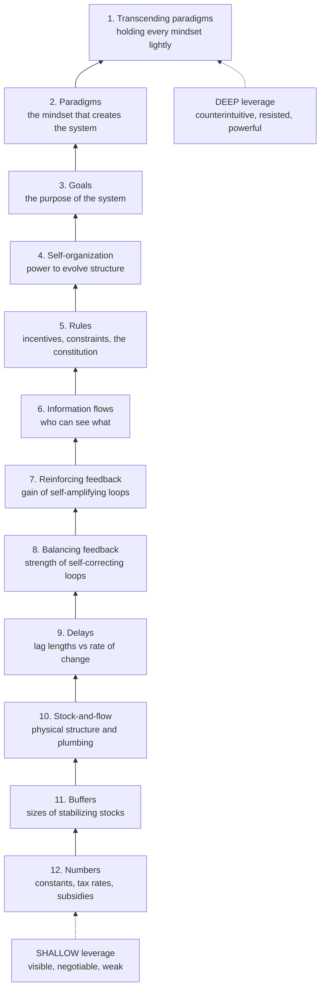

# 🎯 Leverage Points and Mental Models

> [!abstract] TL;DR
> **Leverage points** are places in a system where a small shift can produce a large change in behavior. Donella Meadows ranked twelve of them from shallowest to deepest: tweaking **numbers/parameters** (least effective) through **buffers, physical structure, delays, feedback-loop strength, information flows, rules, self-organization, goals, paradigms**, and finally the power to **transcend paradigms** (most effective). The cruel irony is that the shallow points — the parameters everyone fights over, like tax rates and budgets — attract almost all the effort yet barely move the system (**policy resistance**), while the high-leverage points are **counterintuitive, non-negotiable, and often pushed in the wrong direction**. Because a system's **structure drives its behavior**, and structure ultimately springs from the **mental models and paradigms** of the people inside it, the deepest and hardest leverage of all is the mind out of which the whole system arises.

---

## Intuition

**Analogy:** Picture a self-driving car heading to the wrong city. There are three ways you might try to "fix" the trip. You can **stamp harder on the accelerator** — that is a *parameter*, and it changes almost nothing about *where you end up*; you just get to the wrong place faster or slower. You can **repair the steering feedback** so the car actually corrects toward its lane instead of drifting — that is *structure*, and it changes *how* the car travels. Or you can **retype the destination in the GPS** — that is the *goal*, a single line of intent, and it redirects the entire journey. Changing one number of intent silently reorganizes every turn the car will ever make.

Now notice which lever people instinctively grab. In a crisis everyone lunges for the accelerator — the loud, visible, negotiable knob — and hardly anyone thinks to question the destination. That mismatch is Meadows' whole point: **the leverage points with the most power are the ones we reach for last, and when we do reach for them we frequently push in exactly the wrong direction.** Where you intervene matters far more than how hard you push.

---

## How It Works

### From event to structure to mind

Donella Meadows was a systems-dynamics modeler in the lineage of **Jay Forrester** at MIT. Her 1999 essay *"Leverage Points: Places to Intervene in a System"* (later folded into the posthumous *Thinking in Systems*, 2008) crystallized a career of watching computer models of economies, fisheries, and cities. The founding observation of the whole field is that **structure drives behavior**: the characteristic dynamics a system displays over time — steady growth, boom-and-bust oscillation, overshoot-and-collapse — are generated by its internal wiring of **stocks, flows, and feedback loops**, not by the particular events or personalities passing through it. Swap out every individual in a badly-wired organization and you will see the same pathology reappear, because the pathology lived in the loops, not the people.

This is why intervening on **events** ("someone made a mistake, fire them") almost never works, while intervening on **structure** ("the incentive loop rewards exactly this mistake") can. And structure itself is not the bottom: the goals, rules, and information flows that define the structure are all chosen by the **shared mental models — the paradigm** — of the actors. So there is a ladder of depth, and Meadows numbered its rungs.

### The twelve leverage points, shallow to deep

She counts *down* from the weakest to the strongest, so the numbering is inverted (12 = least effective, 1 = most):

1. **12. Numbers / parameters** — constants, subsidies, tax rates, standards. The stuff of most political debate; the weakest lever.
2. **11. Buffers** — the sizes of stabilizing stocks relative to flows (a big reservoir smooths shocks; too big and the system is sluggish).
3. **10. Stock-and-flow structures** — the physical plumbing itself (road networks, pipe diameters, age structure of a population). Powerful but slow and expensive to change.
4. **9. Delays** — the lengths of lags relative to the rate of change; getting a delay wrong causes oscillation and overshoot.
5. **8. Balancing (negative) feedback loops** — the strength of the self-correcting loops that keep a stock near a target (thermostats, prices, immune responses).
6. **7. Reinforcing (positive) feedback loops** — the gain of self-amplifying loops (compound interest, viral growth, arms races); usually you gain leverage by *slowing* them, not speeding them.
7. **6. Information flows** — who has access to what information; adding a missing feedback signal is cheap and often transformative.
8. **5. Rules** — incentives, punishments, constraints; the constitution of the system.
9. **4. Self-organization** — the system's power to add, change, or evolve its own structure (diversity, mutation, innovation).
10. **3. Goals** — the purpose or function the whole system is steering toward. Change the goal and everything below it reorients.
11. **2. Paradigms** — the shared, usually unspoken set of assumptions and mental models out of which the system's goals, rules, and structure arise.
12. **1. Transcending paradigms** — the power to hold *no* paradigm as absolute Truth, to stay flexible and choose the mindset that serves. The deepest leverage of all.

### Why the shallow points hog the effort

Parameters are **visible, quantifiable, and negotiable**. You can argue over an interest rate or a budget line in a committee meeting; they fit the way institutions already work. So public debate concentrates almost entirely on rungs 12 and 11 — and the result is **policy resistance**: the system's feedback loops quietly absorb or counteract the parameter change. Raise a tax and behavior adapts; widen a highway and induced demand refills it. Meadows' warning is blunt: leverage points "are frequently not intuitive," and "we too often use them backward, systematically worsening the problems we are trying to solve."

### Why the deep points are counterintuitive and hard

Goals, paradigms, and mindsets are exactly the things a system is *built to defend*. They are hard to see (you swim in your paradigm like water), hard to change without a fight, and their effects are indirect. Yet a shift in the **goal** of a subsystem — reorienting a corporation from "quarterly earnings" to "customer lifetime value," or an economy from "GDP growth" to "human wellbeing" — silently rewires every rule and parameter beneath it. And a **paradigm shift** (in the sense of [[Kuhn_and_Scientific_Revolutions]]) can dissolve an entire class of problems at a stroke, because the problem only existed inside the old worldview.

### Mental models: the source of structure, and Meadows' humility

Because the goals and rules that generate structure are set by the **mental models** of the actors, mental models are simultaneously the *deepest* leverage and the *hardest* to move. This is the bridge to cognitive science's [[Schemas_and_Mental_Models]] — the runnable internal simulations we reason with — and to **Peter Senge's** *The Fifth Discipline* (1990), where "**mental models**" is one of the five disciplines of a learning organization: the practice of *surfacing, testing, and improving* the assumptions that drive our actions. Senge and Meadows share the same Forrester roots; Senge gives the *practice*, Meadows locates the *leverage*.

Meadows paired the leverage list with a companion essay, **"Dancing with Systems,"** as a corrective to the fantasy that finding a leverage point lets you *control* the system like a machine. Her guidelines — *get the beat before you intervene, listen to the wisdom of the system, expose your mental models to the open air, stay humble, locate responsibilities within the system, celebrate complexity* — insist that you engage a complex system as a **partner in a dance**, not a lever to be yanked.



---

## Key Concepts

### Secondary (intuitive level)
- A **leverage point** is a spot where a small push produces a big change — like where you place your hands on a seesaw.
- **Where** you intervene matters more than **how hard**. Stamping the accelerator (a number) is weak; changing the destination (the goal) is strong.
- **Structure drives behavior:** a system misbehaves because of how it is wired, not because of who is running it.
- Everyone fights over the **weak** levers (tax rates, budgets) because they are easy to see and argue about.

### Undergraduate (structural level)
- The full **twelve-point hierarchy** and its three broad tiers: *parameters and physical structure* (shallow, 12 through 9), *feedback and information* (middle, 8 through 6), and *rules, self-organization, goals, and paradigms* (deep, 5 through 1).
- **Policy resistance:** feedback loops absorb parameter changes, so shallow interventions produce disappointing, self-cancelling results.
- The **iceberg model** of systems thinking — *events → patterns → structure → mental models* — with leverage rising as you descend.
- **Balancing vs reinforcing loops** as rungs 8 and 7; connects directly to stock-and-flow dynamics.

### Graduate (critical level)
- The ranking is a **heuristic, not a law.** Meadows herself warned the order is "slippery" and context-dependent; in practice leverage points **interact**, and a shallow lever can occasionally trigger a deep cascade.
- **Operationalizing** "goal" and "paradigm" change is genuinely hard: deep leverage usually requires structural or political *power*, so high leverage and high *feasibility* are inversely correlated.
- **Abson et al. (2017)** reframed the twelve into **shallow vs deep leverage** for sustainability transformation, arguing that research and funding cluster on shallow (parameters) precisely because deep points are hard to study and threaten incumbents.
- The tension with **"Dancing with Systems":** the same author who ranked leverage points also insisted complex systems cannot be fully steered — leverage is real but not mechanical control.

---

## Python Demo

```python
# Renewable-resource harvesting model (a stock-and-flow system) used to show
# that intervening at DIFFERENT leverage points produces radically different
# outcomes. We compare a low-leverage parameter tweak, a medium-leverage
# feedback-loop change, and a high-leverage change of the system's GOAL.
#
#   Stock  R : the resource (e.g. a fish population)
#   Inflow   : logistic regeneration  r*R*(1 - R/K)
#   Outflow  : harvest  H = q*E*R    (catchability q, fishing effort E)
#   Effort E : itself a stock, adjusted by a feedback loop toward the GOAL.
import numpy as np
import matplotlib.pyplot as plt


def simulate(q=0.010, gain_goal=0.15, gain_stock=0.0,
             goal_mode="catch", G=12.0, R_target_frac=0.5, T=160, dt=0.1):
    r, K = 0.4, 100.0                    # regen rate, carrying capacity
    n = int(T / dt)
    R = np.zeros(n); E = np.zeros(n); H = np.zeros(n)
    R[0], E[0] = 90.0, 5.0               # near-pristine stock, modest fleet
    for t in range(n - 1):
        H[t] = q * E[t] * R[t]
        # --- the effort-adjustment feedback = the system's control structure
        if goal_mode == "catch":
            drive = gain_goal * (G - H[t])            # chase a fixed catch goal
        else:  # "sustainable": the GOAL is a healthy stock, not a catch number
            drive = gain_goal * (R[t] - R_target_frac * K)
        # optional EXTRA balancing loop: back off effort as the stock falls
        stock_brake = gain_stock * (R[t] / K - 0.5)
        E[t + 1] = max(0.0, E[t] + (drive + stock_brake) * dt)
        # --- resource dynamics
        dR = r * R[t] * (1 - R[t] / K) - H[t]
        R[t + 1] = max(0.0, R[t] + dR * dt)
    H[-1] = q * E[-1] * R[-1]
    return np.arange(n) * dt, R, E, H


# Maximum sustainable yield here is r*K/4 = 10, so a catch goal G = 12 is
# structurally unsustainable and drives the baseline toward collapse.
t, R0, E0, H0 = simulate(q=0.010, gain_goal=0.15, goal_mode="catch", G=12)   # baseline

# LOW leverage (parameter): a gear tax cuts catchability q by 25%.
t, R1, E1, H1 = simulate(q=0.0075, gain_goal=0.15, goal_mode="catch", G=12)

# MEDIUM leverage (feedback-loop gain): keep the same goal, but add a
# balancing loop tying effort to the OBSERVED stock (a new information flow).
t, R2, E2, H2 = simulate(q=0.010, gain_goal=0.15, gain_stock=0.9,
                         goal_mode="catch", G=12)

# HIGH leverage (change the GOAL): stop targeting a catch number; steer the
# fleet to keep the stock at K/2, the maximum-sustainable-yield level.
t, R3, E3, H3 = simulate(q=0.010, gain_goal=0.06, goal_mode="sustainable",
                         R_target_frac=0.5)

fig, ax = plt.subplots(1, 2, figsize=(12, 5))
ax[0].plot(t, R0, "k--", label="Baseline: fixed-catch goal")
ax[0].plot(t, R1, label="Low: gear tax (parameter)")
ax[0].plot(t, R2, label="Medium: stock-feedback loop")
ax[0].plot(t, R3, label="High: change the goal")
ax[0].axhline(50, color="gray", ls=":", lw=1)          # MSY stock level
ax[0].set_title("Resource stock over time")
ax[0].set_xlabel("time"); ax[0].set_ylabel("resource R"); ax[0].legend(fontsize=8)

ax[1].plot(t, H0, "k--", label="Baseline")
ax[1].plot(t, H1, label="Low: gear tax")
ax[1].plot(t, H2, label="Medium: feedback")
ax[1].plot(t, H3, label="High: goal change")
ax[1].set_title("Harvest (yield) over time")
ax[1].set_xlabel("time"); ax[1].set_ylabel("harvest H"); ax[1].legend(fontsize=8)

plt.tight_layout()
plt.show()

# Takeaway: the parameter tweak (gear tax) only DELAYS collapse -- classic
# policy resistance, because the unsustainable goal G=12 is untouched. The
# feedback loop stabilises the stock at a stressed level. Changing the GOAL
# reorganises the whole system into a healthy, high-yield equilibrium.
```

Running this, the **baseline** overshoots and the fish stock crashes toward zero. The **low-leverage gear tax** merely *postpones* the crash, because the system is still steering toward an impossible catch — the definition of policy resistance. The **medium-leverage feedback loop** halts the collapse and holds the stock at a stressed but nonzero level. The **high-leverage goal change** settles the system into a healthy stock near `K/2` while delivering the *highest sustainable yield* — the same intervention that was structurally impossible from the shallow rungs.

---

## Real-World Applications

- **Fisheries collapse (the demo, in reality):** decades of setting *quotas and gear limits* (parameters) failed to stop stock collapse in the North Atlantic cod fishery, because the industry's goal remained maximal short-term catch. Recoveries have come from higher-leverage moves — co-management **rules** and redefining the **goal** toward ecosystem health.
- **Sustainability and climate:** a **carbon tax** is a rung-12 parameter; **cap-and-trade rules** sit higher; shifting the economic **goal** from GDP growth to wellbeing (Bhutan's Gross National Happiness, doughnut economics) is rung-3; and reframing the economy as *embedded in the biosphere* is a rung-2 paradigm shift. The **Abson et al. (2017)** framework uses exactly this shallow-vs-deep lens to critique where sustainability effort is spent. See [[Externalities_and_Pigouvian_Tax]] for the economics of the tax lever.
- **Organizations (Senge):** learning organizations gain leverage not by changing budgets but by surfacing **mental models** and redefining **goals** (OKRs, mission). Changing a metric changes behavior far more than changing a headcount.
- **Public policy:** the entire literature of [[Policy_Analysis_and_the_Policy_Process]] documents why parameter-level interventions ([[Tax_Policy]], subsidies) so often fail — the feedback structure and the policy's underlying goal go untouched.
- **Public health:** taxing sugary drinks (parameter) versus redesigning the food environment and default choices (information flows and rules, higher leverage).

---

## Common Pitfalls

- **Pushing the right lever the wrong way.** Widening highways to cut congestion strengthens a *reinforcing* loop (induced demand) and makes traffic worse. Identifying the loop is not enough; you must know its polarity.
- **Parameter fixation.** Because numbers are measurable and negotiable, institutions pour energy into rungs 12 and 11 and mistake the resulting busywork for change. If a reform can be captured in a single adjustable number, suspect it is low-leverage.
- **Assuming deep = easy.** High-leverage points are high-*impact* but high-*resistance*. Systems and people defend their goals and paradigms; announcing a new mission does not shift a paradigm.
- **Treating the twelve as a rigid cookbook.** Meadows explicitly called the ordering "slippery." The rungs interact and their ranking is context-dependent; use it as a diagnostic, not a formula.
- **Ignoring delays.** Intervene, see no immediate response, conclude it failed, and rip it out — or overcorrect — before the system's lag has played through. Rung 9 exists for a reason.
- **Confusing symptoms with structure.** Reacting to *events* ("fixes that fail," "shifting the burden") treats the smoke and never the fire; leverage lives at the structural and mental-model levels.

---

## Related Concepts

- [[Schemas_and_Mental_Models]] — the cognitive-science account of mental models as runnable internal simulations; these are exactly the paradigm-level structures that Meadows names as the deepest leverage.
- [[Kuhn_and_Scientific_Revolutions]] — Kuhn's paradigms and paradigm shifts are the intellectual ancestor of Meadows' rungs 2 and 1 (paradigms and transcending them).
- [[Externalities_and_Pigouvian_Tax]] — the canonical low-leverage parameter intervention (a corrective tax), useful for seeing why parameter changes meet policy resistance.
- [[Policy_Analysis_and_the_Policy_Process]] — documents empirically why interventions so often disappoint, mirroring Meadows' argument about where effort is wasted.
- [[Tax_Policy]] — tax rates are Meadows' rung-12 "numbers," the most-debated and least-effective lever, a concrete anchor for the shallow end of the hierarchy.

---

## Review Questions

1. **(Understanding)** Explain what Meadows means by "structure drives behavior." Give an example in which two organizations with the same feedback structure produced the same dysfunctional behavior despite having entirely different people, and say why replacing the people would not have helped.
2. **(Application)** A city keeps widening its main highway to reduce congestion, yet within a couple of years congestion is as bad as before. Which leverage point is the city using, why does it fail, and identify one higher-leverage intervention you would propose and the rung it occupies.
3. **(Analysis / trade-off)** Meadows ranks paradigms above goals above parameters, yet virtually all real-world policy operates on parameters. Argue why that is, then critically assess whether her ranking is actually reliable, addressing the *resistance* and *feasibility* costs that rise as leverage deepens.

---

## Sources

- Meadows, D. H. (1999). *Leverage Points: Places to Intervene in a System.* The Sustainability Institute / The Donella Meadows Project. [donellameadows.org](https://donellameadows.org/archives/leverage-points-places-to-intervene-in-a-system/)
- Meadows, D. H. (2008). *Thinking in Systems: A Primer.* Chelsea Green Publishing.
- Meadows, D. H. (2001). *Dancing with Systems.* Whole Earth / The Donella Meadows Project. [donellameadows.org](https://donellameadows.org/archives/dancing-with-systems/)
- Senge, P. M. (1990). *The Fifth Discipline: The Art and Practice of the Learning Organization.* Doubleday.
- Abson, D. J., et al. (2017). "Leverage points for sustainability transformation." *Ambio*, 46(1), 30-39. [doi.org/10.1007/s13280-016-0800-y](https://doi.org/10.1007/s13280-016-0800-y)

---

#systems-thinking #leverage-points #meadows #mental-models #intervention
