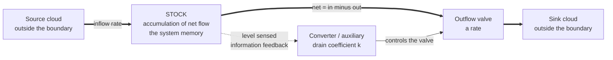

# 🛁 Stocks, Flows, and System Dynamics

> [!abstract] TL;DR
> A **stock** is an accumulation — the amount of "stuff" in the system right now (water in a tub, money in an account, CO2 in the atmosphere). A **flow** is a rate that fills or drains the stock over time. Stocks are the *integral* of net flow, which makes them the system's memory: they change only gradually and lag behind their driving rates. **System dynamics**, founded by Jay Forrester at MIT, is the discipline of modeling and simulating systems as networks of stocks, flows, and feedback loops.

## Intuition — analogy FIRST

Picture a **bathtub**. Water pours in from the faucet (an *inflow* rate, measured in liters per minute) and drains out through the plughole (an *outflow* rate, also liters per minute). The amount of water actually sitting in the tub at any instant is the **stock**, measured in liters — a quantity, not a rate.

Two facts about this bathtub contain almost everything you need to know:

1. **The stock only changes through its flows.** You cannot teleport water into the tub; the level rises or falls solely because of the faucet and the drain. The tub *integrates* the net flow over time.
2. **When inflow equals outflow, the level stops changing — but it does not go to zero.** The tub can sit half-full and perfectly steady while both faucet and drain run hard. The level is *flat*, not *empty*.

That second fact is where human intuition famously breaks. The technical world is nothing more than replacing "water" with people, dollars, inventory, carbon, or infected patients, and replacing "the tub" with a differential equation.

---

## How It Works

### Core mechanics

The entire framework rests on one equation. If `S` is a stock and `f_in`, `f_out` are its flows:

$$\frac{dS}{dt} = f_{in}(t) - f_{out}(t) \qquad\Longleftrightarrow\qquad S(t) = S_0 + \int_0^t \big(f_{in} - f_{out}\big)\,d\tau$$

Read the two forms carefully — they are the heart of the discipline:

1. **The stock is defined by integration.** `S(t)` is the running total of every drop of net flow that has ever entered. This is why a stock has *inertia* and *memory*: it cannot jump, and its present value encodes the entire history of the flows.
2. **The flows are defined by the current state.** In most real systems the outflow (and sometimes the inflow) depends on the stock itself — a fuller tub drains faster, a bigger population has more births. That dependency is a **feedback loop**, and it turns the tidy integral above into a genuine dynamic system.
3. **Converters and auxiliaries** are the supporting cast. They are not stocks and not flows — they are algebraic variables that convert or combine information to *set the flow rates*. "Drain coefficient," "birth fraction," "average delivery delay," and "desired inventory" are all converters. They carry no memory; they are recomputed instantly at every step.
4. **The boundary and the clouds.** Every model has a boundary. Sources and sinks *outside* the boundary are drawn as "clouds" — infinite reservoirs the modeler chooses not to track (the water main feeding the faucet, the sewer swallowing the drain).

Putting it together, a system dynamics model is a set of coupled first-order differential equations (one per stock) plus algebraic converter equations, solved forward in time by numerical **simulation**.

### Stocks vs. flows — the test that trips everyone

The distinction sounds trivial until you try to reason about it. Sterman and Booth Sweeney's famous "bathtub dynamics" experiments showed that even MIT graduate students with strong math backgrounds systematically fail simple stock-flow questions — for example, wrongly believing that if the *inflow* of CO2 emissions merely *stops rising*, the *stock* of atmospheric CO2 will also stop rising. It will not: the stock keeps climbing as long as inflow exceeds outflow. People confuse the derivative with the integral — they pattern-match the shape of the stock to the shape of the flow. This "correlation heuristic" is a robust cognitive failure, not a lack of intelligence, and it is precisely why explicit stock-flow modeling is valuable.



The solid double arrows are **flows** (they move conserved material); the dashed thin arrow is an **information link** (it moves knowledge, not material). Confusing the two arrow types is the most common modeling error of all.

---

## Key Concepts

**Secondary (intuitive level).** A stock is a *noun you can measure at a snapshot* (liters, dollars, people); a flow is a *rate you can only measure over an interval* (liters/min, dollars/year). Snapshot a photo of the system: whatever you could count is a stock; whatever would be blurred by motion is a flow. Stocks give a system inertia — they can only fill or drain gradually.

**Undergraduate (analytical level).** Stocks are state variables; the vector of all stocks is the system's **state**, and the flows are the state's time-derivatives, exactly as in [[State_Space_Basics]]. The stock-flow equation is a first-order ODE, so the entire toolkit of [[First_Order_ODEs]] applies. Numerical solution proceeds by **Euler integration** (`S_{t+dt} = S_t + net * dt`) or higher-order schemes such as RK4; the choice of `dt` is a real modeling decision, since too large a step makes a self-draining tank oscillate or blow up. Feedback loops connecting stock back to flow are what produce the characteristic behaviors: **goal-seeking** (one balancing loop), **exponential growth/collapse** (one reinforcing loop), and **S-shaped growth / overshoot-and-oscillation** (a reinforcing loop that hands off to a balancing loop, usually with a delay).

**Graduate (system-level).** System dynamics is control theory applied to socio-economic and ecological systems, but with the emphasis inverted. Control engineers design a controller to *stabilize* a plant with known transfer function; system dynamicists *reverse-engineer* the endogenous loop structure of a messy real system to explain why it misbehaves. The shared machinery — state, integration, feedback, delay, gain, stability — is identical (see [[Transfer_Functions]] and [[State_Feedback_Control]]). The distinctive commitments of SD are: (1) an **endogenous** point of view, treating behavior as generated by internal loop structure rather than external shocks; (2) explicit representation of **material and information delays**; (3) tolerance for **soft variables** (perceived quality, morale) that resist measurement but drive behavior; and (4) simulation over closed-form solution, because the equations are almost always nonlinear.

---

## Python Demo

```python
# System dynamics by Euler integration.
# Two scenarios show WHY stocks are the integral of net flow, and the
# "bathtub dynamics" insight that a stock peaks when inflow = outflow.
import numpy as np
import matplotlib.pyplot as plt

dt   = 0.05                       # time step [min] -- an integration choice
T    = 60.0                       # horizon [min]
time = np.arange(0.0, T + dt, dt)
n    = len(time)

# ---- Scenario A: self-regulating tank (outflow proportional to the stock) ----
# Constant faucet, drain opening fixed -> classic goal-seeking approach.
# outflow = k * S  is a BALANCING feedback loop: the fuller the tank, the
# faster it drains, until inflow and outflow match.
kA       = 0.15                   # drain coefficient [1/min] (a converter)
inflow_A = 8.0 * np.ones(n)       # constant faucet [L/min]
S_A      = np.zeros(n)            # the STOCK [L]
out_A    = np.zeros(n)            # the outflow rate [L/min]
for i in range(n - 1):
    out_A[i] = kA * S_A[i]                              # flow set by the stock
    S_A[i+1] = S_A[i] + (inflow_A[i] - out_A[i]) * dt  # Euler integration
out_A[-1]   = kA * S_A[-1]
equilibrium = inflow_A[0] / kA    # steady state where inflow == outflow

# ---- Scenario B: the Sterman "bathtub" test (hump inflow, constant outflow) ----
# Inflow rises then falls; outflow held constant. Ask a friend: when does the
# water level peak? Most people say "when the faucet is fullest." Wrong.
outflow_B = 5.0                                                  # constant [L/min]
inflow_B  = 3.0 + 6.0 * np.exp(-((time - 25.0) ** 2) / (2 * 8.0 ** 2))  # a hump
S_B       = np.zeros(n)
S_B[0]    = 40.0
for i in range(n - 1):
    S_B[i+1] = S_B[i] + (inflow_B[i] - outflow_B) * dt          # Euler integration

# The stock peaks exactly where inflow crosses outflow going DOWN (net flow = 0),
# which is LATER than the inflow peak at t = 25.
sign_change = np.where(np.diff(np.sign(inflow_B - outflow_B)))[0]

fig, ax = plt.subplots(2, 2, figsize=(12, 8))

ax[0, 0].plot(time, inflow_A, label="inflow (constant)")
ax[0, 0].plot(time, out_A,    label="outflow = k * S")
ax[0, 0].set_title("A: flows -> goal-seeking")
ax[0, 0].set_ylabel("rate [L/min]"); ax[0, 0].legend()

ax[1, 0].plot(time, S_A, color="tab:green")
ax[1, 0].axhline(equilibrium, ls="--", color="gray", label="equilibrium stock")
ax[1, 0].set_title("A: stock accumulates smoothly to a steady, non-zero level")
ax[1, 0].set_xlabel("time [min]"); ax[1, 0].set_ylabel("stock [L]"); ax[1, 0].legend()

ax[0, 1].plot(time, inflow_B, label="inflow (hump)")
ax[0, 1].axhline(outflow_B, color="tab:red", label="outflow (constant)")
ax[0, 1].set_title("B: bathtub-dynamics test")
ax[0, 1].set_ylabel("rate [L/min]"); ax[0, 1].legend()

ax[1, 1].plot(time, S_B, color="tab:purple")
for c in sign_change:
    ax[0, 1].axvline(time[c], ls=":", color="gray")
    ax[1, 1].axvline(time[c], ls=":", color="gray")
ax[1, 1].set_title("B: stock PEAKS when inflow = outflow, not when inflow peaks")
ax[1, 1].set_xlabel("time [min]"); ax[1, 1].set_ylabel("stock [L]")

plt.tight_layout()
plt.show()

print(f"Scenario A equilibrium stock  = {equilibrium:.1f} L")
print(f"Scenario B inflow peaks at t   = {time[np.argmax(inflow_B)]:.1f} min")
print(f"Scenario B stock  peaks at t   = {time[np.argmax(S_B)]:.1f} min  (later!)")
```

Running this prints that the **stock peaks later than the inflow** — the lag is the whole point. Scenario A demonstrates goal-seeking to a non-zero equilibrium; Scenario B reproduces the exact experiment on which most people fail.

---

## Real-World Applications

- **Climate — the CO2 bathtub.** The atmosphere is a stock of carbon. Human emissions are the inflow; uptake by oceans and land is the outflow (see [[The_Oceanic_Carbon_Cycle]] and [[Biogeochemical_Cycles]]). Because the outflow is much smaller than the inflow, atmospheric CO2 keeps *accumulating* even if emissions merely stabilize. Stabilizing the *stock* (concentration) requires cutting the *inflow* all the way down toward the small natural outflow — a far more aggressive target than "stop emissions from growing." This gap between intuitive and correct policy is the single most consequential stock-flow error in public discourse (see [[Anthropogenic_Climate_Change]] and [[Climate_Sensitivity_and_Feedbacks]]).
- **Industrial Dynamics (Forrester, 1961).** The founding application: modeling a factory's order-inventory-production chain revealed the **bullwhip effect** — small swings in retail demand amplify into wild swings in factory orders purely from the delays and stock adjustments in the supply chain, with no external cause.
- **Urban Dynamics (Forrester, 1969).** A stock-flow model of housing, business, and population in a city produced the counterintuitive result that low-cost-housing programs could *worsen* urban decay by attracting population faster than jobs — a classic "policy resistance" finding.
- **Limits to Growth / World3 (1972).** Meadows, Meadows, Randers, and Behrens used the SD model **World3** (stocks of population, capital, pollution, and non-renewable resources) to simulate global overshoot. Whatever one thinks of its forecasts, it remains the most influential system dynamics study ever built.
- **Epidemiology.** The SIR model is pure stocks and flows: Susceptible, Infected, and Recovered are three stocks; the infection and recovery rates are the flows between them.

---

## Common Pitfalls

- **Confusing a stock with a flow.** "Debt" is a stock; "the deficit" is the flow that adds to it. A shrinking deficit still grows the debt. Always ask: could I measure this in a single snapshot (stock) or only over an interval (flow)?
- **The correlation heuristic (Sterman & Booth Sweeney).** Assuming the stock's graph must look like the flow's graph. The stock is the *integral*, so it lags, smooths, and peaks where net flow crosses zero — not where the flow peaks.
- **Drawing a flow where an information link belongs (and vice versa).** Money and material *conserve* and must ride flow arrows into stocks; *information* about a stock does not deplete it and must ride dashed links into converters. Mixing them breaks conservation.
- **Ignoring integration error.** Euler integration with too large a `dt` can make a self-draining stock oscillate or diverge — an artifact of the solver, not the system. Halve `dt`; if the answer changes materially, `dt` was too big.
- **Omitting delays.** Real flows respond to stocks *after* a lag (perception, shipping, construction). Leaving delays out is the fastest way to build a model that is stable on paper but explains none of the oscillations you see in reality.
- **Boundary too narrow.** If a key feedback loop is left outside the model boundary as an "external input," the model cannot explain endogenously generated behavior — the core promise of SD is lost.

---

## Related Concepts

- [[First_Order_ODEs]] — the stock-flow equation `dS/dt = in - out` *is* a first-order ODE; SD is applied integration.
- [[State_Space_Basics]] — the vector of stocks is exactly the "state" of state-space models; flows are its derivatives.
- [[Transfer_Functions]] — the classical-control counterpart; both describe how accumulation and feedback shape dynamic response.
- [[State_Feedback_Control]] — control theory shares SD's machinery of state, feedback, and stability but designs controllers rather than explaining structure.
- [[Anthropogenic_Climate_Change]] — the canonical CO2 "bathtub": emissions inflow versus uptake outflow into an atmospheric stock.
- [[Climate_Sensitivity_and_Feedbacks]] — the balancing and reinforcing loops that govern the climate stock's response.
- [[The_Oceanic_Carbon_Cycle]] — the dominant natural outflow draining the atmospheric carbon stock.
- [[Biogeochemical_Cycles]] — ecosystems modeled as coupled stocks and flows of carbon, nitrogen, and phosphorus.

---

## Review Questions

1. **(Conceptual)** A country's national debt is rising, but the annual budget deficit has fallen for three straight years. Explain, using stock-flow language, why both statements can be true at once. Which quantity is the stock and which is the flow?
2. **(Scenario)** Global CO2 emissions plateau at a constant, non-zero level. Using the bathtub metaphor, will atmospheric CO2 concentration stabilize, keep rising, or fall? What would emissions have to do for the *concentration* to level off, and why does human intuition usually get this wrong?
3. **(Trade-off)** You are modeling a self-draining water tank with Euler integration. You can pick a large time step (fast to simulate) or a small one (accurate). Describe the failure mode of too large a `dt`, how you would detect it, and why this is a property of the *solver* rather than the *system*.

---

## Sources

- Forrester, J. W. (1961). *Industrial Dynamics*. MIT Press. — The founding text of system dynamics.
- Meadows, D. H. (2008). *Thinking in Systems: A Primer*. Chelsea Green. — The clearest modern introduction to stocks, flows, and feedback.
- Sterman, J. D. (2000). *Business Dynamics: Systems Thinking and Modeling for a Complex World*. McGraw-Hill/Irwin. — Comprehensive SD reference.
- Sterman, J. D., & Booth Sweeney, L. (2007). "Understanding public complacency about climate change: adults' mental models of climate change violate conservation of matter." *Climatic Change*, 80(3–4), 213–238. — The CO2 bathtub-dynamics experiments.
- Meadows, D. H., Meadows, D. L., Randers, J., & Behrens, W. W. (1972). *The Limits to Growth*. Universe Books. — The World3 system dynamics study.

---

#systems-thinking #system-dynamics #stocks-and-flows #forrester #simulation
