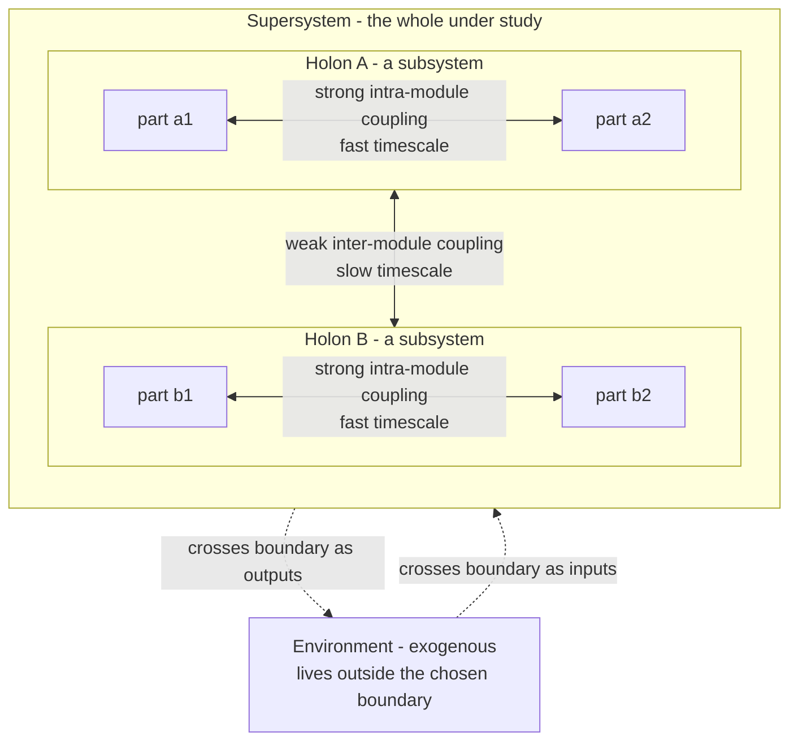

# 🪆 System Boundaries and Hierarchy

> [!abstract] TL;DR
> A **system boundary** is the line an observer draws to separate what counts as *inside* the system (endogenous, to be explained) from what counts as *outside* it (exogenous, taken as given). The choice is never handed to us by nature — it is a modelling decision, and getting it wrong is the root of most "surprising" side-effects. Because boundaries can be nested, complex systems almost always come organized as **hierarchies of subsystems within systems within supersystems**. Herbert Simon showed *why*: complex systems that survive are typically **near-decomposable** — parts interact strongly within a module and weakly across modules — which makes them faster to assemble, more stable to perturbation, and more evolvable. Arthur Koestler named each level a **holon**: a Janus-faced entity that is a *whole* to the parts below it and a *part* to the whole above it.

---

## Intuition

**Analogy: two watchmakers, Hora and Tempus (Simon's parable).**

Both build watches of 1,000 parts, and both get interrupted constantly by phone calls. **Tempus** assembles each watch as one long chain of 1,000 pieces; the moment he sets it down to answer the phone, the unfinished chain falls apart and he starts over. **Hora** first builds small **stable sub-assemblies of ten parts**, then combines ten of those into a larger unit, then ten of *those* into a finished watch. When Hora is interrupted, he loses at most the ten pieces of the sub-assembly currently in his hand — everything already snapped into a stable module stays put.

Hora finishes; Tempus effectively never does. The lesson is not about watches: **hierarchy is how complexity gets built at all in a world full of interruptions (perturbations).** A boundary drawn around a stable sub-assembly is a place where progress can be *saved*. In systems terms, the ten-part module is a subsystem whose internal bonds are strong, and whose coupling to everything outside is, for the moment, cut. Where you decide to snap a module shut — where you draw the boundary — determines whether your system is buildable, stable, and repairable at all.

---

## How It Works

### 1. Drawing the boundary: endogenous vs exogenous

Every model begins with an act of enclosure. Variables **inside** the boundary are **endogenous** — the model is responsible for explaining how they change. Variables **outside** are **exogenous** — inputs the model accepts without explanation. A traffic model that treats weather as exogenous need not explain rain; it only reacts to it. Move the boundary to include the atmosphere, and rain becomes something you now have to account for.

The critical consequence: **whatever you place outside the boundary, you have implicitly declared irrelevant or fixed.** Most catastrophic engineering and policy failures are boundary failures — an effect that was real but *exogenous by assumption*, and therefore invisible to the model, comes back through the wall you drew.

### 2. Boundaries are observer-dependent, not given

There is no "true" boundary of the economy, a cell, or the internet — the boundary depends on the **question, the observer, and the purpose**. A cell membrane looks like a clean physical boundary until you ask about signalling, at which point the "system" plausibly extends to the tissue that supplies the signals. Because the choice is a decision rather than a discovery, two competent analysts studying "the same system" for different purposes will legitimately draw different boundaries and reach different conclusions.

### 3. Why complexity is hierarchical: near-decomposability

Simon's central claim in *The Architecture of Complexity* (1962) is that stable complex systems are almost always **hierarchical** and **near-decomposable**:

1. **Strong within, weak between.** Interactions among the components of a subsystem are strong and fast; interactions *between* subsystems are weak and slow. A molecule's atoms bond tightly; molecules bump each other gently.
2. **Two timescales follow automatically.** Each module reaches its own internal near-equilibrium **quickly**, almost independently of the others. The whole system then drifts toward global equilibrium **slowly**, and during that slow drift each module stays approximately internally equilibrated. This *separation of timescales* is the mathematical signature of near-decomposability (Simon and Ando, 1961).
3. **You can study a level almost in isolation.** Because the fast internal dynamics settle before the slow cross-module dynamics matter, you can model a subsystem's short-run behaviour while treating its neighbours as roughly constant — the practical licence behind almost all tractable science.

### 4. Holons and holarchy (Koestler)

Koestler coined **holon** for any node in such a hierarchy: it is simultaneously a **whole** (a coherent unit governing its own parts) and a **part** (a component of a larger whole). A **holarchy** is a hierarchy of holons. The point is that "whole" and "part" are not fixed identities but *roles relative to a level*: an organ is a whole to its cells and a part of the organism. This dissolves the sterile whole-versus-part debate — every level is both, facing down and up at once.

### 5. Modularity, stability, and evolvability

Near-decomposability pays three dividends that make it favoured by both evolution and engineers:

- **Stability / robustness.** A disturbance that would scramble a fully-connected system is *contained* within a module; damage does not propagate freely across weak boundaries.
- **Evolvability / repair.** You can change or replace one module while the interfaces stay fixed — biological evolution reuses conserved modules; software teams swap microservices behind stable APIs.
- **Assembly speed.** As with Hora, partial results are preserved, so complexity accumulates instead of resetting.

### Nested levels, holons, and the boundary



Each box is a holon: `MOD_A` is a *whole* to `a1` and `a2`, and a *part* of `SUPER`. The **strong/weak** asymmetry inside `SUPER` is exactly near-decomposability; the **dashed edges** are the flows that cross the boundary and remind us the enclosure is a choice, not a wall nature built.

---

## Key Concepts

### Secondary level — the plain idea
- A **system** is a set of parts that work together; a **boundary** is where you decide the system stops and the environment begins.
- Big systems are made of **smaller systems inside bigger systems** — like organs inside a body, which is itself inside an ecosystem. These are **levels**.
- Parts that belong together are grouped into **modules**; things inside a module affect each other a lot, things in different modules affect each other only a little.

### Undergraduate level — the working machinery
- **Endogenous vs exogenous:** endogenous variables are explained *by* the model; exogenous variables are inputs *to* it. The boundary is the line between them, and it is chosen for a purpose.
- **Near-decomposability (Simon):** strong intra-module and weak inter-module coupling produces a **separation of timescales** — modules equilibrate internally fast, the whole equilibrates across modules slowly. This is why you can analyse one subsystem while holding its neighbours roughly constant.
- **Holon / holarchy (Koestler):** every level is Janus-faced — a whole downward, a part upward. A holarchy is a nested stack of holons.
- **Modularity dividends:** robustness (damage is contained), evolvability (modules swap behind stable interfaces), and assembly speed (partial results are preserved).
- **Emergence across levels:** properties can appear at one level that no single part possesses; boundaries mark where such level-relative properties become the right unit of description.

### Graduate level — the sharp edges
- **Spectral view of near-decomposability:** for linear relaxation dynamics `dx/dt = -L x` on a block-structured coupling matrix, the Laplacian spectrum shows a **gap** — a cluster of small eigenvalues (slow inter-module modes) separated from large eigenvalues (fast intra-module modes). The size of the gap quantifies how cleanly the hierarchy separates. Simon and Ando (1961) proved the short-run dynamics are dominated by within-block modes and the long-run by between-block modes.
- **Aggregation and lumpability:** near-decomposability is what licenses *aggregation* — replacing a module by a single lumped variable — with bounded error that shrinks as inter-module coupling weakens.
- **Boundary critique (Ulrich):** in **Critical Systems Heuristics**, Werner Ulrich argues that because boundary judgements determine what and whom a system serves, they are inescapably **normative** and must be surfaced and contested, not smuggled in. His **boundary questions** ask *who benefits, who decides, who has expertise, and who is affected but voiceless* — making the drawing of the boundary an ethical and political act, not a merely technical one.
- **Hierarchy is compressible:** hierarchical systems admit shorter descriptions (a nested part-of tree) than fully-connected ones, connecting Simon's argument to Kolmogorov complexity and to why hierarchical structure is *selected for* under bounded rationality.

---

## Python Demo

This simulation makes **near-decomposability** concrete. We build a block-structured coupling matrix (three modules; strong within, weak between), run diffusion-style relaxation `dx/dt = -L x`, and watch the promised **two timescales**: each module snaps to its own internal average fast, then the modules drift toward global equilibrium slowly. The Laplacian's eigenvalue **spectral gap** is printed as the quantitative fingerprint.

```python
# Near-decomposability (Simon, "The Architecture of Complexity"):
# strong within-module + weak between-module coupling => two timescales.
import numpy as np
import matplotlib.pyplot as plt

rng = np.random.default_rng(0)

# ---- 1. Build a near-decomposable coupling matrix -------------------
block_sizes = [5, 5, 5]                 # three modules / holons
N = sum(block_sizes)
a_strong = 1.00                         # strong WITHIN-module coupling
b_weak   = 0.02                         # weak  BETWEEN-module coupling

blocks = np.concatenate([[k] * s for k, s in enumerate(block_sizes)])
same_block = blocks[:, None] == blocks[None, :]
W = np.where(same_block, a_strong, b_weak)
np.fill_diagonal(W, 0.0)                # no self-coupling

# ---- 2. Relaxation / diffusion dynamics:  dx/dt = -L x --------------
L = np.diag(W.sum(axis=1)) - W          # graph Laplacian (symmetric)
evals, evecs = np.linalg.eigh(L)        # ascending real spectrum

x0 = rng.standard_normal(N)             # arbitrary initial "temperatures"
t  = np.logspace(-2, 2.5, 400)          # log-spaced time

# x(t) = V * exp(-lambda t) * V^T * x0 , vectorised over all t
coeffs = evecs.T @ x0
X = evecs @ (np.exp(-np.outer(evals, t)) * coeffs[:, None])   # shape (N, len(t))

# ---- 3. Spectral gap = signature of near-decomposability -----------
print("Laplacian eigenvalues (sorted):")
print(np.round(evals, 3))
# 1 zero mode (global conservation) + 2 small modes (slow between-module)
# then a large GAP, then big eigenvalues (fast within-module).
gap = evals[3] / max(evals[2], 1e-9)
print(f"\nSpectral gap ratio (fast/slow): {gap:.1f}x  <- bigger = cleaner hierarchy")

# ---- 4. Visualise ---------------------------------------------------
fig, (ax1, ax2) = plt.subplots(1, 2, figsize=(12, 5))

im = ax1.imshow(W, cmap="viridis")
ax1.set_title("Coupling matrix W\nblock-diagonal: strong within, weak between")
ax1.set_xlabel("node"); ax1.set_ylabel("node")
fig.colorbar(im, ax=ax1, fraction=0.046)

colors = ["C0", "C1", "C2"]
for i in range(N):                                   # thin lines: individual nodes
    ax2.plot(t, X[i], color=colors[blocks[i]], alpha=0.5, lw=1.0)
for k in range(len(block_sizes)):                    # thick dashed: module means
    ax2.plot(t, X[blocks == k].mean(axis=0), color=colors[k], lw=3, ls="--")
ax2.set_xscale("log")
ax2.set_title("Relaxation: fast within-module, slow between-module")
ax2.set_xlabel("time (log scale)"); ax2.set_ylabel("node state x_i(t)")

plt.tight_layout()
plt.show()
```

**What you see:** on the left, three bright diagonal blocks over a faint background — the strong/weak asymmetry. On the right, nodes of each colour rush together into their module mean (fast, left portion of the log-time axis), the three module means then crawl toward a single shared value (slow, right portion). The printed spectrum shows a small cluster near zero and a wide gap before the large eigenvalues — the numerical proof that the system is *nearly* decomposable rather than either fully coupled or fully separate.

---

## Real-World Applications

- **Software architecture.** Microservices, modular monoliths, and layered designs are engineered near-decomposability: strong cohesion inside a module, loose coupling across stable interfaces, so teams can change one service without re-deriving the whole system.
- **Organizational design.** Divisions, teams, and cost-centres are boundary choices. Conway's Law is a boundary claim: system structure mirrors the communication boundaries of the org that builds it.
- **Biology and medicine.** The cell / tissue / organ / organism / population ladder is a canonical holarchy; drug models draw a boundary (target pathway endogenous, whole-body pharmacokinetics exogenous) and side-effects are the boundary's revenge.
- **Ecology and climate policy.** Whether carbon sinks, oceans, or economies sit inside or outside a model's boundary decides which feedbacks exist at all — a direct application of endogenous-vs-exogenous choice.
- **Economics.** General-equilibrium and input-output models rely on Simon-Ando aggregation: sectors are near-decomposable blocks, letting analysts lump variables with bounded error.

---

## Common Pitfalls

- **Mistaking the boundary for a fact of nature.** Treating a chosen enclosure as "the real system" hides that a different, equally valid boundary would yield different answers. Always state the purpose the boundary serves.
- **Externalizing the very thing that bites you.** Placing a real influence outside the boundary declares it fixed; unmodelled feedbacks (pollution, network effects, second-order costs) return as "unforeseeable" surprises that were foreseeable with a wider boundary.
- **Assuming perfect decomposability.** Modules are only *nearly* independent. Analysts who treat weak inter-module coupling as zero miss the slow, cumulative dynamics that dominate the long run — exactly the modes Simon-Ando warn about.
- **Over-modularizing.** Forcing clean boundaries onto a genuinely interwoven system creates leaky abstractions and hidden couplings that are worse than an honest, tightly-coupled model.
- **Ignoring the normative load of boundaries (Ulrich's warning).** Boundary judgements decide who counts as inside the system of concern; leaving them implicit smuggles values in as if they were technical necessities.
- **Confusing levels.** Explaining a whole-level property purely by a part-level mechanism (or vice versa) is a level error; emergent, level-relative properties need their own descriptive layer.

---

## Related Concepts

- [[Levels_of_Analysis_and_Marrs_Levels]] — Marr's computational / algorithmic / implementational split is the same "loosely-coupled levels" idea applied to information-processing systems; multiple realizability is the cognitive-science face of near-decomposability.
- [[Dualism_vs_Physicalism]] — supervenience and multiple realizability are the metaphysics of how higher levels can be near-independent of, yet depend on, lower ones; the reductionism-vs-emergence debate lives across these boundaries.
- [[Community_Ecology]] — a worked biological holarchy: population, community, and ecosystem levels, where where you draw the community boundary decides which interactions are endogenous.
- [[Ecosystems_and_Energy_Flow]] — ecosystems as open systems whose boundary determines which energy and matter flows count as inputs versus internal cycling.

---

## Review Questions

1. **(Conceptual)** Explain why a system boundary is a *modelling decision* rather than a discovery, and give one consequence of that observer-dependence for how two analysts might disagree about "the same system."
2. **(Applied)** You are modelling traffic congestion in a city and choose to treat fuel prices as exogenous. Later, a congestion-charge policy quietly changes driving behaviour through fuel-price feedbacks you did not model. Using the endogenous/exogenous distinction, explain exactly where and why the model's boundary failed.
3. **(Trade-off / Graduate)** Simon argues near-decomposability makes complex systems both more *stable* and more *evolvable*. Describe the mechanism behind each claim, then identify a case where pushing modularity too far (assuming inter-module coupling is exactly zero) would make the analysis wrong, and relate it to the Laplacian spectral gap in the demo.

---

## Sources

- Herbert A. Simon, "The Architecture of Complexity," *Proceedings of the American Philosophical Society*, 106(6), 1962, pp. 467-482 (reprinted in *The Sciences of the Artificial*, MIT Press).
- Herbert A. Simon and Albert Ando, "Aggregation of Variables in Dynamic Systems," *Econometrica*, 29(2), 1961, pp. 111-138.
- Arthur Koestler, *The Ghost in the Machine*, Hutchinson, 1967 (holon and holarchy).
- Werner Ulrich, *Critical Heuristics of Social Planning: A New Approach to Practical Philosophy*, Haupt, 1983 (boundary critique / Critical Systems Heuristics).
- Donella H. Meadows, *Thinking in Systems: A Primer*, Chelsea Green, 2008 (system boundaries and their pitfalls).

---

#systems-thinking #hierarchy #boundaries #modularity #holons
