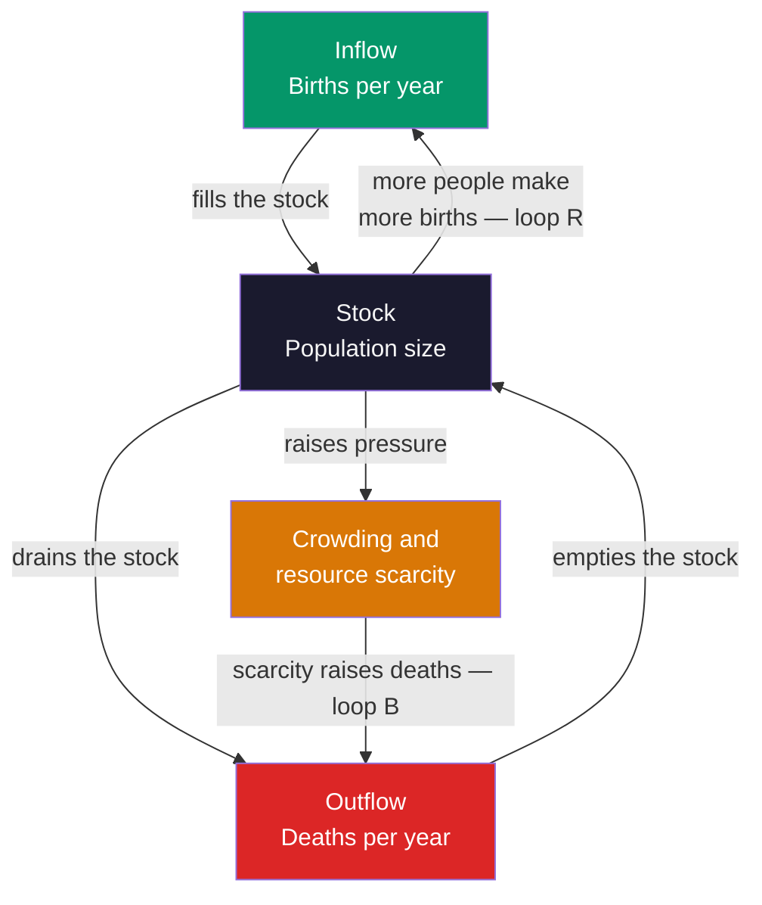

> [!abstract] TL;DR
> Systems thinking is a discipline for understanding the world in terms of wholes, relationships, and patterns of change rather than isolated parts — its central claim is that a system's behavior arises far more from its internal *structure* of feedback loops, stocks, flows, and delays than from any single component or outside event. Where reductionist analysis takes things apart to understand them, systemic thinking studies how the parts interact, because properties like growth, collapse, oscillation, and emergence live in the *connections*, not the pieces. Mastering it explains why well-intentioned interventions so often backfire: policy resistance, unintended consequences, and the search for high-leverage points are all consequences of structure that the analytic eye cannot see.

---

## Intuition

**Analogy:** Watch a flock of thousands of starlings at dusk — a *murmuration* — pour across the sky in a single liquid shape, splitting, folding, and reforming as if it were one enormous animal with a mind of its own. Now try to explain that shape by studying one bird. You can dissect the bird, map its muscles, and measure its wingbeat, and you will learn everything about the *bird* and nothing about the *murmuration* — because the shape does not live in any bird. It lives in the *rules connecting* each bird to its handful of neighbors. Every starling is just staying close to a few others and matching their turns; the breathtaking whole is what those simple relationships produce when there are thousands of them acting at once.

Systems thinking is the decision to study the murmuration instead of the bird. It holds that most of what we actually care about — a traffic jam, an epidemic, an economy, a climate, a company, a human body — behaves the way it does not because of what its parts *are* but because of how they are *wired together*: what flows into what, what pushes back on what, and how long each push takes to arrive. A traffic jam can roll *backward* down a highway while every single car in it moves *forward*; the jam is a pattern in the relationships, not a property of any car. The reductionist habit of taking things apart to understand them — brilliant and indispensable in physics and chemistry — quietly fails here, because the instant you isolate a part you sever exactly the connections that produced the behavior you were trying to explain.

This analogy already contains the field's founding move. The stunning fact about a murmuration is that no bird is in charge and no bird can see the whole shape, yet an ordered global pattern *emerges* from local interaction. Systems thinking is the toolkit for reasoning about that kind of thing: how structure produces behavior, how feedback either amplifies or restrains change, and why the leverage to fix a problem is almost never located where the problem appears.

---

## How It Works

A **system** is not just any collection of things — it is a set of *elements* (the parts), *interconnections* (the relationships and rules by which the parts affect one another), and a *function or purpose* (what the whole tends to do). Donella Meadows' test is decisive: if you can take a part away and the thing keeps working the same way, the part was not integral; but a system loses its character the moment you cut its interconnections. A pile of sand is not a system — remove grains and it is still a pile. A body, an ecosystem, or a market *is* a system, because the relationships carry the behavior. The core discovery of the whole field is that **structure produces behavior**: the same handful of structural building blocks, wired in different ways, generate the recurring patterns we see everywhere — steady growth, sudden collapse, endless oscillation, stubborn stability.

**Stocks and flows** are the first building block. A **stock** is anything that accumulates — water in a bathtub, money in an account, people in a city, carbon in the atmosphere, trust in a relationship. A **flow** is the rate at which a stock fills or drains — the tap and the drain of the tub. This is the single most clarifying image in the field: the water level (stock) is the *integral over time* of the net flow, and it can only change through its flows, never instantly. That is why draining a bathtub, cooling an economy, or decarbonizing an atmosphere all take time even after you turn off the tap — the accumulated stock has inertia. Confusing a stock with a flow (mistaking the *level* of debt for the *rate* of new borrowing, for instance) is one of the most common and expensive reasoning errors there is.

**Feedback loops** are the second building block, and the heart of the discipline. A feedback loop exists whenever a stock's own level circles back — through some chain of causes — to affect its own flows. There are exactly two kinds:

1. **Balancing (negative) loops** are *goal-seeking* and *stabilizing*. They counteract change and pull a stock toward a target. A thermostat is the archetype: the further the room is from the set point, the harder the furnace works to close the gap, and the gap shrinks. Hot coffee cooling toward room temperature, a body regulating its temperature, a market where high prices depress demand — all are balancing loops. They produce *stability*, *goal-seeking decay*, and, when delayed, *oscillation*.
2. **Reinforcing (positive) loops** are *self-amplifying*. They compound change in whatever direction it is already moving: the more you have, the more you get. Compound interest, a population where more people make more babies, a viral post, a bank run, an arms race — all are reinforcing loops. Left unchecked they produce *exponential growth* or *exponential collapse*. Nothing in the real world grows forever, so every reinforcing loop is eventually caught by some balancing loop it triggers.

**Delays** are the third building block and the great troublemaker. Real flows react to information about the stock only after a lag — shipping time in a supply chain, the years between emitting carbon and feeling the warming, the decades between a policy and its social payoff. A balancing loop *with a delay* overshoots its target and then corrects too late, again and again: this is the structural origin of *oscillation*, from boom-and-bust business cycles to the wild swings of the "Beer Game" supply-chain simulation. **Nonlinearity** — where doubling the cause does not double the effect — is the fourth: it is why systems have thresholds and tipping points, and why the loop that *dominates* the behavior can suddenly switch (a population's reinforcing growth loop giving way to a balancing scarcity loop as it hits its carrying capacity). And **emergence** is the payoff: from these simple parts interacting, whole-system properties appear — the murmuration's shape, a market price, consciousness, life — that are not present in, and cannot be predicted from, any part alone.

The diagram below shows all of this at once in a *causal loop diagram* of a population, the canonical system where one reinforcing and one balancing loop fight for dominance.



The **reinforcing loop R** runs Population to Births back to Population: more people make more births, which make more people — an exponential engine. The **balancing loop B** runs Population to Crowding to Deaths back to Population: more people cause scarcity, which raises deaths, which limits people — a goal-seeking brake. When the stock is small the reinforcing loop dominates and growth explodes; as the stock approaches the environment's carrying capacity the balancing loop takes over and growth levels off into an S-curve. *Which loop dominates changes over time*, and that shifting dominance — not any external event — is what shapes the whole trajectory.

The field grew from four intellectual roots. **Ludwig von Bertalanffy** proposed *General System Theory* (developed from the 1930s, canonized in his 1968 book), arguing that the same organizing principles recur across biology, engineering, and society, so a science of "systems as such" is possible. **Norbert Wiener** founded *cybernetics* in 1948 — the science of control and communication through feedback in "the animal and the machine" — giving feedback its rigorous mathematical treatment. **Jay Forrester** at MIT turned these ideas into *system dynamics* (from the late 1950s), a method for simulating stock-and-flow-and-feedback models of firms, cities, and the world. And **Donella Meadows**, Forrester's intellectual heir, co-authored the era-defining *Limits to Growth* (1972) and wrote *Thinking in Systems* (2008), which made the discipline legible to everyone and gave us its most practical tools: system archetypes, leverage points, and the language of stocks, flows, and loops used above.

---

## Key Concepts

### Secondary Level

**What is a system?** A system is a set of parts that work together to do something as a whole — and the "working together" matters more than the parts. Your body is a system; a car is a system; a school, a forest, and a family are systems. The big idea of systems thinking is simple but powerful: **you often cannot understand how something behaves by looking at its parts one at a time.** You have to look at how the parts *connect*. A soccer team is not just eleven skilled players; a great team can be built from ordinary players who pass and move together well, and a bad team can be built from stars who ignore each other.

**Stocks and flows — the bathtub.** Picture a bathtub. The amount of water in it is a **stock** — something that builds up. The tap and the drain are **flows** — how fast water comes in and goes out. Two things follow that trip almost everyone up. First, the water level can only change through the tap and drain — never instantly. Second, if the tap runs faster than the drain, the tub keeps filling *even though the drain is open*. Savings accounts, your weight, a country's debt, and pollution in a lake all behave like bathtubs.

**Feedback loops — two kinds.** A feedback loop is when a thing's own size loops back to change how fast it grows or shrinks.
- A **balancing loop** keeps things steady, like a thermostat: if the room gets too cold the heater turns on; if it gets too warm it turns off. Your body sweating to cool down is a balancing loop.
- A **reinforcing loop** makes things snowball, like money earning interest that earns more interest, or a rumor that spreads faster the more people already know it.

**Why it matters.** Because the parts of a system push back on each other, "obvious" fixes often make things worse. Widen a road to cut traffic, and more people drive, so the traffic comes back. Systems thinkers call this *policy resistance*: the system fights your solution. Learning to see the loops helps you find the *real* place to push.

**The founders, in one line each.** Ludwig von Bertalanffy saw that living things, machines, and societies share the same "systems" patterns. Norbert Wiener invented *cybernetics*, the study of feedback and control. Jay Forrester built computer models of whole cities and the whole planet. Donella Meadows wrote the book — *Thinking in Systems* — that explains all of this in plain language.

---

### Undergraduate Level

#### Systems: Elements, Interconnections, Purpose

Meadows defines a system as **elements + interconnections + a function or purpose**, and ranks their importance in reverse. Changing the *elements* usually changes a system least (swap every player on a losing team and it often keeps losing). Changing the *interconnections* — the rules and information flows — changes it more. Changing the *purpose* changes it most of all. This is why "the system" often survives complete turnover of its people: the structure is doing the work. A university whose true operating purpose is prestige will behave differently from one whose purpose is teaching, even with identical staff and buildings.

#### Stocks, Flows, and the Integral

Formally, a stock is an accumulation and a flow is its time derivative: `stock(t) = stock(0) + ∫ (inflow − outflow) dt`. Three consequences matter. (1) **Stocks buffer and delay** — they decouple inflow from outflow, letting a system absorb shocks (inventory absorbing a demand spike). (2) **Stocks give systems memory and inertia** — the past is stored in current stock levels, so a system cannot be steered instantaneously. (3) **You can raise a stock either by opening the inflow or by closing the outflow**, and the second is often cheaper and overlooked (reducing energy demand versus building more supply). Reasoning correctly about "bathtub dynamics" is a documented weak spot even in highly educated adults, who routinely assume a stock stabilizes when its *inflow* stabilizes, forgetting the inflow must fall to meet the *outflow*.

#### Balancing and Reinforcing Loops, and Link Polarity

A **causal loop diagram** encodes structure as arrows with *polarity*. A `+` link means the cause and effect move the same way (more births to more population); a `−` link means they move oppositely (more crowding to fewer births). Count the negatives around a loop: an *even* number (including zero) makes a **reinforcing loop** R that amplifies; an *odd* number makes a **balancing loop** B that stabilizes. This little parity rule lets you read a system's likely behavior straight off its diagram. Reinforcing loops generate exponential growth or collapse; balancing loops generate goal-seeking approach; and coupled loops generate the richer archetypes below.

#### Delays, Oscillation, and Overshoot

Add a **delay** to a balancing loop and you get oscillation: the controller acts on stale information, overshoots the goal, then over-corrects. This is the structural cause of the **bullwhip effect** in supply chains, of thermostat hunting, of predator–prey cycles, and of much macroeconomic instability. The classic classroom demonstration is Forrester's **Beer Distribution Game**, where a four-stage supply chain, given a tiny one-time bump in customer demand, generates wild boom-and-bust swings *purely from the delays in the structure* — players reliably blame each other, when the oscillation is baked into the system, not the people.

#### System Archetypes

Coupled loops recur as a small catalog of **archetypes** that show up across wildly different domains:
- **Limits to Growth** — a reinforcing loop drives growth until it triggers a balancing loop (a limit), producing an S-curve or an overshoot-and-collapse.
- **Shifting the Burden** — a quick symptomatic fix relieves pressure but atrophies the fundamental solution, creating addiction to the fix (painkillers, bailouts, technical debt).
- **Tragedy of the Commons** — individually rational use of a shared stock (a fishery, an aquifer, the atmosphere) collectively destroys it, because the balancing loop that should protect the commons is too weak or too delayed.
- **Success to the Successful** — a reinforcing loop channels resources to whoever is already ahead, producing lock-in and inequality.

#### Nonlinearity and Loop Dominance

In linear systems, effects are proportional to causes and superpose neatly. Real systems are **nonlinear**: relationships saturate, have thresholds, and interact, so the loop that *dominates* the behavior can switch abruptly. The logistic model in the demo below shows this — early on the reinforcing growth loop dominates and the curve accelerates; past the inflection point the balancing scarcity loop dominates and it decelerates. Nonlinearity is why systems have *tipping points* and why linear extrapolation of a trend is so dangerous.

#### The Three Founding Programs

- **General System Theory** (Bertalanffy) — the search for *isomorphies*, organizing laws that hold across disciplines, and the shift from *closed* systems (physics' isolated boxes) to *open* systems that exchange matter and energy with their environment and sustain themselves far from equilibrium, as living things do.
- **Cybernetics** (Wiener, with W. Ross Ashby and others) — the mathematics of regulation by feedback; Ashby's *Law of Requisite Variety* ("only variety can absorb variety") states that a controller must have at least as many possible responses as the disturbances it must handle, a deep result about the limits of control.
- **System Dynamics** (Forrester) — a simulation methodology: represent the world as stocks, flows, and feedback, encode it in equations, and run it forward to reveal counter-intuitive behavior, as in the World3 model behind *Limits to Growth*.

---

### Graduate Level

#### From Systems Thinking to Complexity Science

Warren Weaver's 1948 essay *Science and Complexity* framed the whole trajectory. Classical science mastered problems of **simplicity** (a few variables — Newtonian mechanics) and, via statistics, problems of **disorganized complexity** (astronomically many independent variables — thermodynamics, where averages tame the chaos). What it left untouched was **organized complexity**: a *moderate* number of variables that are strongly and nonlinearly *interrelated* — a cell, a brain, an ecosystem, an economy. Systems thinking, and later complexity science, is the attempt to build a science of organized complexity. **Complex adaptive systems** (John Holland, the Santa Fe Institute) sharpen this: they are systems of many heterogeneous **agents** that adapt their behavior based on experience, whose interactions produce **emergent**, **self-organizing** macro-order (markets, immune systems, cities) with no central controller. Herbert Simon's *near-decomposability* — that complex systems tend to organize into loosely coupled hierarchical modules — explains why they are evolvable and analyzable at all.

#### Nonlinear Dynamics: Attractors, Bifurcations, Chaos

Cast as differential (or difference) equations, systems live in a **state space**, and their long-run behavior is governed by **attractors** — fixed points (equilibrium), limit cycles (stable oscillation), or **strange attractors** (deterministic chaos). Two results reshape what "prediction" can mean. **Bifurcations**: as a control parameter crosses a critical value, the entire qualitative behavior can flip — a stable equilibrium can suddenly become oscillatory or split in two, which is the rigorous meaning of a *tipping point* (a lake flipping from clear to eutrophic, a climate subsystem crossing a threshold). **Chaos** (Lorenz, 1963): fully deterministic nonlinear systems can be so *sensitively dependent on initial conditions* that long-range prediction is impossible in principle even with perfect equations — the butterfly effect. Together with **path dependence** and **hysteresis** (the state depends on history, and reversing the cause does not reverse the effect), these results place hard epistemic limits on forecasting and control that no amount of data removes.

#### Leverage Points and the Hierarchy of Intervention

Meadows' *Leverage Points: Places to Intervene in a System* (1999) is the field's most cited practitioner text. It ranks intervention points from weakest to strongest, and the ranking is *inverted* relative to intuition. Weakest are **parameters** (taxes, subsidies, standards) — the numbers everyone fights over that rarely change behavior much. Stronger are **stock-and-flow structures**, **delays**, and the **strengths of balancing and reinforcing loops**. Stronger still are **information flows** (who can see what), the **rules** of the system, and the **power to self-organize**. Strongest of all are the system's **goals**, its **paradigm** (the shared mind-set out of which the goals arise), and the power to *transcend paradigms* altogether. The practical lesson is that the highest-leverage interventions are the hardest to see and the most resisted, while the interventions people reach for first (twiddling parameters) have the least leverage — which is precisely why so much well-funded policy fails.

#### Policy Resistance, Bounded Rationality, and Mental Models

Why do systems defeat interventions? **Policy resistance** arises when multiple actors, each pursuing their own goal through their own balancing loop, collectively hold a system stock away from where any single actor wants it; push harder on one loop and the others push back, so effort dissipates into a tighter, more stressed stalemate (the "war on drugs" dynamic). Beneath this sits Herbert Simon's **bounded rationality**: agents optimize locally with limited information and short time horizons, and the *aggregate* of locally rational choices is frequently globally pathological (the tragedy of the commons, financial bubbles). John Sterman's experimental work shows people carry **flawed mental models** — they ignore feedback, misperceive delays, and treat dynamic problems as static — so even skilled managers destabilize simple simulated systems. Systems thinking is, at bottom, a program for upgrading mental models to match the feedback structure of the world.

#### Resilience, Robustness, and Second-Order Cybernetics

Two frontier ideas close the picture. **Resilience** (C.S. Holling) is distinct from efficiency and even from stability: it is a system's capacity to absorb disturbance and *reorganize* while retaining its essential function and identity — the size of the basin of attraction it can be knocked around within before it flips to a different regime. Optimizing a system for narrow efficiency (a lean, single-supplier, just-in-time supply chain; a monoculture) systematically erodes resilience, trading robustness for performance until a shock reveals the brittleness. Finally, **second-order cybernetics** (Heinz von Foerster, Margaret Mead) folds the observer into the system: the analyst modeling an economy is *part* of that economy, the model can change the behavior it predicts (reflexivity), and there is no view from nowhere. This dissolves the naive hope of the systems modeler as detached engineer and connects the field back to epistemology and the sociology of knowledge.

#### The Structure of This Vault — Six Sections

This vault develops systems thinking and complexity along the following arc:

1. **Foundations of Systems Thinking** — this overview: holism versus reductionism, systems as elements-interconnections-purpose, stocks and flows, feedback, emergence, and the founding figures.
2. **Feedback, Dynamics, and System Structure** — balancing and reinforcing loops in depth, causal loop diagrams and link polarity, delays and oscillation, stock-and-flow modeling, and the system dynamics method.
3. **Nonlinear Dynamics and Chaos** — differential and difference equations, state space, attractors, bifurcations, deterministic chaos, tipping points, and path dependence.
4. **Complex Adaptive Systems and Emergence** — agents and self-organization, networks, cellular automata, agent-based modeling, evolution, and the emergence of macro-order.
5. **Cybernetics and Control** — Wiener and the feedback tradition, control theory, homeostasis, requisite variety, and second-order cybernetics.
6. **Applications and Systems Practice** — leverage points, system archetypes, policy resistance, organizational learning, sustainability, resilience, and systems tools for the real world.

---

## Python Demo

```python
import numpy as np
import matplotlib
matplotlib.use("Agg")
import matplotlib.pyplot as plt

# ---------------------------------------------------------------
# STRUCTURE DETERMINES BEHAVIOR.
#
# We build ONE generic stock-and-flow simulator and feed it three
# different feedback structures. The simulator is deliberately
# minimal: a stock changes only through its NET FLOW, integrated
# step by step (Euler). Everything interesting comes from how the
# net flow depends on the stock — i.e., from the feedback loops.
#
#   1. Pure REINFORCING loop   -> exponential growth
#      net_flow = r * stock          (more stock -> more inflow)
#
#   2. Pure BALANCING loop     -> goal-seeking decay (coffee cooling)
#      net_flow = -k * (stock - goal)  (bigger gap -> faster return)
#
#   3. COUPLED loops (logistic)-> S-curve; loop DOMINANCE shifts
#      net_flow = r * stock * (1 - stock / K)
#      (reinforcing early, balancing once scarcity bites)
# ---------------------------------------------------------------

def simulate(stock0, n_steps, net_flow_fn, dt=1.0):
    """Integrate a single stock forward under a net-flow rule."""
    stock = np.zeros(n_steps + 1)
    stock[0] = stock0
    for t in range(n_steps):
        stock[t + 1] = stock[t] + dt * net_flow_fn(stock[t])
    return stock

N = 80
time = np.arange(N + 1)

# --- 1. Reinforcing loop: exponential growth --------------------
r_grow = 0.045
reinforcing = simulate(10.0, N, lambda s: r_grow * s)

# --- 2. Balancing loop: hot coffee cooling toward ambient -------
k_cool, ambient = 0.08, 20.0          # degrees Celsius
balancing = simulate(90.0, N, lambda s: -k_cool * (s - ambient))

# --- 3. Coupled loops: logistic growth (S-curve) ----------------
r_log, K = 0.14, 200.0                # growth rate, carrying capacity
logistic = simulate(5.0, N, lambda s: r_log * s * (1.0 - s / K))

# ---------------------------------------------------------------
# Quantify how differently the three structures behave.
# ---------------------------------------------------------------
print("=" * 62)
print("Loop structure -> system behavior")
print("=" * 62)
print(f"Reinforcing (exp): start {reinforcing[0]:6.1f} -> "
      f"end {reinforcing[-1]:8.1f}   (x{reinforcing[-1]/reinforcing[0]:.0f})")
print(f"Balancing  (cool): start {balancing[0]:6.1f} -> "
      f"end {balancing[-1]:8.1f}   (goal = {ambient:.0f})")
print(f"Logistic (S-curve): start {logistic[0]:6.1f} -> "
      f"end {logistic[-1]:8.1f}   (limit K = {K:.0f})")

# Inflection point of the logistic = where balancing overtakes
# reinforcing = where the stock crosses K/2 = fastest growth.
infl = int(np.argmax(np.diff(logistic)))
print(f"\nLogistic loop-dominance flips near step {infl} "
      f"(stock ~ {logistic[infl]:.0f} = K/2): reinforcing loop")
print("dominates before it, balancing loop dominates after it.")

# ---------------------------------------------------------------
# FIGURE: three panels, one per structure.
# ---------------------------------------------------------------
fig, (ax1, ax2, ax3) = plt.subplots(1, 3, figsize=(16, 5))
fig.suptitle("Same Simulator, Different Feedback Structure -> "
             "Different Behavior Over Time",
             fontsize=13, fontweight="bold")

# Panel 1: reinforcing -> exponential
ax1.plot(time, reinforcing, color="#059669", lw=2.5)
ax1.set_title("Reinforcing loop R\nexponential growth", fontsize=11)
ax1.set_xlabel("time"); ax1.set_ylabel("stock")
ax1.grid(alpha=0.25)
ax1.text(0.04, 0.9, "net flow = r * stock", transform=ax1.transAxes,
         fontsize=9, color="#059669", fontweight="bold")

# Panel 2: balancing -> goal-seeking cooling
ax2.plot(time, balancing, color="#dc2626", lw=2.5)
ax2.axhline(ambient, color="#6b7280", ls="--", lw=1.3)
ax2.set_title("Balancing loop B\ngoal-seeking (coffee cooling)", fontsize=11)
ax2.set_xlabel("time"); ax2.set_ylabel("temperature")
ax2.grid(alpha=0.25)
ax2.text(0.30, 0.30, "ambient goal", transform=ax2.transAxes,
         fontsize=9, color="#6b7280")
ax2.text(0.30, 0.9, "net flow = -k * (stock - goal)",
         transform=ax2.transAxes, fontsize=9,
         color="#dc2626", fontweight="bold")

# Panel 3: coupled loops -> logistic S-curve with dominance shading
ax3.plot(time, logistic, color="#2563eb", lw=2.5)
ax3.axhline(K, color="#6b7280", ls="--", lw=1.3)
ax3.axvspan(0, infl, color="#059669", alpha=0.12)      # R dominates
ax3.axvspan(infl, N, color="#dc2626", alpha=0.12)      # B dominates
ax3.set_title("Coupled loops R + B\nlogistic S-curve", fontsize=11)
ax3.set_xlabel("time"); ax3.set_ylabel("stock")
ax3.grid(alpha=0.25)
ax3.text(0.05, 0.55, "R dominant", transform=ax3.transAxes,
         fontsize=9, color="#059669", fontweight="bold")
ax3.text(0.62, 0.55, "B dominant", transform=ax3.transAxes,
         fontsize=9, color="#dc2626", fontweight="bold")
ax3.text(0.30, 0.9, "carrying capacity K", transform=ax3.transAxes,
         fontsize=9, color="#6b7280")

plt.tight_layout(rect=[0, 0, 1, 0.93])
plt.savefig("systems_thinking_overview.png", dpi=110, bbox_inches="tight")
plt.show()
```

**What the demo shows:**

- **One simulator, three behaviors.** Every panel uses the identical `simulate` function; only the *net-flow rule* — the feedback structure — differs. This is the field's core claim made executable: behavior is a property of structure, not of the substance being modeled.
- **Reinforcing loop (left)** — with `net flow = r · stock`, the stock feeds its own growth and explodes exponentially. This is compound interest, viral spread, and unchecked population.
- **Balancing loop (middle)** — with `net flow = −k · (stock − goal)`, the flow is proportional to the *gap* from a target, so the coffee cools quickly at first and then eases smoothly into ambient temperature. This is the thermostat, homeostasis, and any goal-seeking control.
- **Coupled loops (right)** — the logistic rule `r · stock · (1 − stock/K)` contains *both* loops at once. Early on (green band) the reinforcing term dominates and growth accelerates; once the stock passes `K/2` the balancing term dominates (red band) and growth decelerates into an S-curve. The visible *shift in loop dominance* at the inflection point is exactly the nonlinear phenomenon that the population causal loop diagram above describes — no external event is needed to bend the curve, only the internal structure.

---

## Real-World Applications

> **Global sustainability modeling — Limits to Growth / World3:** The most famous application of system dynamics is the 1972 *Limits to Growth* study, in which Forrester and the Meadows team built the World3 model — a web of stocks and flows for population, industrial capital, food, non-renewable resources, and pollution, laced with reinforcing and balancing loops and long delays. Its central finding, that unconstrained reinforcing growth on a finite planet leads to overshoot-and-collapse unless deliberately steered, was fiercely contested but has held up remarkably well against subsequent data. It remains the paradigm case of using feedback structure, not extrapolation, to reason about the future.

> **Epidemic dynamics — compartmental SIR models:** Public-health modeling is applied systems thinking. The SIR model treats Susceptible, Infected, and Recovered populations as *stocks* connected by infection and recovery *flows*, with a reinforcing loop (more infected produce more infections) checked by a balancing loop (the susceptible stock depletes). The basic reproduction number R0 is literally a statement about loop gain, herd immunity is the point where the balancing loop overtakes the reinforcing one, and the delays between infection, symptoms, and reporting are why interventions must be timed against the structure, not the case count of the day.

> **Supply chains — the bullwhip effect and the Beer Game:** Forrester's Beer Distribution Game shows that a multi-stage supply chain, given a small one-time change in end-customer demand, generates violent oscillations in orders and inventory purely from the *delays* between ordering and receiving stock, amplified up the chain. This "bullwhip effect" is measured in real supply chains and drives billions in excess inventory and stockouts; the systems insight — that the swings are structural, not the fault of any manager — reshaped modern inventory management and information-sharing practices.

> **Business and organizational learning — The Fifth Discipline:** Peter Senge's *The Fifth Discipline* (1990) brought systems thinking into management as the discipline that lets organizations learn. Its archetypes — "shifting the burden" (relying on quick fixes that atrophy real capability), "limits to growth" (a startup's reinforcing growth loop hitting a hidden balancing constraint), "eroding goals" — give managers a vocabulary for the recurring dynamics behind strategic failures, and its core lesson is that structure, not blame, explains most organizational dysfunction.

> **Ecosystem and fisheries management — resilience and collapse:** Fisheries are a textbook tragedy-of-the-commons plus limits-to-growth structure with brutal delays: fish stocks recover slowly, harvesting responds to yesterday's catch, and individually rational fishing collectively crashes the stock, as it did off the coast of Newfoundland in 1992 when the northern cod fishery collapsed and did not recover for decades. C.S. Holling's resilience thinking grew directly out of trying to manage such systems, showing that maximizing short-term yield erodes the very resilience that keeps an ecosystem from flipping into a degraded regime.

---

## Common Pitfalls

- **Reductionism where it does not belong** — the reflex to understand a system by decomposing it into parts and studying each in isolation. It is the right move in a problem of *simplicity*, but for organized complexity it destroys the object of study, because the behavior lives in the interconnections you just cut. A perfect account of every neuron is not an account of a thought; a spreadsheet of every fish is not a model of a fishery.

- **Confusing stocks with flows** — treating a *level* (accumulated debt, atmospheric carbon, inventory) as if it were a *rate*, or assuming a stock stops growing the moment its inflow stops growing. A stock keeps rising as long as inflow exceeds outflow; stabilizing a stock requires cutting inflow all the way down to the outflow, which is far more than most people intuit. This "bathtub blindness" underlies widespread misjudgment of climate and debt dynamics.

- **Ignoring delays** — reacting to a system as though effects were instantaneous. Delays turn a stabilizing balancing loop into an oscillating one: the controller keeps acting on stale information, overshoots, and over-corrects. Un-modeled delays are the hidden cause of boom-bust cycles, supply-chain bullwhips, and the perennial complaint that "we fixed it but it got worse before it got better."

- **Linear thinking in a nonlinear world** — assuming causes and effects are proportional and extrapolating trends in a straight line. Real systems have thresholds, saturations, and tipping points where the dominant loop flips, so a trend that looks gentle can bend sharply or reverse. Linear extrapolation is confident right up until the system crosses a bifurcation.

- **Blaming events instead of structure** — stopping at the visible incident ("the ship's captain was careless," "the trader was greedy") rather than asking what structure made that event likely and repeatable. Meadows' iceberg model — events sit above patterns, which sit above structure, which sit above mental models — warns that intervening at the event level fixes nothing, because the structure will simply generate the next event.

- **Pushing the wrong leverage point** — reaching for the intuitive, weak, heavily-contested lever (usually a parameter like a tax rate or a target number) while ignoring the powerful, invisible ones (information flows, rules, goals, the governing paradigm). Worse, people frequently push high-leverage points *in the wrong direction*. The result is effort that provokes policy resistance and dissipates, confirming the cynical belief that "nothing can be done."

---

## Related Concepts

- [[State_Feedback_Control]] — the control-theory formalization of a balancing loop: measure a system's state, compare it to a goal, and feed a correction back to drive the error to zero. Systems thinking's "balancing loop" is this idea told in words instead of matrices.

- [[BIBO_Stability]] — whether a system's output stays bounded is exactly the question of whether its reinforcing loops are held in check by its balancing loops; runaway (unstable) behavior is an unchecked positive feedback loop.

- [[Interconnected_Systems]] — the engineering treatment of how subsystems compose in series, parallel, and feedback configurations, giving rigorous meaning to the systemic claim that connection topology, not the parts, sets behavior.

- [[State_Space_Basics]] — the state variables of a dynamical system are its *stocks*, the state equations are its *flows*, and the phase portrait is where attractors and tipping points live; this is the mathematical backbone under stock-and-flow diagrams.

- [[Homeostasis_and_the_Nervous_System]] — biology's master example of nested balancing loops: temperature, glucose, and blood pressure are all stocks held near set points by goal-seeking negative feedback, the exact structure of the coffee-cooling demo.

- [[Population_Ecology]] — the logistic model, carrying capacity, and predator–prey cycles are the reinforcing-then-balancing dynamics of this note made quantitative; the population causal loop diagram above is drawn straight from it.

- [[Ecosystems_and_Energy_Flow]] — an ecosystem is a network of stocks (biomass, nutrients) and flows (energy transfer, nutrient cycling); trophic dynamics are systems thinking applied to the living world.

- [[Community_Ecology]] — competition, predation, and mutualism are coupled feedback loops among populations, generating the oscillations, stability, and collapses that systems structure predicts.

- [[Reinforcement_Learning]] — an agent embedded in a feedback loop with its environment, learning a policy from delayed reward; a computational instance of adaptive control and of the agents that constitute complex adaptive systems.

- [[Predictive_Processing_and_Free_Energy]] — the brain modeled as a hierarchy of balancing loops that minimize prediction error, a cybernetic account of cognition where perception and action are error-correcting feedback.

- [[Cognitive_Science_Overview]] — the sibling "systems view" of the mind: an information-processing whole whose behavior emerges from interacting subsystems rather than any single module.

- [[Gradient_Descent]] — an iterative goal-seeking process that is itself a discrete balancing loop: measure the error gradient, take a corrective step, and converge toward a target, with step size and delay controlling stability exactly as in feedback control.

---

## Review Questions

### Secondary

1. A city widens a busy highway to reduce traffic jams, but a year later the jams are just as bad. Using the idea of a *reinforcing loop* (the more convenient driving becomes, the more people choose to drive), explain in your own words why the "obvious" fix did not work. What does this tell you about fixing problems by looking only at the part that seems broken?

2. Think of a bathtub with the tap running and the drain open. If the tap is pouring in water faster than the drain lets it out, what happens to the water level even though the drain is working? Now name one real thing in your own life or the news that behaves like this bathtub (a stock that fills or drains over time).

3. A thermostat and a savings account earning interest are both "feedback loops," but they behave very differently over time. Which one settles down toward a steady value, and which one keeps growing bigger and bigger? Explain what makes them different.

### Undergraduate

1. Explain the difference between a *stock* and a *flow*, and state precisely why a stock can keep rising even after its inflow stops increasing. Then explain why this "bathtub dynamics" reasoning error leads people to underestimate how much emissions must fall to stabilize atmospheric carbon.

2. Draw (in words) a causal loop diagram for a population with births and deaths, identify the reinforcing loop and the balancing loop, and explain why the dominant loop *switches* as the population approaches its carrying capacity. Connect your answer to the S-shape produced by the logistic curve in the Python demo.

3. Delays are described as the great troublemaker of balancing loops. Explain the mechanism by which adding a delay to an otherwise stabilizing negative feedback loop produces oscillation, and describe how this structure generates the "bullwhip effect" in the Beer Distribution Game even when every participant behaves reasonably.

### Graduate

1. Meadows ranks *parameters* as low-leverage and *paradigms/goals* as high-leverage intervention points, an ordering that is inverted relative to where most policy effort goes. Construct the argument for why the most powerful leverage points are also the least visible and most resisted, and analyze one real policy failure in these terms, specifying which loop was pushed, in which direction, and why the system resisted.

2. Distinguish *stability*, *robustness*, and *resilience* as properties of a complex adaptive system, and explain Holling's claim that optimizing a system for efficiency systematically erodes its resilience. Use a concrete example (a just-in-time supply chain, a monoculture, or a financial system) and identify the specific feedback structure whose weakening moves the system closer to a regime-shifting bifurcation.

3. Deterministic chaos and second-order cybernetics each impose a hard limit on the classical dream of the systems modeler as a detached engineer who predicts and controls. Explain each limit precisely — sensitive dependence on initial conditions in the first case, the observer's inseparability from and reflexive effect on the system in the second — and assess what a mature systems practice should aim for *instead* of prediction and control.

---

## Sources

- [Meadows, D. H. (2008). *Thinking in Systems: A Primer*. Chelsea Green Publishing](https://www.chelseagreen.com/product/thinking-in-systems/)
- [Meadows, D. H. (1999). *Leverage Points: Places to Intervene in a System*. The Sustainability Institute](https://donellameadows.org/archives/leverage-points-places-to-intervene-in-a-system/)
- [von Bertalanffy, L. (1968). *General System Theory: Foundations, Development, Applications*. George Braziller](https://archive.org/details/generalsystemthe0000bert)
- [Wiener, N. (1948). *Cybernetics: Or Control and Communication in the Animal and the Machine*. MIT Press](https://mitpress.mit.edu/9780262730099/cybernetics/)
- [Forrester, J. W. (1961). *Industrial Dynamics*. MIT Press](https://www.systemdynamics.org/assets/general/originofsd.pdf)
- [Sterman, J. D. (2000). *Business Dynamics: Systems Thinking and Modeling for a Complex World*. McGraw-Hill/Irwin](https://www.mheducation.com/highered/product/business-dynamics-systems-thinking-modeling-complex-world-sterman/M9780072389159.html)
- [Senge, P. M. (1990). *The Fifth Discipline: The Art and Practice of the Learning Organization*. Doubleday](https://www.penguinrandomhouse.com/books/163962/the-fifth-discipline-by-peter-m-senge/)
- [Meadows, D. H., Randers, J. & Meadows, D. L. (1972 / 2004). *The Limits to Growth* (and *Limits to Growth: The 30-Year Update*). Chelsea Green](https://www.chelseagreen.com/product/limits-to-growth/)
- [Weaver, W. (1948). "Science and Complexity." *American Scientist*, 36(4), 536–544](https://www.jstor.org/stable/27826254)
- [Holland, J. H. (1995). *Hidden Order: How Adaptation Builds Complexity*. Addison-Wesley](https://archive.org/details/hiddenorderhowad0000holl)

---

#systems-thinking #complexity #feedback #holism
