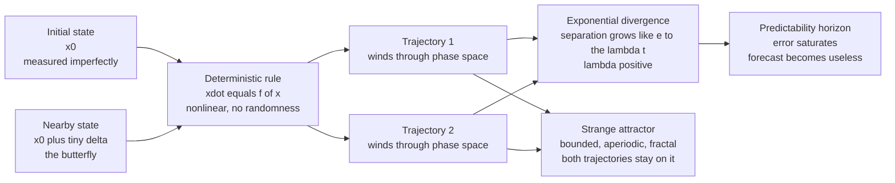

# 🦋 Chaos Theory and Sensitive Dependence

> [!abstract] TL;DR
> **Deterministic chaos** is the surprising fact that a system with **no randomness at all** — one whose future is *completely* fixed by its present state through a fixed rule — can nonetheless be **effectively unpredictable**. The mechanism is **sensitive dependence on initial conditions** (the *butterfly effect*, Edward Lorenz 1963): two starting states that differ by a vanishingly small amount **diverge exponentially**, at a rate set by the **largest Lyapunov exponent** $\lambda > 0$, so any real-world error in knowing the initial state is amplified until the forecast is worthless. Chaotic trajectories are **bounded but never repeating** (aperiodic) and live on a **strange attractor** — a fractal set in phase space (the **Lorenz** and **Rössler** attractors are the classic examples). The **logistic map** shows *how* an orderly system slides into chaos through a **period-doubling cascade** governed by the universal **Feigenbaum constants**. Chaos is why deterministic weather forecasts collapse beyond about **two weeks** — determinism does **not** imply predictability.

---

## Intuition

**Analogy — the butterfly and the weather.** Imagine the atmosphere as an impossibly precise machine of gears. If you knew the exact position and speed of every gear right now, the laws of physics would fix the entire future — no dice, no chance. Yet Edward Lorenz found that a butterfly flapping its wings in Brazil could, in principle, be the difference between a tornado forming in Texas next month or not. The point is *not* that the butterfly is "powerful." It is that the tiny puff of air it creates is a **microscopic difference in the starting conditions**, and in a chaotic system such differences **grow exponentially** — doubling, then doubling again, then again — until they dominate the entire weather pattern. The machine is perfectly deterministic, but because you can never measure its gears with infinite precision, its distant future is hidden from you forever.

The deeper twist: this unpredictability is **not** randomness sneaking in. The equations contain no random term whatsoever. The trajectory is fully determined — it just becomes **impossible to predict in practice** because your knowledge of the starting point is never perfect and the error explodes. **Determinism and predictability are two different things**, and chaos is precisely the gap between them.

---

## How It Works

### Core mechanics

1. **A deterministic rule.** A chaotic system is defined by a fixed evolution law — a set of differential equations $\dot{\mathbf{x}} = \mathbf{f}(\mathbf{x})$ (continuous time) or an iterated map $x_{n+1} = f(x_n)$ (discrete time). Given a state, the next state is *uniquely* determined. There is no noise.

2. **Nonlinearity is mandatory.** A **linear** system cannot be chaotic: its solutions are sums of exponentials and sinusoids, which either decay, blow up, or oscillate regularly. Chaos requires **nonlinear** terms (products like $XY$, $XZ$) that let trajectories **stretch and fold** — stretching pulls nearby points apart (sensitivity), folding keeps everything bounded. Continuous flows also need **at least three dimensions** (Poincaré–Bendixson theorem rules out chaos in 2D flows).

3. **Sensitive dependence.** Take two initial states separated by a tiny vector $\boldsymbol{\delta}_0$. Their separation grows on average as $|\boldsymbol{\delta}(t)| \approx |\boldsymbol{\delta}_0|\,e^{\lambda t}$, where $\lambda$ is the **largest Lyapunov exponent**. If $\lambda > 0$, the divergence is **exponential** — this *is* the mathematical definition of chaos.

4. **Bounded, so it folds back.** Exponential divergence cannot continue forever inside a bounded region, so trajectories are repeatedly folded back on themselves. The result is motion that is **bounded** (stays in a finite region), **aperiodic** (never exactly repeats), and confined to a **strange attractor** — a fractal set of zero volume onto which all nearby trajectories are drawn.

5. **The horizon of predictability.** If you know the initial state to precision $\delta_0$ and can tolerate error up to $\Delta$, the forecast stays useful only until $\delta_0 e^{\lambda t} \approx \Delta$, i.e. for a time $t_{\text{pred}} \approx \frac{1}{\lambda}\ln\!\frac{\Delta}{\delta_0}$. Because the dependence on $\delta_0$ is only **logarithmic**, improving your measurements a *millionfold* buys you only a *few extra doubling-times* of skill. This is the wall behind the roughly two-week limit on deterministic weather forecasts.

### Flow / architecture



---

## Key Concepts

### Secondary Level

- **Deterministic but unpredictable.** A chaotic system follows exact rules with no luck involved, yet you still cannot predict it far ahead. This sounds contradictory until you realize the catch is in the *starting measurement*, not in the rule.
- **The butterfly effect.** A tiny change now — a butterfly's wingbeat — grows and grows until it changes the whole outcome. The name comes from Edward Lorenz, who in 1963 discovered this while running a simplified computer model of the weather and rounding one number from `0.506127` to `0.506`.
- **Chaos is not randomness.** A coin flip is *random* — genuinely no rule decides it. Chaos is *deterministic* — there is a rule, it is just extremely sensitive. Re-run a chaotic simulation from the *exact* same start and you get the *exact* same result every time; re-run a random process and you do not.
- **Bounded but never repeating.** Chaotic motion stays inside a limited region (it does not fly off to infinity) but never retraces the same path twice. Think of stirring cream into coffee: the swirls stay in the cup but never repeat.
- **Why weather forecasts fail after ~2 weeks.** The atmosphere is chaotic, so today's tiny measurement errors double every couple of days until, around two weeks out, the forecast is no better than quoting the seasonal average.

### Undergraduate Level

**The Lorenz system (1963).** Lorenz truncated the equations of thermal convection to three variables, giving the archetypal chaotic flow:
$$\dot{X} = \sigma(Y - X), \qquad \dot{Y} = X(\rho - Z) - Y, \qquad \dot{Z} = XY - \beta Z,$$
with the classic parameters $\sigma = 10,\ \rho = 28,\ \beta = 8/3$. Here $X$ is proportional to convective overturning intensity, $Y$ and $Z$ to horizontal and vertical temperature variation. The nonlinearities are the products $XY$ and $XZ$. For these parameters the two symmetric fixed points are **unstable**, so the trajectory can settle on neither and instead orbits both forever, tracing the famous **butterfly-shaped attractor**.

**Phase space and attractors.** The **phase space** (or state space) is the space whose coordinates are the system's state variables; a single point is a complete instantaneous state, and the trajectory is the system's history. Dissipative systems contract phase-space volume onto an **attractor**. The taxonomy: a **fixed point** (steady state), a **limit cycle** (periodic oscillation), a **torus** (quasiperiodic motion), and — uniquely for chaos — a **strange attractor** that is bounded, of fractal dimension, and on which nearby trajectories diverge.

**Lyapunov exponents.** For an $n$-dimensional system there are $n$ **Lyapunov exponents** $\lambda_1 \ge \lambda_2 \ge \dots \ge \lambda_n$ measuring the average exponential rate of stretching/contraction along each direction. A system is **chaotic if and only if its largest exponent is positive**. For a bounded dissipative flow the exponents must sum to something negative (volume shrinks). The Lorenz attractor's spectrum is roughly $(\lambda_1, \lambda_2, \lambda_3) \approx (0.9,\ 0,\ -14.6)$: one direction stretches, one is neutral (along the flow), one strongly contracts — stretch-and-fold in numbers.

**The logistic map and the route to chaos.** The one-line map
$$x_{n+1} = r\,x_n(1 - x_n), \qquad 0 \le r \le 4,$$
models constrained population growth and is the cleanest demonstration of *how* order becomes chaos. As the growth parameter $r$ increases: the population settles to a single stable value, then at $r \approx 3$ it splits into a **2-cycle**, then a **4-cycle** ($r \approx 3.449$), then 8, 16, 32 — a **period-doubling cascade** that accumulates at $r_\infty \approx 3.5699$, beyond which the behaviour is chaotic (interlaced with periodic windows, most visibly a period-3 window near $r \approx 3.828$).

**Feigenbaum universality.** The successive bifurcation points get closer in a fixed ratio: $\delta = \lim_{n\to\infty}\frac{r_n - r_{n-1}}{r_{n+1} - r_n} = 4.6692\ldots$ — the **Feigenbaum constant**. Astonishingly, the *same* number appears for the period-doubling route in *any* smooth unimodal map (and in real experiments — dripping taps, convection cells, electronic circuits). This **universality** means chaos has quantitative laws independent of the specific system, much like critical exponents in phase transitions.

### Graduate Level

**Formal definition of chaos.** A common working definition (Devaney): a map is chaotic on an invariant set if it (1) has **sensitive dependence on initial conditions**, (2) is **topologically transitive** (mixing — some orbit visits arbitrarily close to every region), and (3) has **dense periodic orbits**. For the purposes of physics, the operational marker is simply a **positive largest Lyapunov exponent on a bounded aperiodic attractor**.

**Computing Lyapunov exponents.** Evolve the linearized (tangent) dynamics $\dot{\boldsymbol{\delta}} = \mathbf{J}(\mathbf{x}(t))\,\boldsymbol{\delta}$ alongside the trajectory, where $\mathbf{J}$ is the Jacobian. The full spectrum is obtained by evolving an orthonormal frame and periodically re-orthonormalizing (Benettin/Gram–Schmidt algorithm); the growth rates of the frame vectors give $\lambda_1 \ge \dots \ge \lambda_n$. The **Kaplan–Yorke (Lyapunov) dimension** $D_{KY} = k + \frac{\sum_{i=1}^{k}\lambda_i}{|\lambda_{k+1}|}$ estimates the fractal dimension of the attractor from the spectrum — for the Lorenz attractor $D_{KY} \approx 2.06$, a set that is more than a surface but less than a volume.

**Fractal structure of strange attractors.** A strange attractor has **zero volume** yet contains an **infinity of leaves** — the repeated stretch-and-fold operation is a Smale-horseshoe-like process that produces a Cantor-set cross-section. Its **non-integer (fractal) dimension** is the geometric fingerprint of chaos: it is what makes it *strange*, as opposed to a mere limit cycle. (This links directly to the notion of fractal self-similarity and non-integer dimension.)

**The Rössler attractor.** Otto Rössler (1976) engineered a *minimal* chaotic flow with a **single** quadratic nonlinearity:
$$\dot{x} = -y - z, \qquad \dot{y} = x + a y, \qquad \dot{z} = b + z(x - c),$$
(typically $a = b = 0.2,\ c = 5.7$). It produces a simpler, single-scroll "folded band" attractor and is the standard pedagogical companion to Lorenz because its stretch-and-fold action is geometrically transparent.

**Predictability, quantified.** The exponential error growth $\delta(t)\sim\delta_0 e^{\lambda t}$ gives a predictability time $t_{\text{pred}} \sim \lambda^{-1}\ln(\Delta/\delta_0)$ whose **logarithmic** dependence on initial accuracy is the fundamental barrier: throwing precision at the problem yields brutally diminishing returns. In real geophysical systems predictability is also **scale-dependent** — small convective scales decorrelate in hours while planetary waves persist for weeks — which is why sub-seasonal prediction is possible at all despite the two-week "weather wall."

**Determinism vs predictability, and chaos control.** Chaos dissolves the Laplacian dream that determinism guarantees predictability. Yet the very sensitivity that destroys forecasting can be *exploited*: because a chaotic attractor is threaded with unstable periodic orbits, **tiny, well-timed perturbations** can stabilize a chosen orbit — the **OGY method** (Ott–Grebogi–Yorke 1990) and **Pyragas time-delay feedback**. Chaos control has been demonstrated in cardiac tissue, lasers, and mechanical systems — but it is fundamentally **local and short-horizon**: you can nudge the system onto a nearby unstable orbit, you cannot make its long-term future globally predictable.

---

## Python Demo

This script integrates the **Lorenz (1963)** system with a hand-written **4th-order Runge–Kutta** integrator (numpy only), plots the **butterfly-shaped strange attractor** in the X–Z plane, and demonstrates **sensitive dependence** by running two trajectories whose initial $X$ differs by only $10^{-9}$ and plotting the **exponential growth of their separation** on a log axis. Runnable with just `numpy` and `matplotlib`.

```python
# Deterministic chaos in the Lorenz 1963 system:
# (a) the butterfly-shaped strange attractor, and
# (b) sensitive dependence on initial conditions -> exponential divergence.
import numpy as np
import matplotlib.pyplot as plt

# ---- Classic chaotic parameters ----
sigma, rho, beta = 10.0, 28.0, 8.0 / 3.0

def lorenz(state):
    x, y, z = state
    dx = sigma * (y - x)
    dy = x * (rho - z) - y
    dz = x * y - beta * z
    return np.array([dx, dy, dz])

def rk4_step(state, dt):
    k1 = lorenz(state)
    k2 = lorenz(state + 0.5 * dt * k1)
    k3 = lorenz(state + 0.5 * dt * k2)
    k4 = lorenz(state + dt * k3)
    return state + (dt / 6.0) * (k1 + 2.0 * k2 + 2.0 * k3 + k4)

def integrate(state0, dt, n_steps):
    traj = np.empty((n_steps, 3))
    s = np.array(state0, dtype=float)
    for i in range(n_steps):
        traj[i] = s
        s = rk4_step(s, dt)
    return traj

dt, n = 0.005, 8000
t = np.arange(n) * dt

# Two trajectories differing by 1e-9 in X -> the microscopic "butterfly"
traj1 = integrate([1.0,          1.0, 1.0], dt, n)
traj2 = integrate([1.0 + 1e-9,   1.0, 1.0], dt, n)

# Phase-space separation between the twin trajectories
sep = np.sqrt(np.sum((traj1 - traj2) ** 2, axis=1))

# Estimate the largest Lyapunov exponent from the exponential-growth window:
# fit  ln(sep) = ln(sep0) + lambda * t  while the separation is still growing
mask = (t > 3.0) & (t < 25.0) & (sep < 5.0)
lam, intercept = np.polyfit(t[mask], np.log(sep[mask]), 1)
print(f"initial separation    = {sep[0]:.1e}")
print(f"largest Lyapunov exp. = {lam:.3f} per time unit")
print(f"error-doubling time   = {np.log(2.0) / lam:.2f} time units")
print("(reference for Lorenz63: lambda ~ 0.906)")

fig = plt.figure(figsize=(12, 5))

# (a) The strange attractor: X-Z projection = the two butterfly wings
ax1 = fig.add_subplot(1, 2, 1)
ax1.plot(traj1[:, 0], traj1[:, 2], lw=0.4, color="navy")
ax1.set_xlabel("X"); ax1.set_ylabel("Z")
ax1.set_title("Lorenz strange attractor (X-Z projection)")

# (b) Exponential divergence of near-identical starts (log axis)
ax2 = fig.add_subplot(1, 2, 2)
ax2.semilogy(t, sep, lw=0.8, color="k", label="separation |delta(t)|")
ax2.semilogy(t[mask], np.exp(intercept + lam * t[mask]), "r--",
             label=f"exp fit, lambda={lam:.2f}")
ax2.set_xlabel("time"); ax2.set_ylabel("phase-space separation")
ax2.set_title("Sensitive dependence: exponential divergence")
ax2.legend()

plt.tight_layout()
plt.show()
```

**What you see.** Left panel: the trajectory settles onto the two-lobed **butterfly** — bounded, never repeating, fractal-thin. Right panel: two runs that started $10^{-9}$ apart stay glued together for a while, then their separation grows as a **straight line on a log axis** (i.e. exponentially) until it saturates at the size of the attractor. The fitted slope gives $\lambda \approx 0.9$ per time-unit and an error-doubling time near $0.7$ — a deterministic system that is, past a finite horizon, genuinely unpredictable.

---

## Real-World Applications

> **Example — weather and climate.** The two-week ceiling on deterministic weather forecasts is a *direct* consequence of atmospheric chaos. Operational centers respond not by chasing impossible precision but by running **ensembles** of perturbed forecasts and issuing **probabilities** (see [[Ensemble_Forecasting_and_Uncertainty]]). The Lorenz system itself was a truncation of atmospheric convection — chaos was *discovered* in meteorology.

- **Numerical weather prediction.** Modern models quantify the growth of initial-condition error (via **singular vectors** and **bred vectors**) to decide *which* perturbations matter and how far the forecast can be trusted — chaos theory made operational.
- **Population dynamics and ecology.** The logistic map arose from population biology (Robert May, 1976); real insect and fish populations can exhibit period-doubling and chaotic booms and busts, complicating fisheries management.
- **Cardiology and neuroscience.** Certain cardiac arrhythmias and epileptic dynamics show chaotic signatures; chaos-control ideas (OGY) have been used experimentally to stabilize irregular heart rhythms.
- **Engineering and lasers.** Nonlinear circuits (Chua's circuit), mechanical oscillators (the driven Duffing and forced pendulum), and semiconductor lasers all display route-to-chaos behaviour; **chaotic laser dynamics** are used for high-rate random-number generation and secure "chaos communication."
- **Celestial mechanics.** The Solar System is weakly chaotic: the orbits of the inner planets have a Lyapunov time of only ~5 million years, so planetary positions are formally unpredictable on ~100-million-year scales despite Newtonian determinism.
- **Finance and secure communication.** Chaotic models capture the aperiodic, bounded, mixing character of some market and signal data — though distinguishing genuine low-dimensional chaos from high-dimensional noise in empirical data is notoriously hard (see pitfalls).

---

## Common Pitfalls

- **Confusing chaos with randomness.** Chaos is fully deterministic and *reproducible*: same initial state, same trajectory, every time. Randomness has no underlying rule. A short chaotic time series can *look* random, but re-running the model reveals the hidden determinism. Calling something "chaotic" when you just mean "noisy" or "complicated" is the most common misuse of the word.
- **Believing determinism implies predictability.** The Laplacian intuition — perfect rules mean a knowable future — fails for chaotic systems. Because knowledge of the initial state is never perfect and error grows exponentially, the *practical* future is unknowable even though the *mathematical* future is fixed.
- **Thinking more precision fixes it.** Since the predictability horizon grows only *logarithmically* with initial accuracy, a million-fold better measurement extends the useful forecast by only a handful of doubling-times. You cannot buy your way past the horizon with better instruments.
- **Assuming chaos requires complicated equations.** The logistic map is a single quadratic line; the Lorenz and Rössler systems have just three variables. Chaos is a property of **nonlinearity and dimension**, not of complexity or size. Conversely, a huge linear system can never be chaotic.
- **"Detecting chaos" in real data too eagerly.** Empirical estimators (correlation dimension, largest Lyapunov exponent) can return finite, chaos-looking values for **coloured noise** or short, noisy datasets. Robust claims of low-dimensional chaos in observations require surrogate-data tests and long, clean records — many early claims (in economics, EEG) did not survive scrutiny.
- **Expecting chaos to be "controllable" like a machine.** Chaos control can stabilize a nearby unstable orbit with tiny nudges, but it does **not** restore long-term global predictability — the sensitivity is still there the moment you stop steering.

---

## Related Concepts

- [[Numerical_Weather_Prediction]] — the operational setting where Lorenz's chaos sets a hard ~2-week ceiling on deterministic forecasting; the note derives the predictability limit from the same Lorenz equations.
- [[Ensemble_Forecasting_and_Uncertainty]] — the practical answer to sensitive dependence: perturb the initial state many ways and forecast a *probability distribution* rather than a single trajectory.
- [[State_Space_Basics]] — the state/phase-space viewpoint (a state vector as a point, its evolution as a trajectory) that underlies attractors and Lyapunov analysis; here specialized to nonlinear, dissipative flows.
- [[System_Properties]] — the linear-vs-nonlinear distinction: chaos is impossible for linear systems, so the nonlinearity of the evolution rule is a precondition for everything on this page.

---

## Review Questions

**Secondary.** In plain words, how can a system that follows exact rules with no luck involved still be impossible to predict far into the future? Explain the "butterfly effect" using an everyday example, and say clearly *why* chaos is **not** the same thing as randomness.

**Undergraduate.** Write down the Lorenz equations and identify the nonlinear terms. Why can a *linear* system never be chaotic, and why does a continuous chaotic flow need at least three dimensions? Define the **largest Lyapunov exponent** and explain how its sign decides whether a bounded system is chaotic. Using the error-growth relation $\delta(t)\approx\delta_0 e^{\lambda t}$, derive the predictability time and explain why improving initial accuracy a millionfold helps so little.

**Graduate.** Describe the **period-doubling route to chaos** in the logistic map and state what the **Feigenbaum constant** $\delta \approx 4.669$ measures and why its *universality* is remarkable. What geometric feature makes an attractor "strange," and how does the **Kaplan–Yorke dimension** connect the Lyapunov spectrum to fractal dimension? Finally, explain the OGY idea of **chaos control** and argue precisely why it does not contradict the claim that chaotic systems are unpredictable in the long run.

---

## Sources

- Lorenz, E. N. — "Deterministic Nonperiodic Flow," *Journal of the Atmospheric Sciences* 20 (1963), 130–141. The founding paper: chaos, sensitive dependence, and the Lorenz attractor. [https://doi.org/10.1175/1520-0469(1963)020%3C0130:DNF%3E2.0.CO;2](https://journals.ametsoc.org/view/journals/atsc/20/2/1520-0469_1963_020_0130_dnf_2_0_co_2.xml)
- Strogatz, S. H. — *Nonlinear Dynamics and Chaos* (2nd ed., Westview/CRC Press, 2015). The standard undergraduate text on flows, bifurcations, the Lorenz system, and Lyapunov exponents.
- May, R. M. — "Simple mathematical models with very complicated dynamics," *Nature* 261 (1976), 459–467. The classic on the logistic map and the period-doubling route to chaos. [https://www.nature.com/articles/261459a0](https://www.nature.com/articles/261459a0)
- Feigenbaum, M. J. — "Quantitative universality for a class of nonlinear transformations," *Journal of Statistical Physics* 19 (1978), 25–52. The discovery of the universal period-doubling constants.
- Ott, E., Grebogi, C., & Yorke, J. A. — "Controlling chaos," *Physical Review Letters* 64 (1990), 1196–1199. The OGY method for stabilizing unstable periodic orbits in a chaotic attractor. [https://doi.org/10.1103/PhysRevLett.64.1196](https://doi.org/10.1103/PhysRevLett.64.1196)

---

#complexity #chaos-theory #lorenz #butterfly-effect #strange-attractor
