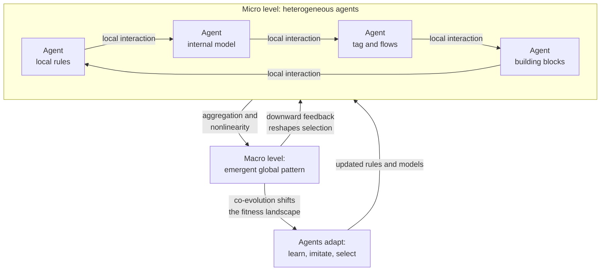

# 🐜 Complex Adaptive Systems

> [!abstract] TL;DR
> A **Complex Adaptive System (CAS)** is a system of many **heterogeneous agents** that interact **locally**, **adapt** their behavior over time, and produce **coherent global patterns with no central controller** — ant colonies, immune systems, economies, ecosystems, brains, and the internet all qualify. The defining move, formalized in the **Santa Fe Institute** tradition of Holland, Arthur, Kauffman, and Gell-Mann, is that macro-order **emerges** from micro-rules and then feeds back to reshape the agents, so the system **co-evolves** with itself. This is why a CAS is *complex* rather than merely *complicated*: you cannot understand or steer it by decomposing it into independent parts.

---

## Intuition

**Analogy:** Watch an **ant colony** forage. No ant knows the map, no ant is in charge, and the queen issues no orders — she just lays eggs. Each ant follows a few dumb local rules: drop pheromone as you carry food, and probabilistically turn toward stronger pheromone. Yet the colony as a whole discovers the shortest path to food, reroutes around obstacles within minutes, and reallocates its workforce between foraging and nest repair as conditions change. The *intelligence* lives in the interactions, not in any ant. Kill a third of the ants and the colony adapts; there is no single point whose failure stops the behavior.

Now swap ants for **traders in a market**. Each trader follows local rules ("buy if it looks cheap, sell if the trend breaks"), reacting only to the prices and rumors they can see. Out of millions of such local reactions a **price** emerges — a global signal that aggregates dispersed information no participant possesses in full — and that price then loops back and changes what every trader does next. That feedback loop between local action and emergent global structure, with adaptation on both ends, is the beating heart of every complex adaptive system.

---

## How It Works

### Core Mechanics

A system earns the label *complex adaptive* when it exhibits this cluster of features together:

1. **Many heterogeneous agents.** The parts are not identical cogs; agents differ in state, strategy, and history. Diversity is not noise to be averaged away — it is the raw material for adaptation.
2. **Local interaction.** Agents act on **local** information and interact with **neighbors**, not with a global blackboard. There is no god's-eye coordinator.
3. **No central control.** Global order is **distributed**. Structure is *self-organized*, produced bottom-up rather than imposed top-down.
4. **Nonlinearity.** Effects are not proportional to causes. Small perturbations can cascade; large ones can be absorbed. The whole is *not* the sum of the parts, so linear decomposition fails.
5. **Emergence.** Higher-level patterns — flocks, prices, immunity, consciousness — appear that are not properties of any single agent and were not explicitly programmed.
6. **Adaptation and co-evolution.** Agents change their rules in response to experience (learning, selection, imitation), and because they adapt to *each other*, the fitness landscape itself keeps shifting. Everyone is running to stay in place (the **Red Queen** effect).
7. **Feedback loops.** Emergent macro-structure exerts **downward causation** on the micro-agents, closing the loop between levels.

**Complex vs merely complicated.** A jumbo jet is *complicated*: millions of parts, but each has a fixed role, the behavior is decomposable, and a blueprint fully specifies it. A rainforest is *complex*: the parts adapt, interactions dominate, behavior is emergent and history-dependent, and no blueprint exists. Complicated systems can be engineered and predicted; complex ones can only be **cultivated, nudged, and observed**.

**Holland's four properties and three mechanisms.** John Holland compressed CAS theory into a checklist. The four **properties** are:

- **Aggregation** — simple agents combine into higher-level "meta-agents" (cells to organs, firms to industries) that themselves become agents at the next level.
- **Nonlinearity** — interactions multiply rather than add, breaking superposition.
- **Flows** — resources, signals, and information move over a network of nodes and connectors, with **multiplier** and **recycling** effects.
- **Diversity** — the persistent variety of agent types, continually regenerated because each niche created by one agent opens niches for others.

The three **mechanisms** that make adaptation work are:

- **Tagging** — agents carry markers (a banner, a molecular signature, a brand) that let them recognize and selectively interact, enabling boundaries and cooperation.
- **Internal models** — agents carry an internal representation that lets them **anticipate**, not just react. Models can be *tacit* (a reflex) or *overt* (an explicit forecast).
- **Building blocks** — complex behavior is assembled by recombining a small set of reusable components, so novelty is combinatorial rather than built from scratch.

**Edge of chaos.** CAS tend to be most creative and computationally powerful in a narrow regime **between frozen order and roiling chaos** — ordered enough to store and transmit structure, fluid enough to explore and change. Kauffman argued that adaptation itself tunes systems toward this critical zone, where information can both persist and propagate.

**Why CAS resist prediction and central control.** Because behavior is emergent, nonlinear, path-dependent, and co-evolving, a CAS has no closed-form solution and no stable target to optimize against. Point interventions get absorbed, rerouted, or amplified in unintended ways. The primary way to *study* one is therefore not to solve equations but to **grow it in silico** — **agent-based modeling (ABM)**, where you code the agents and their local rules, run them, and watch what emerges.

### Flow / Architecture



---

## Key Concepts

### Secondary
- **Agents and local rules.** A CAS is built from many independent "doers," each following its own simple rules using only nearby information.
- **No boss.** Group-level order arises without a leader or blueprint — think a flock of starlings or a school of fish.
- **Emergence.** The group can do things no individual can: the flock as a whole evades the hawk even though each bird only watches its neighbors.
- **Adaptation.** The parts change with experience, so the whole system learns and adjusts to a changing world.

### Undergraduate
- **Complex vs complicated.** Complicated = many fixed parts, decomposable, engineerable (a jet). Complex = adaptive interacting parts, non-decomposable, emergent (an ecosystem).
- **Self-organization vs emergence.** *Self-organization* names the **process** by which local interaction produces order without a controller; *emergence* names the **result** — macro-properties absent at the micro level. (Kept as separate notes; see Related Concepts.)
- **Holland's properties and mechanisms.** Aggregation, nonlinearity, flows, diversity; tagging, internal models, building blocks.
- **Feedback and nonlinearity.** Positive feedback amplifies (booms, epidemics); negative feedback stabilizes (homeostasis). Nonlinear coupling makes small causes sometimes have large effects.
- **Agent-based modeling.** The workhorse method: specify agents and rules, simulate, and study the emergent macro-behavior (Boids, Schelling segregation, Sugarscape).

### Graduate
- **Co-evolution and the Red Queen.** Because agents adapt to a landscape made of other adapting agents, the landscape is **deforming** — equilibrium is the exception, not the norm.
- **Edge of chaos and self-organized criticality.** Kauffman's NK landscapes and Bak's sandpile model formalize how adaptive systems poise near a critical boundary that maximizes evolvability and information flow, often producing power-law event distributions.
- **Fitness landscapes and rugged optimization.** Kauffman's NK model tunes ruggedness via epistatic coupling K, connecting CAS to search, evolution, and hard optimization.
- **Genetic algorithms and classifier systems.** Holland's own formalisms — the **schema theorem** and **building-block hypothesis** — cast adaptation as recombination of partial solutions, linking CAS to evolutionary computation.
- **Complexity economics.** Arthur's work on **increasing returns**, lock-in, and out-of-equilibrium markets reframes the economy as a CAS rather than an equilibrium machine.
- **Effective complexity and the observer.** Gell-Mann distinguished *algorithmic information* (random strings maximize it) from **effective complexity** (the length of the regularities), arguing genuine complexity sits between total order and total randomness.

---

## Python Demo

A **Boids** model (Craig Reynolds, 1987). Each agent follows just three local rules — **cohesion**, **separation**, and **alignment** — using only neighbors within a perception radius. There is no leader and no global plan, yet a coherent flock **self-organizes**. We track a **polarization order parameter** (0 = disordered, 1 = perfectly aligned) and snapshot the swarm to watch order emerge. Uses only `numpy` and `matplotlib`.

```python
# Boids flocking: coherent global order emerges from three local rules,
# with no leader and no global coordinator. numpy + matplotlib only.
import numpy as np
import matplotlib.pyplot as plt

rng = np.random.default_rng(7)

N          = 200      # number of agents
WORLD      = 100.0    # square world side, periodic / toroidal
RADIUS     = 8.0      # perception radius for neighbors
SEP_RADIUS = 3.0      # personal-space radius
MAX_SPEED  = 2.0
W_COH, W_ALI, W_SEP = 0.010, 0.125, 0.080   # rule weights
STEPS      = 400
SNAPSHOTS  = [0, 60, 200, 399]

# random initial positions and velocities (a disordered swarm)
pos = rng.uniform(0, WORLD, size=(N, 2))
vel = rng.uniform(-1, 1, size=(N, 2))
vel = vel / np.linalg.norm(vel, axis=1, keepdims=True) * MAX_SPEED

def toroidal_delta(a, b, L):
    # shortest displacement a - b on a periodic square of side L
    d = a - b
    return d - L * np.round(d / L)

def order_parameter(v):
    # polarization: 1.0 = perfectly aligned flock, ~0 = incoherent
    unit = v / np.linalg.norm(v, axis=1, keepdims=True)
    return np.linalg.norm(unit.mean(axis=0))

def step(pos, vel):
    new_vel = vel.copy()
    for i in range(N):
        d = toroidal_delta(pos[i], pos, WORLD)      # self - others, shape (N,2)
        dist = np.linalg.norm(d, axis=1)
        near = (dist < RADIUS) & (dist > 1e-9)
        if not np.any(near):
            continue
        coh = -d[near].mean(axis=0)                 # steer toward local center of mass
        ali = vel[near].mean(axis=0) - vel[i]       # match mean neighbor velocity
        very = near & (dist < SEP_RADIUS)           # avoid crowding
        sep = (d[very] / dist[very, None]**2).sum(axis=0) if np.any(very) else np.zeros(2)
        new_vel[i] = vel[i] + W_COH*coh + W_ALI*ali + W_SEP*sep
    speed = np.linalg.norm(new_vel, axis=1, keepdims=True)
    speed = np.where(speed < 1e-9, 1e-9, speed)
    new_vel = new_vel / speed * MAX_SPEED           # clamp to constant speed
    new_pos = (pos + new_vel) % WORLD               # move, wrap on the torus
    return new_pos, new_vel

snaps, order = {}, []
for t in range(STEPS):
    order.append(order_parameter(vel))
    if t in SNAPSHOTS:
        snaps[t] = (pos.copy(), vel.copy())
    pos, vel = step(pos, vel)

fig, axes = plt.subplots(1, len(SNAPSHOTS), figsize=(16, 4))
for ax, t in zip(axes, SNAPSHOTS):
    p, v = snaps[t]
    ax.quiver(p[:, 0], p[:, 1], v[:, 0], v[:, 1], angles="xy", scale=40, width=0.005)
    ax.set_title("step {}   order = {:.2f}".format(t, order[t]))
    ax.set_xlim(0, WORLD); ax.set_ylim(0, WORLD)
    ax.set_aspect("equal"); ax.set_xticks([]); ax.set_yticks([])
plt.tight_layout(); plt.show()

print("polarization rose from {:.2f} to {:.2f} "
      "-- a coherent flock emerged with no leader"
      .format(order[0], order[-1]))
```

Running it, the first snapshot shows arrows pointing every which way (order near 0.1); by the last, the agents move as a common stream (order near 0.9). No line of code ever tells the swarm to form a flock — the flock is what *local* cohesion, separation, and alignment *add up to*. That is emergence you can watch.

---

## Real-World Applications

> **Example — the human immune system.** No cell knows "the body is under attack." B-cells and T-cells carry molecular **tags** (receptors), interact **locally** via chemical signals, and the ones that happen to bind a pathogen are **selected** and cloned — a within-body **adaptation** that builds immunity with no central command. It is a textbook CAS: distributed, tagged, model-carrying, and co-evolving with the pathogens it fights.

- **Ecosystems.** Food webs, predator–prey cycles, and succession are emergent products of locally interacting species that co-evolve (see Biology ecology notes).
- **Economies and markets.** Prices aggregate dispersed information; Arthur's complexity economics treats markets as out-of-equilibrium CAS with increasing returns and lock-in, not tidy equilibria.
- **Cities.** Traffic jams, neighborhood segregation (Schelling), and land-use patterns self-organize from millions of local decisions — no planner draws them.
- **Brains and cognition.** Cognition emerges from vast numbers of locally connected neurons; connectionist models make this CAS logic explicit.
- **The internet and social networks.** Routing, cascades, and viral spread are emergent behaviors over an unplanned, adaptive network of autonomous nodes.
- **Multi-agent AI and swarm robotics.** Ant-colony optimization, particle swarms, and multi-agent reinforcement learning engineer useful emergence from designed local rules.

---

## Common Pitfalls

- **Confusing complex with complicated.** Treating a CAS like a machine — assuming a blueprint exists and the parts are decomposable — leads to interventions that get absorbed or backfire. Complex systems are *grown and nudged*, not *engineered and solved*.
- **Assuming a controller exists.** Looking for the "queen" who runs the colony, or the trader who sets the price, misses that the order is **distributed**. There is no single lever.
- **Naive reductionism.** Explaining the whole purely from an isolated part ignores that behavior lives in the **interactions**; the nonlinear coupling is the phenomenon, not a detail to average away.
- **Predicting like a linear system.** Extrapolating trends ignores tipping points, cascades, and path dependence. CAS produce fat-tailed, surprise-prone dynamics near the edge of chaos.
- **Over-tuning agent-based models.** ABMs can reproduce anything if you add enough free parameters. Without validation against real data and sensitivity analysis, a pretty emergent pattern proves nothing.
- **Ignoring co-evolution.** Optimizing against a fixed landscape when rivals adapt (the Red Queen) yields strategies that are stale the moment they deploy.
- **Mistaking emergence for magic.** Emergence is not spooky — it is the lawful, simulable consequence of many local rules. Invoking it to dodge a mechanism explanation is a cop-out, not an account.

---

## Related Concepts

- [[Natural_Selection_and_Adaptation]] — the canonical adaptive mechanism; CAS generalize selection-driven adaptation beyond biology to economies, immune systems, and algorithms.
- [[Community_Ecology]] — ecosystems are the archetypal CAS: locally interacting, co-evolving species producing emergent community structure.
- [[Population_Ecology]] — nonlinear feedback (predator–prey, carrying capacity) is the CAS dynamics of populations.
- [[The_Adaptive_Immune_System]] — a within-body CAS using tagging and selection, exactly Holland's mechanisms in biological form.
- [[Morphogenesis_and_Pattern_Formation]] — biological self-organization producing emergent spatial order from local signaling.
- [[Replicator_Dynamics]] — the evolutionary-game engine of how successful strategies spread through a population of adapting agents.
- [[Evolutionary_Stable_Strategies]] — equilibrium concept for co-evolving agent strategies, a game-theoretic lens on CAS.
- [[Multi_Agent_and_Inverse_RL]] — engineered multi-agent learning where global behavior emerges from many locally-optimizing agents.
- [[Connectionism_and_Neural_Networks]] — cognition as emergent order over many locally connected units; a CAS view of the mind.
- [[Cognitive_Architectures]] — how integrated cognition is built up from interacting sub-agent modules.
- [[Market_Equilibrium]] — the classical equilibrium picture that complexity economics reframes as an out-of-equilibrium CAS.
- [[Nash_Equilibrium_Applications]] — strategic interaction among adaptive agents, the game-theoretic substrate of many CAS.

---

## Review Questions

1. **(Conceptual)** A colleague says "our microservice platform is a complex adaptive system because it has thousands of moving parts." Using the complex-vs-complicated distinction and at least three of Holland's properties, argue for or against the claim.
2. **(Scenario)** You are asked to reduce traffic congestion in a growing city. Given that the transport system is a CAS, explain why a single top-down mandate (for example, a fixed rule sent to every driver) is likely to fail, and describe an intervention strategy that works *with* the system's emergent, adaptive nature.
3. **(Trade-off)** Kauffman argues adaptive systems are most creative at the "edge of chaos." What is the trade-off a system faces between the ordered regime and the chaotic regime, and why might natural selection tune a CAS toward the boundary rather than deep into either side?

---

## Sources

- John H. Holland, *Hidden Order: How Adaptation Builds Complexity* (Addison-Wesley, 1995).
- John H. Holland, *Complexity: A Very Short Introduction* (Oxford University Press, 2014).
- Melanie Mitchell, *Complexity: A Guided Tour* (Oxford University Press, 2009).
- Stuart A. Kauffman, *At Home in the Universe: The Search for the Laws of Self-Organization and Complexity* (Oxford University Press, 1995).
- Craig W. Reynolds, "Flocks, Herds and Schools: A Distributed Behavioral Model," *SIGGRAPH '87 Computer Graphics* 21(4), 25–34.

---

#complexity #complex-adaptive-systems #emergence #agents #santa-fe
