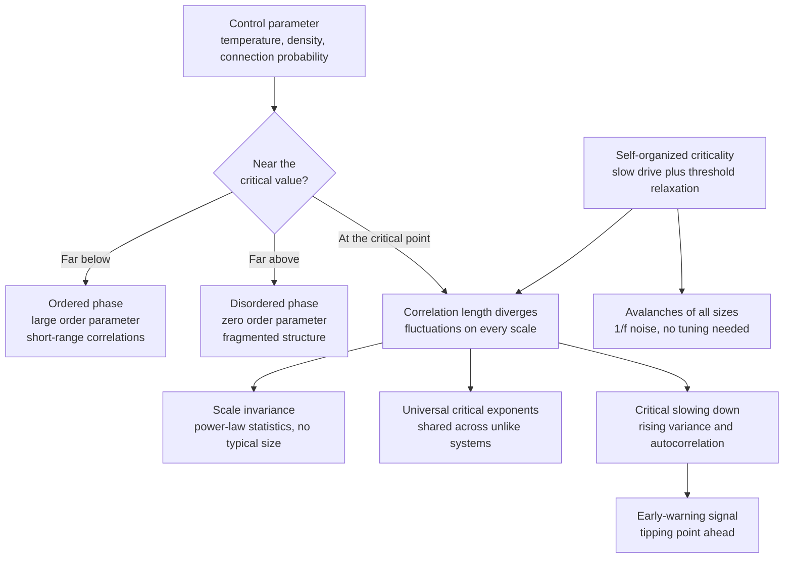

# 🏔️ Criticality and Phase Transitions

> [!abstract] TL;DR
> A phase transition is an abrupt, qualitative change in a system's macroscopic behavior as a control parameter crosses a critical threshold; exactly at that threshold, fluctuations occur on every scale at once, microscopic details stop mattering, and the system's statistics become power laws. Some systems — sandpiles, earthquake faults, brains — organize themselves to sit at this critical point without any external tuning, a phenomenon called self-organized criticality.

---

## Intuition

**Analogy:** Add sand, one grain at a time, to a flat table. For a while the pile just grows taller. Then it reaches a slope where each new grain might trigger nothing, or a tiny slide, or occasionally a catastrophic avalanche that reshapes the whole pile. The pile has settled onto its critical slope: it is perpetually on the edge, and the size of the next avalanche is fundamentally unpredictable — yet the *distribution* of avalanche sizes is beautifully regular, following a power law.

Boiling water shows the sharper, tuned version of the same idea. Nothing dramatic happens at 50 degrees or 99 degrees, then at exactly 100 degrees (at sea level) the liquid violently reorganizes into gas. The "control knob" is temperature; the qualitative state of the water is the thing that flips. Criticality is what the world looks like right at that flip: neither one phase nor the other, but a scale-free mixture of both.

---

## How It Works

### Core Mechanics

1. **Control parameter and order parameter.** A *control parameter* is the knob you turn (temperature, density, node-connection probability, external field). An *order parameter* measures how ordered the system is (magnetization, density difference, size of the largest connected cluster). It is nonzero in the ordered phase and zero in the disordered phase.

2. **The critical point.** As the control parameter approaches a critical value, the *correlation length* — the distance over which one part of the system "feels" another — grows without bound. At the critical point it is effectively infinite: a local disturbance can propagate across the entire system.

3. **Scale invariance and power laws.** With no finite correlation length, there is no characteristic size. Structures of every size coexist. The signature is a power-law distribution, `P(s) ~ s^(-alpha)`, which plots as a straight line on log-log axes. Halving the resolution leaves the picture statistically unchanged — the same self-similarity seen in fractals.

4. **Universality and critical exponents.** Astonishingly, wildly different systems — a magnet, boiling water, a percolating network — share the *same* critical exponents if they share dimensionality and the symmetry of their order parameter. Microscopic details wash out under coarse-graining; only a few coarse features survive to set the exponents. This is why the study of one toy model (the Ising model) illuminates thousands of real systems.

5. **Percolation: connectivity as a phase transition.** Fill a grid's cells at random with probability `p`. Below a critical `p_c`, only small isolated clusters exist; above `p_c`, a single cluster suddenly spans the whole system. The spanning cluster is the order parameter; `p_c` is the critical point. Percolation is the cleanest geometric model of a phase transition.

6. **Self-organized criticality (SOC).** Ordinary criticality requires fine-tuning the control parameter to `p_c`. Bak, Tang, and Wiesenfeld (1987) showed that a class of driven, dissipative systems with a local threshold rule are *attracted* to the critical state on their own. The recipe: drive the system slowly, let it relax quickly when a local threshold is exceeded, and let the disturbance cascade. The system converges to the edge and stays there, emitting avalanches of all sizes and characteristic `1/f` noise — no tuning required.

7. **Critical slowing down.** As a system nears a tipping point, its recovery from small perturbations gets sluggish. Statistically this shows up as rising variance and rising lag-1 autocorrelation — potential *early-warning signals* for a coming transition.

### Flow / Architecture



---

## Key Concepts

### Secondary (intuitive)
- **Phase:** a qualitative state of a system — solid, liquid, gas; magnetized or not; connected or fragmented.
- **Phase transition:** the abrupt switch between phases when you turn a knob past a threshold (ice melting, water boiling).
- **Control parameter:** the knob you turn (temperature, pressure, how densely a network is wired).
- **Tipping point:** the critical value where a small extra push flips the whole system into a new state.
- **Avalanche:** a cascade of change triggered by a tiny nudge; near criticality avalanches come in all sizes.

### Undergraduate
- **Order parameter:** quantitative measure of order (magnetization `m`, density gap, spanning-cluster fraction), zero above `T_c` and nonzero below.
- **First-order vs continuous transitions:** first-order transitions jump discontinuously and release latent heat (ice to water); continuous (second-order) transitions have the order parameter go smoothly to zero with a diverging correlation length (magnet at the Curie point).
- **Correlation length divergence:** near `T_c`, `xi ~ |t|^(-nu)` where `t = (T - T_c)/T_c`. Infinite `xi` is the engine of scale invariance.
- **Power laws and scale invariance:** at criticality, cluster sizes, avalanche sizes, and correlations follow `~ s^(-alpha)` — straight lines on log-log plots, self-similar under rescaling.
- **Percolation threshold:** `p_c` for site percolation on a 2D square lattice is about 0.5927; the infinite spanning cluster appears there.
- **The Ising model:** spins `s = +/-1` on a lattice with nearest-neighbor coupling `H = -J * sum(s_i * s_j)`; the canonical statistical-mechanics model of a continuous transition and the prototype for universality.

### Graduate
- **Universality classes and critical exponents:** exponents `alpha, beta, gamma, delta, nu, eta` depend only on dimension and order-parameter symmetry, tied together by scaling relations (Rushbrooke, Widom, Fisher, hyperscaling). See [[Phase_Transitions_and_Critical_Phenomena]] for the renormalization-group derivation.
- **Renormalization group:** repeated coarse-graining flows the system toward a fixed point; relevant directions drive the transition, irrelevant ones explain universality.
- **Self-organized criticality mechanics:** requires a separation of timescales (slow drive, fast relaxation) plus a threshold-and-redistribute rule. At the critical state the underlying branching process has branching ratio exactly 1 — each toppling triggers on average one more, so avalanches neither die instantly nor explode.
- **Absorbing-state transitions:** many SOC and epidemic models sit at a transition between an active and an absorbing (frozen) state, in the directed-percolation universality class.
- **1/f noise:** the temporal fingerprint of SOC — a power spectrum `S(f) ~ 1/f^b` with no characteristic frequency, complementing the spatial power law.
- **Critical slowing down and early-warning signals:** near a fold bifurcation the dominant eigenvalue approaches zero, so recovery slows; rising variance, lag-1 autocorrelation, and skewness are leading indicators (Scheffer et al.), though prone to false positives.
- **Edge of chaos:** in cellular automata and neural systems, the ordered/chaotic boundary maximizes dynamic range, information storage, and transmission — an argument that living and computational systems evolve toward criticality.

---

## Python Demo

```python
# Bak-Tang-Wiesenfeld sandpile: self-organized criticality on a 2D grid.
# Drive the system one grain at a time; whenever a cell reaches the toppling
# threshold it sheds 4 grains to its neighbours (grains falling off the edge
# are lost). The size of the resulting avalanche = number of topplings.
# Collected over many drives, avalanche sizes follow a power law -> the
# hallmark of criticality reached without any tuning.

import numpy as np
import matplotlib.pyplot as plt

rng = np.random.default_rng(42)

N = 40             # grid is N x N
Z_CRIT = 4         # a cell topples when it holds 4 or more grains (2D rule)
N_GRAINS = 80_000  # total grains dropped
WARMUP = 20_000    # early drives spent filling the pile to its critical slope

grid = np.zeros((N, N), dtype=np.int64)
avalanche_sizes = []
neighbours = [(-1, 0), (1, 0), (0, -1), (0, 1)]

def relax(grid):
    """Topple every supercritical cell until the pile is stable.
    Returns the avalanche size (total number of topplings)."""
    size = 0
    stack = list(zip(*np.where(grid >= Z_CRIT)))
    while stack:
        i, j = stack.pop()
        if grid[i, j] < Z_CRIT:
            continue
        grid[i, j] -= Z_CRIT
        size += 1
        for di, dj in neighbours:
            ni, nj = i + di, j + dj
            if 0 <= ni < N and 0 <= nj < N:   # edge grains are lost (dissipation)
                grid[ni, nj] += 1
                if grid[ni, nj] >= Z_CRIT:
                    stack.append((ni, nj))
        if grid[i, j] >= Z_CRIT:              # cell may still be overloaded
            stack.append((i, j))
    return size

for step in range(N_GRAINS):
    i, j = rng.integers(N), rng.integers(N)
    grid[i, j] += 1
    s = relax(grid)
    if step >= WARMUP and s > 0:
        avalanche_sizes.append(s)

sizes = np.array(avalanche_sizes)

# Logarithmically spaced bins: a power law becomes a straight line on log-log.
bins = np.logspace(0, np.log10(sizes.max()), 30)
counts, edges = np.histogram(sizes, bins=bins, density=True)
centers = np.sqrt(edges[:-1] * edges[1:])
mask = counts > 0

plt.figure(figsize=(6, 5))
plt.loglog(centers[mask], counts[mask], "o", label="measured avalanche sizes")
ref = centers[mask]
plt.loglog(ref, counts[mask][0] * (ref / ref[0]) ** -1.0,
           "--", label="slope = -1 reference")
plt.xlabel("avalanche size s")
plt.ylabel("P(s)")
plt.title("BTW sandpile: power-law avalanche distribution")
plt.legend()
plt.tight_layout()
plt.show()

print(f"avalanches recorded: {sizes.size}")
print(f"largest avalanche:   {sizes.max()} topplings")
print(f"mean avalanche size: {sizes.mean():.2f}")
```

Running this prints a heavy-tailed set of avalanche sizes and shows data lying along a straight line on log-log axes over a couple of decades before the finite grid imposes a cutoff — the visual signature of a scale-free, self-organized critical state that was never explicitly tuned.

---

## Real-World Applications

> **Earthquakes (Gutenberg-Richter law):** The number of earthquakes of magnitude `M` or greater falls off as a power law, `log N ~ -b*M`. Faults are widely modeled as SOC systems: stress builds slowly from plate motion and releases in slips of every size, from imperceptible tremors to megaquakes, with no characteristic quake size.

- **Forest fires:** The Drossel-Schwabl forest-fire model self-organizes to criticality, producing a power-law distribution of burned-cluster sizes; real fire-size statistics often show similar heavy tails, which is why fuel-load management matters.
- **Neuronal avalanches:** Beggs and Plenz (2003) found cortical activity propagates in cascades whose sizes follow a power law with exponent near -3/2, evidence that the brain operates near a critical point where information transmission and dynamic range are maximized (see [[Connectomics_and_Network_Neuroscience]]).
- **Financial crashes:** Return distributions have power-law tails, and some models treat markets as critical systems where herding pushes them to the edge; log-periodic power-law fits have been proposed as crash precursors (contested but influential).
- **Mass extinctions:** The Bak-Sneppen coevolution model produces extinction avalanches with power-law sizes, suggesting some large extinctions could be intrinsic cascades rather than external shocks.
- **Percolation applications:** conductivity of composite materials, gelation of polymers, spread of epidemics and forest connectivity, and robustness of communication networks all hinge on whether the system is above or below its percolation threshold.
- **Climate tipping points:** ice-sheet collapse, monsoon shifts, and AMOC slowdown are studied as critical transitions whose approach may show critical slowing down (see [[Climate_Sensitivity_and_Feedbacks]]).

---

## Common Pitfalls

- **Seeing power laws everywhere.** A line that looks straight on log-log axes is not proof of a power law. Log-normal and stretched-exponential distributions mimic power laws over limited ranges. Use maximum-likelihood fitting with goodness-of-fit tests (Clauset-Shalizi-Newman) before claiming criticality.
- **Confusing tuned criticality with self-organized criticality.** Ordinary critical phenomena require setting the control parameter exactly to `p_c`; SOC systems reach the critical state on their own. Calling any power law "SOC" without the slow-drive-plus-threshold mechanism is a category error.
- **Ignoring finite-size cutoffs.** Real and simulated systems are finite, so the correlation length and the largest avalanche are capped by the system size. Power laws always bend at the tail; that bend is finite-size scaling, not a failure of the theory.
- **Trusting mean-field exponents.** Mean-field (Landau) theory predicts a transition but gives wrong exponents below the upper critical dimension (4 for the Ising class). Do not quote mean-field values for real 3D systems.
- **Over-reading early-warning signals.** Rising variance and autocorrelation can precede a tipping point but also appear from noise or slow forcing without any transition, and some tipping points give no warning at all. Treat critical slowing down as a probabilistic hint, not a guarantee.
- **Forgetting the timescale separation.** SOC only emerges when driving is slow compared with relaxation. If you add grains faster than the pile can topple, the scale invariance is destroyed.

---

## Related Concepts

- [[Phase_Transitions_and_Critical_Phenomena]] — the full statistical-mechanics treatment: Landau theory, the Ising model, universality classes, and the renormalization-group explanation of critical exponents.
- [[Classical_Statistical_Mechanics]] — the ensemble and partition-function machinery underlying the Ising model and the free-energy view of order parameters.
- [[Connectomics_and_Network_Neuroscience]] — network structure of the brain and the criticality hypothesis behind neuronal avalanches.
- [[Climate_Sensitivity_and_Feedbacks]] — feedback loops and tipping points in the climate system, a real-world arena for critical transitions and early-warning signals.

---

## Review Questions

1. **(Secondary)** Boiling water and a growing sandpile both show sudden large changes. In which one do you have to deliberately set a knob to a precise value to reach the critical state, and in which does the system get there by itself? Explain the difference in one sentence.
2. **(Undergraduate)** In site percolation you slowly raise the occupation probability `p`. Sketch how the size of the largest connected cluster behaves as `p` passes `p_c`, identify the order parameter and the control parameter, and explain why cluster sizes follow a power law exactly at `p_c` but not away from it.
3. **(Graduate)** Two research groups both report power-law avalanche statistics — one from a fine-tuned lab experiment, one from an untouched driven system. What additional evidence would you demand before labeling the second one "self-organized criticality," and how would branching-ratio and timescale-separation arguments support or undermine that label?

---

## Sources

- Bak, P., Tang, C., & Wiesenfeld, K. (1987). "Self-organized criticality: An explanation of 1/f noise." *Physical Review Letters* 59, 381.
- Bak, P. (1996). *How Nature Works: The Science of Self-Organized Criticality.* Copernicus / Springer.
- Stanley, H. E. (1971). *Introduction to Phase Transitions and Critical Phenomena.* Oxford University Press.
- Scheffer, M. et al. (2009). "Early-warning signals for critical transitions." *Nature* 461, 53.
- Clauset, A., Shalizi, C. R., & Newman, M. E. J. (2009). "Power-law distributions in empirical data." *SIAM Review* 51, 661.

---

#complexity #criticality #self-organized-criticality #phase-transition #power-law
